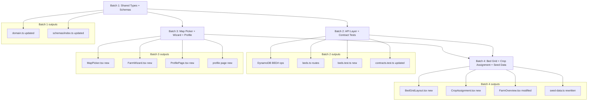

# EXECUTION-PLAN-PHASE-D.md — Phase D: UX Restructure

> Created: 2026-03-22
> Phase: D (MVP+ v0.13)
> Prerequisite: Phase C complete (v0.12, develop branch at `e59e4eb`)
> Design sources: PHASE-D-ARCHITECTURE.md, ADR-20260322-phase-d-bed-grid-data-model.md, UX-DESIGNS.md §14, SYSTEM-DESIGN.md §10
> Target: 303 tests pass before and after each batch gate

---

## Executive Summary

Phase D replaces the 4-level Farm→Field→Bed→Plot hierarchy with a flat 2-level Farm→Bed model. It introduces three visible features — a Leaflet map picker for farm location, a CSS Grid bed layout view, and a redesigned profile page — and one structural API replacement (Plot endpoints → Bed endpoints). Scope is 5 design items (F-09, F-10, BED, CROP, PROF) organized into 4 sequential batches.

**Effort estimate**: ~5–7 hours of implementation across 4 batches.

**Version target**: v0.13 on develop, PR to main after /cc-review passes.

**Readiness criteria closed by Phase D**: 3 of 5 remaining (map picker F-09, bed-grid BED+CROP, profile PROF). The remaining 2 (3 user accounts, camera→bed association) are post-deploy operational tasks, not code tasks.

---

## Batch Plan

### Batch 1 — Data Foundation (Shared Types + Schemas)

**Theme**: Replace the Plot/Field domain model in the shared package. Everything downstream (API, frontend, tests) depends on this batch being stable.

**Tasks**:

| Task ID | File | Action |
|---------|------|--------|
| D-T01 | `packages/shared/src/types/domain.ts` | Add `grid_rows`, `grid_cols` to `Farm`. Expand `Bed` with `farm_id`, `row`, `col`, `crop_type`, `crop_variety`, `planted_at`, `expected_harvest`, `notes`. Change `image.plot_id` → `image.bed_id`. Remove `Field` interface. Remove `Plot` interface. Rename `PlotStatus` → `BedStatus` (keep old alias for one version). |
| D-T02 | `packages/shared/src/schemas/index.ts` | Add `BedSchema`, `UpdateBedRequestSchema`, `CreateFarmRequestSchema` (extended with `grid_rows`, `grid_cols`), `GetFarmResponseSchema` (flat `beds[]`). Remove `FieldSchema`, `PlotSchema`, `NestedPlotSchema`. Update `ImageSchema` (`plot_id` → `bed_id`). Update `FarmPlotItemSchema` → `FarmBedItemSchema`. |
| D-T03 | `packages/shared/src/types/api.ts` | Add `BedId` branded type. Update API response types to use `beds[]` instead of `fields[]`. |
| D-T04 | `packages/shared/src/types/requests.ts` | Add `UpdateBedRequest`. Extend `CreateFarmRequest` and `UpdateFarmRequest` with `grid_rows`, `grid_cols`. |

**Estimated effort**: ~1 hour.

**Gate criteria before Batch 2**:
- `cd packages/shared && npm run build` exits 0 (no TypeScript errors)
- `npm test` in packages/shared (if any schema tests exist) passes
- 303 existing tests still pass (many will now have type errors in other packages — those are caught in Batch 2 and 3, so confirm test runner completes even if downstream tests show type drift)

**Test expectations**: No new test files. Existing `contracts.test.ts` will likely fail at the type-import level — this is expected and resolved in Batch 2.

**Commit message**: `feat(shared): Phase D — flatten Farm->Bed data model, remove Field/Plot types`

---

### Batch 2 — API Layer (DynamoDB + Routes + Contract Tests)

**Theme**: Replace the data access layer and HTTP routes. All plot-based endpoints become bed-based. Contract tests are rewritten to match the new API shape.

**Tasks**:

| Task ID | File | Action |
|---------|------|--------|
| D-T05 | `src/api/src/services/dynamodb.ts` | Add: `createBedForFarm()`, `createBedsForFarm()` (batch create for grid), `getBedsForFarm()`, `getBedById()`, `updateBed()`. Modify: `createFarm()` to auto-generate bed grid using BatchWriteItem. Modify: `createImage()` to use `BED#` PK (was `PLOT#`). Deprecate (keep as stubs): `createField()`, `createPlot()`, `getFieldsForFarm()`, `getBedsForField()`. |
| D-T06 | `src/api/src/routes/beds.ts` | **Create new file**. Routes: `GET /beds/:bedId`, `PATCH /beds/:bedId`, `GET /beds/:bedId/images`, `POST /beds/:bedId/images`. Auth: admin+manager for PATCH; read for GET. |
| D-T07 | `src/api/src/routes/farms.ts` | Modify response shape of `GET /farms/:farmId` to return flat `beds[]`. Extend `POST /farms` and `PATCH /farms/:farmId` with `grid_rows`, `grid_cols`. Register new beds router. |
| D-T08 | `src/api/src/routes/plots.ts` | Add 301 redirects for all 4 plot-based endpoints → bed equivalents. Keep existing handlers as stubs (do not delete yet). |
| D-T09 | `src/api/src/__tests__/routes/beds.test.ts` | **Create new file**. Tests: happy path GET bed, PATCH crop assignment (admin/manager), 403 for observer, 404 for unknown bed, GET images for bed, POST image to bed. |
| D-T10 | `src/api/src/__tests__/routes/plots.test.ts` | Rewrite: verify 301 redirect behavior for all 4 plot endpoints. Remove old handler tests. |
| D-T11 | `src/api/src/__tests__/routes/farms.test.ts` | Update: verify `beds[]` in GET /farms/:farmId response, verify grid_rows/cols in POST/PATCH requests. |
| D-T12 | `src/api/src/__tests__/services/dynamodb.test.ts` | Add tests for `createBedsForFarm()`, `getBedsForFarm()`, `getBedById()`, `updateBed()`. Update `createFarm()` test to verify auto-generated beds. |
| D-T13 | `src/api/src/__tests__/contracts.test.ts` | Rewrite all schemas that reference `Field`, `Plot`, `plot_id`. Add contract tests for `BedSchema`, `UpdateBedRequest`, `FarmBedItem`. |

**Estimated effort**: ~2 hours.

**Gate criteria before Batch 3**:
- `npm test` passes (303 + new tests). Target: 303 + ~25 new = ~328 tests passing.
- `GET /farms/:farmId` response validated by `GetFarmResponseSchema` (contract test passes)
- `PATCH /beds/:bedId` returns 200 with `BedSchema`-valid body
- `GET /farms/:farmId/plots` returns 301 (redirect shim working)
- No TypeScript errors in `src/api/`

**Test expectations**: ~25 new tests in beds.test.ts. ~10 tests rewritten in plots.test.ts, farms.test.ts, dynamodb.test.ts, contracts.test.ts.

**Commit message**: `feat(api): Phase D — beds routes, DynamoDB BED# model, plot 301 redirects`

---

### Batch 3 — Frontend: Map Picker + Farm Wizard + Profile

**Theme**: New user-facing components for farm creation (map picker, 3-step wizard) and the profile page redesign. These are largely independent of the bed grid (which reads from the same API), so they can be built in parallel with Batch 4 conceptually — but sequentially in practice for solo work.

**Tasks**:

| Task ID | File | Action |
|---------|------|--------|
| D-T14 | `src/frontend/package.json` | Add `leaflet` and `@types/leaflet` dependencies. |
| D-T15 | `src/frontend/src/components/MapPicker.tsx` | **Create**. Preact island (`client:load`). Leaflet dynamic import (code-split). Crosshair pattern (map pans under fixed crosshair). GPS button. Elevation auto-fetch from Open-Meteo. Coordinate preview card. Fallback to 3 text inputs on Leaflet load failure. State matrix per UX-DESIGNS.md §14.11. |
| D-T16 | `src/frontend/src/styles/components/map-picker.css` | **Create**. Map container, crosshair overlay, GPS button, coordinate card. Mobile-first. Desktop side panel at 1024px+. |
| D-T17 | `src/frontend/src/components/FarmWizard.tsx` | **Create**. Preact island. 3-step wizard: (1) name/description, (2) MapPicker, (3) confirm + submit. Step indicator (dot pattern). Back/Cancel/Next buttons. POST to `/api/v1/farms`. Post-create prompt: "Switch to new farm?" |
| D-T18 | `src/frontend/src/styles/components/wizard.css` | **Create**. Step indicator dots, wizard container, step transitions. |
| D-T19 | `src/frontend/src/components/ProfilePage.tsx` | **Create**. Preact island. Two sections: "Farm" (farm list + role badge + Switch button + [+ New Farm] → FarmWizard) and "You" (email read-only, locale picker, theme picker). Active farm highlighted with badge. Observer: no [+ New Farm]. |
| D-T20 | `src/frontend/src/styles/components/farm-card.css` | **Create**. Profile farm card, role badges, member list. |
| D-T21 | `src/frontend/src/pages/profile/index.astro` | **Create**. Static shell page for ProfilePage island. AuthGuard-wrapped. Replaces `/settings/` as home for user management. |
| D-T22 | `src/frontend/src/pages/settings.astro` | **Modify**. Add redirect to `/profile/` (301 or meta-refresh). Settings content is now within ProfilePage. |
| D-T23 | `src/frontend/src/i18n/en.json` | Add map picker, wizard, profile, bed grid, crop assignment i18n keys from UX-DESIGNS.md §14.9. |
| D-T24 | `src/frontend/src/i18n/ja.json` | Add Japanese translations for all new Phase D keys. |

**Estimated effort**: ~2 hours.

**Gate criteria before Batch 4**:
- `npm run build` in frontend exits 0 (no TypeScript errors, no missing i18n key warnings)
- MapPicker renders map on `/profile/` create-farm flow (manual check or Playwright smoke)
- Elevation auto-fetch resolves with a value for test coordinates (lat: 36.03, lon: 138.25)
- FarmWizard posts to `/api/v1/farms` with correct body including `grid_rows`/`grid_cols`
- Profile page shows farm list with role badges and [+ New Farm] button
- `/settings/` redirects to `/profile/`
- 303+ tests still pass (no regression from frontend type changes)

**Test expectations**: No new unit test files in this batch. Existing frontend smoke tests (if any) should still pass. Manual verification required for Leaflet and elevation API.

**Commit message**: `feat(frontend): Phase D — map picker, farm wizard, profile page`

---

### Batch 4 — Frontend: Bed Grid + Crop Assignment + Seed Data

**Theme**: The visible bed grid on the farm overview, crop assignment sheet, bed detail page, and the seed data rewrite. This batch closes all 5 Phase D design items.

**Tasks**:

| Task ID | File | Action |
|---------|------|--------|
| D-T25 | `src/frontend/src/components/BedGridLayout.tsx` | **Create**. Preact island. CSS Grid (`grid-template-columns: repeat(gridCols, 1fr)`). Renders `grid_rows × grid_cols` cells from `beds[]`. Assigned cell: status-tinted background, crop_type, latest_status badge. Empty cell: dashed border, "+" icon (hidden for Observers). Tap empty → opens CropAssignment. Tap assigned → navigate to `/beds/view?id=`. `role="grid"` + arrow key nav per UX-DESIGNS.md §14.8. |
| D-T26 | `src/frontend/src/styles/components/bed-grid.css` | **Create**. Grid layout tokens, cell states (empty, assigned, healthy, issue), status badge colors, size selector pills. Responsive: min 64px mobile, 120px desktop. |
| D-T27 | `src/frontend/src/components/CropAssignment.tsx` | **Create**. Preact island. Bottom sheet (mobile) / modal (desktop). Form: crop_type (required, 1-100 chars), crop_variety (optional), planted_at date, expected_harvest date, notes (max 500 chars). PATCH `/api/v1/beds/:bedId`. Optimistic UI update. Save/Cancel buttons. |
| D-T28 | `src/frontend/src/styles/components/crop-sheet.css` | **Create**. Bottom sheet slide-up (mobile), centered modal (desktop). |
| D-T29 | `src/frontend/src/components/FarmOverview.tsx` | **Modify**. Add List/Layout toggle button in header. Layout mode renders BedGridLayout. List mode renders existing tile list (updated to use `beds[]` from API instead of `plots[]`). |
| D-T30 | `src/frontend/src/pages/beds/view.astro` | **Create**. Bed detail page. Replaces `/plots/view`. Renders bed metadata (crop, planted date, harvest date, notes), latest_status badge, image timeline (reuses ImageViewer with `GET /beds/:bedId/images`). |
| D-T31 | `src/frontend/src/pages/plots/` | **Remove or redirect**. `/plots/view.astro` replaced by `/beds/view.astro`. Add meta-refresh redirect: `/plots/view?id={id}` → `/beds/view?id={id}`. |
| D-T32 | `src/frontend/src/components/AddPlotForm.tsx` | **Remove**. Replaced by CropAssignment sheet. If any import references exist, update before deletion. |
| D-T33 | `scripts/seed-data.ts` | **Rewrite**. Create demo farm with `grid_rows: 3, grid_cols: 4` (12 beds). Use `BED#` PK pattern for images. Assign crops to beds (A1=Tomato, B1=Cucumber, etc.). Create images under `BED#{bedId}` keys. Remove Field/Plot creation. |
| D-T34 | `src/simulator/src/` | **Modify**. Update camera simulator to target `POST /beds/:bedId/images` instead of `POST /plots/:plotId/images`. Update any hardcoded plot IDs → bed IDs. |

**Estimated effort**: ~2 hours.

**Gate criteria (Phase D complete)**:

- `npm test` passes: target ~340+ tests (303 baseline + ~25 from Batch 2 + ~12 from Batch 4)
- `GET /api/v1/farms/:farmId` response includes `grid_rows`, `grid_cols`, `beds[]` (no `fields[]`)
- Farm overview shows List/Layout toggle; Layout mode renders a 3×4 grid for the demo farm
- Tapping an empty bed opens the CropAssignment sheet; saving updates the cell without page reload
- Tapping an assigned bed navigates to `/beds/view?id=`
- `/plots/view?id=X` redirects to `/beds/view?id=X`
- Profile page shows farm list; [+ New Farm] opens wizard; wizard posts with map coordinates
- `scripts/seed-data.ts` runs without error and creates Farm + Beds + Images under `BED#` keys
- Camera simulator uploads to `/beds/:bedId/images` (not `/plots/`)
- All 4 April Field Evaluation readiness criteria that Phase D owns are met (see §Readiness Mapping)

**Test expectations**: ~12 new tests in Batch 4 — bed grid state transitions, CropAssignment form validation, FarmOverview toggle behavior (unit/integration level).

**Commit message**: `feat(frontend): Phase D — bed grid layout, crop assignment, bed detail, seed data rewrite`

---

## Dependency and Sequencing Diagram



**Critical path**: Batch 1 → Batch 2 → Batch 4.

Batch 3 (frontend map/wizard/profile) is parallel-capable with Batch 2 — both depend only on Batch 1. In solo execution, complete Batch 2 first to have a working API before building frontend components that call it.

---

## Pipeline Instructions for /cc-implement

Each batch follows this sequence:

```
/cc-implement (batch N tasks)
  → run npm test                # verify no regression (must pass)
  → review diff manually        # spot-check new files
  → ask user: run /simplify?    # ALWAYS ask first, never auto-run
  → commit batch
  → move to next batch
```

### Starting a /cc-implement session for Phase D

Provide the following context block at the start of each session:

```
Phase D — Batch [N] of 4
Design sources:
  - docs/designs/PHASE-D-ARCHITECTURE.md  (API contracts, data model)
  - docs/UX-DESIGNS.md §14                (component specs, wireframes, state matrix)
  - docs/SYSTEM-DESIGN.md §10             (sequence diagrams, component interaction)
  - docs/decisions/ADR-20260322-phase-d-bed-grid-data-model.md

Current state: 303 tests passing (17 test files).
Constraints: solo work, no parallel agents.
Gate: all tests must pass before commit.
Batch scope: [paste relevant task rows from Batch N table above]
```

### Batch-specific implementation notes

**Batch 1 note**: When removing `Field` and `Plot` interfaces, add `// REMOVED in Phase D — see ADR-20260322` comments rather than deleting the lines in the first pass. This preserves IDE autocomplete context during Batch 2 development. Do a final cleanup pass before the Batch 1 commit.

**Batch 2 note**: The 5x5 grid (25 beds + 1 farm meta = 26 items) exceeds DynamoDB TransactWriteItems limit of 25. Use BatchWriteItem for beds + separate PutItem for farm meta (documented in SYSTEM-DESIGN.md §10.1b). Do not use TransactWrite for farm creation.

**Batch 2 note**: Keep `plots.ts` alive as a redirect shim — do not delete. Tests in plots.test.ts must verify the 301 behavior, not the old handlers.

**Batch 3 note**: Leaflet must be dynamically imported inside `MapPicker.tsx` (not in the Astro page or barrel import). Pattern: `const L = await import('leaflet')` inside `useEffect` or a lazy component. Leaflet CSS must also be imported dynamically or via a conditional `<link>` tag in the island.

**Batch 4 note**: `AddPlotForm.tsx` must be removed cleanly — grep for all import references before deletion: `grep -r "AddPlotForm" src/frontend/src/`. Update `FarmOverview.tsx` and any page that imports it before removal.

---

## Risk Register

| Risk | Likelihood | Impact | Mitigation |
|------|-----------|--------|------------|
| Plot→Bed rename touches 10+ files simultaneously | High | Medium | Sequenced batches prevent cascade: types first, then API, then frontend. TypeScript compiler errors after Batch 1 are the early-warning system — fix all in Batch 2 before proceeding to Batch 3. |
| Leaflet fails in Astro SSG build | Medium | Medium | Leaflet requires a DOM; must be dynamically imported inside `useEffect` equivalent (Preact island `client:load`). If `npm run build` fails, check for server-side Leaflet initialization. Fallback in MapPicker handles runtime failures — also provide Astro error boundary at the island level. |
| contracts.test.ts breaks mid-batch (Batch 2) | Medium | Low | `contracts.test.ts` imports shared schemas. After Batch 1 schema changes, the test file will have TypeScript errors until Batch 2 D-T13 rewrites it. Run `tsc --noEmit` to track — do not let the test suite stay broken overnight. |
| `grid_rows`/`grid_cols` defaults missing on existing farm records | Medium | Medium | Existing demo farm (created in Phase B) lacks these fields. `getFarm()` must apply defaults (`grid_rows: 1, grid_cols: 1`) when reading legacy records. Frontend BedGridLayout must handle `undefined` gracefully. |
| Camera simulator hardcodes plot IDs | Medium | Low | D-T34 updates the simulator. Verify with `grep -r "plot" src/simulator/` before closing Batch 4. |
| Batch 4 removes AddPlotForm — missed import reference | Low | Low | grep check in batch note above eliminates this. TypeScript will catch any missed import at build time. |
| 5x5 grid BatchWrite partial failure window | Low | Low | Acceptable for MVP+ (documented in SYSTEM-DESIGN.md §10.1b). Farm creation is user-initiated and rare. A failed farm creation can be retried — no partial write cleanup needed at this scale. |
| Leaflet bundle size on slow connections | Low | Low | Lazy-loaded (~40KB gzip) — only loaded on farm creation wizard step 2. Fallback text inputs cover the failure case. |

---

## Readiness Criteria Mapping

| Readiness Criterion | Source | Closed by Batch |
|--------------------|--------|-----------------|
| B can create own farm via wizard + map | MVP-PLUS-SCENARIO §Step 2 | **Batch 3** (FarmWizard + MapPicker) |
| Bed-grid layout creation (5×5 max) | MVP-PLUS-SCENARIO §Step 3 | **Batch 4** (BedGridLayout + BedGridSetup) |
| Camera images associate to beds | MVP-PLUS-SCENARIO §Step 4 | **Batch 2** (API) + **Batch 4** (simulator) |
| Profile page shows farm list + switch | MVP-PLUS-SCENARIO §Step 2 | **Batch 3** (ProfilePage) |
| 3 user accounts created (A/B/C roles) | USE-CASES.md §7 | Post-deploy (operational, not code) |

After Phase D, 15 of 16 readiness criteria will be met. The one remaining (3 user accounts) requires a manual `POST /api/v1/farms/:id/members` call or a seed user script — it is not a code deliverable.

---

## New File Summary

| File | Batch | Action |
|------|-------|--------|
| `packages/shared/src/types/domain.ts` | 1 | Modify |
| `packages/shared/src/schemas/index.ts` | 1 | Modify |
| `packages/shared/src/types/api.ts` | 1 | Modify |
| `packages/shared/src/types/requests.ts` | 1 | Modify |
| `src/api/src/services/dynamodb.ts` | 2 | Modify |
| `src/api/src/routes/beds.ts` | 2 | **Create** |
| `src/api/src/routes/farms.ts` | 2 | Modify |
| `src/api/src/routes/plots.ts` | 2 | Modify (redirects) |
| `src/api/src/__tests__/routes/beds.test.ts` | 2 | **Create** |
| `src/api/src/__tests__/routes/plots.test.ts` | 2 | Rewrite |
| `src/api/src/__tests__/routes/farms.test.ts` | 2 | Modify |
| `src/api/src/__tests__/services/dynamodb.test.ts` | 2 | Modify |
| `src/api/src/__tests__/contracts.test.ts` | 2 | Rewrite |
| `src/frontend/package.json` | 3 | Modify (add leaflet) |
| `src/frontend/src/components/MapPicker.tsx` | 3 | **Create** |
| `src/frontend/src/styles/components/map-picker.css` | 3 | **Create** |
| `src/frontend/src/components/FarmWizard.tsx` | 3 | **Create** |
| `src/frontend/src/styles/components/wizard.css` | 3 | **Create** |
| `src/frontend/src/components/ProfilePage.tsx` | 3 | **Create** |
| `src/frontend/src/styles/components/farm-card.css` | 3 | **Create** |
| `src/frontend/src/pages/profile/index.astro` | 3 | **Create** |
| `src/frontend/src/pages/settings.astro` | 3 | Modify (redirect) |
| `src/frontend/src/i18n/en.json` | 3 | Modify |
| `src/frontend/src/i18n/ja.json` | 3 | Modify |
| `src/frontend/src/components/BedGridLayout.tsx` | 4 | **Create** |
| `src/frontend/src/styles/components/bed-grid.css` | 4 | **Create** |
| `src/frontend/src/components/CropAssignment.tsx` | 4 | **Create** |
| `src/frontend/src/styles/components/crop-sheet.css` | 4 | **Create** |
| `src/frontend/src/components/FarmOverview.tsx` | 4 | Modify |
| `src/frontend/src/pages/beds/view.astro` | 4 | **Create** |
| `src/frontend/src/pages/plots/view.astro` | 4 | Modify (redirect) |
| `src/frontend/src/components/AddPlotForm.tsx` | 4 | **Remove** |
| `scripts/seed-data.ts` | 4 | Rewrite |
| `src/simulator/src/` (upload paths) | 4 | Modify |

Total: 12 new files, 14 modified files, 1 removed file, 7 rewritten files.

---

## Iteration Log Entry

> (Append to PLANS.md §Iteration Log)

```markdown
### Iteration 3 — 2026-03-22
- **Trigger**: Phase D design complete (cc-design re-entry)
- **Entry point**: Step 7 (Execution Plan) — design artifacts complete, ready for /cc-implement
- **What changed**:
  - PHASE-D-ARCHITECTURE.md: Full API contract design — data model flattening (Farm→Bed), 8 modified/new endpoints, DynamoDB access patterns (2-query farm overview vs N+1)
  - ADR-20260322: Option B selected — flatten 4-level hierarchy to Farm→Bed, merge Plot into Bed
  - UX-DESIGNS.md §14: Map picker wireframes (mobile/desktop), farm creation wizard (3-step), bed grid editor with crop assignment sheet, profile page redesign, accessibility audit, i18n keys, component state matrix
  - SYSTEM-DESIGN.md §10: 5 sequence diagrams (farm creation, bed auto-generation, crop assignment, image upload to bed, farm overview query), component interaction diagram, state shapes, error conditions, 34-file change summary
  - docs/EXECUTION-PLAN-PHASE-D.md: This file — 4-batch plan, gate criteria, risk register, readiness mapping
- **What preserved**: All Phase A+B+C artifacts, 303 passing tests, v0.12 deployed build, ADRs 001-009
- **Key design decisions**:
  - Farm→Bed flattening (ADR Option B): removes Field and Plot entities, 4→2 levels, 2 DynamoDB queries for farm overview
  - Leaflet for map picker: ~40KB gzip, BSD-2, no API key, lazy-loaded only in wizard step 2
  - Crosshair pattern (map pans under fixed pin): avoids accidental tap-to-place on small screens
  - Elevation auto-fetch from Open-Meteo frontend-direct (not proxied): same provider as weather, CORS-enabled, free
  - 5x5 max grid: 25 beds per farm — exceeds TransactWriteItems limit, use BatchWrite + separate PutItem
  - CropAssignment optimistic UI: cell updates immediately, reverts on error
```

---

> Generated 2026-03-22 | For use with /cc-implement Phase D (v0.13)
