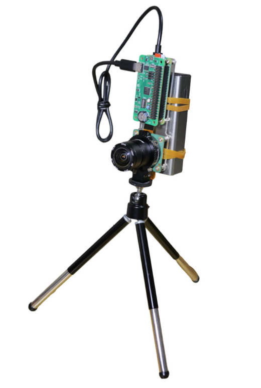
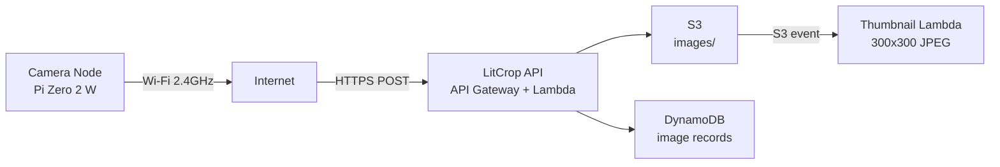
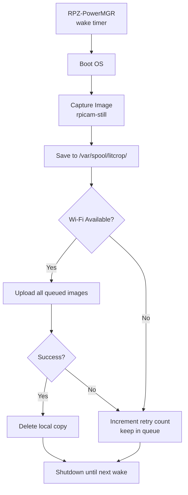

# MVP Camera Node Specification (LitCrop)

> Date: 2026-03-20 | Updated: 2026-03-22
> Status: DRAFT — hardware assembled, software integration pending
> Scope: MVP (field evaluation, April 2026)

---

## 1. Purpose

This document defines the MVP specification for the LitCrop Camera Node — a low-cost, battery-powered device that captures crop images periodically and uploads them to the LitCrop backend.

Objectives:
- Validate field deployment in Nagano (April 2026)
- Capture crop images at configurable intervals
- Upload to LitCrop API with retry and offline tolerance
- Ensure simple, reliable operation in outdoor environments

### Hardware Prototype



*Assembled prototype: Pi Zero 2 W + Camera Module 3 (wide-angle) + RPZ-PowerMGR + LiPo battery, mounted on mini tripod.*

---

## 2. Key Assumption

**Wi-Fi (2.4GHz) is available from the field.**

Therefore:
- LTE / SIM is **NOT required for MVP**
- The node connects via Wi-Fi directly to the internet

This simplifies hardware, power consumption, cost, and debugging.

---

## 3. System Overview



---

## 4. Design Principles

- Prioritize reliability over complexity
- Minimize power consumption
- Ensure offline tolerance (local queue)
- Keep implementation simple for MVP
- Maintain path to future scalability (LTE, solar, multi-node)

---

## 5. Hardware Specification

**References** (Japanese):
1. [RPZ-PowerMGR battery camera guide](https://www.indoorcorgielec.com/resources/raspberry-pi/rpz-powermgr-battery-camera/)
2. [Camera Module setup guide](https://www.indoorcorgielec.com/resources/raspberry-pi/camera-setup/)

### 5.1 Compute

| Component | Specification |
|-----------|--------------|
| Board | Raspberry Pi Zero 2 W |
| CPU | ARM Cortex-A53 (quad-core, 1GHz) |
| RAM | 512MB |

Rationale: low power, small form factor, sufficient for still image capture.

### 5.2 Camera

| Component | Specification |
|-----------|--------------|
| Module | Raspberry Pi Camera Module 3 |
| Variant | Wide-angle (recommended: NoIR for low-light) |
| Resolution | 11.9 MP (4608x2592 max) |
| Interface | CSI ribbon cable |

### 5.3 Power

| Component | Specification |
|-----------|--------------|
| Controller | RPZ-PowerMGR |
| Battery | LiPo 5000–10000mAh |
| Charging | USB-C (manual recharge for MVP) |

MVP strategy: battery-based operation with manual recharge. Solar deferred to Production.

### 5.4 Connectivity

| Scope | Method |
|-------|--------|
| MVP | Wi-Fi 2.4GHz |
| Future | LTE + SIM (e.g., SORACOM) |

Pre-deployment: test signal strength at deployment location using smartphone.

### 5.5 Storage

| Component | Specification |
|-----------|--------------|
| Media | microSD 64GB (recommended) |
| Usage | OS, image buffer, retry queue |

### 5.6 Enclosure

| Requirement | Specification |
|-------------|--------------|
| Rating | IP65 or higher |
| Features | Waterproof, cable sealing, condensation control (silica gel) |

---

## 6. Software Specification

### 6.1 OS

- Raspberry Pi OS Lite (headless, no desktop)
- SSH enabled for remote access

### 6.2 Core Functions

1. Periodic image capture (libcamera / rpicam-still)
2. Local storage with queue management
3. Upload to LitCrop API (multipart POST)
4. Retry with exponential backoff on failure
5. Logging to local file

### 6.3 Capture Flow



### 6.4 Capture Settings (Default)

| Setting | Value | Notes |
|---------|-------|-------|
| Interval | 10 minutes | RPZ-PowerMGR wake timer |
| Resolution | 1920x1080 | Sufficient for crop monitoring |
| Format | JPEG | Required by API (validates magic bytes `0xFFD8FF`) |
| Quality | 75 | ~300-500KB per image at 1080p |
| Max file size | 2MB | API rejects files exceeding this limit |

### 6.5 Upload Contract

The camera node uploads images to the LitCrop API. The upload must match the implemented API contract.

**Endpoint**: `POST /api/v1/beds/{bedId}/images`

**Content-Type**: `multipart/form-data`

**Required fields**:

| Field | Type | Description |
|-------|------|-------------|
| `image` | File (JPEG) | The captured image file (max 2MB) |
| `captured_at` | String (ISO 8601) | Capture timestamp, e.g. `2026-04-01T06:10:00+09:00` |
| `node_id` | String (1-64 chars) | Camera identifier, e.g. `field-01-camera-01` |
| `trigger` | String | `scheduled` or `motion` |

**Optional fields**:

| Field | Type | Description |
|-------|------|-------------|
| `metadata` | JSON string (max 4KB) | Additional capture metadata |

**Validation rules**:
- JPEG only (magic bytes check)
- `node_id` must match `/^[a-zA-Z0-9_-]{1,64}$/`
- `trigger` must be `scheduled` or `motion`
- File size must not exceed 2MB

**Success response**: `201 Created` with `ImageUploadResponse` (id, url, captured_at, uploaded_at, trigger, size_bytes)

**Retry strategy**: 3 attempts with exponential backoff (1s, 2s, 4s) — matches simulator implementation.

### 6.6 Authentication (MVP — Option B: Pre-provisioned Token)

The API is protected by Cognito JWT. For MVP+ field evaluation, we use **Option B**: a pre-provisioned access token stored on the device, with automatic refresh via cron.

| Component | Detail |
|-----------|--------|
| Initial token | Obtained via `aws cognito-idp initiate-auth` using a user account (e.g., Kiku) |
| Storage | `/etc/litcrop/node.conf` (`AUTH_TOKEN` field) |
| Refresh | `scripts/camera-node/refresh-token.sh` via cron every 50 minutes |
| Expiry | Access tokens last 1 hour; refresh tokens last 30 days |
| PROD-1 | Replace with Cognito machine-to-machine client credentials (no user account needed) |

**Setup guide**: `docs/CAMERA-NODE-SETUP.md` §4

### 6.7 Configuration

```yaml
# /etc/litcrop/node.yaml
node_id: field-01-camera-01
bed_id: <target-bed-uuid>
capture_interval_minutes: 10
image_width: 1920
image_height: 1080
jpeg_quality: 75
trigger: scheduled
api_base_url: https://<your-api-gateway-url>
spool_dir: /var/spool/litcrop
max_retry_count: 5
```

---

## 7. Node Identification

**Field**: `node_id` (matches API contract)

**Format**: `{location}-{sequence}`

**Examples**:
- `field-01-camera-01` — first camera in field 01
- `field-01-camera-02` — second camera in field 01
- `greenhouse-01-camera-01` — greenhouse deployment

**Constraints**: 1-64 alphanumeric characters, hyphens, and underscores.

---

## 8. Power Management

- RPZ-PowerMGR handles wake/sleep cycles
- Boot → capture → upload → shutdown (minimize active time)
- Avoid continuous processing
- Monitor battery level manually in MVP
- Estimated battery life: 3-7 days at 10-min intervals (depends on battery capacity and upload duration)

---

## 9. Logging

Log file: `/var/log/litcrop-node.log`

Log entries should include:
- Timestamp, capture result, file size
- Upload attempts, success/failure, HTTP status
- Wi-Fi signal strength (if available)
- Battery level (if readable from RPZ-PowerMGR)

---

## 10. Estimated Cost (MVP)

### Per-Node Hardware

| Component | Cost (JPY) |
|-----------|-----------|
| Pi Zero 2 W | 3,000 - 5,000 |
| Camera Module 3 | 3,000 - 6,000 |
| RPZ-PowerMGR | 3,000 - 5,000 |
| LiPo Battery | 2,000 - 5,000 |
| microSD 64GB | 1,000 - 2,000 |
| Enclosure (IP65) | 2,000 - 5,000 |
| **Total per node** | **15,000 - 30,000** |

No LTE/SIM recurring costs for MVP.

### Cloud Cost (existing infrastructure)

- S3 storage: ~$0.025/GB/month (images transition to IA at 30d, Glacier at 90d)
- Lambda invocations: negligible at MVP scale
- DynamoDB: on-demand, negligible at MVP scale

---

## 11. Risks

| Risk | Likelihood | Impact | Mitigation |
|------|-----------|--------|------------|
| Weak Wi-Fi signal at field edge | Medium | High | Pre-test with smartphone; consider USB Wi-Fi antenna |
| Battery depletion mid-day | Medium | Medium | 10000mAh battery; manual recharge schedule |
| Condensation inside enclosure | Low | Medium | Silica gel packs; IP65 seal |
| API auth token expiry | Medium | Medium | Resolve auth strategy (§6.6) before deployment |
| Image queue fills SD card | Low | Low | 64GB holds ~130K images at 500KB; auto-purge after 7 days |

---

## 12. Existing Software (Reference)

The LitCrop codebase already includes a **camera simulator** (`src/simulator/`) that validates the upload pipeline:

| Feature | Simulator | Camera Node (this spec) |
|---------|-----------|------------------------|
| Runtime | Node.js (dev machine) | Python/shell (Pi OS Lite) |
| Image source | Sample JPEGs from disk | rpicam-still (live capture) |
| Upload | Same API endpoint | Same API endpoint |
| `node_id` | `node-001` (default) | `field-01-camera-01` |
| `trigger` | `scheduled` or `motion` | `scheduled` (primary) |
| Retry | 3 attempts, exp. backoff | 3 attempts, exp. backoff |
| Offline queue | Not implemented | Local spool directory |

The simulator proves the upload contract works end-to-end. The camera node script should reuse the same API contract.

---

## 13. Future Expansion

- LTE / SIM integration (SORACOM)
- Solar panel charging
- Multi-node fleet management (web UI for device status)
- Environmental sensor integration (temperature, humidity, soil moisture)
- Motion detection trigger (PIR sensor or camera-based)
- OTA firmware updates

---

## 14. Summary

This MVP configuration removes LTE complexity by leveraging available 2.4GHz Wi-Fi, enabling faster setup, lower cost, and easier debugging.

The upload contract is already validated by the existing camera simulator. The remaining work is:
1. Write the capture script (Python or shell, ~100 lines)
2. Resolve the authentication strategy for device uploads (§6.6)
3. Configure RPZ-PowerMGR wake intervals
4. Field-test with the assembled prototype

The system remains extensible for LTE/SIM, solar power, and multi-node deployments beyond MVP.

### Scripts & Documentation

| File | Purpose |
|------|---------|
| `scripts/camera-node/install.sh` | Automated installer (run on Pi with `sudo`) |
| `scripts/camera-node/capture.sh` | Capture + upload script (run on Pi) |
| `scripts/camera-node/refresh-token.sh` | Cognito token refresh (cron every 50 min) |
| `scripts/camera-node/node.conf.example` | Configuration template |
| `docs/CAMERA-NODE-SETUP.md` | Step-by-step setup guide |
