# SYSTEM-DESIGN.md -- LitCrop MVP

> Generated by my-architect (Step 5a) on 2026-03-17
> Updated for MVP scope on 2026-03-20
> Scope Level: **MVP**

---

## 1. Sequence Diagrams

> **MVP Auth Note**: All `/api/v1/*` endpoints (except `/health`) are protected by an API Gateway JWT Authorizer backed by Cognito User Pools ([ADR-007](decisions/ADR-20260320-authentication-provider.md)). JWT validation happens at the gateway level (~1ms, zero Lambda cost). The sequence diagrams below show the Hono middleware extracting user identity from the already-validated JWT claims.

### 1.0a User Registration Flow (MVP)

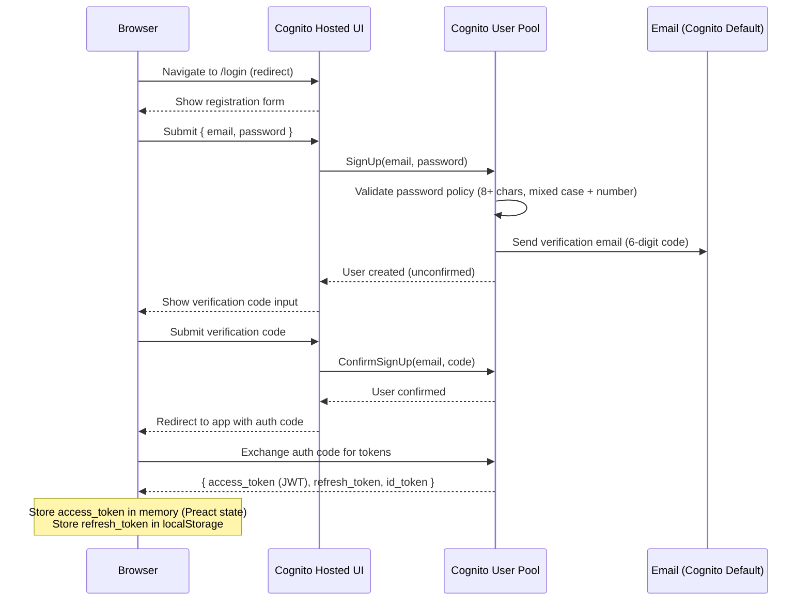
```mermaid
sequenceDiagram
    participant B as Browser
    participant CUI as Cognito Hosted UI
    participant CUP as Cognito User Pool
    participant SES as Email (Cognito Default)

    B->>CUI: Navigate to /login (redirect)
    CUI-->>B: Show registration form

    B->>CUI: Submit { email, password }
    CUI->>CUP: SignUp(email, password)
    CUP->>CUP: Validate password policy (8+ chars, mixed case + number)
    CUP->>SES: Send verification email (6-digit code)
    CUP-->>CUI: User created (unconfirmed)
    CUI-->>B: Show verification code input

    B->>CUI: Submit verification code
    CUI->>CUP: ConfirmSignUp(email, code)
    CUP-->>CUI: User confirmed
    CUI-->>B: Redirect to app with auth code

    B->>CUP: Exchange auth code for tokens
    CUP-->>B: { access_token (JWT), refresh_token, id_token }

    Note over B: Store access_token in memory (Preact state)<br/>Store refresh_token in localStorage
```

> **Production hardening**: Storing refresh tokens in `localStorage` is acceptable for MVP (1-10 trusted users, no sensitive financial data), but is vulnerable to XSS. At Production scope, evaluate HttpOnly cookie-based token storage with a BFF (Backend For Frontend) pattern, or Cognito's built-in cookie-based session management.

### 1.0b User Login Flow (MVP)

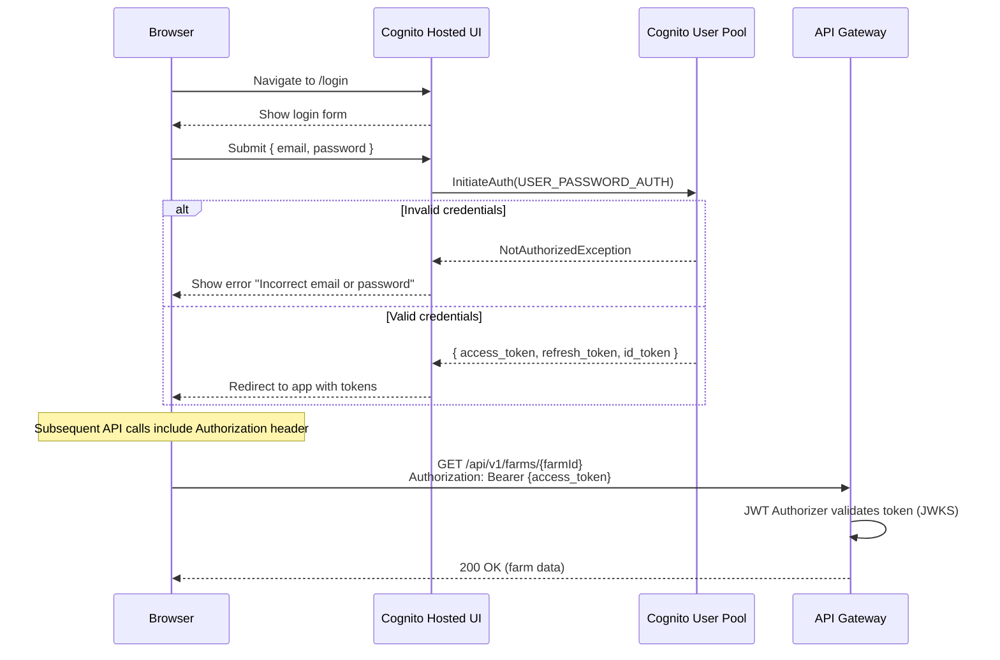
```mermaid
sequenceDiagram
    participant B as Browser
    participant CUI as Cognito Hosted UI
    participant CUP as Cognito User Pool
    participant AG as API Gateway

    B->>CUI: Navigate to /login
    CUI-->>B: Show login form

    B->>CUI: Submit { email, password }
    CUI->>CUP: InitiateAuth(USER_PASSWORD_AUTH)

    alt Invalid credentials
        CUP-->>CUI: NotAuthorizedException
        CUI-->>B: Show error "Incorrect email or password"
    else Valid credentials
        CUP-->>CUI: { access_token, refresh_token, id_token }
        CUI-->>B: Redirect to app with tokens
    end

    Note over B: Subsequent API calls include Authorization header
    B->>AG: GET /api/v1/farms/{farmId}<br/>Authorization: Bearer {access_token}
    AG->>AG: JWT Authorizer validates token (JWKS)
    AG-->>B: 200 OK (farm data)
```

### 1.0c Token Refresh Flow (MVP)

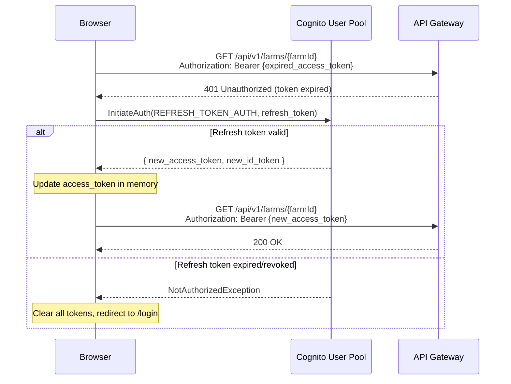
```mermaid
sequenceDiagram
    participant B as Browser
    participant CUP as Cognito User Pool
    participant AG as API Gateway

    B->>AG: GET /api/v1/farms/{farmId}<br/>Authorization: Bearer {expired_access_token}
    AG-->>B: 401 Unauthorized (token expired)

    B->>CUP: InitiateAuth(REFRESH_TOKEN_AUTH, refresh_token)

    alt Refresh token valid
        CUP-->>B: { new_access_token, new_id_token }
        Note over B: Update access_token in memory
        B->>AG: GET /api/v1/farms/{farmId}<br/>Authorization: Bearer {new_access_token}
        AG-->>B: 200 OK
    else Refresh token expired/revoked
        CUP-->>B: NotAuthorizedException
        Note over B: Clear all tokens, redirect to /login
    end
```

### 1.0d Password Reset Flow (MVP)

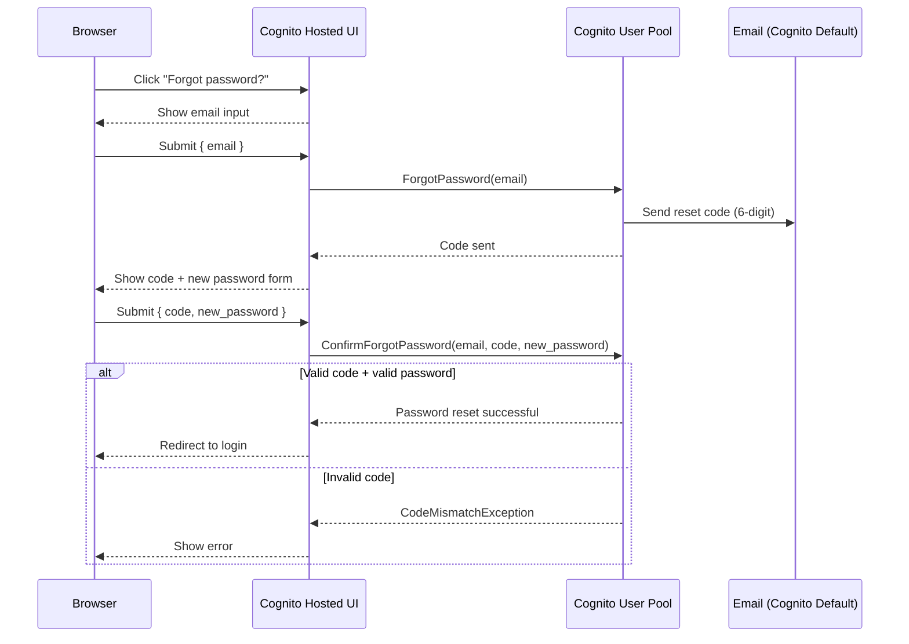
```mermaid
sequenceDiagram
    participant B as Browser
    participant CUI as Cognito Hosted UI
    participant CUP as Cognito User Pool
    participant SES as Email (Cognito Default)

    B->>CUI: Click "Forgot password?"
    CUI-->>B: Show email input

    B->>CUI: Submit { email }
    CUI->>CUP: ForgotPassword(email)
    CUP->>SES: Send reset code (6-digit)
    CUP-->>CUI: Code sent

    CUI-->>B: Show code + new password form
    B->>CUI: Submit { code, new_password }
    CUI->>CUP: ConfirmForgotPassword(email, code, new_password)

    alt Valid code + valid password
        CUP-->>CUI: Password reset successful
        CUI-->>B: Redirect to login
    else Invalid code
        CUP-->>CUI: CodeMismatchException
        CUI-->>B: Show error
    end
```

### 1.1 GET /api/v1/farms/{farmId} -- Farm Metadata + Layout

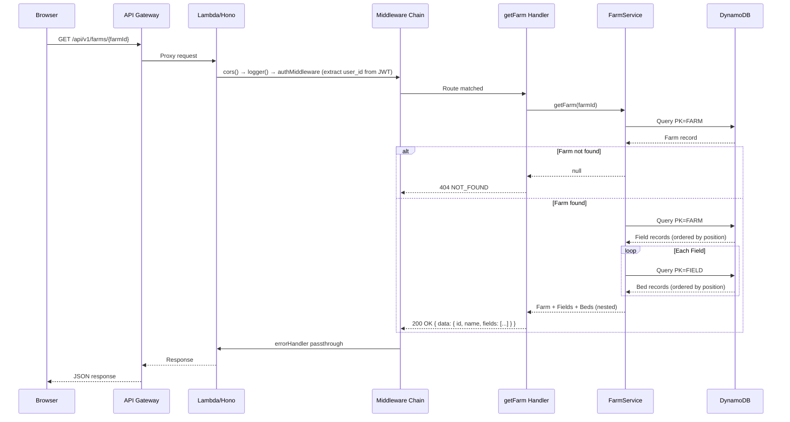
```mermaid
sequenceDiagram
    participant B as Browser
    participant AG as API Gateway
    participant L as Lambda/Hono
    participant MW as Middleware Chain
    participant RH as getFarm Handler
    participant SVC as FarmService
    participant DB as DynamoDB

    B->>AG: GET /api/v1/farms/{farmId}
    AG->>L: Proxy request
    L->>MW: cors() → logger() → authMiddleware (extract user_id from JWT)
    MW->>RH: Route matched

    RH->>SVC: getFarm(farmId)
    SVC->>DB: Query PK=FARM#{farmId} SK=#META
    DB-->>SVC: Farm record

    alt Farm not found
        SVC-->>RH: null
        RH-->>MW: 404 NOT_FOUND
    else Farm found
        SVC->>DB: Query PK=FARM#{farmId} SK begins_with FIELD#
        DB-->>SVC: Field records (ordered by position)

        loop Each Field
            SVC->>DB: Query PK=FIELD#{fieldId} SK begins_with BED#
            DB-->>SVC: Bed records (ordered by position)
        end

        SVC-->>RH: Farm + Fields + Beds (nested)
        RH-->>MW: 200 OK { data: { id, name, fields: [...] } }
    end

    MW->>L: errorHandler passthrough
    L-->>AG: Response
    AG-->>B: JSON response
```

### 1.2 POST /api/v1/farms -- Create Farm

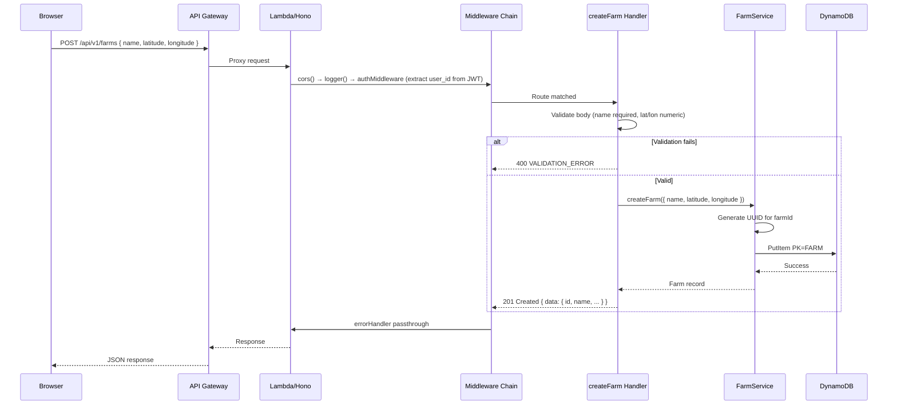
```mermaid
sequenceDiagram
    participant B as Browser
    participant AG as API Gateway
    participant L as Lambda/Hono
    participant MW as Middleware Chain
    participant RH as createFarm Handler
    participant SVC as FarmService
    participant DB as DynamoDB

    B->>AG: POST /api/v1/farms { name, latitude, longitude }
    AG->>L: Proxy request
    L->>MW: cors() → logger() → authMiddleware (extract user_id from JWT)
    MW->>RH: Route matched

    RH->>RH: Validate body (name required, lat/lon numeric)

    alt Validation fails
        RH-->>MW: 400 VALIDATION_ERROR
    else Valid
        RH->>SVC: createFarm({ name, latitude, longitude })
        SVC->>SVC: Generate UUID for farmId
        SVC->>DB: PutItem PK=FARM#{farmId} SK=#META
        DB-->>SVC: Success
        SVC-->>RH: Farm record
        RH-->>MW: 201 Created { data: { id, name, ... } }
    end

    MW->>L: errorHandler passthrough
    L-->>AG: Response
    AG-->>B: JSON response
```

### 1.3 PATCH /api/v1/farms/{farmId} -- Update Farm Settings

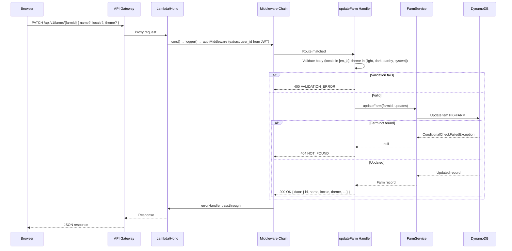
```mermaid
sequenceDiagram
    participant B as Browser
    participant AG as API Gateway
    participant L as Lambda/Hono
    participant MW as Middleware Chain
    participant RH as updateFarm Handler
    participant SVC as FarmService
    participant DB as DynamoDB

    B->>AG: PATCH /api/v1/farms/{farmId} { name?, locale?, theme? }
    AG->>L: Proxy request
    L->>MW: cors() → logger() → authMiddleware (extract user_id from JWT)
    MW->>RH: Route matched

    RH->>RH: Validate body (locale in [en, ja], theme in [light, dark, earthy, system])

    alt Validation fails
        RH-->>MW: 400 VALIDATION_ERROR
    else Valid
        RH->>SVC: updateFarm(farmId, updates)
        SVC->>DB: UpdateItem PK=FARM#{farmId} SK=#META SET name, locale, theme
        alt Farm not found
            DB-->>SVC: ConditionalCheckFailedException
            SVC-->>RH: null
            RH-->>MW: 404 NOT_FOUND
        else Updated
            DB-->>SVC: Updated record
            SVC-->>RH: Farm record
            RH-->>MW: 200 OK { data: { id, name, locale, theme, ... } }
        end
    end

    MW->>L: errorHandler passthrough
    L-->>AG: Response
    AG-->>B: JSON response
```

### 1.4 GET /api/v1/farms/{farmId}/plots -- All Plots (Farm Overview)

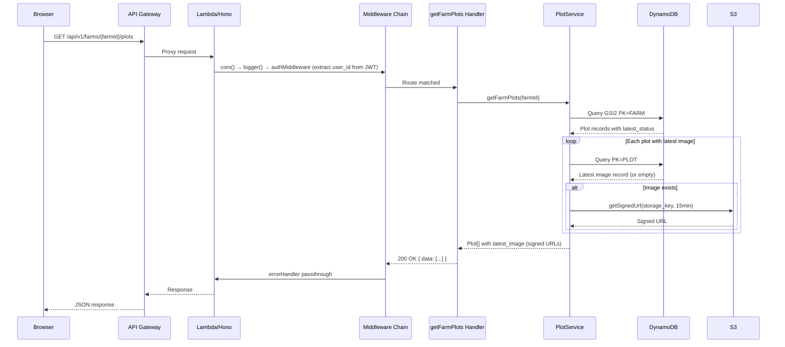
```mermaid
sequenceDiagram
    participant B as Browser
    participant AG as API Gateway
    participant L as Lambda/Hono
    participant MW as Middleware Chain
    participant RH as getFarmPlots Handler
    participant SVC as PlotService
    participant DB as DynamoDB
    participant S3 as S3

    B->>AG: GET /api/v1/farms/{farmId}/plots
    AG->>L: Proxy request
    L->>MW: cors() → logger() → authMiddleware (extract user_id from JWT)
    MW->>RH: Route matched

    RH->>SVC: getFarmPlots(farmId)
    SVC->>DB: Query GSI2 PK=FARM#{farmId} (all plots)
    DB-->>SVC: Plot records with latest_status

    loop Each plot with latest image
        SVC->>DB: Query PK=PLOT#{plotId} SK begins_with IMG# (limit 1, ScanIndexForward=false)
        DB-->>SVC: Latest image record (or empty)

        alt Image exists
            SVC->>S3: getSignedUrl(storage_key, 15min)
            S3-->>SVC: Signed URL
        end
    end

    SVC-->>RH: Plot[] with latest_image (signed URLs)
    RH-->>MW: 200 OK { data: [...] }

    MW->>L: errorHandler passthrough
    L-->>AG: Response
    AG-->>B: JSON response
```

### 1.5 GET /api/v1/plots/{plotId} -- Plot Detail

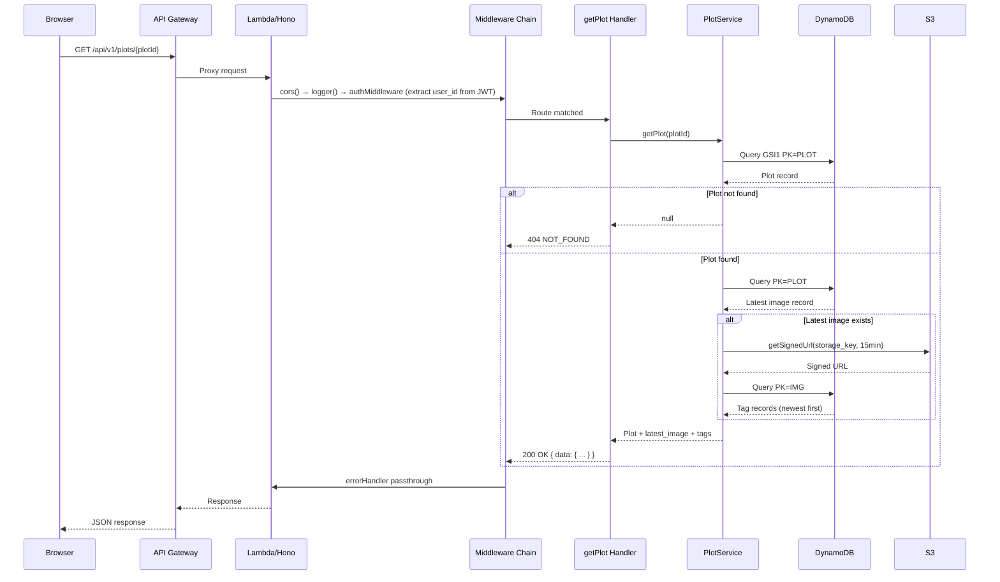
```mermaid
sequenceDiagram
    participant B as Browser
    participant AG as API Gateway
    participant L as Lambda/Hono
    participant MW as Middleware Chain
    participant RH as getPlot Handler
    participant SVC as PlotService
    participant DB as DynamoDB
    participant S3 as S3

    B->>AG: GET /api/v1/plots/{plotId}
    AG->>L: Proxy request
    L->>MW: cors() → logger() → authMiddleware (extract user_id from JWT)
    MW->>RH: Route matched

    RH->>SVC: getPlot(plotId)
    SVC->>DB: Query GSI1 PK=PLOT#{plotId} SK=#META
    DB-->>SVC: Plot record

    alt Plot not found
        SVC-->>RH: null
        RH-->>MW: 404 NOT_FOUND
    else Plot found
        SVC->>DB: Query PK=PLOT#{plotId} SK begins_with IMG# (limit 1, ScanIndexForward=false)
        DB-->>SVC: Latest image record

        alt Latest image exists
            SVC->>S3: getSignedUrl(storage_key, 15min)
            S3-->>SVC: Signed URL
            SVC->>DB: Query PK=IMG#{imageId} SK begins_with TAG#
            DB-->>SVC: Tag records (newest first)
        end

        SVC-->>RH: Plot + latest_image + tags
        RH-->>MW: 200 OK { data: { ... } }
    end

    MW->>L: errorHandler passthrough
    L-->>AG: Response
    AG-->>B: JSON response
```

### 1.6 GET /api/v1/plots/{plotId}/images -- Image History (Paginated)

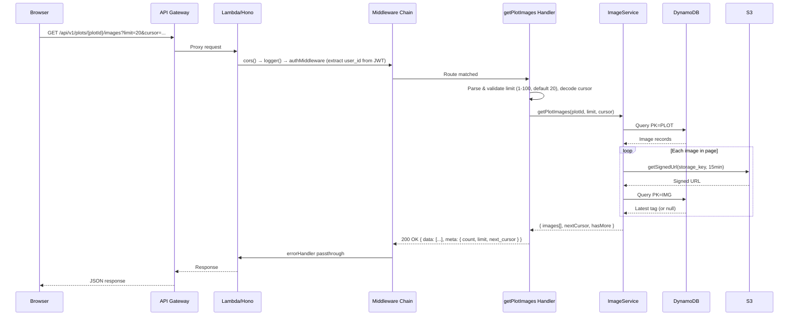
```mermaid
sequenceDiagram
    participant B as Browser
    participant AG as API Gateway
    participant L as Lambda/Hono
    participant MW as Middleware Chain
    participant RH as getPlotImages Handler
    participant SVC as ImageService
    participant DB as DynamoDB
    participant S3 as S3

    B->>AG: GET /api/v1/plots/{plotId}/images?limit=20&cursor=...
    AG->>L: Proxy request
    L->>MW: cors() → logger() → authMiddleware (extract user_id from JWT)
    MW->>RH: Route matched

    RH->>RH: Parse & validate limit (1-100, default 20), decode cursor

    RH->>SVC: getPlotImages(plotId, limit, cursor)
    SVC->>DB: Query PK=PLOT#{plotId} SK begins_with IMG#<br/>ScanIndexForward=false, Limit=limit+1,<br/>ExclusiveStartKey=decoded cursor
    DB-->>SVC: Image records

    loop Each image in page
        SVC->>S3: getSignedUrl(storage_key, 15min)
        S3-->>SVC: Signed URL

        SVC->>DB: Query PK=IMG#{imageId} SK begins_with TAG# (limit 1, newest)
        DB-->>SVC: Latest tag (or null)
    end

    SVC-->>RH: { images[], nextCursor, hasMore }
    RH-->>MW: 200 OK { data: [...], meta: { count, limit, next_cursor } }

    MW->>L: errorHandler passthrough
    L-->>AG: Response
    AG-->>B: JSON response
```

### 1.7 POST /api/v1/plots/{plotId}/images -- Image Upload

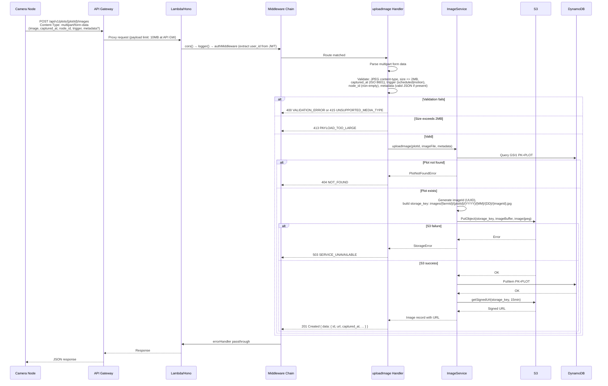
```mermaid
sequenceDiagram
    participant CN as Camera Node
    participant AG as API Gateway
    participant L as Lambda/Hono
    participant MW as Middleware Chain
    participant RH as uploadImage Handler
    participant SVC as ImageService
    participant S3 as S3
    participant DB as DynamoDB

    CN->>AG: POST /api/v1/plots/{plotId}/images<br/>Content-Type: multipart/form-data<br/>(image, captured_at, node_id, trigger, metadata?)
    AG->>L: Proxy request (payload limit: 10MB at API GW)
    L->>MW: cors() → logger() → authMiddleware (extract user_id from JWT)
    MW->>RH: Route matched

    RH->>RH: Parse multipart form data
    RH->>RH: Validate: JPEG content-type, size <= 2MB,<br/>captured_at (ISO 8601), trigger (scheduled|motion),<br/>node_id (non-empty), metadata (valid JSON if present)

    alt Validation fails
        RH-->>MW: 400 VALIDATION_ERROR or 415 UNSUPPORTED_MEDIA_TYPE
    else Size exceeds 2MB
        RH-->>MW: 413 PAYLOAD_TOO_LARGE
    else Valid
        RH->>SVC: uploadImage(plotId, imageFile, metadata)

        SVC->>DB: Query GSI1 PK=PLOT#{plotId} SK=#META (verify plot exists)
        alt Plot not found
            SVC-->>RH: PlotNotFoundError
            RH-->>MW: 404 NOT_FOUND
        else Plot exists
            SVC->>SVC: Generate imageId (UUID),<br/>build storage_key: images/{farmId}/{plotId}/{YYYY}/{MM}/{DD}/{imageId}.jpg
            SVC->>S3: PutObject(storage_key, imageBuffer, image/jpeg)
            alt S3 failure
                S3-->>SVC: Error
                SVC-->>RH: StorageError
                RH-->>MW: 503 SERVICE_UNAVAILABLE
            else S3 success
                S3-->>SVC: OK
                SVC->>DB: PutItem PK=PLOT#{plotId} SK=IMG#{capturedAt}#{imageId}
                DB-->>SVC: OK
                SVC->>S3: getSignedUrl(storage_key, 15min)
                S3-->>SVC: Signed URL
                SVC-->>RH: Image record with URL
                RH-->>MW: 201 Created { data: { id, url, captured_at, ... } }
            end
        end
    end

    MW->>L: errorHandler passthrough
    L-->>AG: Response
    AG-->>CN: JSON response
```

### 1.8 GET /api/v1/images/{imageId} -- Image Metadata + Signed URL

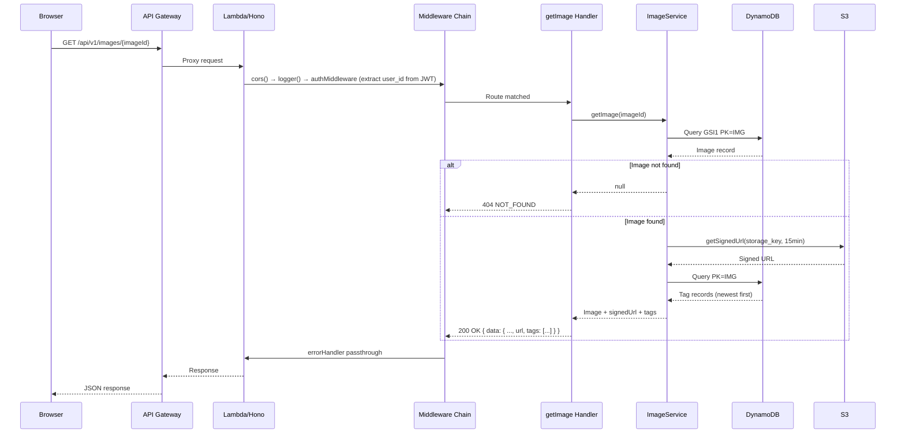
```mermaid
sequenceDiagram
    participant B as Browser
    participant AG as API Gateway
    participant L as Lambda/Hono
    participant MW as Middleware Chain
    participant RH as getImage Handler
    participant SVC as ImageService
    participant DB as DynamoDB
    participant S3 as S3

    B->>AG: GET /api/v1/images/{imageId}
    AG->>L: Proxy request
    L->>MW: cors() → logger() → authMiddleware (extract user_id from JWT)
    MW->>RH: Route matched

    RH->>SVC: getImage(imageId)
    SVC->>DB: Query GSI1 PK=IMG#{imageId} SK=#META
    DB-->>SVC: Image record

    alt Image not found
        SVC-->>RH: null
        RH-->>MW: 404 NOT_FOUND
    else Image found
        SVC->>S3: getSignedUrl(storage_key, 15min)
        S3-->>SVC: Signed URL
        SVC->>DB: Query PK=IMG#{imageId} SK begins_with TAG#
        DB-->>SVC: Tag records (newest first)
        SVC-->>RH: Image + signedUrl + tags
        RH-->>MW: 200 OK { data: { ..., url, tags: [...] } }
    end

    MW->>L: errorHandler passthrough
    L-->>AG: Response
    AG-->>B: JSON response
```

### 1.9 POST /api/v1/images/{imageId}/tags -- Add Tag

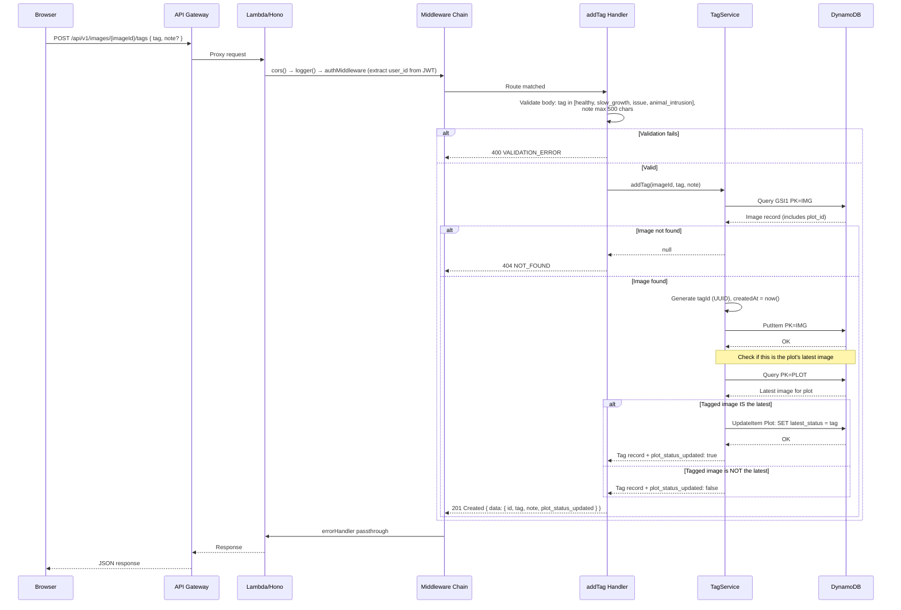
```mermaid
sequenceDiagram
    participant B as Browser
    participant AG as API Gateway
    participant L as Lambda/Hono
    participant MW as Middleware Chain
    participant RH as addTag Handler
    participant SVC as TagService
    participant DB as DynamoDB

    B->>AG: POST /api/v1/images/{imageId}/tags { tag, note? }
    AG->>L: Proxy request
    L->>MW: cors() → logger() → authMiddleware (extract user_id from JWT)
    MW->>RH: Route matched

    RH->>RH: Validate body: tag in [healthy, slow_growth, issue, animal_intrusion],<br/>note max 500 chars

    alt Validation fails
        RH-->>MW: 400 VALIDATION_ERROR
    else Valid
        RH->>SVC: addTag(imageId, tag, note)
        SVC->>DB: Query GSI1 PK=IMG#{imageId} SK=#META
        DB-->>SVC: Image record (includes plot_id)

        alt Image not found
            SVC-->>RH: null
            RH-->>MW: 404 NOT_FOUND
        else Image found
            SVC->>SVC: Generate tagId (UUID), createdAt = now()
            SVC->>DB: PutItem PK=IMG#{imageId} SK=TAG#{createdAt}#{tagId}
            DB-->>SVC: OK

            Note over SVC,DB: Check if this is the plot's latest image
            SVC->>DB: Query PK=PLOT#{plotId} SK begins_with IMG# (limit 1, desc)
            DB-->>SVC: Latest image for plot

            alt Tagged image IS the latest
                SVC->>DB: UpdateItem Plot: SET latest_status = tag
                DB-->>SVC: OK
                SVC-->>RH: Tag record + plot_status_updated: true
            else Tagged image is NOT the latest
                SVC-->>RH: Tag record + plot_status_updated: false
            end

            RH-->>MW: 201 Created { data: { id, tag, note, plot_status_updated } }
        end
    end

    MW->>L: errorHandler passthrough
    L-->>AG: Response
    AG-->>B: JSON response
```

### 1.10 GET /api/v1/farms/{farmId}/weather -- Weather Proxy

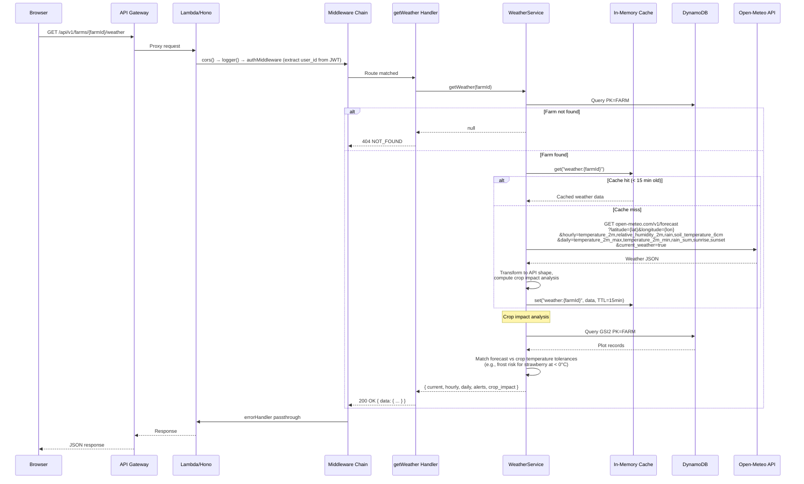
```mermaid
sequenceDiagram
    participant B as Browser
    participant AG as API Gateway
    participant L as Lambda/Hono
    participant MW as Middleware Chain
    participant RH as getWeather Handler
    participant SVC as WeatherService
    participant Cache as In-Memory Cache
    participant DB as DynamoDB
    participant OM as Open-Meteo API

    B->>AG: GET /api/v1/farms/{farmId}/weather
    AG->>L: Proxy request
    L->>MW: cors() → logger() → authMiddleware (extract user_id from JWT)
    MW->>RH: Route matched

    RH->>SVC: getWeather(farmId)

    SVC->>DB: Query PK=FARM#{farmId} SK=#META (get lat/lon)
    alt Farm not found
        SVC-->>RH: null
        RH-->>MW: 404 NOT_FOUND
    else Farm found
        SVC->>Cache: get("weather:{farmId}")

        alt Cache hit (< 15 min old)
            Cache-->>SVC: Cached weather data
        else Cache miss
            SVC->>OM: GET open-meteo.com/v1/forecast<br/>?latitude={lat}&longitude={lon}<br/>&hourly=temperature_2m,relative_humidity_2m,rain,soil_temperature_6cm<br/>&daily=temperature_2m_max,temperature_2m_min,rain_sum,sunrise,sunset<br/>&current_weather=true
            OM-->>SVC: Weather JSON

            SVC->>SVC: Transform to API shape,<br/>compute crop impact analysis
            SVC->>Cache: set("weather:{farmId}", data, TTL=15min)
        end

        Note over SVC: Crop impact analysis
        SVC->>DB: Query GSI2 PK=FARM#{farmId} (all plots with crop types)
        DB-->>SVC: Plot records

        SVC->>SVC: Match forecast vs crop temperature tolerances<br/>(e.g., frost risk for strawberry at < 0°C)

        SVC-->>RH: { current, hourly, daily, alerts, crop_impact }
        RH-->>MW: 200 OK { data: { ... } }
    end

    MW->>L: errorHandler passthrough
    L-->>AG: Response
    AG-->>B: JSON response
```

### 1.11 POST /api/v1/chat -- AI Chatbot (MVP: Multi-Turn + Tool Use)

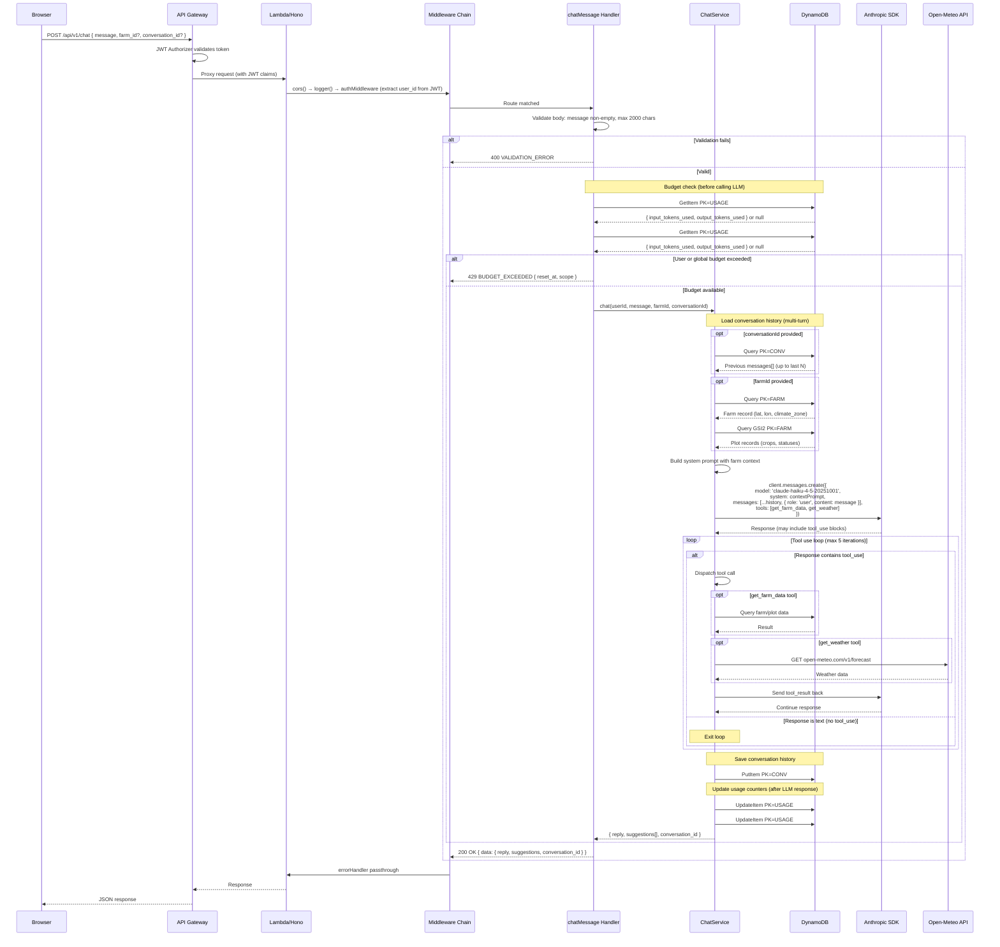
```mermaid
sequenceDiagram
    participant B as Browser
    participant AG as API Gateway
    participant L as Lambda/Hono
    participant MW as Middleware Chain
    participant RH as chatMessage Handler
    participant SVC as ChatService
    participant DB as DynamoDB
    participant SDK as Anthropic SDK
    participant OM as Open-Meteo API

    B->>AG: POST /api/v1/chat { message, farm_id?, conversation_id? }
    AG->>AG: JWT Authorizer validates token
    AG->>L: Proxy request (with JWT claims)
    L->>MW: cors() → logger() → authMiddleware (extract user_id from JWT)
    MW->>RH: Route matched

    RH->>RH: Validate body: message non-empty, max 2000 chars

    alt Validation fails
        RH-->>MW: 400 VALIDATION_ERROR
    else Valid
        Note over RH,DB: Budget check (before calling LLM)
        RH->>DB: GetItem PK=USAGE#{userId} SK=DAY#{yyyy-mm-dd}
        DB-->>RH: { input_tokens_used, output_tokens_used } or null
        RH->>DB: GetItem PK=USAGE#GLOBAL SK=DAY#{yyyy-mm-dd}
        DB-->>RH: { input_tokens_used, output_tokens_used } or null

        alt User or global budget exceeded
            RH-->>MW: 429 BUDGET_EXCEEDED { reset_at, scope }
        else Budget available
        RH->>SVC: chat(userId, message, farmId, conversationId)

        Note over SVC,DB: Load conversation history (multi-turn)
        opt conversationId provided
            SVC->>DB: Query PK=CONV#{conversationId} SK begins_with MSG#
            DB-->>SVC: Previous messages[] (up to last N)
        end

        opt farmId provided
            SVC->>DB: Query PK=FARM#{farmId} SK=#META (verify user_id ownership)
            DB-->>SVC: Farm record (lat, lon, climate_zone)
            SVC->>DB: Query GSI2 PK=FARM#{farmId} (all plots)
            DB-->>SVC: Plot records (crops, statuses)
        end

        SVC->>SVC: Build system prompt with farm context

        SVC->>SDK: client.messages.create({<br/>  model: 'claude-haiku-4-5-20251001',<br/>  system: contextPrompt,<br/>  messages: [...history, { role: 'user', content: message }],<br/>  tools: [get_farm_data, get_weather]<br/>})
        SDK-->>SVC: Response (may include tool_use blocks)

        loop Tool use loop (max 5 iterations)
            alt Response contains tool_use
                SVC->>SVC: Dispatch tool call
                opt get_farm_data tool
                    SVC->>DB: Query farm/plot data
                    DB-->>SVC: Result
                end
                opt get_weather tool
                    SVC->>OM: GET open-meteo.com/v1/forecast
                    OM-->>SVC: Weather data
                end
                SVC->>SDK: Send tool_result back
                SDK-->>SVC: Continue response
            else Response is text (no tool_use)
                Note over SVC: Exit loop
            end
        end

        Note over SVC,DB: Save conversation history
        SVC->>DB: PutItem PK=CONV#{convId} SK=MSG#{ts}#user<br/>(+ assistant response, TTL: 24h)

        Note over SVC,DB: Update usage counters (after LLM response)
        SVC->>DB: UpdateItem PK=USAGE#{userId} SK=DAY#{date}<br/>ADD input_tokens_used +N, output_tokens_used +M (TTL: 48h)
        SVC->>DB: UpdateItem PK=USAGE#GLOBAL SK=DAY#{date}<br/>ADD input_tokens_used +N, output_tokens_used +M (TTL: 48h)

        SVC-->>RH: { reply, suggestions[], conversation_id }
        end
        RH-->>MW: 200 OK { data: { reply, suggestions, conversation_id } }
    end

    MW->>L: errorHandler passthrough
    L-->>AG: Response
    AG-->>B: JSON response
```

### 1.12 Image Processing Pipeline — Thumbnail Generation (MVP)

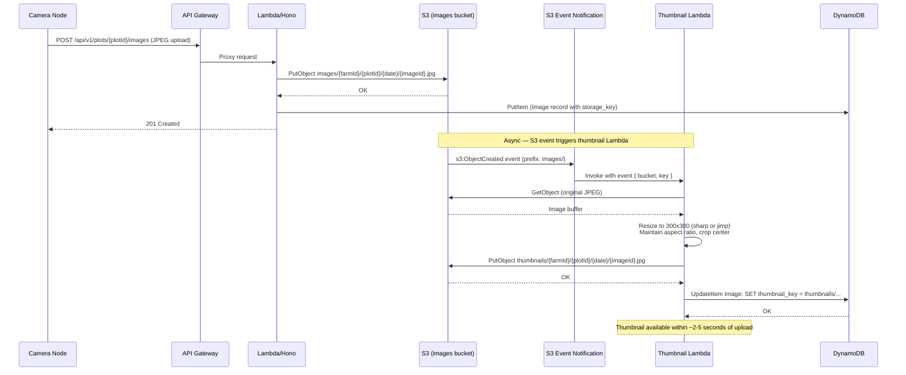
```mermaid
sequenceDiagram
    participant CN as Camera Node
    participant AG as API Gateway
    participant L as Lambda/Hono
    participant S3 as S3 (images bucket)
    participant S3E as S3 Event Notification
    participant TL as Thumbnail Lambda
    participant DB as DynamoDB

    CN->>AG: POST /api/v1/plots/{plotId}/images (JPEG upload)
    AG->>L: Proxy request
    L->>S3: PutObject images/{farmId}/{plotId}/{date}/{imageId}.jpg
    S3-->>L: OK
    L->>DB: PutItem (Image record with storage_key)
    L-->>CN: 201 Created

    Note over S3,TL: Async — S3 event triggers thumbnail Lambda
    S3->>S3E: s3:ObjectCreated event (prefix: images/)
    S3E->>TL: Invoke with event { bucket, key }

    TL->>S3: GetObject (original JPEG)
    S3-->>TL: Image buffer

    TL->>TL: Resize to 300x300 (sharp or jimp)<br/>Maintain aspect ratio, crop center

    TL->>S3: PutObject thumbnails/{farmId}/{plotId}/{date}/{imageId}.jpg
    S3-->>TL: OK

    TL->>DB: UpdateItem Image: SET thumbnail_key = thumbnails/...
    DB-->>TL: OK

    Note over TL: Thumbnail available within ~2-5 seconds of upload
```

**Key design decisions**:
- **Async processing**: Thumbnail generation does not block the upload response — the camera node gets `201` immediately
- **Separate Lambda**: Isolates image processing from the API Lambda (different memory/timeout requirements)
- **S3 event trigger**: No polling or queue needed — S3 natively invokes Lambda on object creation
- **Thumbnail size**: 300x300px center-crop covers both mobile grid tiles and desktop list views
- **CDK construct**: S3 bucket notification → Lambda trigger defined in `LitCropStack`

---

## 2. Component Interface Contracts

### 2.1 Shared Domain Types

These types are shared across frontend, API, and simulator packages via `@litcrop/shared`. The TypeScript interfaces below define the domain model; the corresponding **Zod schemas** in `packages/shared/src/schemas/index.ts` provide runtime validation and contract testing (see [ARCHITECTURE.md Section 10](ARCHITECTURE.md#10-contract-testing--shared-schemas) for the full schema catalog).

```typescript
// packages/shared/types/domain.ts

/** Status values for plot health observation */
export type PlotStatus = 'healthy' | 'slow_growth' | 'issue' | 'animal_intrusion' | 'no_data';

/** Image capture trigger type */
export type TriggerType = 'scheduled' | 'motion';

/** Tag values (subset of PlotStatus, excludes no_data) */
export type TagValue = Exclude<PlotStatus, 'no_data'>;

/** Supported locales */
export type Locale = 'en' | 'ja';

/** Theme options */
export type Theme = 'light' | 'dark' | 'earthy' | 'system';

/** Temperature unit */
export type TempUnit = 'C' | 'F';

// --- Entity Types ---

export interface Farm {
  id: string;
  name: string;
  description?: string;
  latitude: number;
  longitude: number;
  elevation_m?: number;
  climate_zone?: string;
  locale: Locale;
  theme: Theme;
  created_at: string; // ISO 8601
  user_id: string;    // MVP: Cognito sub (owner). Used for per-user data isolation.
}

export interface Field {
  id: string;
  farm_id: string;
  name: string;
  position: number;
}

export interface Bed {
  id: string;
  field_id: string;
  name: string;
  position: number;
}

export interface Plot {
  id: string;
  bed_id: string;
  label: string;
  crop_type: string;
  crop_variety: string;
  planted_at: string;      // ISO 8601 date
  expected_harvest: string; // ISO 8601 date
  notes?: string;
  latest_status: PlotStatus;
  farm_id: string; // denormalized for GSI2
}

export interface Image {
  id: string;
  plot_id: string;
  node_id: string;
  captured_at: string;  // ISO 8601
  uploaded_at: string;  // ISO 8601
  storage_key: string;
  thumbnail_key?: string; // MVP: set async by Thumbnail Lambda after upload
  trigger: TriggerType;
  content_type: string;
  size_bytes: number;
  bed_id: string;       // MVP: denormalized for query convenience
  field_id: string;     // MVP: denormalized for query convenience
  metadata?: Record<string, unknown>;
}

/** MVP: Conversation message for multi-turn AI chatbot (FR-9.5) */
export interface ConversationMessage {
  id: string;
  conversation_id: string;
  role: 'user' | 'assistant';
  content: string;
  tool_use?: {           // Present when assistant invoked a tool
    name: string;
    input: Record<string, unknown>;
    result?: unknown;
  };
  created_at: string;    // ISO 8601
  ttl: number;           // DynamoDB TTL (epoch seconds, 24h from creation)
}

/** MVP: Daily token usage counter for AI budget controls */
export interface UsageBudget {
  user_id: string;        // Cognito sub, or "GLOBAL" for global counter
  date: string;           // ISO 8601 date (UTC), e.g. "2026-03-20"
  input_tokens_used: number;   // cumulative input tokens consumed today
  output_tokens_used: number;  // cumulative output tokens consumed today
  messages_sent: number;       // number of chat messages sent today
  updated_at: string;     // ISO 8601 timestamp of last update
  ttl: number;            // DynamoDB TTL (epoch seconds, 48h from date start)
}
// DynamoDB key: PK=USAGE#{userId|GLOBAL}, SK=DAY#{yyyy-mm-dd}
// Updated via atomic ADD operations after each Anthropic SDK call

export interface Tag {
  id: string;
  image_id: string;
  tag: TagValue;
  note?: string;
  created_at: string; // ISO 8601
}
```

### 2.2 API Response Types

```typescript
// packages/shared/types/api.ts

import type { Farm, Field, Bed, Plot, Image, Tag, PlotStatus, TriggerType, TagValue } from './domain';

// --- Response Envelopes ---

export interface ApiResponse<T> {
  data: T;
}

export interface PaginatedResponse<T> {
  data: T[];
  meta: {
    count: number;
    limit: number;
    next_cursor: string | null;
  };
}

export interface ApiError {
  error: {
    code: ErrorCode;
    message: string;
    details?: Record<string, unknown>;
  };
}

export type ErrorCode =
  | 'UNAUTHORIZED'           // 401 — API Gateway JWT Authorizer (pre-Lambda)
  | 'FORBIDDEN'              // 403 — reserved for future RBAC (not used at MVP)
  | 'VALIDATION_ERROR'       // 400 — request body/param validation failure
  | 'UNSUPPORTED_MEDIA_TYPE' // 415 — non-JPEG upload (replaces INVALID_CONTENT_TYPE)
  | 'NOT_FOUND'              // 404 — resource missing or ownership mismatch
  | 'PAYLOAD_TOO_LARGE'      // 413 — image exceeds 2MB
  | 'CONFLICT'               // 409 — duplicate resource or state conflict
  | 'BAD_CURSOR'             // 400 — invalid pagination cursor
  | 'RATE_LIMITED'            // 429 — Anthropic API rate limit passthrough
  | 'INTERNAL_ERROR'          // 500 — unclassified server error
  | 'SERVICE_UNAVAILABLE'     // 503 — downstream service (S3, DynamoDB) failure
  | 'UPSTREAM_ERROR';         // 502 — external API failure (Open-Meteo, Anthropic)

// --- Endpoint-Specific Response Types ---

/** GET /api/v1/farms/{farmId} */
export interface FarmResponse extends Farm {
  fields: (Field & {
    beds: Bed[];
  })[];
}

/** GET /api/v1/farms/{farmId}/plots */
export interface FarmPlotItem {
  id: string;
  label: string;
  bed_id: string;
  field_id: string;
  crop_type: string;
  crop_variety: string;
  latest_status: PlotStatus;
  latest_image: {
    id: string;
    captured_at: string;
    trigger: TriggerType;
    thumbnail_url: string;
  } | null;
}

/** GET /api/v1/plots/{plotId} */
export interface PlotDetailResponse extends Plot {
  latest_image: {
    id: string;
    captured_at: string;
    trigger: TriggerType;
    url: string;
    tags: Tag[];
  } | null;
}

/** GET /api/v1/plots/{plotId}/images (each item) */
export interface ImageListItem {
  id: string;
  captured_at: string;
  trigger: TriggerType;
  thumbnail_url: string;
  latest_tag: TagValue | null;
}

/** POST /api/v1/plots/{plotId}/images */
export interface ImageUploadResponse {
  id: string;
  url: string;
  captured_at: string;
  uploaded_at: string;
  trigger: TriggerType;
  storage_key: string;
  size_bytes: number;
}

/** GET /api/v1/images/{imageId} */
export interface ImageDetailResponse extends Omit<Image, 'storage_key'> {
  url: string;
  tags: Tag[];
}

/** POST /api/v1/images/{imageId}/tags */
export interface TagCreateResponse extends Tag {
  image_id: string;
  plot_status_updated: boolean;
}

/** GET /api/v1/farms/{farmId}/weather */
export interface WeatherResponse {
  current: {
    temperature: number;
    condition: string;
    condition_icon: string;
    humidity: number;
    wind_speed: number;
    wind_direction: string;
  };
  today: {
    high: number;
    low: number;
    rain_probability: number;
    rain_sum_mm: number;
    sunrise: string;
    sunset: string;
  };
  hourly: HourlyForecast[];
  daily: DailyForecast[];
  alerts: WeatherAlert[];
  crop_impact: CropImpactCard[];
}

export interface HourlyForecast {
  time: string; // ISO 8601
  temperature: number;
  rain_probability: number;
  condition_icon: string;
}

export interface DailyForecast {
  date: string; // ISO 8601 date
  high: number;
  low: number;
  rain_probability: number;
  rain_sum_mm: number;
  condition: string;
  condition_icon: string;
}

export interface WeatherAlert {
  type: 'frost' | 'heavy_rain' | 'extreme_heat';
  severity: 'warning' | 'danger';
  message: string;
}

export interface CropImpactCard {
  severity: 'danger' | 'warning' | 'good' | 'info';
  title: string;
  description: string;
  affected_plots: { id: string; label: string; crop_type: string }[];
}

/** POST /api/v1/chat */
export interface ChatRequest {
  message: string;
  farm_id?: string;
  conversation_id?: string; // MVP: continue existing conversation
}

export interface ChatResponse {
  reply: string;
  suggestions: string[];
  conversation_id: string; // MVP: session ID for multi-turn
  tool_calls?: {           // MVP: present when LLM invoked tools during this exchange
    name: string;
    input: Record<string, unknown>;
  }[];
}

/** GET /api/v1/usage — MVP: AI chat budget status */
export interface UsageResponse {
  user_id: string;
  period: 'daily';
  period_start: string;   // ISO 8601 (start of UTC day)
  reset_at: string;        // ISO 8601 (next midnight UTC)
  user_budget: {
    input_tokens_used: number;
    input_tokens_limit: number;
    output_tokens_used: number;
    output_tokens_limit: number;
    messages_sent: number;
    messages_limit: number;
  };
  global_budget: {
    input_tokens_used: number;
    input_tokens_limit: number;
    output_tokens_used: number;
    output_tokens_limit: number;
    utilization_pct: number;  // 0-100
  };
  model: string;            // e.g. 'claude-haiku-4-5-20251001'
}
```

### 2.3 API Request Validation Types

```typescript
// packages/shared/types/requests.ts

import type { Locale, Theme, TagValue, TempUnit } from './domain';

/** POST /api/v1/farms -- Create Farm */
export interface CreateFarmRequest {
  name: string;
  latitude: number;
  longitude: number;
  description?: string;
  elevation_m?: number;
  locale?: Locale;
  theme?: Theme;
}

/** PATCH /api/v1/farms/{farmId} -- Update Farm */
export interface UpdateFarmRequest {
  name?: string;
  description?: string;
  locale?: Locale;
  theme?: Theme;
  temp_unit?: TempUnit;
}

/** POST /api/v1/images/{imageId}/tags */
export interface CreateTagRequest {
  tag: TagValue;
  note?: string;
}

/** POST /api/v1/chat */
export interface ChatMessageRequest {
  message: string;
  farm_id?: string;
}
```

### 2.4 Service Layer Interfaces

```typescript
// src/api/src/services/types.ts

import type {
  Farm, Plot, Image, Tag,
  FarmResponse, FarmPlotItem, PlotDetailResponse,
  ImageListItem, ImageUploadResponse, ImageDetailResponse,
  TagCreateResponse, WeatherResponse, ChatResponse, UsageResponse,
  CreateFarmRequest, UpdateFarmRequest, CreateTagRequest,
  TagValue
} from '@litcrop/shared';

// --- FarmService ---

export interface IFarmService {
  getFarm(farmId: string, userId: string): Promise<FarmResponse | null>;  // MVP: filter by user_id
  createFarm(userId: string, input: CreateFarmRequest): Promise<Farm>;    // MVP: set user_id from JWT
  updateFarm(farmId: string, userId: string, input: UpdateFarmRequest): Promise<Farm | null>;
}

// --- PlotService ---

export interface IPlotService {
  getFarmPlots(farmId: string): Promise<FarmPlotItem[]>;
  getPlot(plotId: string): Promise<PlotDetailResponse | null>;
  updatePlotStatus(plotId: string, status: TagValue): Promise<void>;
}

// --- ImageService ---

export interface IImageService {
  getPlotImages(
    plotId: string,
    limit: number,
    cursor?: string
  ): Promise<{ images: ImageListItem[]; nextCursor: string | null; hasMore: boolean }>;

  uploadImage(
    plotId: string,
    file: {
      buffer: ArrayBuffer;
      contentType: string;
      size: number;
    },
    metadata: {
      captured_at: string;
      node_id: string;
      trigger: 'scheduled' | 'motion';
      extra?: Record<string, unknown>;
    }
  ): Promise<ImageUploadResponse>;

  getImage(imageId: string): Promise<ImageDetailResponse | null>;
  getLatestImageForPlot(plotId: string): Promise<Image | null>;
}

// --- TagService ---

export interface ITagService {
  addTag(
    imageId: string,
    input: CreateTagRequest
  ): Promise<TagCreateResponse | null>;
}

// --- WeatherService ---

export interface IWeatherService {
  getWeather(farmId: string): Promise<WeatherResponse | null>;
}

// --- ChatService (MVP: multi-turn + tool use via Anthropic SDK) ---

export interface IChatService {
  chat(
    userId: string,          // Cognito sub from JWT
    message: string,
    farmId?: string,
    conversationId?: string  // Continue existing conversation
  ): Promise<ChatResponse>;
}

// --- BudgetService (MVP: AI token budget controls) ---

export interface IBudgetService {
  /** Check if user/global budget allows another exchange */
  checkBudget(userId: string): Promise<{
    allowed: boolean;
    scope?: 'user' | 'global';   // which budget would be exceeded
    reset_at?: string;            // ISO 8601 (next midnight UTC)
  }>;

  /** Record token usage after an Anthropic SDK call */
  recordUsage(userId: string, usage: {
    input_tokens: number;
    output_tokens: number;
  }): Promise<void>;

  /** Get current usage stats for the usage endpoint */
  getUsage(userId: string): Promise<UsageResponse>;

  /** [Production] BYOK: resolve which Anthropic API key to use for this user */
  resolveApiKey?(userId: string): Promise<{
    key: string;           // decrypted Anthropic API key
    source: 'shared' | 'byok';
  }>;
}

// --- S3 Operations ---

export interface IStorageService {
  putObject(key: string, body: ArrayBuffer, contentType: string): Promise<void>;
  getSignedUrl(key: string, expiresIn: number): Promise<string>;
}
```

### 2.5 DynamoDB Repository Interface

```typescript
// src/api/src/services/db.ts

/** Generic DynamoDB single-table operations */
export interface IDynamoRepository {
  /** Query by PK with optional SK prefix filter */
  query(params: {
    pk: string;
    skPrefix?: string;
    limit?: number;
    scanForward?: boolean;
    exclusiveStartKey?: Record<string, unknown>;
  }): Promise<{
    items: Record<string, unknown>[];
    lastEvaluatedKey?: Record<string, unknown>;
  }>;

  /** Query on a GSI */
  queryGSI(params: {
    indexName: 'GSI1' | 'GSI2';
    pk: string;
    skPrefix?: string;
    limit?: number;
  }): Promise<{
    items: Record<string, unknown>[];
    lastEvaluatedKey?: Record<string, unknown>;
  }>;

  /** Put a single item */
  putItem(item: Record<string, unknown>): Promise<void>;

  /** Update specific attributes with condition */
  updateItem(params: {
    pk: string;
    sk: string;
    updates: Record<string, unknown>;
    condition?: string;
  }): Promise<Record<string, unknown>>;
}
```

### 2.6 Frontend API Client Interface

```typescript
// src/frontend/src/lib/api-client.ts

import type {
  ApiResponse, PaginatedResponse,
  FarmResponse, FarmPlotItem, PlotDetailResponse,
  ImageListItem, ImageDetailResponse, TagCreateResponse,
  WeatherResponse, ChatResponse, ChatRequest,
  CreateTagRequest, UpdateFarmRequest
} from '@litcrop/shared';

export interface IApiClient {
  // Farm
  getFarm(farmId: string): Promise<ApiResponse<FarmResponse>>;
  updateFarm(farmId: string, updates: UpdateFarmRequest): Promise<ApiResponse<FarmResponse>>;

  // Plots
  getFarmPlots(farmId: string): Promise<ApiResponse<FarmPlotItem[]>>;
  getPlot(plotId: string): Promise<ApiResponse<PlotDetailResponse>>;

  // Images
  getPlotImages(plotId: string, limit?: number, cursor?: string): Promise<PaginatedResponse<ImageListItem>>;
  getImage(imageId: string): Promise<ApiResponse<ImageDetailResponse>>;

  // Tags
  addTag(imageId: string, input: CreateTagRequest): Promise<ApiResponse<TagCreateResponse>>;

  // Weather
  getWeather(farmId: string): Promise<ApiResponse<WeatherResponse>>;

  // Chat (MVP: multi-turn)
  chat(input: ChatRequest): Promise<ApiResponse<ChatResponse>>;

  // Usage (MVP: budget status)
  getUsage(): Promise<ApiResponse<UsageResponse>>;
}

/**
 * MVP: All API client methods automatically include the Authorization header.
 * The client reads the access token from authClient.getAccessToken() and
 * attaches it as `Authorization: Bearer {token}`. On 401 responses, the client
 * calls getAccessToken() (which triggers a Cognito token refresh) and retries once.
 * If the retry also returns 401, the client clears tokens and redirects to /login.
 */
```

### 2.7 Frontend Auth Client Interface (MVP)

```typescript
// src/frontend/src/lib/auth-client.ts

/**
 * Auth client wrapping amazon-cognito-identity-js (~45KB).
 * Manages Cognito User Pool authentication, token lifecycle,
 * and session state for the Astro + Preact frontend.
 */
export interface IAuthClient {
  /** Check if user has a valid (non-expired) session */
  isAuthenticated(): boolean;

  /** Get current access token for API calls (auto-refreshes if expired) */
  getAccessToken(): Promise<string | null>;

  /** Get user info from JWT claims */
  getCurrentUser(): { userId: string; email: string } | null;

  /** Redirect to Cognito Hosted UI for login */
  redirectToLogin(): void;

  /** Redirect to Cognito Hosted UI for registration */
  redirectToSignUp(): void;

  /** Handle OAuth callback (exchange auth code for tokens) */
  handleCallback(code: string): Promise<void>;

  /** Sign out (clear tokens, revoke refresh token) */
  signOut(): Promise<void>;
}
```

**Integration with API client**: The `apiClient` reads the access token from `authClient.getAccessToken()` and includes it as `Authorization: Bearer {token}` on every API request. On `401` responses, it calls `getAccessToken()` (which triggers a refresh) and retries once.

---

## 3. Module Dependency Graph

### 3.1 Package-Level Dependencies

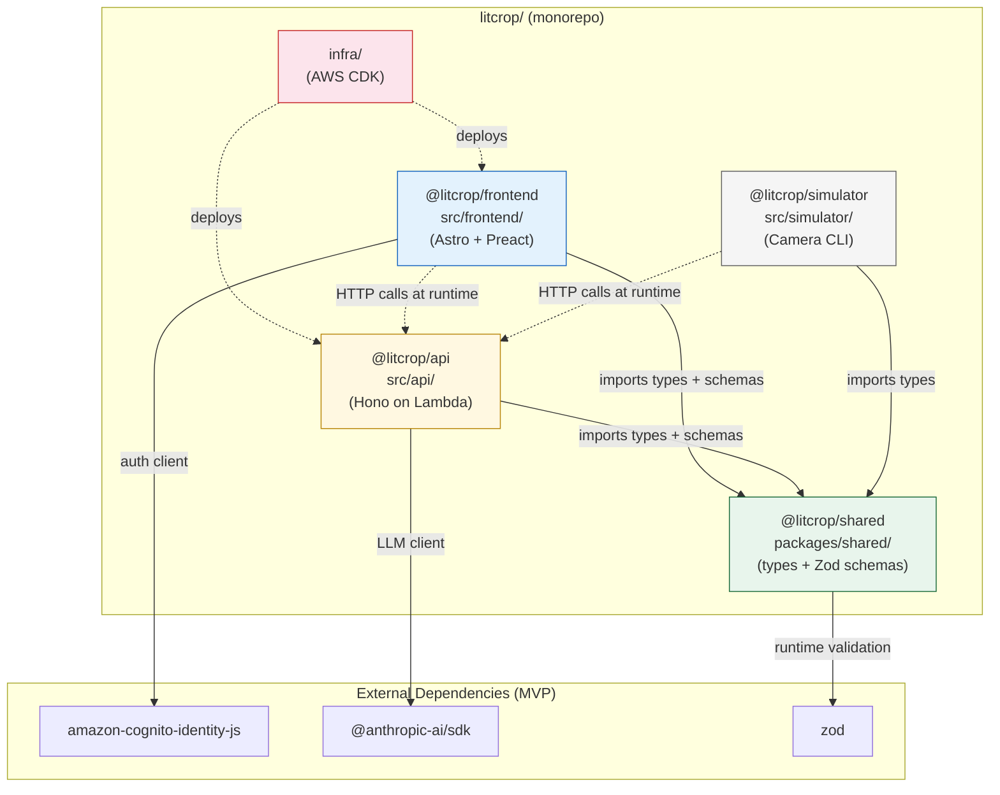
```mermaid
graph TD
    subgraph Monorepo["litcrop/ (monorepo)"]
        SHARED["@litcrop/shared<br/>packages/shared/<br/>(types + Zod schemas)"]

        FE["@litcrop/frontend<br/>src/frontend/<br/>(Astro + Preact)"]

        API["@litcrop/api<br/>src/api/<br/>(Hono on Lambda)"]

        SIM["@litcrop/simulator<br/>src/simulator/<br/>(Camera CLI)"]

        INFRA["infra/<br/>(AWS CDK)"]
    end

    subgraph External["External Dependencies (MVP)"]
        COGNITO["amazon-cognito-identity-js"]
        ANTHROPIC["@anthropic-ai/sdk"]
        ZOD["zod"]
    end

    FE -->|"imports types + schemas"| SHARED
    API -->|"imports types + schemas"| SHARED
    SIM -->|"imports types"| SHARED

    FE -->|"auth client"| COGNITO
    API -->|"LLM client"| ANTHROPIC
    SHARED -->|"runtime validation"| ZOD

    INFRA -.->|"deploys"| API
    INFRA -.->|"deploys"| FE

    FE -.->|"HTTP calls at runtime"| API
    SIM -.->|"HTTP calls at runtime"| API

    style SHARED fill:#E8F5EC,stroke:#1B6B3A
    style FE fill:#E3F2FD,stroke:#1565C0
    style API fill:#FFF8E1,stroke:#B8860B
    style SIM fill:#F5F5F5,stroke:#616161
    style INFRA fill:#FCE4EC,stroke:#C62828
```

### 3.2 API Internal Module Dependencies

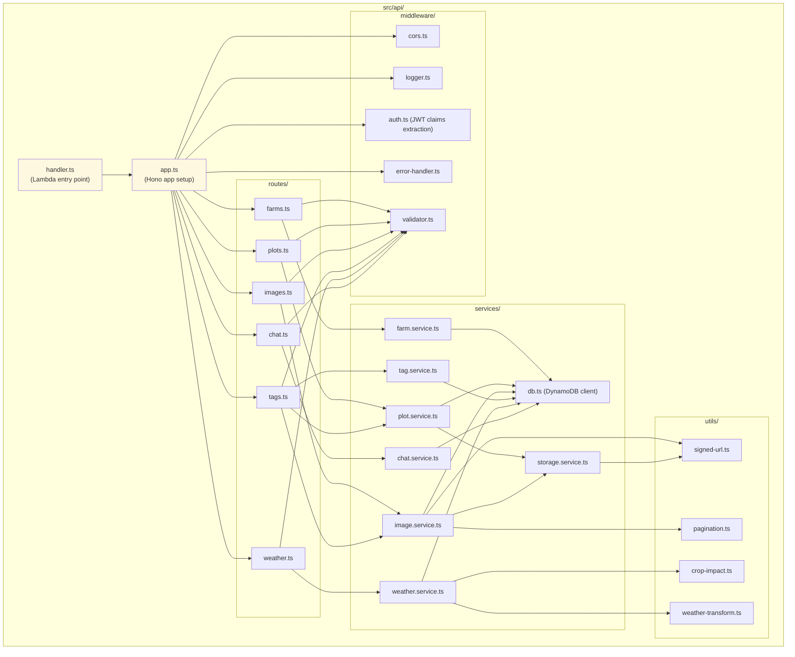
```mermaid
graph TD
    subgraph API["src/api/"]
        HANDLER["handler.ts<br/>(Lambda entry point)"]
        APP["app.ts<br/>(Hono app setup)"]

        subgraph Routes["routes/"]
            R_FARMS["farms.ts"]
            R_PLOTS["plots.ts"]
            R_IMAGES["images.ts"]
            R_TAGS["tags.ts"]
            R_WEATHER["weather.ts"]
            R_CHAT["chat.ts"]
        end

        subgraph Middleware["middleware/"]
            MW_CORS["cors.ts"]
            MW_LOG["logger.ts"]
            MW_AUTH["auth.ts (JWT claims extraction)"]
            MW_ERR["error-handler.ts"]
            MW_VALID["validator.ts"]
        end

        subgraph Services["services/"]
            S_FARM["farm.service.ts"]
            S_PLOT["plot.service.ts"]
            S_IMAGE["image.service.ts"]
            S_TAG["tag.service.ts"]
            S_WEATHER["weather.service.ts"]
            S_CHAT["chat.service.ts"]
            S_STORAGE["storage.service.ts"]
            S_DB["db.ts (DynamoDB client)"]
        end

        subgraph Utils["utils/"]
            U_SIGNED["signed-url.ts"]
            U_PAGINATE["pagination.ts"]
            U_CROP["crop-impact.ts"]
            U_WEATHER["weather-transform.ts"]
        end
    end

    HANDLER --> APP
    APP --> MW_CORS & MW_LOG & MW_AUTH & MW_ERR
    APP --> R_FARMS & R_PLOTS & R_IMAGES & R_TAGS & R_WEATHER & R_CHAT

    R_FARMS --> S_FARM & MW_VALID
    R_PLOTS --> S_PLOT & MW_VALID
    R_IMAGES --> S_IMAGE & MW_VALID
    R_TAGS --> S_TAG & S_IMAGE & S_PLOT & MW_VALID
    R_WEATHER --> S_WEATHER & MW_VALID
    R_CHAT --> S_CHAT & MW_VALID

    S_FARM --> S_DB
    S_PLOT --> S_DB & S_STORAGE
    S_IMAGE --> S_DB & S_STORAGE & U_SIGNED & U_PAGINATE
    S_TAG --> S_DB
    S_WEATHER --> S_DB & U_CROP & U_WEATHER
    S_CHAT --> S_DB
    S_STORAGE --> U_SIGNED

    style HANDLER fill:#FFF8E1
    style APP fill:#FFF8E1
```

### 3.3 Frontend Internal Module Dependencies

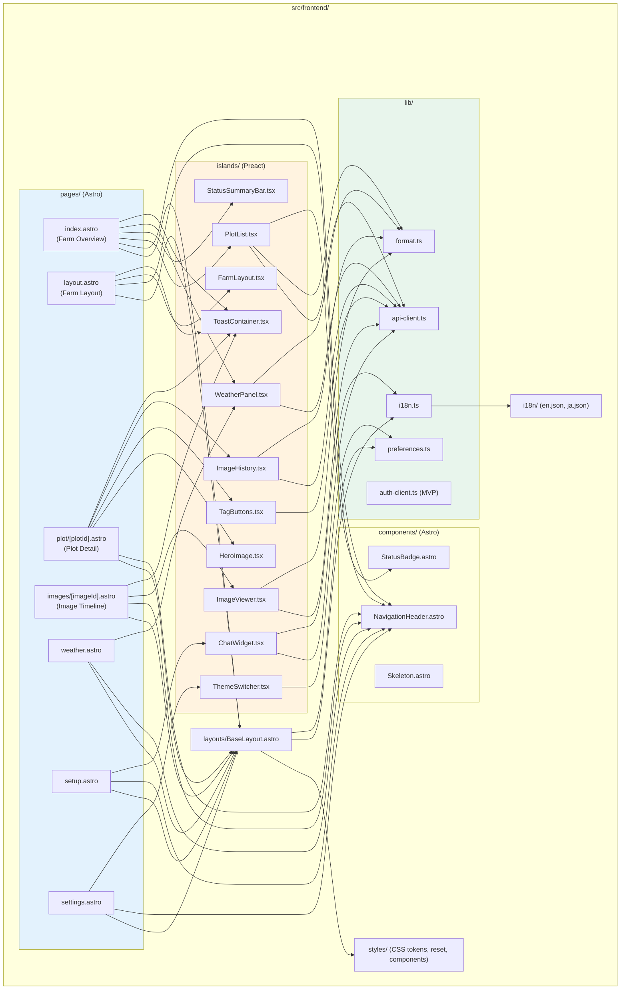
```mermaid
graph TD
    subgraph Frontend["src/frontend/"]
        subgraph Pages["pages/ (Astro)"]
            P_HOME["index.astro<br/>(Farm Overview)"]
            P_LAYOUT["layout.astro<br/>(Farm Layout)"]
            P_PLOT["plot/[plotId].astro<br/>(Plot Detail)"]
            P_IMAGE["images/[imageId].astro<br/>(Image Timeline)"]
            P_WEATHER["weather.astro"]
            P_SETUP["setup.astro"]
            P_SETTINGS["settings.astro"]
        end

        subgraph Islands["islands/ (Preact)"]
            I_PLOTLIST["PlotList.tsx"]
            I_STATUSBAR["StatusSummaryBar.tsx"]
            I_FARMLAY["FarmLayout.tsx"]
            I_HERO["HeroImage.tsx"]
            I_TAGS["TagButtons.tsx"]
            I_HISTORY["ImageHistory.tsx"]
            I_VIEWER["ImageViewer.tsx"]
            I_WEATHER["WeatherPanel.tsx"]
            I_CHAT["ChatWidget.tsx"]
            I_THEME["ThemeSwitcher.tsx"]
            I_TOAST["ToastContainer.tsx"]
        end

        subgraph Components["components/ (Astro)"]
            C_HEADER["NavigationHeader.astro"]
            C_SKELETON["Skeleton.astro"]
            C_BADGE["StatusBadge.astro"]
        end

        subgraph Lib["lib/"]
            L_API["api-client.ts"]
            L_AUTH["auth-client.ts (MVP)"]
            L_I18N["i18n.ts"]
            L_PREFS["preferences.ts"]
            L_FORMAT["format.ts"]
        end

        LAYOUT["layouts/BaseLayout.astro"]
        STYLES["styles/ (CSS tokens, reset, components)"]
        I18N_FILES["i18n/ (en.json, ja.json)"]
    end

    P_HOME --> LAYOUT & C_HEADER & I_PLOTLIST & I_STATUSBAR & I_WEATHER & I_TOAST
    P_LAYOUT --> LAYOUT & C_HEADER & I_FARMLAY & I_TOAST
    P_PLOT --> LAYOUT & C_HEADER & I_HERO & I_TAGS & I_HISTORY & I_TOAST
    P_IMAGE --> LAYOUT & C_HEADER & I_VIEWER & I_TOAST
    P_WEATHER --> LAYOUT & C_HEADER & I_WEATHER
    P_SETUP --> LAYOUT & C_HEADER & I_CHAT
    P_SETTINGS --> LAYOUT & C_HEADER & I_THEME

    LAYOUT --> STYLES & L_I18N & L_PREFS

    I_PLOTLIST --> L_API & L_FORMAT & C_BADGE
    I_TAGS --> L_API
    I_HISTORY --> L_API & L_FORMAT
    I_VIEWER --> L_API & L_FORMAT
    I_WEATHER --> L_API & L_FORMAT
    I_CHAT --> L_API & L_I18N
    I_THEME --> L_PREFS

    L_I18N --> I18N_FILES

    style Pages fill:#E3F2FD
    style Islands fill:#FFF3E0
    style Lib fill:#E8F5EC
```

---

## 4. Error Handling Strategy

### 4.1 Error Classification

All errors in the system are classified into a hierarchy that determines how they propagate and are displayed.

```
API Gateway (pre-Lambda):
├── 401 Unauthorized    → JWT missing, expired, or invalid (Cognito JWT Authorizer)

AppError (base) — within Lambda/Hono:
├── ValidationError     → 400 VALIDATION_ERROR
├── ContentTypeError    → 415 UNSUPPORTED_MEDIA_TYPE
├── NotFoundError       → 404 NOT_FOUND (also used when user_id doesn't match — prevents info leak)
├── PayloadTooLargeError → 413 PAYLOAD_TOO_LARGE
├── StorageError        → 503 SERVICE_UNAVAILABLE
├── ExternalApiError    → 502 (weather, LLM failures)
└── (unclassified)      → 500 INTERNAL_ERROR
```

> **MVP note**: `401 Unauthorized` is handled at the API Gateway level by the JWT Authorizer — it never reaches the Lambda function. If a request has a valid JWT but the user doesn't own the requested resource, the API returns `404 NOT_FOUND` (not `403 Forbidden`) to avoid leaking resource existence.

### 4.2 Error Propagation: Service → Middleware → Client

```typescript
// src/api/src/middleware/error-handler.ts

import { Context, Next } from 'hono';
import { AppError } from '../errors';

/**
 * Global error handler middleware.
 * Services throw typed AppError subclasses.
 * Routes do NOT catch errors — they propagate up to this middleware.
 * This ensures a consistent error response format across all endpoints.
 */
export async function errorHandler(c: Context, next: Next) {
  try {
    await next();
  } catch (err) {
    if (err instanceof AppError) {
      // Known error — map to structured response
      return c.json(
        {
          error: {
            code: err.code,
            message: err.message,
            details: err.details ?? {},
          },
        },
        err.statusCode
      );
    }

    // Unknown error — log and return generic 500
    console.error('Unhandled error:', err);
    return c.json(
      {
        error: {
          code: 'INTERNAL_ERROR',
          message: 'An unexpected error occurred.',
          details: {},
        },
      },
      500
    );
  }
}
```

### 4.3 Service-Level Error Throwing

```typescript
// src/api/src/errors.ts

export class AppError extends Error {
  constructor(
    public readonly code: string,
    message: string,
    public readonly statusCode: number,
    public readonly details?: Record<string, unknown>
  ) {
    super(message);
  }
}

export class NotFoundError extends AppError {
  constructor(resource: string, id: string) {
    super('NOT_FOUND', `${resource} '${id}' not found`, 404);
  }
}

export class ValidationError extends AppError {
  constructor(message: string, details?: Record<string, unknown>) {
    super('VALIDATION_ERROR', message, 400, details);
  }
}

export class PayloadTooLargeError extends AppError {
  constructor(maxBytes: number) {
    super('PAYLOAD_TOO_LARGE', `Payload exceeds ${maxBytes} bytes`, 413);
  }
}

export class StorageError extends AppError {
  constructor(message: string) {
    super('SERVICE_UNAVAILABLE', message, 503);
  }
}
```

### 4.4 Route Handler Pattern

Route handlers validate inputs and call services. They do **not** catch errors — errors propagate to `errorHandler` middleware.

```typescript
// Example: src/api/src/routes/tags.ts

import { Hono } from 'hono';
import type { ITagService } from '../services/types';

export function tagRoutes(tagService: ITagService) {
  const app = new Hono();

  app.post('/api/v1/images/:imageId/tags', async (c) => {
    const { imageId } = c.req.param();
    const body = await c.req.json();

    // Validation (throws ValidationError on failure)
    validateTagInput(body);

    // Service call (throws NotFoundError if image missing)
    const result = await tagService.addTag(imageId, body);

    return c.json({ data: result }, 201);
  });

  return app;
}
```

### 4.5 Frontend Error Handling

| Error Source | Detection | User Feedback | Recovery |
|-------------|-----------|---------------|----------|
| API 401 (unauthorized) | Response status check | Redirect to /login | Auto-refresh token; if refresh fails, full re-login |
| API 400 (validation) | Response status check | Toast with error message | Fix input and retry |
| API 404 | Response status check | Navigate to "not found" state | Back navigation |
| API 413 | Response status check | Camera node logs warning | Reduce image quality |
| API 500 | Response status check | Full-page or inline error state | Retry button |
| API 503 | Response status check | "Service temporarily unavailable" | Auto-retry after delay |
| Network offline | `navigator.onLine` + fetch catch | Yellow banner: "You are offline" | Auto-retry on reconnect |
| S3 signed URL expired (403) | Image `onerror` event | Silent re-fetch of parent resource | Transparent to user |
| Tag save failure | POST catch | Revert optimistic UI + error toast | "Tap to retry" on toast |

### 4.6 Camera Simulator Error Handling

```
Upload attempt
  ├── Success (201) → log, wait for next interval
  ├── 400/413 → log error, skip this image (do not retry)
  ├── 404 → log error, halt (configuration issue)
  ├── 500/503/network error → retry with exponential backoff
  │     ├── Attempt 1: wait 1s
  │     ├── Attempt 2: wait 2s
  │     ├── Attempt 3: wait 4s
  │     ├── Attempt 4: wait 8s
  │     └── Attempt 5: wait 16s → give up, log failure, continue to next
  └── Timeout (30s) → treat as network error → retry
```

---

## 5. Caching Strategy

### 5.1 Caching Layers Overview

```
Layer 1: CloudFront (static assets)           TTL: long-lived
Layer 2: Lambda in-memory (weather proxy)     TTL: 15 minutes
Layer 3: S3 signed URLs (image access)        TTL: 15 minutes
Layer 4: Browser cache (assets + API)         TTL: varies
```

### 5.2 Weather Proxy Cache

| Aspect | Strategy |
|--------|----------|
| **Store** | Lambda in-memory (module-level `Map`) |
| **Key** | `weather:{farmId}` |
| **TTL** | 15 minutes |
| **Invalidation** | Time-based only; no manual invalidation in PoC |
| **Cold start** | Lambda cold start clears cache; first request after cold start calls Open-Meteo |
| **Fallback** | If Open-Meteo is unreachable, return stale cache (if exists) with `stale: true` flag |

```typescript
// Conceptual implementation
const cache = new Map<string, { data: WeatherResponse; timestamp: number }>();
const WEATHER_TTL_MS = 15 * 60 * 1000; // 15 minutes

function getCachedWeather(farmId: string): WeatherResponse | null {
  const entry = cache.get(`weather:${farmId}`);
  if (entry && Date.now() - entry.timestamp < WEATHER_TTL_MS) {
    return entry.data;
  }
  return null;
}
```

**Why in-memory for MVP?** At 1-5 users with 1 farm each, a Lambda module-level `Map` keyed by `farmId` is sufficient. The cache is per-Lambda-instance, so concurrent users may trigger redundant Open-Meteo calls during cold starts — acceptable at MVP scale. At Production scale (many farms, concurrent users), migrate to DynamoDB TTL-based caching to survive cold starts and reduce external API calls.

### 5.3 S3 Signed URL Expiry

| Aspect | Strategy |
|--------|----------|
| **Expiry** | 15 minutes |
| **Generated by** | `@aws-sdk/s3-request-presigner` in Lambda |
| **Used for** | All image access (thumbnails and full-size) |
| **Frontend handling** | If image load fails with 403, re-fetch parent API endpoint for fresh URLs |
| **Per-request** | Each API response generates fresh signed URLs (not cached) |

**Why 15 minutes?** Balances security (short-lived access) with usability (user check-in sessions are 1-3 minutes, leaving margin for slow connections and browsing).

### 5.4 Static Asset Caching (CloudFront + S3)

| Asset Type | Cache-Control Header | CloudFront TTL | Notes |
|-----------|---------------------|----------------|-------|
| HTML pages | `no-cache, must-revalidate` | 0 (always origin) | Ensures latest content |
| CSS/JS (hashed) | `public, max-age=31536000, immutable` | 1 year | Astro adds content hashes to filenames |
| Fonts | `public, max-age=31536000` | 1 year | System fonts, rarely changes |
| favicon/icons | `public, max-age=86400` | 24 hours | |

### 5.5 Browser-Level Caching

| Resource | Cache Strategy |
|----------|---------------|
| Astro static HTML | `ETag` + `If-None-Match` (304 responses) |
| Hashed JS/CSS bundles | Immutable cache (filename changes on content change) |
| API responses (`/api/*`) | `Cache-Control: no-store` (always fetch fresh) |
| S3 signed URL images | Not browser-cached (URL changes each request due to signature) |

---

## 6. Frontend Architecture

### 6.1 Rendering Strategy: Astro SSG + Preact Islands

The frontend uses Astro's **Static Site Generation (SSG)** for the page shell and **Preact Islands** for interactive components. This delivers near-zero JavaScript for the static layout while hydrating only the components that need interactivity.

```
  Astro Build (SSG)                 Browser (Runtime)
  ─────────────────                 ──────────────────
  ┌─────────────────┐              ┌─────────────────┐
  │  BaseLayout     │ ──── HTML ──>│  Static shell    │  0 KB JS
  │  NavigationHeader│             │  Header, footer  │
  │  Page structure  │             │  CSS tokens       │
  └─────────────────┘              └─────────────────┘
                                           │
  ┌─────────────────┐              ┌───────▼─────────┐
  │  Preact Islands  │ ─── JS ───>│  Hydrated islands│  ~15-30 KB JS
  │  (client:load)   │            │  API fetch + UI  │
  │  (client:visible)│            │  Event handlers  │
  └─────────────────┘              └─────────────────┘
```

### 6.2 Island Hydration Directives

| Island Component | Directive | Rationale |
|-----------------|-----------|-----------|
| `PlotList` | `client:load` | Core content, must render immediately with API data |
| `StatusSummaryBar` | `client:load` | Updates with PlotList data, shown above fold |
| `FarmLayout` | `client:load` | Core spatial view, needs DOM measurement |
| `HeroImage` | `client:load` | Largest Contentful Paint element, eager load |
| `TagButtons` | `client:load` | Primary interaction, must be ready immediately |
| `ImageHistory` | `client:visible` | Below fold on Plot Detail, lazy-load when scrolled into view |
| `ImageViewer` | `client:load` | Full-page viewer, needs swipe/navigation handlers |
| `WeatherPanel` | `client:load` | Above fold on Weather screen |
| `ChatWidget` | `client:load` | Requires immediate input handling |
| `ThemeSwitcher` | `client:load` | Must respond to user preference immediately |
| `ToastContainer` | `client:load` | Global notification layer, must be ready for any action |

### 6.3 Page Routing (Astro MPA)

Astro generates static HTML files for each page. Navigation is standard browser navigation (full page loads), not client-side SPA routing. This provides:

- **Simpler mental model**: each page is a separate HTML file
- **Better performance on slow connections**: HTML loads before JS
- **Browser-native back/forward**: history management is free

```
src/frontend/src/pages/
  login.astro                     →  /login               (MVP: Cognito login redirect)
  callback.astro                  →  /callback            (MVP: OAuth callback handler)
  index.astro                     →  /                    (Farm Overview) [protected]
  layout.astro                    →  /layout              (Farm Layout View) [protected]
  plot/[plotId].astro             →  /plot/{plotId}        (Plot Detail) [protected]
  plot/[plotId]/images.astro      →  /plot/{plotId}/images (Image Timeline) [protected]
  weather.astro                   →  /weather             (Weather & Environment) [protected]
  setup.astro                     →  /setup               (Farm Setup & AI) [protected]
  settings.astro                  →  /settings            (Settings) [protected]
```

**MVP auth routing**: Pages marked `[protected]` check for a valid session on load. If no session exists, the user is redirected to `/login`, which redirects to the Cognito Hosted UI. After login, Cognito redirects back to `/callback`, which exchanges the auth code for tokens and redirects to `/`.

**Navigation flow**: Users navigate via `<a href="...">` links. Preact islands handle in-page interactions (tagging, image browsing, chat). No client-side router is needed.

### 6.4 Static vs Interactive Component Boundary

```
┌─ Astro SSG (static) ────────────────────────────────────────┐
│                                                              │
│  BaseLayout.astro                                            │
│  ├── <html lang={locale} data-theme={theme}>                │
│  ├── <head> meta, CSS tokens, preload                       │
│  ├── NavigationHeader.astro (static: title, back link)      │
│  └── <main>                                                  │
│       ├── Skeleton placeholder HTML (visible before hydrate) │
│       │                                                      │
│       ├── ┌─ Preact Island (interactive) ──────────────┐    │
│       │   │  PlotList: fetch API → render tiles         │    │
│       │   │  - Replaces skeleton on hydration           │    │
│       │   │  - Pull-to-refresh handler                  │    │
│       │   │  - Tap → window.location.href = plotUrl     │    │
│       │   └─────────────────────────────────────────────┘    │
│       │                                                      │
│       └── ┌─ Preact Island (interactive) ──────────────┐    │
│           │  WeatherStrip: fetch API → render weather    │    │
│           │  - Tap → window.location.href = '/weather'  │    │
│           └─────────────────────────────────────────────┘    │
│                                                              │
└──────────────────────────────────────────────────────────────┘
```

### 6.5 Key Frontend Patterns

**API fetch on mount**: Each Preact island fetches its own data on mount. The farm ID is passed as a prop from the Astro page (read from config or URL).

```typescript
// Example: PlotList island
import { useEffect, useState } from 'preact/hooks';
import { apiClient } from '../lib/api-client';

export function PlotList({ farmId }: { farmId: string }) {
  const [plots, setPlots] = useState<FarmPlotItem[]>([]);
  const [loading, setLoading] = useState(true);
  const [error, setError] = useState<string | null>(null);

  useEffect(() => {
    apiClient.getFarmPlots(farmId)
      .then(res => setPlots(res.data))
      .catch(err => setError(err.message))
      .finally(() => setLoading(false));
  }, [farmId]);

  if (loading) return <PlotListSkeleton />;
  if (error) return <ErrorState message={error} onRetry={() => { /* refetch */ }} />;
  return <>{plots.map(plot => <PlotTile key={plot.id} plot={plot} />)}</>;
}
```

**Optimistic UI for tagging**: Tag buttons apply the visual state immediately, then fire the API call. If the call fails, the UI reverts and shows an error toast.

**Cross-island communication**: Minimal. When a tag is applied in `TagButtons`, it emits a browser `CustomEvent` that `ToastContainer` listens for. No shared state store is needed — each island is self-contained.

```typescript
// TagButtons emits:
window.dispatchEvent(new CustomEvent('litcrop:toast', {
  detail: { type: 'success', message: 'Healthy tag applied' }
}));

// ToastContainer listens:
useEffect(() => {
  const handler = (e: CustomEvent) => showToast(e.detail);
  window.addEventListener('litcrop:toast', handler);
  return () => window.removeEventListener('litcrop:toast', handler);
}, []);
```

---

## 7. i18n Integration

### 7.1 Locale File Structure

```
src/frontend/src/i18n/
  en.json           # English translations
  ja.json           # Japanese translations
  index.ts          # Loader and t() function
```

### 7.2 Translation File Format

Flat key structure with dot-separated namespacing:

```json
// en.json
{
  "farm.title": "Farm Overview",
  "farm.statusSummary": "{count} plots",
  "farm.refresh": "Refresh",
  "farm.emptyTitle": "No plots yet",
  "farm.emptyBody": "Plots will appear here once your farm is set up.",
  "farm.errorTitle": "Could not load farm data",
  "farm.errorBody": "Check your connection and try again.",
  "farm.retry": "Retry",

  "plot.detail": "Plot {label}: {crop}",
  "plot.captured": "Captured: {date}",
  "plot.cropInfo": "Crop Info",
  "plot.planted": "Planted",
  "plot.harvest": "Expected Harvest",
  "plot.notes": "Notes",
  "plot.tagTitle": "Tag this image:",
  "plot.loadMore": "Load More",

  "status.healthy": "Healthy",
  "status.slow_growth": "Slow Growth",
  "status.issue": "Issue",
  "status.animal_intrusion": "Animal",
  "status.no_data": "No Data",

  "trigger.scheduled": "Scheduled",
  "trigger.motion": "Motion",

  "tag.applied": "{tag} applied",
  "tag.error": "Could not save tag. Tap to retry.",

  "weather.title": "Weather & Environment",
  "weather.hourly": "Hourly Forecast",
  "weather.daily": "7-Day Forecast",
  "weather.alerts.frost": "Frost Warning",
  "weather.alerts.heavy_rain": "Heavy Rain Alert",
  "weather.alerts.extreme_heat": "Extreme Heat Warning",

  "settings.title": "Settings",
  "settings.theme": "Theme",
  "settings.language": "Language",
  "settings.tempUnit": "Temperature",

  "theme.light": "Light",
  "theme.dark": "Dark",
  "theme.earthy": "Earthy",
  "theme.system": "System",

  "chat.placeholder": "Ask about crops, planting, weather...",
  "chat.send": "Send",

  "common.back": "Back",
  "common.offline": "You are offline. Showing cached data.",
  "common.loading": "Loading..."
}
```

```json
// ja.json
{
  "farm.title": "圃場一覧",
  "farm.statusSummary": "{count}区画",
  "farm.refresh": "更新",
  "farm.emptyTitle": "区画がありません",
  "farm.emptyBody": "圃場の設定が完了すると、ここに区画が表示されます。",
  "farm.errorTitle": "圃場データを読み込めませんでした",
  "farm.errorBody": "接続を確認して、もう一度お試しください。",
  "farm.retry": "再試行",

  "plot.detail": "区画{label}：{crop}",
  "plot.captured": "撮影：{date}",
  "plot.cropInfo": "作物情報",
  "plot.planted": "植え付け日",
  "plot.harvest": "収穫予定",
  "plot.notes": "メモ",
  "plot.tagTitle": "この画像にタグ：",
  "plot.loadMore": "もっと見る",

  "status.healthy": "健康",
  "status.slow_growth": "生育遅延",
  "status.issue": "問題あり",
  "status.animal_intrusion": "動物侵入",
  "status.no_data": "データなし",

  "trigger.scheduled": "定時撮影",
  "trigger.motion": "動体検知",

  "tag.applied": "「{tag}」を適用しました",
  "tag.error": "タグを保存できませんでした。タップして再試行。",

  "weather.title": "天気・環境",
  "weather.hourly": "時間ごとの予報",
  "weather.daily": "週間予報",
  "weather.alerts.frost": "霜注意報",
  "weather.alerts.heavy_rain": "大雨警報",
  "weather.alerts.extreme_heat": "猛暑警報",

  "settings.title": "設定",
  "settings.theme": "テーマ",
  "settings.language": "言語",
  "settings.tempUnit": "温度単位",

  "theme.light": "ライト",
  "theme.dark": "ダーク",
  "theme.earthy": "アーシー",
  "theme.system": "システム",

  "chat.placeholder": "作物、植え付け、天気について質問...",
  "chat.send": "送信",

  "common.back": "戻る",
  "common.offline": "オフラインです。キャッシュデータを表示しています。",
  "common.loading": "読み込み中..."
}
```

### 7.3 i18n Loader and `t()` Function

```typescript
// src/frontend/src/i18n/index.ts

import en from './en.json';
import ja from './ja.json';
import type { Locale } from '@litcrop/shared';

const translations: Record<Locale, Record<string, string>> = { en, ja };

let currentLocale: Locale = 'en';

export function setLocale(locale: Locale) {
  currentLocale = locale;
  document.documentElement.lang = locale;
}

export function getLocale(): Locale {
  return currentLocale;
}

/**
 * Translate a key with optional interpolation.
 * Usage: t('plot.detail', { label: 'A1', crop: 'Tomato' })
 *        → "Plot A1: Tomato" (en)
 *        → "区画A1：Tomato" (ja)
 */
export function t(key: string, params?: Record<string, string | number>): string {
  let text = translations[currentLocale]?.[key] ?? translations.en[key] ?? key;
  if (params) {
    for (const [k, v] of Object.entries(params)) {
      text = text.replace(`{${k}}`, String(v));
    }
  }
  return text;
}
```

### 7.4 Locale Initialization Flow

```
1. Page load (Astro SSG)
   └── BaseLayout.astro reads farm.locale from config/API
       └── Sets <html lang="{locale}" data-theme="{theme}">
       └── Passes locale as prop to islands

2. Preact island hydration
   └── Calls setLocale(locale) on mount
   └── All t() calls use the current locale

3. User changes language in Settings
   └── PATCH /api/v1/farms/{farmId} { locale: "ja" }
   └── setLocale("ja")
   └── document.documentElement.lang = "ja"
   └── Save to localStorage for next page load
   └── Reload page (Astro MPA) — new HTML served with correct lang

4. Date/time formatting
   └── Uses Intl.DateTimeFormat(locale) throughout
   └── en: "Mar 17, 2026 at 2:00 PM"
   └── ja: "2026年3月17日 14:00"
```

### 7.5 Theme Switching Mechanism

The theme system uses CSS custom properties with a `data-theme` attribute on `<html>`.

```css
/* styles/tokens.css */

:root, [data-theme="light"] {
  --color-primary: #1B6B3A;
  --color-surface: #FFFFFF;
  --color-background: #F5F5F5;
  /* ... all light theme tokens */
}

[data-theme="dark"] {
  --color-primary: #4CAF50;
  --color-surface: #1E1E1E;
  --color-background: #121212;
  /* ... all dark theme tokens */
}

[data-theme="earthy"] {
  --color-primary: #6B7F5E;
  --color-surface: #FDFBF7;
  --color-background: #F0EDE4;
  /* ... all earthy theme tokens */
}

@media (prefers-color-scheme: dark) {
  [data-theme="system"] {
    --color-primary: #4CAF50;
    --color-surface: #1E1E1E;
    /* ... dark tokens */
  }
}
```

```typescript
// src/frontend/src/lib/preferences.ts

import type { Theme, Locale, TempUnit } from '@litcrop/shared';

const PREFS_KEY = 'litcrop-prefs';

interface UserPreferences {
  theme: Theme;
  locale: Locale;
  tempUnit: TempUnit;
}

/** Apply theme to document — called on page load and on change */
export function applyTheme(theme: Theme) {
  document.documentElement.setAttribute('data-theme', theme);
  savePreference('theme', theme);
}

/** Read preferences from localStorage */
export function getPreferences(): UserPreferences {
  const stored = localStorage.getItem(PREFS_KEY);
  return stored
    ? JSON.parse(stored)
    : { theme: 'system', locale: 'en', tempUnit: 'C' };
}

function savePreference<K extends keyof UserPreferences>(
  key: K, value: UserPreferences[K]
) {
  const prefs = getPreferences();
  prefs[key] = value;
  localStorage.setItem(PREFS_KEY, JSON.stringify(prefs));
}
```

**Initialization order** (in `BaseLayout.astro`):

```html
<script is:inline>
  // Runs synchronously before paint — prevents flash of wrong theme
  (function() {
    const prefs = JSON.parse(localStorage.getItem('litcrop-prefs') || '{}');
    if (prefs.theme) {
      document.documentElement.setAttribute('data-theme', prefs.theme);
    }
  })();
</script>
```

The `is:inline` directive ensures the script runs before Astro's hydration, preventing a flash of the default theme.

---

## 8. State Management

### 8.1 State Management Philosophy

LitCrop has **no global state store**. Each Preact island manages its own local state via `useState`/`useReducer`. This is deliberate:

- **Astro MPA**: Pages are separate HTML files — no shared memory between pages
- **Island isolation**: Each island fetches its own data and manages its own lifecycle
- **MVP scale**: 6 plots, 1-5 users — no complex state synchronization needed

**MVP addition**: Auth state (access token, user info) is the one piece of state that spans all pages. It's managed by the auth client module (Section 2.7) and stored in memory + `localStorage`, not in a state library.

### 8.2 Data Flow Pattern

```
         API Server                    Browser
         ──────────                    ───────
     ┌──────────────┐
     │  DynamoDB     │
     │  S3           │
     │  Open-Meteo   │
     └──────┬───────┘
            │
     ┌──────▼───────┐         ┌────────────────────────┐
     │  Hono API    │◄────────│  Preact Island         │
     │  (Lambda)    │ fetch() │  ┌──────────────────┐  │
     │              │─────────>│  │ useState(data)   │  │
     └──────────────┘  JSON   │  │ useState(loading)│  │
                              │  │ useState(error)  │  │
                              │  └────────┬─────────┘  │
                              │           │ render      │
                              │  ┌────────▼─────────┐  │
                              │  │  DOM / UI         │  │
                              │  └──────────────────┘  │
                              └────────────────────────┘
```

### 8.3 State by Screen

| Screen | Island | State Shape | Data Source | Refresh Trigger |
|--------|--------|-------------|-------------|-----------------|
| Farm Overview | `PlotList` | `{ plots: FarmPlotItem[], loading, error }` | `GET /farms/{id}/plots` | Pull-to-refresh, page mount |
| Farm Overview | `StatusSummaryBar` | Derived from `PlotList` data (counts by status) | Props from PlotList | Updates with PlotList |
| Farm Overview | `WeatherStrip` | `{ weather: WeatherResponse, loading }` | `GET /farms/{id}/weather` | Page mount |
| Farm Layout | `FarmLayout` | `{ farm: FarmResponse, plots: FarmPlotItem[] }` | `GET /farms/{id}` + `GET /farms/{id}/plots` | Page mount |
| Plot Detail | `HeroImage` | `{ plot: PlotDetailResponse, loading }` | `GET /plots/{id}` | Page mount |
| Plot Detail | `TagButtons` | `{ selectedTag: TagValue, submitting, applied }` | Local; `POST /images/{id}/tags` on tap | User tap |
| Plot Detail | `ImageHistory` | `{ images: ImageListItem[], cursor, hasMore, loading }` | `GET /plots/{id}/images` | Scroll / "Load More" |
| Image Timeline | `ImageViewer` | `{ currentImage: ImageDetailResponse, index, total }` | `GET /images/{id}` | Prev/Next tap or swipe |
| Weather | `WeatherPanel` | `{ weather: WeatherResponse, loading }` | `GET /farms/{id}/weather` | Page mount |
| Setup | `ChatWidget` | `{ messages: ChatMessage[], inputText, sending, conversationId }` | `POST /chat` | User sends message |
| Settings | `ThemeSwitcher` | `{ theme: Theme }` | `localStorage` | User selection |
| Global | `ToastContainer` | `{ toasts: Toast[] }` | `CustomEvent` listener | Other islands dispatch events |
| Global (MVP) | Auth client | `{ accessToken, user: { userId, email } }` | Cognito + `localStorage` | Token refresh on 401 |

### 8.4 Cross-Page State Persistence

| State | Persistence | Mechanism |
|-------|-------------|-----------|
| Auth tokens (MVP) | Memory + `localStorage` | Access token in Preact context; refresh token in `localStorage` |
| User identity (MVP) | Derived from JWT | `sub` (userId) and `email` decoded from access token claims |
| User locale | `localStorage` + Farm API | `litcrop-prefs.locale` → used on page load; synced to API on change |
| User theme | `localStorage` + Farm API | `litcrop-prefs.theme` → applied before paint; synced to API on change |
| Temp unit | `localStorage` + Farm API | `litcrop-prefs.tempUnit` |
| Farm ID | Derived from user's farms | MVP: query user's farms on login; single-farm per user |
| Conversation ID (MVP) | Session memory | ChatWidget maintains `conversationId` for multi-turn; lost on page navigation |
| Scroll position | Browser native | Astro MPA — browser manages `history.scrollRestoration` |

### 8.5 Stale Data Handling

Since the app uses Astro MPA (full page loads), stale data is naturally resolved:

- **Navigating back to Farm Overview** after tagging: triggers a fresh `GET /farms/{id}/plots` fetch, which returns the updated `latest_status`
- **Signed URL expiry**: If an `` fails to load (S3 returns 403), the island catches the `onerror` event and re-fetches the parent API endpoint for fresh URLs
- **Weather cache**: The 15-minute server-side cache means weather data may be up to 15 minutes stale — acceptable for farming use case

### 8.6 No State Library Justification

| Factor | Assessment |
|--------|-----------|
| Shared state across islands? | Minimal — toast events + auth token cross boundaries |
| Complex state transitions? | No — simple loading/data/error pattern |
| Server state synchronization? | Handled by re-fetching on page mount |
| Number of state consumers? | 1-2 per data source (island-local) |
| MVP scope? | 6 plots, 1 farm, 1-5 users |

A state library (Redux, Zustand, Jotai) would add bundle size and complexity without solving a real problem at MVP scale. Auth state is managed by the auth client module (not a state library). If Production introduces cross-island shared state (e.g., real-time updates via WebSocket), evaluate `@preact/signals` for lightweight reactivity.

---

## 9. Phase C: Vision Closure — System Design (MVP+ v0.12)

> Added 2026-03-22 — detailed component design for F-14, FR-3.5, SF-4.

### 9.1 TimeLapsePlayer Component

**File**: `src/frontend/src/components/TimeLapsePlayer.tsx`
**Hydration**: `client:load` — renders within PlotDetail page
**Entry**: Rendered conditionally when images.length >= 2

#### Props Interface

```typescript
interface TimeLapsePlayerProps {
  plotId: string;
  plotLabel: string;
  cropType: string;
}
```

#### State Shape

```typescript
interface TimeLapseState {
  status: 'idle' | 'loading' | 'ready' | 'playing' | 'paused' | 'error';
  allImages: ImageListItem[];     // All images for this plot (all pages)
  weeks: WeekGroup[];             // Images grouped by ISO week
  selectedWeekIndex: number;      // Currently selected week
  frames: TimeLapseFrame[];       // Frames for selected week, oldest-first
  currentIndex: number;
  speed: 0.5 | 1 | 2;            // Multiplier (1x=30fps default)
  loadProgress: { loaded: number; total: number };
  error: string | null;
}

interface WeekGroup {
  weekStart: string;              // ISO date (Monday)
  weekEnd: string;                // ISO date (Sunday)
  images: ImageListItem[];        // Images in this week, oldest-first
  complete: boolean;              // true if 7 days of data exist
}

interface TimeLapseFrame {
  id: string;
  thumbnailUrl: string;           // 300x300 thumbnail for playback
  capturedAt: string;             // ISO 8601
  trigger: TriggerType;
  preloaded: boolean;             // true after Image() onload fires
}
```

#### Data Loading Strategy

```
1. On component mount (not on play tap):
   - Fetch all pages of GET /plots/{plotId}/images
   - Accumulate all ImageListItem[]
   - Group by ISO week (Mon-Sun), sort each group oldest-first
   - Mark complete weeks (7 unique days)
   - Show week selector with available weeks

2. User selects a week (preloading starts immediately):
   - Map selected week's images to TimeLapseFrame[]
   - Batch-preload all thumbnails (6 parallel via new Image().src)
   - Play button enables after 50 frames preloaded

3. User taps "Play This Week":
   - Start playback at 30fps (1x) after 50+ frames ready
   - Continue preloading remaining frames in background
```

**Why thumbnails**: 300x300 JPEGs are ~15-30KB each. A full week (~294 frames) = ~5.7MB. Full-size images would be ~441MB — impossible on LTE in the field.

**Week grouping**: Uses `getISOWeek()` from captured_at timestamp. Camera schedule produces ~42 images/day. Complete weeks have all 7 days represented. Current (incomplete) week shows progress but is not playable.

#### Animation Loop

```typescript
// Speed mapping:
//   0.5x → 15fps (show every frame, 33ms interval)
//   1x   → 30fps (show every frame, 33ms interval) — DEFAULT
//   2x   → 30fps (skip every 2nd frame, 33ms interval)
const BASE_FPS = 30;
const frameInterval = state.speed >= 1 ? 1000 / BASE_FPS : 1000 / 15;
const frameStep = state.speed === 2 ? 2 : 1;
let lastFrameTime = 0;

function animate(timestamp: number) {
  if (state.status !== 'playing') return;
  if (timestamp - lastFrameTime >= frameInterval) {
    lastFrameTime = timestamp;
    setCurrentIndex(prev => {
      let next = prev + frameStep;
      if (next >= frames.length) next = 0;  // Loop
      // If next frame not preloaded, pause with buffering indicator
      if (!frames[next].preloaded) {
        setStatus('buffering');
        return prev;
      }
      return next;
    });
  }
  rafId = requestAnimationFrame(animate);
}
```

**Preload strategy**: Preloading starts on week selection (not play tap). 6 parallel `new Image()` requests. Play button enables after 50 frames. At 30fps, 50 frames = 1.7s of headroom — typically enough for the remaining ~244 frames to finish loading (~4.8MB at ~5Mbps LTE = ~8s, well within the 10s playback window).

**`prefers-reduced-motion`**: If true, auto-play disabled; manual stepping only.

#### Time-Proportional Progress Bar

The progress bar maps frame position to real clock time, not frame index. This means morning/afternoon dense capture windows (15-min intervals) compress visually, while midday sparse windows (30-min intervals) expand.

```typescript
function getProgressPercent(frame: TimeLapseFrame, weekStart: Date, weekEnd: Date): number {
  const frameTime = new Date(frame.capturedAt).getTime();
  const start = weekStart.getTime();
  const end = weekEnd.getTime();
  return ((frameTime - start) / (end - start)) * 100;
}
```

#### Integration with PlotDetail

TimeLapsePlayer manages its own data fetching and week grouping. It does NOT share image state with PlotDetail. The week selector and play controls render inline below the hero image.

---

### 9.2 Lightbox Component

**File**: `src/frontend/src/components/Lightbox.tsx`
**Pattern**: Portal-rendered overlay (appended to `document.body`)

#### Props Interface

```typescript
interface LightboxProps {
  src: string;
  alt: string;
  caption?: string;
  onClose: () => void;
}
```

#### Lifecycle

```
1. Mount: push history state, lock body scroll, trap focus
2. Image load: set loaded=true, show image
3. Dismiss (ESC/backdrop/close/popstate): restore scroll, return focus
4. Unmount: cleanup event listeners
```

#### Zoom: Pinch gesture (touchstart/touchmove/touchend), double-tap toggle 1x/2x, pan when zoomed. CSS transform: scale() + translate().

#### Trigger Points

| Source Component | Trigger | src value |
|-----------------|---------|-----------|
| PlotDetail thumbnails | Tap thumbnail | item.thumbnail_url |
| TimeLapsePlayer (paused) | Tap frame | frame.thumbnailUrl |
| ImageViewer main image | Tap image | image.url (full-size) |

---

### 9.3 ChatMarkdown Rendering

**New utility**: `src/frontend/src/lib/markdown.ts`

```typescript
import { marked } from 'marked';
import DOMPurify from 'dompurify';

marked.setOptions({ breaks: true, gfm: true });

export function renderMarkdown(text: string): string {
  const rawHtml = marked.parse(text) as string;
  return DOMPurify.sanitize(rawHtml, {
    ALLOWED_TAGS: [
      'p', 'br', 'strong', 'em', 'code', 'pre', 'blockquote',
      'ul', 'ol', 'li', 'h3', 'h4', 'h5', 'h6', 'a', 'table',
      'thead', 'tbody', 'tr', 'th', 'td', 'del', 'hr',
    ],
    ALLOWED_ATTR: ['href', 'target', 'rel', 'class'],
  });
}
```

**ChatAssistant change**: Assistant messages render via `renderMarkdown()` with sanitized HTML output. User messages remain plain text. CSS scoped under `.chat-markdown` class.

**Security**: All HTML is sanitized through DOMPurify before rendering, providing defense-in-depth against prompt injection producing malicious HTML.

---

### 9.4 Phase C State Management Updates

| Screen | Island | State Shape | Data Source |
|--------|--------|-------------|-------------|
| Plot Detail | `TimeLapsePlayer` | `{ status, frames, currentIndex, speed, loadProgress }` | `GET /plots/{id}/images` (all pages) |
| Plot Detail | `Lightbox` | `{ loaded, error, zoom, panX, panY }` | Props (image URL) |
| Image Timeline | `Lightbox` | Same as above | Props (image URL) |

### 9.5 Phase C New File Summary

| File | Action |
|------|--------|
| `src/frontend/src/components/TimeLapsePlayer.tsx` | **Create** |
| `src/frontend/src/components/Lightbox.tsx` | **Create** |
| `src/frontend/src/lib/markdown.ts` | **Create** |
| `src/frontend/src/components/ChatAssistant.tsx` | **Modify** — use renderMarkdown() |
| `src/frontend/src/components/PlotDetail.tsx` | **Modify** — add TimeLapsePlayer + Lightbox |
| `src/frontend/src/components/ImageViewer.tsx` | **Modify** — add Lightbox trigger |
| `src/frontend/src/styles/components.css` | **Modify** — add timelapse, lightbox, chat-markdown styles |
| `src/frontend/src/i18n/en.json` | **Modify** — add timelapse + lightbox i18n keys |
| `src/frontend/src/i18n/ja.json` | **Modify** — add timelapse + lightbox i18n keys |
| `package.json` (frontend) | **Modify** — add `marked`, `dompurify`, `@types/dompurify` |

---

## 10. Phase D: Bed-Grid System Design (MVP+ v0.13)

> Added 2026-03-22 -- System design for the UX Restructure phase.
> Covers: Farm->Bed flattened data model, bed grid auto-generation, crop assignment,
> map picker with elevation, profile page farm management.
> Depends on: [ADR-20260322](decisions/ADR-20260322-phase-d-bed-grid-data-model.md),
> [PHASE-D-ARCHITECTURE.md](designs/PHASE-D-ARCHITECTURE.md), [UX-DESIGNS.md Section 14](UX-DESIGNS.md#14-phase-d-ux-restructure----map-bed-grid-profile-mvp-v10).

### 10.1 Sequence Diagrams

#### 10.1a Farm Creation with Map Picker + Elevation Auto-Fetch

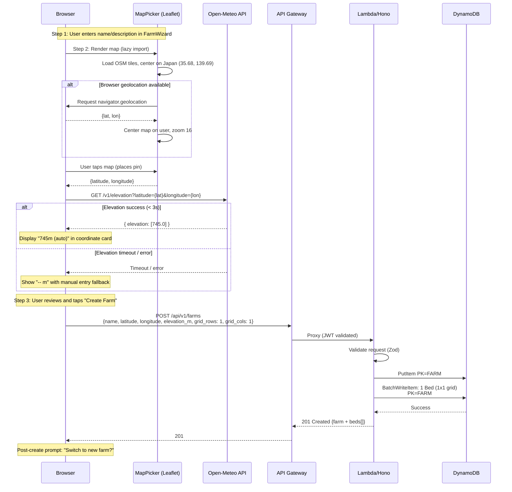
```mermaid
sequenceDiagram
    participant B as Browser
    participant MP as MapPicker (Leaflet)
    participant OM as Open-Meteo API
    participant AG as API Gateway
    participant L as Lambda/Hono
    participant DB as DynamoDB

    Note over B,MP: Step 1: User enters name/description in FarmWizard

    B->>MP: Step 2: Render map (lazy import)
    MP->>MP: Load OSM tiles, center on Japan (35.68, 139.69)

    alt Browser geolocation available
        MP->>B: Request navigator.geolocation
        B-->>MP: {lat, lon}
        MP->>MP: Center map on user, zoom 16
    end

    B->>MP: User taps map (places pin)
    MP-->>B: {latitude, longitude}

    B->>OM: GET /v1/elevation?latitude={lat}&longitude={lon}

    alt Elevation success (< 3s)
        OM-->>B: { elevation: [745.0] }
        Note over B: Display "745m (auto)" in coordinate card
    else Elevation timeout / error
        OM-->>B: Timeout / error
        Note over B: Show "-- m" with manual entry fallback
    end

    Note over B: Step 3: User reviews and taps "Create Farm"

    B->>AG: POST /api/v1/farms<br/>{name, latitude, longitude, elevation_m, grid_rows: 1, grid_cols: 1}
    AG->>L: Proxy (JWT validated)
    L->>L: Validate request (Zod)
    L->>DB: PutItem PK=FARM#{id} SK=#META (farm record)
    L->>DB: BatchWriteItem: 1 Bed (1x1 grid)<br/>PK=FARM#{id} SK=BED#01#01#{bedId}

    DB-->>L: Success
    L-->>AG: 201 Created {farm + beds[]}
    AG-->>B: 201

    Note over B: Post-create prompt: "Switch to new farm?"
```

#### 10.1b Bed Grid Auto-Generation (3x4 Example)

```mermaid
sequenceDiagram
    participant B as Browser
    participant AG as API Gateway
    participant L as Lambda/Hono
    participant SVC as FarmService
    participant DB as DynamoDB

    B->>AG: POST /api/v1/farms<br/>{name, lat, lon, grid_rows: 3, grid_cols: 4}
    AG->>L: Proxy (JWT validated)
    L->>SVC: createFarm(data)

    SVC->>SVC: Generate 12 Bed records:<br/>A1(1,1) A2(1,2) A3(1,3) A4(1,4)<br/>B1(2,1) B2(2,2) B3(2,3) B4(2,4)<br/>C1(3,1) C2(3,2) C3(3,3) C4(3,4)

    SVC->>DB: TransactWriteItems:<br/>1. PutItem PK=FARM#{farmId} SK=#META<br/>2-13. PutItem PK=FARM#{farmId} SK=BED#{row}#{col}#{bedId} (x12)

    Note over SVC,DB: Single transaction -- all or nothing (max 25 items OK for 5x5=25+1=26, use BatchWrite for 5x5)

    DB-->>SVC: Success
    SVC-->>L: {farm, beds: FarmBed[12]}
    L-->>AG: 201 Created
    AG-->>B: {id, name, ..., grid_rows: 3, grid_cols: 4, beds: [...]}
```

> **Note**: For a 5x5 grid (25 beds + 1 farm meta = 26 items), this exceeds DynamoDB's TransactWriteItems limit of 25. The implementation uses BatchWriteItem (max 25 per batch) with the farm meta as a separate PutItem, accepting the small window of partial writes. This is acceptable for MVP+ since farm creation is a rare, user-initiated action.

#### 10.1c Crop Assignment to Bed (PATCH /beds/{bedId})

```mermaid
sequenceDiagram
    participant B as Browser
    participant AG as API Gateway
    participant L as Lambda/Hono
    participant MW as Middleware Chain
    participant SVC as BedService
    participant DB as DynamoDB

    Note over B: User taps empty bed cell in BedGridLayout,<br/>Crop Assignment Sheet opens

    B->>AG: PATCH /api/v1/beds/{bedId}<br/>{crop_type: "Tomato", crop_variety: "Cherry", planted_at: "2026-02-15"}
    AG->>L: Proxy (JWT validated)
    L->>MW: cors() -> logger() -> authMiddleware (extract user_id)
    MW->>MW: Role check: admin or manager required

    alt Insufficient role
        MW-->>B: 403 FORBIDDEN
    else Authorized
        MW->>SVC: updateBed(bedId, data)
        SVC->>DB: GSI1 Query PK=BED#{bedId} SK=#META
        DB-->>SVC: Bed record (with farm_id)

        alt Bed not found
            SVC-->>L: null
            L-->>B: 404 NOT_FOUND
        else Bed found
            SVC->>SVC: Validate: crop_type 1-100 chars, notes max 500
            SVC->>DB: UpdateItem PK=FARM#{farmId} SK=BED#{row}#{col}#{bedId}<br/>SET crop_type, crop_variety, planted_at, expected_harvest, notes
            DB-->>SVC: Updated Bed
            SVC-->>L: Bed
            L-->>AG: 200 OK {bed}
            AG-->>B: 200 {id, farm_id, row, col, name, crop_type, ...}
        end
    end

    Note over B: Optimistic UI: cell already shows crop name.<br/>On success: confirm. On error: revert + toast.
```

#### 10.1d Image Upload to Bed (Replaces Plot-Based Upload)

```mermaid
sequenceDiagram
    participant B as Browser
    participant AG as API Gateway
    participant L as Lambda/Hono
    participant SVC as ImageService
    participant S3 as S3 Bucket
    participant DB as DynamoDB

    B->>AG: POST /api/v1/beds/{bedId}/images<br/>Content-Type: multipart/form-data<br/>{image file, trigger, captured_at}
    AG->>L: Proxy (JWT validated)

    L->>SVC: createImage(bedId, file, metadata)
    SVC->>DB: GSI1 Query PK=BED#{bedId} SK=#META
    DB-->>SVC: Bed record (confirms bed exists, gets farm_id)

    SVC->>S3: PutObject images/{farmId}/{bedId}/{imageId}.jpg
    S3-->>SVC: OK

    SVC->>DB: PutItem PK=BED#{bedId} SK=IMG#{capturedAt}#{imageId}<br/>GSI1PK=IMG#{imageId} GSI1SK=#META<br/>GSI2PK=FARM#{farmId}

    Note over SVC,DB: Image PK is BED# (was PLOT# before Phase D)

    DB-->>SVC: Success
    SVC-->>L: Image
    L-->>AG: 201 Created
    AG-->>B: {id, bed_id, storage_key, thumbnail_key, ...}
```

#### 10.1e Farm Overview Query (Simplified 2-Query Pattern)

```mermaid
sequenceDiagram
    participant B as Browser
    participant AG as API Gateway
    participant L as Lambda/Hono
    participant SVC as FarmService
    participant DB as DynamoDB

    B->>AG: GET /api/v1/farms/{farmId}
    AG->>L: Proxy (JWT validated)
    L->>SVC: getFarm(farmId)

    par Query 1: Farm metadata
        SVC->>DB: Query PK=FARM#{farmId} SK=#META
        DB-->>SVC: Farm record
    and Query 2: All beds
        SVC->>DB: Query PK=FARM#{farmId} SK begins_with BED#
        DB-->>SVC: Bed records (sorted by row/col via SK)
    end

    Note over SVC: 2 queries total (was 1 + N fields + N beds + N plots)

    SVC->>SVC: Assemble response: farm metadata + flat beds[]
    SVC-->>L: {farm + beds: FarmBed[]}
    L-->>AG: 200 OK
    AG-->>B: {id, name, ..., grid_rows, grid_cols, beds: [{id, row, col, name, crop_type, ...}]}
```

---

### 10.2 Component Interaction Diagram

```mermaid
graph TD
    subgraph "Profile Page (/profile/)"
        PROF[ProfilePage]
        FLIST[FarmList]
        FSWITCH[FarmSwitcher]
        UINFO[UserInfo]
    end

    subgraph "Farm Creation"
        FW[FarmWizard]
        FW_S1[Step 1: Name/Description]
        FW_S2[Step 2: Location]
        FW_S3[Step 3: Review + Create]
        MAP[MapPicker - Leaflet]
    end

    subgraph "Farm Overview (/)"
        FO[FarmOverview]
        TOGGLE[List/Layout Toggle]
        GRID[BedGridLayout]
        LIST[BedListView]
    end

    subgraph "Bed Detail (/beds/view)"
        BD[BedDetail]
        TLP[TimeLapsePlayer]
        LB[Lightbox]
    end

    subgraph "Crop Assignment"
        CA[CropAssignment Sheet/Modal]
    end

    subgraph "External APIs"
        OMELEV[Open-Meteo Elevation API]
        OSM[OpenStreetMap Tiles]
    end

    subgraph "Backend API"
        API_FARMS_LIST[GET /farms]
        API_FARMS_POST[POST /farms]
        API_FARM_GET[GET /farms/farmId]
        API_BEDS_GET[GET /farms/farmId/beds]
        API_BED_GET[GET /beds/bedId]
        API_BED_PATCH[PATCH /beds/bedId]
        API_BED_IMAGES[GET /beds/bedId/images]
        API_BED_UPLOAD[POST /beds/bedId/images]
    end

    %% Profile Page flows
    PROF --> FLIST
    PROF --> UINFO
    FLIST -->|list farms| API_FARMS_LIST
    FLIST --> FSWITCH
    FSWITCH -->|update localStorage + reload| FO
    FLIST -->|"[+] New Farm"| FW

    %% Farm Wizard flows
    FW --> FW_S1
    FW_S1 --> FW_S2
    FW_S2 --> MAP
    MAP -->|tile requests| OSM
    MAP -->|lat/lon selected| FW_S2
    FW_S2 -->|auto-fetch elevation| OMELEV
    FW_S2 --> FW_S3
    FW_S3 -->|POST /farms| API_FARMS_POST

    %% Farm Overview flows
    FO --> TOGGLE
    TOGGLE -->|layout mode| GRID
    TOGGLE -->|list mode| LIST
    FO -->|load farm + beds| API_FARM_GET
    GRID -->|render grid cells| API_BEDS_GET

    %% Bed interactions
    GRID -->|tap assigned cell| BD
    GRID -->|tap empty cell| CA
    CA -->|PATCH /beds/bedId| API_BED_PATCH
    BD -->|load bed detail| API_BED_GET
    BD -->|image timeline| API_BED_IMAGES
    BD --> TLP
    BD --> LB
    BD -->|upload| API_BED_UPLOAD
```

---

### 10.3 Updated TypeScript Types

Phase D modifies the shared domain types. Existing types (Farm, Bed, Image) are updated; Field and Plot are removed. See [PHASE-D-ARCHITECTURE.md Section 2](designs/PHASE-D-ARCHITECTURE.md) for full interface definitions.

#### 10.3a Farm (extended)

```typescript
// packages/shared/src/types/domain.ts

export interface Farm {
  id: string;
  user_id: string;
  name: string;
  description?: string;
  latitude: number;
  longitude: number;
  elevation_m?: number;          // F-10: auto-fetched from Open-Meteo
  climate_zone?: string;
  locale: Locale;
  theme: Theme;
  grid_rows: number;             // NEW (Phase D): 1-5, default 1
  grid_cols: number;             // NEW (Phase D): 1-5, default 1
  created_at: string;
}
```

#### 10.3b Bed (replaces Bed + Plot)

```typescript
export interface Bed {
  id: string;
  farm_id: string;               // CHANGED: was field_id
  row: number;                   // NEW: 1-based grid position (1-5)
  col: number;                   // NEW: 1-based grid position (1-5)
  name: string;                  // auto-generated: "A1", "B2", etc.
  crop_type?: string;            // MERGED from Plot
  crop_variety?: string;         // MERGED from Plot
  planted_at?: string;           // MERGED from Plot
  expected_harvest?: string;     // MERGED from Plot
  notes?: string;                // MERGED from Plot
  latest_status: BedStatus;      // MERGED from Plot (renamed from PlotStatus)
}

export type BedStatus = 'healthy' | 'issue' | 'critical' | 'no_data';
```

#### 10.3c Image (modified)

```typescript
export interface Image {
  id: string;
  bed_id: string;                // CHANGED: was plot_id
  node_id: string;
  captured_at: string;
  uploaded_at: string;
  storage_key: string;
  thumbnail_key?: string;
  trigger: TriggerType;
  content_type: string;
  size_bytes: number;
  metadata?: Record<string, unknown>;
}
```

#### 10.3d Removed Types

```typescript
// REMOVED in Phase D:
// - Field (entire interface)
// - Plot (merged into Bed)
// - PlotStatus (renamed to BedStatus)
```

#### 10.3e API Response Types (new/modified)

```typescript
// GET /farms/{farmId} response
export interface GetFarmResponse {
  id: string;
  user_id: string;
  name: string;
  description: string | null;
  latitude: number;
  longitude: number;
  elevation_m: number | null;
  climate_zone: string | null;
  locale: Locale;
  theme: Theme;
  grid_rows: number;
  grid_cols: number;
  created_at: string;
  beds: FarmBed[];               // CHANGED: flat array (was nested fields[])
}

export interface FarmBed {
  id: string;
  row: number;
  col: number;
  name: string;
  crop_type: string | null;
  crop_variety: string | null;
  latest_status: BedStatus;
}

// PATCH /beds/{bedId} request
export interface UpdateBedRequest {
  crop_type?: string | null;
  crop_variety?: string | null;
  planted_at?: string | null;
  expected_harvest?: string | null;
  notes?: string | null;
}

// POST /farms request (extended)
export interface CreateFarmRequest {
  name: string;
  latitude: number;
  longitude: number;
  elevation_m?: number | null;
  locale?: Locale;
  theme?: Theme;
  description?: string | null;
  grid_rows?: number;            // NEW: 1-5, default 1
  grid_cols?: number;            // NEW: 1-5, default 1
}
```

---

### 10.4 State Management

#### 10.4a Farm Wizard Multi-Step State

```typescript
// FarmWizard.tsx -- Preact island, client:load on /profile/

interface FarmWizardState {
  step: 1 | 2 | 3;
  // Step 1
  name: string;
  description: string;
  // Step 2
  latitude: number | null;
  longitude: number | null;
  elevation_m: number | null;
  elevationStatus: 'idle' | 'loading' | 'loaded' | 'error';
  mapLoaded: boolean;            // false if Leaflet fails to load
  // Step 3 (derived from above -- no additional state)
  // Submission
  submitting: boolean;
  error: string | null;
  createdFarmId: string | null;  // non-null after successful creation
}
```

**Validation rules per step**:
- Step 1: `name.trim().length >= 1` (required). Description optional.
- Step 2: `latitude !== null && longitude !== null` (pin placed). Elevation optional (can fail).
- Step 3: All Step 1 + Step 2 conditions met. "Create Farm" enabled.

**State persistence**: Wizard state is held in Preact component state only (not localStorage). Closing the wizard discards state with a confirmation dialog.

#### 10.4b Bed Grid Selection State

```typescript
// BedGridLayout.tsx -- Preact island, client:load on /

interface BedGridState {
  viewMode: 'list' | 'layout';
  beds: FarmBed[];               // from GET /farms/{farmId} response
  gridRows: number;
  gridCols: number;
  loading: boolean;
  error: string | null;
  // Grid size editor (when visible)
  editingGrid: boolean;
  pendingRows: number;
  pendingCols: number;
}
```

**Data flow**: BedGridLayout reads `beds[]` from the farm overview response. Grid dimensions come from `grid_rows` and `grid_cols` on the farm object. The grid is a CSS Grid with `grid-template-columns: repeat(gridCols, 1fr)`.

**Grid resize**: When `editingGrid` is true, the user picks new dimensions via pill selectors. On confirm, PATCH /farms/{farmId} updates grid dimensions. If shrinking below occupied cells, the API returns a 409 CONFLICT with details about which cells would be affected.

#### 10.4c Crop Assignment Form State

```typescript
// CropAssignment.tsx -- Preact island (bottom sheet / modal)

interface CropAssignmentState {
  bedId: string;
  bedName: string;               // e.g., "A3" -- for display in title
  row: number;
  col: number;
  // Form fields
  cropType: string;              // dropdown selection
  cropTypeCustom: string;        // visible only when cropType === 'Other'
  variety: string;
  plantedAt: string;             // ISO date, default: today
  // Submission
  submitting: boolean;
  error: string | null;
}
```

**Optimistic UI**: On "Save Crop" tap, the grid cell immediately updates to show the crop name with "No Data" status. The PATCH request fires in the background. On failure, the cell reverts and a toast error appears.

#### 10.4d Profile Page State

```typescript
// ProfilePage.tsx -- Preact island, client:load on /profile/

interface ProfilePageState {
  // Farm list
  farms: Array<{
    id: string;
    name: string;
    role: 'admin' | 'manager' | 'observer';
    grid_rows: number;
    grid_cols: number;
  }>;
  activeFarmId: string;          // from localStorage('litcrop-farmId')
  farmsLoading: boolean;
  farmsError: string | null;
  // Farm wizard
  wizardOpen: boolean;
  // User info (from Cognito JWT claims)
  email: string;
  locale: Locale;
  theme: Theme;
}
```

**Farm switching**: Tapping "Switch" on a farm card calls `localStorage.setItem('litcrop-farmId', farmId)` and triggers `window.location.reload()`. The active farm is highlighted with a primary-color left border.

---

### 10.5 Error Handling

Phase D introduces new error conditions beyond the existing strategy (Section 4). These are specific to new flows.

#### 10.5a Map Tile Loading Failure

| Condition | Detection | User-Facing Behavior | Technical Detail |
|-----------|-----------|---------------------|------------------|
| Leaflet JS fails to load | `lazy(() => import('./MapPicker'))` catch | Fallback: 3 text inputs (latitude, longitude, elevation) with helper text "Enter your farm coordinates manually." | Leaflet is ~40KB gzipped. On slow connections or CSP issues, the dynamic import may fail. The wizard Step 2 detects the error boundary and renders the fallback form. |
| Map tiles fail to load (offline) | Leaflet `tileerror` event | Banner above map: "Map unavailable offline. Enter coordinates manually." Manual inputs appear below. | OpenStreetMap tile CDN may be unreachable. Map container renders but shows gray squares. |
| GPS denied | `navigator.geolocation` PermissionDeniedError | Toast: "Location access denied. Tap the map to set manually." GPS button returns to default state. | Non-blocking -- map still usable via manual pan/tap. |

#### 10.5b Elevation API Timeout

| Condition | Detection | User-Facing Behavior | Technical Detail |
|-----------|-----------|---------------------|------------------|
| Open-Meteo timeout (> 3s) | `AbortController` with 3s timeout | Elevation field shows "-- m" with editable text input. Wizard "Next" button still enabled (elevation is optional). | `fetch` with `signal: AbortSignal.timeout(3000)`. |
| Open-Meteo HTTP error | Non-200 response | Same as timeout. | Catches 4xx/5xx. No retry -- user can enter manually. |
| Open-Meteo returns invalid data | Missing `elevation` array in response | Same as timeout. | Defensive parsing: `response?.elevation?.[0]` with fallback. |

#### 10.5c Grid Resize with Existing Data

| Condition | Detection | User-Facing Behavior | Technical Detail |
|-----------|-----------|---------------------|------------------|
| Shrink removes empty beds only | Backend checks: no images/crops on beds being removed | Grid resizes. Removed beds are soft-deleted. Success toast. | Beds outside new bounds marked `status: 'inactive'`. Images preserved in DynamoDB under `BED#` PK. |
| Shrink would remove beds with crops | Backend checks: occupied beds in removed area | Confirmation dialog: "Removing rows will delete {N} beds with crops. Continue?" If confirmed, beds soft-deleted. If declined, resize canceled. | API returns 409 CONFLICT with `affected_beds[]` listing bed names and crop types. Frontend renders the confirmation dialog from this data. |
| Shrink would remove beds with images | Same as above | Same confirmation flow. Dialog adds: "{M} images will be archived." | Images remain in S3 and DynamoDB. Only the bed metadata is soft-deleted. Images are still accessible via direct URL. |

#### 10.5d Crop Assignment Validation

| Condition | Detection | User-Facing Behavior | Technical Detail |
|-----------|-----------|---------------------|------------------|
| crop_type empty | Frontend validation (required field) | "Save Crop" button disabled. No error message needed (field is visually required). | Zod schema: `crop_type: z.string().min(1).max(100)` |
| crop_type too long (> 100 chars) | Backend Zod validation | 400 VALIDATION_ERROR. Toast: "Crop type must be 100 characters or less." | Only reachable if "Other" freeform input is used. |
| notes too long (> 500 chars) | Backend Zod validation | 400 VALIDATION_ERROR. Toast: "Notes must be 500 characters or less." | Frontend also enforces `maxlength="500"`. |
| planted_at in future | Frontend validation (soft warning) | Warning text below date input: "This date is in the future." Submission still allowed. | Not a hard error -- pre-planting scheduling is valid. |
| Bed not found | Backend lookup miss | 404 NOT_FOUND. Toast: "Bed not found. It may have been removed." Sheet closes, grid reloads. | Possible if grid was resized by another session between opening the sheet and saving. |
| Unauthorized (observer role) | Middleware role check | 403 FORBIDDEN. Toast: "You don't have permission to assign crops." | CropAssignment sheet is hidden for observers via progressive disclosure, so this is a defense-in-depth catch. |

---

### 10.6 Phase D New File Summary

| File | Action | Purpose |
|------|--------|---------|
| `packages/shared/src/types/domain.ts` | **Modify** | Add grid_rows/cols to Farm, merge Plot into Bed, remove Field/Plot |
| `packages/shared/src/schemas/bed.ts` | **Create** | Zod schemas for Bed, UpdateBedRequest, CreateFarmRequest (extended) |
| `packages/shared/src/schemas/field.ts` | **Remove** | Field entity removed |
| `packages/shared/src/schemas/plot.ts` | **Remove** | Plot entity removed (merged into bed.ts) |
| `src/api/src/routes/beds.ts` | **Create** | GET /beds/{bedId}, PATCH /beds/{bedId}, GET /beds/{bedId}/images, POST /beds/{bedId}/images |
| `src/api/src/routes/farms.ts` | **Modify** | Extended POST/PATCH with grid_rows/cols, response includes flat beds[] |
| `src/api/src/routes/plots.ts` | **Modify** | Add 301 redirects to /beds/* equivalents (one version cycle) |
| `src/api/src/services/dynamodb.ts` | **Modify** | New: createBedForFarm, getBedsForFarm, getBedById, updateBed. Modified: createFarm (auto-generates beds), createImage (BED# PK) |
| `src/frontend/src/components/MapPicker.tsx` | **Create** | Leaflet map picker with GPS, crosshair, coordinate preview |
| `src/frontend/src/components/FarmWizard.tsx` | **Create** | 3-step farm creation wizard |
| `src/frontend/src/components/BedGridLayout.tsx` | **Create** | CSS Grid bed layout with status colors, empty cell CTAs |
| `src/frontend/src/components/CropAssignment.tsx` | **Create** | Bottom sheet (mobile) / modal (desktop) for crop assignment |
| `src/frontend/src/components/ProfilePage.tsx` | **Create** | Farm list + user info + farm switcher |
| `src/frontend/src/pages/beds/view.astro` | **Create** | Bed detail page (replaces /plots/view) |
| `src/frontend/src/pages/profile/index.astro` | **Create** | Profile page (replaces /settings/) |
| `src/frontend/src/i18n/en.json` | **Modify** | Add bed grid, crop assignment, profile, map picker i18n keys |
| `src/frontend/src/i18n/ja.json` | **Modify** | Japanese translations for all new keys |
| `src/frontend/package.json` | **Modify** | Add `leaflet`, `@types/leaflet` |
| `scripts/seed-data.ts` | **Modify** | Rewrite to create Farm + Bed grid + Images under BED# keys |

---

---

## 11. Beta-5: Device Management & Profile Picture — System Design

> Added 2026-04-02 — system design for #210 (device configuration) and #160 (profile picture).
> Architecture: ARCHITECTURE.md §13. UX: UX-DESIGNS.md §15.

### 11.1 Sequence Diagrams

#### 11.1.1 Device Registration

```mermaid
sequenceDiagram
    participant B as Browser
    participant AG as API Gateway
    participant L as Lambda (Hono)
    participant DB as DynamoDB
    participant C as crypto

    B->>AG: POST /api/v1/farms/{farmId}/devices
    Note right of B: { node_name, bed_id }
    AG->>AG: JWT Authorizer validates access token
    AG->>L: Forward + JWT claims (sub, email)

    L->>L: assertFarmAccess(userId, farmId, ['admin','manager'])
    L->>DB: Query PK=FARM#{farmId} SK begins_with DEVICE#
    DB-->>L: existing devices (count check: max 10)

    L->>DB: Query GSI1 PK=BED#{bedId} SK=#META
    DB-->>L: bed exists, no existing device on bed

    L->>C: generateDeviceId() → "dev-" + nanoid(8)
    L->>C: generateApiKey() → "dk_" + crypto.randomBytes(24).hex
    L->>C: bcrypt.hash(apiKey, saltRounds=10)

    L->>DB: PutItem {
    Note right of L: PK=FARM#{farmId}, SK=DEVICE#{deviceId}<br/>GSI1PK=DEVICE#{deviceId}, GSI1SK=#META<br/>device_api_key_hash, node_name, bed_id,<br/>status: "inactive", defaults...
    }

    L->>L: emit('device.registered', { farmId, deviceId, nodeName })

    L-->>B: 201 { device_id, device_api_key, bed_id, config_poll_url }
    Note right of B: API key shown ONCE
```

#### 11.1.2 Config Poll (Pi → Cloud)

```mermaid
sequenceDiagram
    participant Pi as Pi (capture.sh)
    participant AG as API Gateway
    participant L as Lambda (Hono)
    participant DB as DynamoDB

    Pi->>AG: GET /api/v1/devices/{deviceId}/config
    Note right of Pi: Authorization: Bearer <access_token><br/>X-Device-Key: dk_xxx...

    AG->>AG: JWT Authorizer validates access token
    AG->>L: Forward + JWT claims

    L->>DB: Query GSI1 PK=DEVICE#{deviceId} SK=#META
    DB-->>L: device record

    L->>L: bcrypt.compare(headerKey, device.device_api_key_hash)
    Note right of L: If device not found → compare<br/>against dummy hash (timing safety)

    alt Key valid
        L-->>Pi: 200 { capture_interval, resolution,<br/>jpeg_quality, active_window, trigger_type,<br/>bed_id, upload_url, test_shot_requested }
    else Key invalid
        L-->>Pi: 401 Unauthorized
    end
```

#### 11.1.3 Device Heartbeat

```mermaid
sequenceDiagram
    participant Pi as Pi (capture.sh)
    participant AG as API Gateway
    participant L as Lambda (Hono)
    participant DB as DynamoDB

    Pi->>AG: POST /api/v1/devices/{deviceId}/heartbeat
    Note right of Pi: Authorization: Bearer <access_token><br/>X-Device-Key: dk_xxx...<br/>{ battery_level, wifi_signal_dbm,<br/>storage_status, capabilities? }

    AG->>AG: JWT validates
    AG->>L: Forward

    L->>L: Verify device key (bcrypt)

    L->>DB: UpdateItem PK=FARM#{farmId} SK=DEVICE#{deviceId}
    Note right of L: SET last_seen_at, battery_level,<br/>wifi_signal_dbm, storage_status,<br/>status = "online"<br/>+ capabilities (if provided, first heartbeat)

    L-->>Pi: 200 { acknowledged: true }
```

#### 11.1.4 Image Upload with Device Verification

```mermaid
sequenceDiagram
    participant Pi as Pi (capture.sh)
    participant AG as API Gateway
    participant L as Lambda (Hono)
    participant S3 as S3 (images)
    participant DB as DynamoDB

    Pi->>AG: POST /api/v1/beds/{bedId}/images
    Note right of Pi: Authorization: Bearer <access_token><br/>X-Device-Key: dk_xxx...<br/>multipart: image + metadata

    AG->>AG: JWT validates
    AG->>L: Forward

    L->>L: Validate JPEG, size ≤ 2MB
    L->>DB: Query GSI1 PK=BED#{bedId} → get farmId
    L->>DB: Query PK=FARM#{farmId} SK begins_with DEVICE#
    Note right of L: Find device matching X-Device-Key

    alt Device key matches a registered device
        L->>S3: PutObject (images/{farmId}/{bedId}/...)
        L->>DB: PutItem (Image record, device_id field set)
        L-->>Pi: 201 { id, url }
    else No matching device key
        L-->>Pi: 401 Unauthorized
    end
```

#### 11.1.5 Profile Picture Upload

```mermaid
sequenceDiagram
    participant B as Browser
    participant AG as API Gateway
    participant L as Lambda (Hono)
    participant S as sharp
    participant S3 as S3 (images)
    participant DB as DynamoDB

    B->>AG: POST /api/v1/me/profile-picture
    Note right of B: multipart: image (JPEG/PNG, ≤ 1MB)

    AG->>AG: JWT validates
    AG->>L: Forward + claims (sub)

    L->>L: Validate format (JPEG/PNG magic bytes) + size
    L->>S: sharp(buffer).resize(150,150).jpeg()
    S-->>L: thumbnail buffer (150×150)

    L->>S3: PutObject images/avatars/{userId}/original.jpg
    L->>S3: PutObject images/avatars/{userId}/thumb.jpg

    L->>DB: UpdateItem PK=USER#{userId} SK=#PROFILE
    Note right of L: SET profile_picture_key,<br/>profile_picture_thumb_key

    L->>L: getSignedUrl(original), getSignedUrl(thumb)
    L-->>B: 201 { profile_picture_url, profile_picture_thumb_url }
```

### 11.2 Component Interfaces

#### 11.2.1 Shared Types (new/modified)

```typescript
// packages/shared/src/types/domain.ts — additions

/** Device status */
export type DeviceStatus = 'online' | 'offline' | 'inactive';

/** Device storage status */
export type StorageStatus = 'ok' | 'low' | 'full';

/** Device hardware capabilities (reported via heartbeat) */
export interface DeviceCapabilities {
  resolutions: string[];          // e.g., ["1920x1080", "1280x720"]
  has_battery_sensor: boolean;
  has_pir_sensor: boolean;
}

/**
 * Device entity — API-facing shape.
 * DynamoDB stores active_window as flat fields (active_window_start, active_window_end).
 * The DynamoDB service layer transforms to/from this nested shape for API responses.
 */
export interface Device {
  device_id: string;
  farm_id: string;
  bed_id: string;
  node_name: string;
  status: DeviceStatus;
  capture_interval: number;       // seconds
  resolution: string;
  jpeg_quality: number;           // 50-100
  active_window: {                // nested in API responses; stored flat in DynamoDB
    start: string;                // "HH:MM"
    end: string;                  // "HH:MM"
  };
  trigger_type: 'scheduled';      // Beta-5: scheduled only
  last_seen_at: string | null;    // ISO 8601
  battery_level: number | null;
  wifi_signal_dbm: number | null;
  storage_status: StorageStatus | null;
  capabilities: DeviceCapabilities | null;
  created_at: string;
  updated_at: string;
}

/** Device registration response (includes one-time API key) */
export interface DeviceRegistrationResponse {
  device_id: string;
  node_name: string;
  bed_id: string;
  device_api_key: string;         // shown ONCE, never stored in plaintext
  config_poll_url: string;
  created_at: string;
}

/** Config poll response (Pi-facing) */
export interface DeviceConfigResponse {
  capture_interval: number;
  resolution: string;
  jpeg_quality: number;
  active_window: { start: string; end: string };
  trigger_type: 'scheduled';
  bed_id: string;
  upload_url: string;
  test_shot_requested: boolean;
}

/** Device list item (web UI-facing, includes health + bed name) */
export interface DeviceListItem extends Device {
  bed_name: string;
}

/** Extended UserProfile (with avatar fields) */
export interface UserProfile {
  user_id: string;
  display_name: string;
  preferred_role: string;
  created_at: string;
  profile_picture_key?: string;
  profile_picture_thumb_key?: string;
}

/** Profile response (API-facing, with signed URLs) */
export interface UserProfileResponse {
  user_id: string;
  display_name: string;
  preferred_role: string;
  created_at: string;
  is_admin: boolean;
  profile_picture_url: string | null;
  profile_picture_thumb_url: string | null;
}
```

#### 11.2.2 API Route Handlers

```typescript
// src/api/src/routes/devices.ts — new file

import { Hono } from 'hono';

const devices = new Hono();

// POST /api/v1/farms/:farmId/devices — register
// GET  /api/v1/farms/:farmId/devices — list
// PATCH /api/v1/farms/:farmId/devices/:deviceId — update config
// DELETE /api/v1/farms/:farmId/devices/:deviceId — deregister
// POST /api/v1/farms/:farmId/devices/:deviceId/test-shot — request test

// GET  /api/v1/devices/:deviceId/config — config poll (Pi)
// POST /api/v1/devices/:deviceId/heartbeat — health update (Pi)

export { devices };
```

```typescript
// src/api/src/middleware/device-auth.ts — new file

/**
 * Device key verification middleware.
 * Extracts X-Device-Key header, looks up device by ID,
 * compares key via bcrypt. Uses dummy hash when device
 * not found to prevent timing side-channel.
 */
export async function verifyDeviceKey(
  deviceId: string,
  headerKey: string,
): Promise<{ valid: boolean; device?: Device }> {
  const device = await db.getDeviceById(deviceId);

  // Timing-safe: always compare, even if device not found
  const hashToCompare = device?.device_api_key_hash ?? DUMMY_BCRYPT_HASH;
  const valid = await bcrypt.compare(headerKey, hashToCompare);

  return { valid: valid && !!device, device: device ?? undefined };
}
```

#### 11.2.3 DynamoDB Service Extensions

```typescript
// src/api/src/services/dynamodb.ts — additions

// Key builders
const pk = {
  // ... existing ...
  device: (farmId: string) => `FARM#${farmId}`,
};
const sk = {
  // ... existing ...
  device: (deviceId: string) => `DEVICE#${deviceId}`,
};

// New methods:
async function createDevice(device: Device & { device_api_key_hash: string }): Promise<void>
async function getDeviceById(deviceId: string): Promise<Device | null>  // GSI1 query
async function getDevicesForFarm(farmId: string): Promise<Device[]>     // PK query
async function updateDeviceConfig(farmId: string, deviceId: string, updates: Partial<Device>): Promise<Device>
async function updateDeviceHeartbeat(farmId: string, deviceId: string, health: HeartbeatPayload): Promise<void>
async function deleteDevice(farmId: string, deviceId: string): Promise<void>
async function setTestShotFlag(farmId: string, deviceId: string, requested: boolean): Promise<void>

// Profile picture extensions:
async function upsertUserProfile(userId: string, updates: Partial<UserProfile>): Promise<void>
// Already exists — extend to accept profile_picture_key and profile_picture_thumb_key
```

#### 11.2.4 Frontend Components

```typescript
// src/frontend/src/components/DeviceListPage.tsx — replaces ManagePage.tsx

interface Props { farmId: string; }

// States: loading → empty | data | error
// Fetches: GET /api/v1/farms/{farmId}/devices
// Actions: navigate to register, navigate to config, request test shot
// Renders: DeviceCard[] with health grid, status dot, action buttons
```

```typescript
// src/frontend/src/components/DeviceRegisterForm.tsx — new

interface Props { farmId: string; beds: Bed[]; onSuccess: (result: DeviceRegistrationResponse) => void; }

// Two-step flow:
// Step 1: Form (node_name + bed_id) → POST /farms/{farmId}/devices
// Step 2: Success display (device_id, api_key, config_url) with copy buttons
```

```typescript
// src/frontend/src/components/DeviceConfigForm.tsx — new

interface Props { farmId: string; device: DeviceListItem; onSave: () => void; }

// Renders config form with capability-aware field states
// Disabled fields when capability missing (opacity: 0.4 + hint)
// Danger zone: deregister with confirmation
```

```typescript
// src/frontend/src/components/ProfilePicture.tsx — new

interface Props { userId: string; displayName: string; currentUrl: string | null; }

// States: no-picture (initials) | has-picture (avatar) | uploading (progress)
// Upload: POST /api/v1/me/profile-picture (multipart)
// Remove: DELETE /api/v1/me/profile-picture
```

```typescript
// src/frontend/src/components/Avatar.tsx — new (shared)

interface Props {
  displayName: string;
  thumbUrl: string | null;
  size: 'hero' | 'list' | 'admin';  // 96px | 32px | 28px
  userId?: string;                    // for deterministic color
}

// Renders:  if thumbUrl, initials fallback otherwise
// Hero: 2-char initials, List/Admin: 1-char
// Deterministic background color from userId hash
```

#### 11.2.5 Frontend API Client Extensions

```typescript
// src/frontend/src/lib/api.ts — additions

// Device endpoints
export async function getDevices(farmId: string): Promise<{ devices: DeviceListItem[] }>
export async function registerDevice(farmId: string, data: { node_name: string; bed_id: string }): Promise<DeviceRegistrationResponse>
export async function getDeviceConfig(deviceId: string): Promise<DeviceConfigResponse>
export async function updateDevice(farmId: string, deviceId: string, data: Partial<Device>): Promise<DeviceListItem>
export async function deleteDevice(farmId: string, deviceId: string): Promise<{ deleted: boolean }>
export async function requestTestShot(farmId: string, deviceId: string): Promise<{ test_shot_requested: boolean }>

// Profile picture endpoints
export async function uploadProfilePicture(formData: FormData): Promise<{ profile_picture_url: string; profile_picture_thumb_url: string }>
export async function deleteProfilePicture(): Promise<{ deleted: boolean }>
```

### 11.3 Component Interaction Diagram

```
┌─────────────────────────────────────────────────────────────────┐
│ Frontend (Astro + Preact islands)                               │
│                                                                 │
│  DeviceListPage ──────→ DeviceRegisterForm                     │
│       │                      │                                  │
│       │ click "Configure"    │ POST /farms/{fId}/devices        │
│       ▼                      ▼                                  │
│  DeviceConfigForm       RegistrationSuccess                    │
│       │                   (shows API key once)                  │
│       │ PATCH /farms/{fId}/devices/{dId}                       │
│       │                                                         │
│  ProfilePage ──→ ProfilePicture ──→ Avatar (shared)            │
│                      │                   │                      │
│                      │ POST /me/         │ used in:             │
│                      │ profile-picture   │ - MemberList         │
│                      ▼                   │ - AdminDashboard     │
│                  Upload flow             │ - ProfilePage        │
│                                          │                      │
└──────────────────────────────────────────┼──────────────────────┘
                                           │
┌──────────────────────────────────────────┼──────────────────────┐
│ API (Hono on Lambda)                     │                      │
│                                          ▼                      │
│  routes/devices.ts ←─── middleware/device-auth.ts              │
│       │                    (bcrypt verify + dummy hash)          │
│       │                                                         │
│  routes/me.ts (extended) ←── services/s3.ts                    │
│       │                       (presigned URLs, avatar upload)   │
│       ▼                                                         │
│  services/dynamodb.ts                                           │
│       │ DEVICE# entity (PK=FARM#, GSI1=DEVICE#)               │
│       │ USER# profile (+ picture keys)                         │
│       ▼                                                         │
│  services/events.ts                                             │
│       │ device.registered, device.deregistered,                │
│       │ device.config_updated, user.profile_updated            │
│       ▼                                                         │
│  services/activity.ts (ACTIVITY# log)                          │
│  services/notification.ts (SES email)                          │
│                                                                 │
└─────────────────────────────────────────────────────────────────┘
                                           │
┌──────────────────────────────────────────┼──────────────────────┐
│ Pi (capture.sh)                          │                      │
│                                          │                      │
│  1. Read config: GET /devices/{dId}/config (+ JWT + device key)│
│  2. Capture image (raspistill / libcamera)                     │
│  3. Upload: POST /beds/{bId}/images (+ JWT + device key)       │
│  4. Heartbeat: POST /devices/{dId}/heartbeat (+ capabilities)  │
│  5. Refresh JWT if expired (Cognito refresh token)             │
│                                                                 │
└─────────────────────────────────────────────────────────────────┘
```

### 11.4 File Change Summary

| Action | File | Description |
|--------|------|-------------|
| **Create** | `src/api/src/routes/devices.ts` | 7 device endpoints |
| **Create** | `src/api/src/middleware/device-auth.ts` | X-Device-Key verification with bcrypt |
| **Create** | `src/frontend/src/components/DeviceListPage.tsx` | Replaces ManagePage.tsx |
| **Create** | `src/frontend/src/components/DeviceRegisterForm.tsx` | Registration form + success display |
| **Create** | `src/frontend/src/components/DeviceConfigForm.tsx` | Config editor with capability awareness |
| **Create** | `src/frontend/src/components/ProfilePicture.tsx` | Avatar upload/remove component |
| **Create** | `src/frontend/src/components/Avatar.tsx` | Shared avatar display (3 sizes) |
| **Modify** | `src/api/src/services/dynamodb.ts` | +7 device methods, +profile picture fields |
| **Modify** | `src/api/src/services/s3.ts` | +avatar upload/delete helpers |
| **Modify** | `src/api/src/services/events.ts` | +4 device events |
| **Modify** | `src/api/src/routes/me.ts` | +profile picture upload/delete endpoints, extend GET /me/profile |
| **Modify** | `src/api/src/routes/farms.ts` | Extend GET /farms/{fId}/members to include avatar URLs |
| **Modify** | `src/frontend/src/lib/api.ts` | +8 API client methods |
| **Modify** | `src/frontend/src/pages/manage/index.astro` | Import DeviceListPage instead of ManagePage |
| **Modify** | `src/frontend/src/components/ProfilePage.tsx` | Add ProfilePicture component |
| **Modify** | `packages/shared/src/types/domain.ts` | +Device, DeviceCapabilities, extended UserProfile |
| **Modify** | `packages/shared/src/schemas/index.ts` | +Device Zod schemas |
| **Modify** | `src/thumbnail/handler.ts` | Add avatars/ prefix guard |
| **Modify** | `infra/lib/litcrop-stack.ts` | +sharp in API Lambda bundle |
| **Modify** | `src/frontend/src/i18n/en.json` | +device.* and profile.picture_* keys |
| **Modify** | `src/frontend/src/i18n/ja.json` | +Japanese translations |
| **Create** | `src/api/src/__tests__/devices.test.ts` | Device API unit tests |
| **Create** | `src/api/src/__tests__/profile-picture.test.ts` | Profile picture API tests |
| **Create** | `tests/contracts/devices.test.ts` | Device endpoint contract tests |
| **Create** | `tests/contracts/profile.test.ts` | Profile picture contract tests |
| **Modify** | `src/api/package.json` | Add bcrypt dependency |
| **Modify** | `src/frontend/src/components/FarmMemberList.tsx` | Add Avatar to member rows |
| **Modify** | `src/frontend/src/components/AdminDashboard.tsx` | Add Avatar to user table |
| **Delete** | `src/frontend/src/components/ManagePage.tsx` | Replaced by DeviceListPage.tsx |

**Total**: 11 create, 17 modify, 1 delete = **29 files**

### 11.5 Event System Extensions

```typescript
// services/events.ts — new events added to TypedEventEmitter

interface DeviceEventMap {
  'device.registered':     { farmId: string; deviceId: string; nodeName: string; bedId: string; userId: string };
  'device.deregistered':   { farmId: string; deviceId: string; nodeName: string; userId: string };
  'device.config_updated': { farmId: string; deviceId: string; changes: string[]; userId: string };
  'device.test_shot':      { farmId: string; deviceId: string; userId: string };
}
```

These events flow through the existing notification and activity log services:
- `services/notification.ts` — sends SES email to admin on device registration/deregistration
- `services/activity.ts` — writes ACTIVITY# records for admin dashboard

### 11.6 Zod Schema Additions

```typescript
// packages/shared/src/schemas/index.ts — new schemas

export const DeviceCapabilitiesSchema = z.object({
  resolutions: z.array(z.string()),
  has_battery_sensor: z.boolean(),
  has_pir_sensor: z.boolean(),
});

export const DeviceListItemSchema = z.object({
  device_id: z.string(),
  farm_id: z.string(),
  bed_id: z.string(),
  bed_name: z.string(),
  node_name: z.string().min(1).max(64),
  status: z.enum(['online', 'offline', 'inactive']),
  capture_interval: z.number(),
  resolution: z.string(),
  jpeg_quality: z.number(),
  active_window: z.object({ start: z.string(), end: z.string() }),
  trigger_type: z.literal('scheduled'),
  last_seen_at: z.string().nullable(),
  battery_level: z.number().nullable(),
  wifi_signal_dbm: z.number().nullable(),
  storage_status: z.enum(['ok', 'low', 'full']).nullable(),
  capabilities: DeviceCapabilitiesSchema.nullable(),
  created_at: z.string(),
  updated_at: z.string(),
});

export const DeviceRegistrationResponseSchema = z.object({
  device_id: z.string(),
  node_name: z.string().min(1).max(64),
  bed_id: z.string(),
  device_api_key: z.string(),
  config_poll_url: z.string(),
  created_at: z.string(),
});

export const DeviceConfigResponseSchema = z.object({
  capture_interval: z.number(),
  resolution: z.string(),
  jpeg_quality: z.number(),
  active_window: z.object({ start: z.string(), end: z.string() }),
  trigger_type: z.literal('scheduled'),
  bed_id: z.string(),
  upload_url: z.string(),
  test_shot_requested: z.boolean(),
});

export const ProfilePictureResponseSchema = z.object({
  profile_picture_url: z.string(),
  profile_picture_thumb_url: z.string(),
});
```

---

## References

- [REQUIREMENTS.md](../REQUIREMENTS.md) -- Functional and non-functional requirements (expanded for MVP)
- [ARCHITECTURE.md](ARCHITECTURE.md) -- System architecture, DynamoDB schema, CDK deployment, monitoring
- [UX-DESIGNS.md](UX-DESIGNS.md) -- Design tokens, screen designs, component specs
- [docs/decisions/](decisions/) -- Architecture Decision Records (11 accepted)
- [packages/shared/src/schemas/](../packages/shared/src/schemas/) -- Zod schemas for contract testing
- [ADR-007](decisions/ADR-20260320-authentication-provider.md) -- Cognito User Pools + JWT
- [ADR-008](decisions/ADR-20260320-iac-tool-selection.md) -- AWS CDK (TypeScript)
- [ADR-009](decisions/ADR-20260320-ai-llm-framework.md) -- Anthropic SDK
- [ADR-20260322](decisions/ADR-20260322-phase-d-bed-grid-data-model.md) -- Phase D: Bed-Grid Data Model
- [PHASE-D-ARCHITECTURE.md](designs/PHASE-D-ARCHITECTURE.md) -- Phase D API & data model design

> Updated 2026-03-22 for Phase D: +bed-grid system design, +farm creation sequences, +crop assignment flows, +component interaction diagram.
> Updated 2026-04-02 for Beta-5: +device management sequences, +profile picture upload, +component interfaces, +22-file change summary.
