# TASK-BREAKDOWN.md -- LitCrop PoC

> Generated by my-analyst (Step 6a) on 2026-03-17
> Scope Level: **PoC**

---

## Overview

This document decomposes the LitCrop PoC system design (ARCHITECTURE.md, SYSTEM-DESIGN.md, API-CONTRACTS.md) into implementable tasks. Tasks are grouped by package following the project structure in ARCHITECTURE.md §9.

### Task ID Convention

| Prefix | Package |
|--------|---------|
| `T-INFRA-` | Infrastructure (monorepo, config, tooling) |
| `T-SHARED-` | Shared types, constants, validation |
| `T-API-` | API (Hono Lambda) |
| `T-FE-` | Frontend (Astro + Preact) |
| `T-SIM-` | Simulator (Camera Node) |
| `T-SCRIPT-` | Scripts (seed data, deployment, AWS setup) |

### Complexity Legend

| Size | Effort | Description |
|------|--------|-------------|
| **S** | ~2-4 hours | Single file or small module |
| **M** | ~half day | Multiple files, some integration |
| **L** | ~full day | Multi-file, integration + testing |

---

## 1. Infrastructure (T-INFRA)

### T-INFRA-01: Initialize monorepo with npm workspaces and shared TypeScript config

**Package**: infra
**Complexity**: M
**Dependencies**: none
**FRs/NFRs**: (foundational — enables all work)

**Description**: Create the monorepo root `package.json` with npm workspaces pointing to `src/frontend`, `src/api`, `src/simulator`, and `packages/shared`. Create `tsconfig.base.json` with strict mode, ES2022 target, and path aliases. Each workspace gets its own `tsconfig.json` extending the base.

**Acceptance Criteria**:
- [ ] `npm install` from root installs all workspace dependencies
- [ ] `packages/shared` is importable as `@litcrop/shared` from all three src packages
- [ ] `tsc --noEmit` passes in each workspace
- [ ] `.gitignore` covers `node_modules/`, `dist/`, `.env`

---

### T-INFRA-02: Configure Astro project with Preact integration

**Package**: infra
**Complexity**: M
**Dependencies**: T-INFRA-01
**FRs/NFRs**: NFR-1.1, NFR-3.1

**Description**: Initialize the Astro project in `src/frontend/` with the Preact integration (`@astrojs/preact`). Configure `astro.config.mjs` for SSG output mode. Set up the base `tsconfig.json` for the frontend workspace with JSX support for Preact.

**Acceptance Criteria**:
- [ ] `npm run dev` starts Astro dev server on port 4321
- [ ] `npm run build` produces static HTML in `dist/`
- [ ] Preact components can be used as islands with `client:load`
- [ ] TypeScript types from `@litcrop/shared` resolve correctly

---

### T-INFRA-03: Configure Hono Lambda project with bundler

**Package**: infra
**Complexity**: M
**Dependencies**: T-INFRA-01
**FRs/NFRs**: (foundational — enables API work)

**Description**: Initialize the Hono project in `src/api/` with `@hono/node-server` for local dev and Lambda adapter for deployment. Configure esbuild or tsup for Lambda bundling. Create `handler.ts` as the Lambda entry point that exports the Hono app.

**Acceptance Criteria**:
- [ ] `npm run dev` starts local Hono server on port 3000
- [ ] `npm run build` produces a single bundled `handler.js` suitable for Lambda
- [ ] AWS SDK v3 clients (DynamoDB, S3) are configured as external dependencies or bundled
- [ ] TypeScript types from `@litcrop/shared` resolve correctly

---

### T-INFRA-04: Configure simulator project

**Package**: infra
**Complexity**: S
**Dependencies**: T-INFRA-01
**FRs/NFRs**: (foundational — enables simulator work)

**Description**: Initialize the simulator workspace in `src/simulator/` with TypeScript configuration. Add `tsx` for running TypeScript directly. Create `package.json` with a `start` script.

**Acceptance Criteria**:
- [ ] `npm run start` in simulator workspace executes the entry point
- [ ] TypeScript types from `@litcrop/shared` resolve correctly

---

## 2. Shared (T-SHARED)

### T-SHARED-01: Define domain entity types and enums

**Package**: shared
**Complexity**: S
**Dependencies**: T-INFRA-01
**FRs/NFRs**: FR-1.2, FR-2.2, FR-4.1, FR-10.1, FR-10.2

**Description**: Create `packages/shared/types/domain.ts` with all domain types as specified in SYSTEM-DESIGN.md §2.1: `PlotStatus`, `TriggerType`, `TagValue`, `Locale`, `Theme`, `TempUnit`, and entity interfaces (`Farm`, `Field`, `Bed`, `Plot`, `Image`, `Tag`).

**Acceptance Criteria**:
- [ ] All 6 entity interfaces match the data model in REQUIREMENTS.md §4
- [ ] Enum types (`PlotStatus`, `TriggerType`, etc.) are union string literals
- [ ] `TagValue` is defined as `Exclude<PlotStatus, 'no_data'>`
- [ ] Package exports from `packages/shared/index.ts`

---

### T-SHARED-02: Define API response and request types

**Package**: shared
**Complexity**: S
**Dependencies**: T-SHARED-01
**FRs/NFRs**: (foundational — types shared between API and frontend)

**Description**: Create `packages/shared/types/api.ts` with response envelopes (`ApiResponse<T>`, `PaginatedResponse<T>`, `ApiError`), error codes, and endpoint-specific response types (`FarmResponse`, `FarmPlotItem`, `PlotDetailResponse`, `ImageListItem`, `ImageUploadResponse`, `ImageDetailResponse`, `TagCreateResponse`, `WeatherResponse`, `ChatResponse`). Create `packages/shared/types/requests.ts` with request body types (`CreateFarmRequest`, `UpdateFarmRequest`, `CreateTagRequest`, `ChatMessageRequest`).

**Acceptance Criteria**:
- [ ] All 11 endpoint response types match API-CONTRACTS.md §5
- [ ] `ErrorCode` type includes all codes from API-CONTRACTS.md §2
- [ ] `PaginatedResponse` includes `count`, `next_cursor`, `has_more`
- [ ] All types are exported from package index

---

### T-SHARED-03: Define constants and configuration values

**Package**: shared
**Complexity**: S
**Dependencies**: T-SHARED-01
**FRs/NFRs**: NFR-7.3, FR-2.5

**Description**: Create `packages/shared/constants.ts` with application-wide constants: max image size (2MB = 2,097,152 bytes), signed URL expiry (900s), weather cache TTL (15 min), pagination defaults (limit: 20, max: 100), S3 bucket names, DynamoDB table name, API version prefix, image storage key pattern template, crop temperature tolerances for impact analysis.

**Acceptance Criteria**:
- [ ] Constants are typed and documented
- [ ] Image size limit matches FR-2.5 (2MB)
- [ ] All magic numbers from the codebase have a named constant

---

### T-SHARED-04: Create validation utility functions

**Package**: shared
**Complexity**: S
**Dependencies**: T-SHARED-01, T-SHARED-03
**FRs/NFRs**: FR-2.5, NFR-7.3

**Description**: Create `packages/shared/validation.ts` with reusable validation functions: `isValidUUID`, `isValidISO8601`, `isValidTriggerType`, `isValidTagValue`, `isValidLocale`, `isValidTheme`, `isValidLatitude`, `isValidLongitude`, `isValidNodeId` (pattern: `/^[a-zA-Z0-9_-]{1,64}$/`).

**Acceptance Criteria**:
- [ ] Each validator returns `boolean`
- [ ] Validators match the rules defined in API-CONTRACTS.md §5 and §6
- [ ] Node ID pattern matches `/^[a-zA-Z0-9_-]{1,64}$/`

---

## 3. API (T-API)

### T-API-01: Create Hono app with middleware stack

**Package**: api
**Complexity**: M
**Dependencies**: T-INFRA-03, T-SHARED-01
**FRs/NFRs**: NFR-7.4

**Description**: Create `src/api/src/app.ts` that instantiates the Hono app and registers the middleware chain: CORS (configured per API-CONTRACTS.md §4), request logger, no-op auth placeholder (satisfies NFR-7.4), and global error handler. The auth middleware must be a separate pass-through module that can be swapped at MVP without changing route handlers.

**Acceptance Criteria**:
- [ ] Middleware chain runs in order: CORS → logger → auth (no-op) → error handler
- [ ] CORS allows localhost:3000, localhost:4321, *.cloudfront.net
- [ ] Auth middleware is a separate file (`middleware/auth.ts`) exporting a pass-through
- [ ] Unhandled errors return consistent `{ error: { code, message, details } }` JSON

---

### T-API-02: Implement error class hierarchy

**Package**: api
**Complexity**: S
**Dependencies**: T-SHARED-02
**FRs/NFRs**: (foundational — all endpoints depend on error handling)

**Description**: Create `src/api/src/errors.ts` with the `AppError` base class and subclasses as defined in SYSTEM-DESIGN.md §4: `ValidationError` (400), `NotFoundError` (404), `PayloadTooLargeError` (413), `UnsupportedMediaTypeError` (415), `ConflictError` (409), `StorageError` (503), `UpstreamError` (502). Create the error handler middleware in `src/api/src/middleware/error-handler.ts`.

**Acceptance Criteria**:
- [ ] All error subclasses map to correct HTTP status codes
- [ ] Error handler catches `AppError` instances and returns structured JSON
- [ ] Unknown errors return 500 with `INTERNAL_ERROR` code
- [ ] Error details are not leaked for 500 errors

---

### T-API-03: Implement DynamoDB repository (single-table)

**Package**: api
**Complexity**: L
**Dependencies**: T-API-01, T-SHARED-01, T-SHARED-03
**FRs/NFRs**: NFR-2.1

**Description**: Create `src/api/src/services/db.ts` implementing the `IDynamoRepository` interface from SYSTEM-DESIGN.md §2.5. Implement `query()`, `queryGSI()`, `putItem()`, and `updateItem()` using AWS SDK v3 (`@aws-sdk/client-dynamodb` + `@aws-sdk/lib-dynamodb`). Configure table name from environment variable. Define PK/SK key generation helpers matching ARCHITECTURE.md §4 patterns (e.g., `FARM#{farmId}`, `PLOT#{plotId}`, `IMG#{capturedAt}#{imageId}`).

**Acceptance Criteria**:
- [ ] `query()` supports PK, optional SK prefix, limit, scanForward, exclusiveStartKey
- [ ] `queryGSI()` supports GSI1 and GSI2 index names
- [ ] Key generation helpers produce correct PK/SK patterns for all 6 entities
- [ ] DynamoDB client is configured for `ap-northeast-1` region
- [ ] Table name read from `DYNAMODB_TABLE` env var (default: `litcrop-poc`)

---

### T-API-04: Implement S3 storage service

**Package**: api
**Complexity**: S
**Dependencies**: T-API-01, T-SHARED-03
**FRs/NFRs**: FR-2.3, NFR-7.1

**Description**: Create `src/api/src/services/storage.service.ts` implementing `IStorageService` from SYSTEM-DESIGN.md §2.4. Implement `putObject()` for image upload and `getSignedUrl()` for generating 15-minute presigned URLs using `@aws-sdk/s3-request-presigner`. Configure bucket name from environment variable.

**Acceptance Criteria**:
- [ ] `putObject()` uploads to S3 with correct content type
- [ ] `getSignedUrl()` generates URLs with 900-second expiry
- [ ] Bucket name read from `S3_IMAGES_BUCKET` env var
- [ ] S3 errors are wrapped in `StorageError`

---

### T-API-05: Implement FarmService and farm routes

**Package**: api
**Complexity**: M
**Dependencies**: T-API-02, T-API-03, T-SHARED-02
**FRs/NFRs**: FR-1.1, FR-8.1, FR-8.3, FR-10.1, FR-10.2

**Description**: Create `src/api/src/services/farm.service.ts` implementing `IFarmService` with `getFarm()`, `createFarm()`, `updateFarm()`. The `getFarm()` method queries farm metadata, then fields, then beds per field to build the nested hierarchy response. Create `src/api/src/routes/farms.ts` with handlers for `GET /api/v1/farms/{farmId}`, `POST /api/v1/farms`, `PATCH /api/v1/farms/{farmId}`. Enforce single-farm constraint (409 CONFLICT on duplicate create).

**Acceptance Criteria**:
- [ ] `GET /farms/{farmId}` returns farm with nested `fields[].beds[]` structure
- [ ] `POST /farms` creates farm, returns 201, rejects duplicate with 409
- [ ] `PATCH /farms/{farmId}` updates only provided fields (merge semantics)
- [ ] Validation: name 1-100 chars, lat -90..90, lon -180..180, locale in [en,ja], theme in [light,dark,earthy,system]
- [ ] 404 returned for non-existent farm on GET and PATCH

---

### T-API-06: Implement PlotService and plot routes

**Package**: api
**Complexity**: M
**Dependencies**: T-API-03, T-API-04, T-SHARED-02
**FRs/NFRs**: FR-1.3, FR-1.4, FR-1.5, FR-4.4

**Description**: Create `src/api/src/services/plot.service.ts` implementing `IPlotService` with `getFarmPlots()` and `getPlot()`. `getFarmPlots()` queries GSI2 for all plots, then fetches latest image per plot (limit 1, newest first) with signed URLs. `getPlot()` queries GSI1 for a single plot with latest image and tags. Create `src/api/src/routes/plots.ts` with handlers for `GET /api/v1/farms/{farmId}/plots` and `GET /api/v1/plots/{plotId}`.

**Acceptance Criteria**:
- [ ] `GET /farms/{farmId}/plots` returns all plots with `latest_status`, `latest_image` (signed URL), `field_name`, `bed_name`
- [ ] `GET /plots/{plotId}` returns full plot detail with latest image and tags
- [ ] Plots without images return `latest_image: null`
- [ ] 404 returned for non-existent farm or plot

---

### T-API-07: Implement ImageService and image routes

**Package**: api
**Complexity**: L
**Dependencies**: T-API-03, T-API-04, T-SHARED-02, T-SHARED-04
**FRs/NFRs**: FR-2.1, FR-2.2, FR-2.3, FR-2.4, FR-2.5, FR-3.3, FR-3.4, NFR-1.2, NFR-1.3, NFR-7.1, NFR-7.3

**Description**: Create `src/api/src/services/image.service.ts` implementing `IImageService` with `uploadImage()`, `getPlotImages()`, `getImage()`, `getLatestImageForPlot()`. `uploadImage()` parses multipart form data, validates JPEG (content-type + magic bytes `FF D8 FF`), enforces 2MB limit, stores to S3 with key `images/{farmId}/{plotId}/{YYYY}/{MM}/{DD}/{imageId}.jpg`, writes DynamoDB record. `getPlotImages()` implements cursor-based pagination. Create routes for `POST /api/v1/plots/{plotId}/images`, `GET /api/v1/plots/{plotId}/images`, `GET /api/v1/images/{imageId}`. Implement cursor encode/decode as Base64url of DynamoDB ExclusiveStartKey.

**Acceptance Criteria**:
- [ ] Upload accepts multipart/form-data with fields: image (JPEG ≤2MB), captured_at, node_id, trigger, metadata
- [ ] JPEG validated by both content-type and magic bytes
- [ ] 400 on missing fields, 413 on oversize, 415 on non-JPEG, 404 on unknown plot
- [ ] S3 key follows pattern `images/{farmId}/{plotId}/{YYYY}/{MM}/{DD}/{imageId}.jpg`
- [ ] Image list supports cursor-based pagination (default limit=20, max=100)
- [ ] `GET /images/{imageId}` returns metadata + fresh signed URL + tags
- [ ] Upload returns 201 with `{ id, url, captured_at, uploaded_at, storage_key, trigger, size_bytes }`

---

### T-API-08: Implement TagService and tag route

**Package**: api
**Complexity**: M
**Dependencies**: T-API-03, T-API-06, T-API-07
**FRs/NFRs**: FR-4.1, FR-4.2, FR-4.3, FR-4.4, FR-4.5

**Description**: Create `src/api/src/services/tag.service.ts` implementing `ITagService` with `addTag()`. When a tag is added, the service checks if the tagged image is the latest for its plot (by `captured_at`). If so, it updates the plot's `latest_status`. Create route for `POST /api/v1/images/{imageId}/tags`.

**Acceptance Criteria**:
- [ ] Tag values limited to: healthy, slow_growth, issue, animal_intrusion
- [ ] Optional note field (max 500 chars)
- [ ] Response includes `plot_status_updated: boolean`
- [ ] Plot `latest_status` updated only when tagged image is the plot's latest
- [ ] 404 for non-existent image
- [ ] Returns 201 with tag data

---

### T-API-09: Implement WeatherService and weather route

**Package**: api
**Complexity**: L
**Dependencies**: T-API-03, T-API-05, T-SHARED-02
**FRs/NFRs**: FR-7.1, FR-7.2, FR-7.3, FR-7.4, FR-7.5, FR-7.6

**Description**: Create `src/api/src/services/weather.service.ts` implementing `IWeatherService`. Fetch weather data from Open-Meteo API using farm lat/lon. Implement in-memory cache with 15-minute TTL. Transform Open-Meteo response to API contract shape (SYSTEM-DESIGN.md §2.2 `WeatherResponse`). Compute crop impact analysis by matching forecast temperatures against crop tolerances (frost <0°C, heat >35°C, heavy rain >30mm). Create weather transform utility (`utils/weather-transform.ts`) for WMO code → label/icon mapping. Create crop impact analyzer (`utils/crop-impact.ts`). Create route for `GET /api/v1/farms/{farmId}/weather`.

**Acceptance Criteria**:
- [ ] Weather fetched from Open-Meteo with farm coordinates
- [ ] Response includes: current conditions, 24h hourly, 7-day daily, crop impact cards, alerts
- [ ] In-memory cache with 15-min TTL (stale data served as fallback if Open-Meteo is down)
- [ ] Crop impact cards generated for frost risk, heat stress, heavy rain
- [ ] WMO weather codes mapped to human-readable labels and icon identifiers
- [ ] 404 for non-existent farm, 502 for upstream failure (no cache available)

---

### T-API-10: Implement ChatService and chat route

**Package**: api
**Complexity**: M
**Dependencies**: T-API-03, T-API-05
**FRs/NFRs**: FR-9.1, FR-9.2, FR-9.3

**Description**: Create `src/api/src/services/chat.service.ts` implementing `IChatService`. Build a system prompt with farm context (location, climate zone, elevation, current crops, season) from DynamoDB. Send to configured LLM API (Claude or OpenAI via env var). Parse response for reply text and suggestion strings. Create route for `POST /api/v1/chat`.

**Acceptance Criteria**:
- [ ] System prompt includes farm location, climate zone, current crop list, season
- [ ] LLM provider configurable via `LLM_API_PROVIDER` and `LLM_API_KEY` env vars
- [ ] Response includes `reply` (markdown string) and `suggestions` (2-4 follow-up prompts)
- [ ] Message validation: non-empty, max 2000 chars
- [ ] 502 returned when LLM API is unavailable

---

### T-API-11: Wire all routes into Hono app

**Package**: api
**Complexity**: S
**Dependencies**: T-API-05, T-API-06, T-API-07, T-API-08, T-API-09, T-API-10
**FRs/NFRs**: (integration — all 11 endpoints)

**Description**: Update `src/api/src/app.ts` to mount all route modules. Instantiate services with their dependencies (DynamoDB repository, storage service) and inject into route factories. Ensure the Lambda handler in `handler.ts` exports the composed app.

**Acceptance Criteria**:
- [ ] All 11 endpoints accessible at their documented paths
- [ ] Services instantiated with proper DI (repository + storage injected)
- [ ] `handler.ts` exports the Lambda-compatible handler
- [ ] Local dev server can serve all endpoints

---

## 4. Frontend (T-FE)

### T-FE-01: Create base layout with mobile-first responsive shell

**Package**: frontend
**Complexity**: M
**Dependencies**: T-INFRA-02, T-SHARED-01
**FRs/NFRs**: NFR-3.1, NFR-3.2, NFR-3.5, NFR-4.1

**Description**: Create `src/frontend/src/layouts/BaseLayout.astro` with mobile-first HTML shell: `<html lang>` with `data-theme` attribute, responsive meta viewport, CSS reset, and global CSS custom property tokens for all four themes (light, dark, earthy, system). Create `NavigationHeader.astro` component with back navigation and title. Implement semantic HTML with ARIA landmarks.

**Acceptance Criteria**:
- [ ] Base layout sets `lang` attribute from locale preference
- [ ] `data-theme` attribute on `<html>` drives CSS custom properties
- [ ] All four theme token sets defined (light, dark, earthy, system follows OS)
- [ ] Touch targets ≥ 48px with ≥ 12px gap (CSS)
- [ ] Viewport meta set for 320-480px primary
- [ ] Semantic `<header>`, `<main>`, `<nav>` landmarks present

---

### T-FE-02: Create CSS design token system and global styles

**Package**: frontend
**Complexity**: M
**Dependencies**: T-FE-01
**FRs/NFRs**: NFR-3.3, NFR-3.4, NFR-4.4, FR-10.1

**Description**: Create `src/frontend/src/styles/` with CSS custom properties for all design tokens: colors (status: healthy/slow_growth/issue/animal_intrusion/no_data), typography (including Japanese font stack: Hiragino Sans, Noto Sans JP), spacing scale, border radii, shadows. Implement theme switching via `[data-theme]` selectors. Status colors must use color AND icon/text for color-blind accessibility. Respect `prefers-reduced-motion`. Ensure ≥ 7:1 contrast ratio for text.

**Acceptance Criteria**:
- [ ] Status colors visually distinct across all four themes
- [ ] Japanese font stack included (Hiragino Sans, Noto Sans JP fallback)
- [ ] `prefers-reduced-motion` disables transitions
- [ ] Text contrast ≥ 7:1 against backgrounds (outdoor readability)
- [ ] Skeleton loading placeholder styles defined

---

### T-FE-03: Implement i18n system with EN/JA locale files

**Package**: frontend
**Complexity**: M
**Dependencies**: T-FE-01
**FRs/NFRs**: FR-10.2, NFR-6.1i, NFR-6.2i, NFR-6.3i, NFR-6.4i

**Description**: Create `src/frontend/src/i18n/en.json` and `ja.json` with all UI strings (flat key structure as defined in SYSTEM-DESIGN.md §7.2). Create `src/frontend/src/i18n/index.ts` with `t(key, params?)` function supporting interpolation. Create `src/frontend/src/lib/format.ts` with locale-aware date/time formatting using `Intl.DateTimeFormat`. Locale preference read from localStorage, falling back to farm `locale` setting.

**Acceptance Criteria**:
- [ ] `t('farm.title')` returns "Farm Overview" in EN, Japanese equivalent in JA
- [ ] Interpolation: `t('plot.detail', { label: 'A1', crop: 'Tomato' })` works
- [ ] Date formatting respects locale (ISO 8601 stored, locale-aware display)
- [ ] All hardcoded UI strings externalized to locale files
- [ ] Locale switch takes effect without page reload

---

### T-FE-04: Implement theme switcher and preference persistence

**Package**: frontend
**Complexity**: S
**Dependencies**: T-FE-01, T-FE-02
**FRs/NFRs**: FR-10.1, NFR-4.4

**Description**: Create `src/frontend/src/lib/preferences.ts` for localStorage-based persistence of theme, locale, and temp unit. Create `src/frontend/src/islands/ThemeSwitcher.tsx` Preact island that reads/writes theme preference and updates `data-theme` on `<html>`. System theme option uses `matchMedia('(prefers-color-scheme: dark)')`.

**Acceptance Criteria**:
- [ ] Theme persists across page loads via localStorage
- [ ] System option tracks OS dark/light mode changes in real-time
- [ ] Theme switch applies instantly (no page reload)
- [ ] ~20 lines JS for theme logic (per ARCHITECTURE.md)

---

### T-FE-05: Create API client module

**Package**: frontend
**Complexity**: M
**Dependencies**: T-INFRA-02, T-SHARED-02
**FRs/NFRs**: (foundational — all islands depend on API client)

**Description**: Create `src/frontend/src/lib/api-client.ts` implementing `IApiClient` from SYSTEM-DESIGN.md §2.6. All methods return typed responses using shared types. API base URL configurable via environment variable. Implement consistent error handling (parse `ErrorResponse` envelope on non-2xx). Handle 403 from expired signed URLs by re-fetching parent resource.

**Acceptance Criteria**:
- [ ] All 11 endpoint methods implemented with correct types
- [ ] Base URL configurable via `PUBLIC_API_URL` env var
- [ ] Non-2xx responses parsed as `ApiError` with code/message
- [ ] Pagination support: `getPlotImages()` accepts `limit` and `cursor`
- [ ] Fetch wrapper handles network errors gracefully

---

### T-FE-06: Implement Farm Overview page (List view)

**Package**: frontend
**Complexity**: L
**Dependencies**: T-FE-01, T-FE-02, T-FE-03, T-FE-05
**FRs/NFRs**: FR-1.3, FR-1.4, FR-1.5, FR-4.4, FR-6.2, FR-7.1, FR-7.6, NFR-1.1, NFR-3.1, NFR-3.6, NFR-5.2

**Description**: Create `src/frontend/src/pages/index.astro` as the home screen. Create `PlotList.tsx` island that fetches plots via API and renders severity-sorted tiles. Each tile shows: crop name, latest image (at CSS-reduced size), status badge (color + icon). Create `StatusSummaryBar.tsx` showing counts per status. Create `StatusBadge.astro` component. Implement weather strip (tappable, shows current conditions). Add tab toggle UI for List/Layout views. Implement skeleton loading states.

**Acceptance Criteria**:
- [ ] Plots sorted by severity (issue > animal_intrusion > slow_growth > healthy > no_data)
- [ ] Each tile shows: crop name, thumbnail (CSS-sized), status badge with color AND text
- [ ] Tap tile navigates to `/plot/{plotId}`
- [ ] Weather strip at top shows current temp + condition, tappable to `/weather`
- [ ] Tab toggle for List/Layout views visible (Layout tab can link to `/layout`)
- [ ] Skeleton loading shown before API response
- [ ] "No Data" state shown for empty farm
- [ ] Status summary bar shows counts (e.g., "2 Healthy, 1 Issue")

---

### T-FE-07: Implement Farm Overview page (Layout view)

**Package**: frontend
**Complexity**: M
**Dependencies**: T-FE-01, T-FE-02, T-FE-05
**FRs/NFRs**: FR-6.1, FR-6.2, FR-6.3, FR-6.4, FR-6.5

**Description**: Create `src/frontend/src/pages/layout.astro` and `FarmLayout.tsx` island. Display spatial farm layout: Fields as sections, Beds as rows/ridges, Plots as cells. Each cell shows crop icon/label and status-tinted background. Tapping a cell navigates to Plot Detail. Show empty/unassigned plot placeholders.

**Acceptance Criteria**:
- [ ] Fields rendered as sections with headings
- [ ] Beds rendered as rows within fields
- [ ] Plot cells show crop label and status-colored background
- [ ] Status colors consistent with list view
- [ ] Tap cell navigates to `/plot/{plotId}`
- [ ] Empty plot placeholders visible

---

### T-FE-08: Implement Plot Detail page

**Package**: frontend
**Complexity**: L
**Dependencies**: T-FE-01, T-FE-02, T-FE-03, T-FE-05
**FRs/NFRs**: FR-3.1, FR-3.2, FR-3.3, FR-4.1, FR-4.2, FR-4.3, FR-7.7, NFR-3.2, NFR-3.5, NFR-4.2

**Description**: Create `src/frontend/src/pages/plot/[plotId].astro`. Create `HeroImage.tsx` island showing latest camera image at full width (16:9). Below: crop metadata (type, variety, planted date, expected harvest, notes). Create `TagButtons.tsx` island with four one-tap tag buttons (Healthy, Slow Growth, Possible Issue, Animal Intrusion) — implement optimistic UI with revert on failure. Create `ImageHistory.tsx` island (lazy-loaded, `client:visible`) showing chronological grid of past images with pagination. Add compact weather context section. Add toast notification via `CustomEvent`.

**Acceptance Criteria**:
- [ ] Latest image displayed at full width with 16:9 aspect ratio
- [ ] Crop metadata displayed below image
- [ ] Four tag buttons with ≥ 48px touch targets
- [ ] Tagging uses optimistic UI (instant visual + API call; revert on failure)
- [ ] Image history grid loads with "Load More" pagination
- [ ] Images have alt text: "Plot [label] - [crop] - captured [date]"
- [ ] Toast shown on tag success/failure

---

### T-FE-09: Implement Image Timeline/Viewer page

**Package**: frontend
**Complexity**: M
**Dependencies**: T-FE-05, T-FE-01
**FRs/NFRs**: FR-3.5, FR-3.6

**Description**: Create `src/frontend/src/pages/plot/[plotId]/images.astro` (or dedicated viewer). Create `ImageViewer.tsx` island for full-size image view with swipe/tap navigation between images (previous/next). Show image metadata (captured date, trigger type, tags). Tapping a thumbnail in Image History navigates here.

**Acceptance Criteria**:
- [ ] Full-size image displayed with navigation (previous/next)
- [ ] Image metadata visible (date, trigger type, size)
- [ ] Tags shown as badges on the image view
- [ ] Swipe or tap navigation between images in the set

---

### T-FE-10: Implement Weather & Environment page

**Package**: frontend
**Complexity**: L
**Dependencies**: T-FE-05, T-FE-01, T-FE-03
**FRs/NFRs**: FR-7.1, FR-7.3, FR-7.4, FR-7.5, FR-7.6

**Description**: Create `src/frontend/src/pages/weather.astro` and `WeatherPanel.tsx` island. Display: current conditions (temperature, condition, hi/lo, humidity), scrollable hourly forecast (next 24h), 7-day forecast with temperature range bars and rain probability, weather alert banners (frost, heavy rain, extreme heat), and crop impact analysis cards linking weather to specific plots. Temperature display respects °C/°F preference.

**Acceptance Criteria**:
- [ ] Current conditions displayed with temperature, condition icon, hi/lo
- [ ] Hourly forecast scrollable (next 24 hours)
- [ ] 7-day forecast with temperature range bars and rain probability
- [ ] Alert banners for frost, heavy rain, extreme heat
- [ ] Crop impact cards show affected plots (e.g., "Frost risk: Strawberry (C1)")
- [ ] Temperature unit respects user preference (°C/°F)

---

### T-FE-11: Implement Farm Setup & AI Assistant page

**Package**: frontend
**Complexity**: M
**Dependencies**: T-FE-05, T-FE-01, T-FE-03
**FRs/NFRs**: FR-8.1, FR-8.2, FR-8.3, FR-8.4, FR-9.1, FR-9.2, FR-9.3

**Description**: Create `src/frontend/src/pages/setup.astro` and `ChatWidget.tsx` island. Farm setup form: farm name input, location input (lat/lon coordinates or GPS auto-detect via `navigator.geolocation`). AI chatbot section: text input, message display area (markdown rendering), quick-action suggestion buttons. Chat sends to `POST /api/v1/chat` with farm context.

**Acceptance Criteria**:
- [ ] Farm name input with validation
- [ ] Location input via coordinates or GPS button
- [ ] Chat interface with message input and display area
- [ ] LLM responses rendered as markdown
- [ ] Quick-action suggestion buttons displayed after each response
- [ ] Chat messages sent with `farm_id` for contextual recommendations

---

### T-FE-12: Implement Settings page

**Package**: frontend
**Complexity**: S
**Dependencies**: T-FE-04, T-FE-03, T-FE-05
**FRs/NFRs**: FR-10.1, FR-10.2, FR-10.3, FR-10.4, FR-10.5, FR-10.6

**Description**: Create `src/frontend/src/pages/settings.astro` with settings controls: theme toggle (Light/Dark/Earthy/System), language toggle (English/Japanese), temperature unit toggle (°C/°F). Theme and language changes persist via API (PATCH farm) and localStorage. Display camera capture interval (read-only, 1 hour). Motion detection on/off toggle.

**Acceptance Criteria**:
- [ ] Theme toggle with four options, persists to API and localStorage
- [ ] Language toggle between EN/JA, persists and updates UI
- [ ] Temperature unit toggle (°C/°F)
- [ ] Camera interval displayed as read-only
- [ ] All labels properly i18n'd

---

### T-FE-13: Implement ToastContainer island for notifications

**Package**: frontend
**Complexity**: S
**Dependencies**: T-FE-01
**FRs/NFRs**: (UX — feedback for user actions)

**Description**: Create `src/frontend/src/islands/ToastContainer.tsx` that listens for `litcrop:toast` CustomEvent and displays transient toast notifications (success, error, info). Auto-dismiss after 3 seconds. Support "tap to retry" for error toasts.

**Acceptance Criteria**:
- [ ] Listens for `litcrop:toast` CustomEvent on `window`
- [ ] Displays toast with type-based styling (success=green, error=red, info=blue)
- [ ] Auto-dismiss after 3 seconds
- [ ] Error toasts support "tap to retry" callback

---

## 5. Simulator (T-SIM)

### T-SIM-01: Implement camera node upload logic with retry

**Package**: simulator
**Complexity**: M
**Dependencies**: T-INFRA-04, T-SHARED-01, T-SHARED-03
**FRs/NFRs**: FR-5.1, FR-5.2, FR-5.4, FR-2.1, FR-2.2

**Description**: Create `src/simulator/src/upload.ts` with the image upload function. Sends multipart/form-data POST to the API with: JPEG file, captured_at (ISO 8601), node_id, trigger type, optional metadata (resolution, battery %). Implement exponential backoff retry for 500/503/network errors (5 attempts: 1s, 2s, 4s, 8s, 16s). Skip (no retry) on 400/413. Halt on 404 (configuration error).

**Acceptance Criteria**:
- [ ] Uploads multipart/form-data with all required fields
- [ ] Retry with exponential backoff on 500/503/network (5 attempts)
- [ ] No retry on 400/413 (client errors)
- [ ] Halt on 404 with configuration error message
- [ ] Logs upload result (success/failure) with image ID

---

### T-SIM-02: Implement CLI configuration and scheduling

**Package**: simulator
**Complexity**: M
**Dependencies**: T-SIM-01
**FRs/NFRs**: FR-5.1, FR-5.3, FR-5.5

**Description**: Create `src/simulator/src/config.ts` with CLI configuration: API base URL, target plot ID, node ID, upload interval (default 1 hour), motion simulation toggle. Create entry point that runs in two modes: scheduled (periodic uploads at configurable interval) and motion (random-interval uploads simulating PIR sensor triggers). Configuration via command-line arguments or environment variables.

**Acceptance Criteria**:
- [ ] Configurable: API URL, plot ID, node ID, interval, motion toggle
- [ ] Scheduled mode uploads at regular intervals (default: 1 hour)
- [ ] Motion mode triggers at random intervals (simulating PIR events)
- [ ] CLI help text with usage examples
- [ ] Trigger type correctly set to "scheduled" or "motion" per mode

---

### T-SIM-03: Collect sample JPEG images

**Package**: simulator
**Complexity**: S
**Dependencies**: none
**FRs/NFRs**: FR-5.1, FR-5.2

**Description**: Collect or create 6-10 sample JPEG images (plant/crop photos) for the simulator. Place in `src/simulator/sample-images/`. Include a variety of conditions (healthy plants, wilting, pest damage) to demonstrate different tagging scenarios. Each image should be under 2MB.

**Acceptance Criteria**:
- [ ] 6-10 sample JPEG images in `src/simulator/sample-images/`
- [ ] Each image < 2MB
- [ ] Mix of conditions for demonstrating different status tags
- [ ] Images are royalty-free or original

---

## 6. Scripts (T-SCRIPT)

### T-SCRIPT-01: Create DynamoDB seed data script

**Package**: scripts
**Complexity**: M
**Dependencies**: T-SHARED-01, T-API-03
**FRs/NFRs**: FR-1.1, FR-1.2

**Description**: Create `scripts/seed-data.ts` that populates DynamoDB with the PoC demo farm from ARCHITECTURE.md §4: 1 farm (LitCrop Demo Farm, Nagano coordinates), 2 fields (North, South), 3 beds (A, B, C), 6 plots with crop data. Uses AWS SDK v3 with BatchWriteItem. Generates correct PK/SK patterns. Idempotent (can be re-run safely).

**Acceptance Criteria**:
- [ ] Creates all seed entities: 1 farm, 2 fields, 3 beds, 6 plots
- [ ] PK/SK patterns match ARCHITECTURE.md §4 DynamoDB design
- [ ] GSI1 and GSI2 attributes populated correctly
- [ ] Crop types: Cherry Tomato, Basil, Cucumber, Lettuce, Strawberry, Eggplant
- [ ] Idempotent: re-running does not create duplicates
- [ ] Configurable table name via env var

---

### T-SCRIPT-02: Create AWS resource setup script

**Package**: scripts
**Complexity**: M
**Dependencies**: T-SHARED-03
**FRs/NFRs**: NFR-2.1

**Description**: Create `scripts/setup-aws.sh` that creates all required AWS resources for the PoC: DynamoDB table (`litcrop-poc` with GSI1 + GSI2), S3 buckets (`litcrop-poc-images` with private access, `litcrop-poc-static`), Lambda function, API Gateway HTTP API, IAM role with DynamoDB + S3 permissions. Uses AWS CLI. Includes teardown option.

**Acceptance Criteria**:
- [ ] DynamoDB table created with correct key schema and GSI1 + GSI2
- [ ] S3 image bucket created with private access (no public access)
- [ ] S3 static bucket created for frontend hosting
- [ ] IAM role with least-privilege permissions for Lambda
- [ ] Teardown option (`--teardown`) to remove all resources
- [ ] Idempotent: handles "already exists" errors gracefully

---

### T-SCRIPT-03: Create frontend deployment script

**Package**: scripts
**Complexity**: S
**Dependencies**: T-INFRA-02
**FRs/NFRs**: (deployment)

**Description**: Create `scripts/deploy-frontend.sh` that builds the Astro project and syncs to S3. Steps: `npm run build` in frontend workspace, `aws s3 sync dist/ s3://litcrop-poc-static/`, CloudFront invalidation for `/*`.

**Acceptance Criteria**:
- [ ] Builds Astro project before syncing
- [ ] S3 sync with `--delete` to remove stale files
- [ ] CloudFront cache invalidation for all paths
- [ ] Bucket name configurable via env var or argument

---

### T-SCRIPT-04: Create API deployment script

**Package**: scripts
**Complexity**: S
**Dependencies**: T-INFRA-03
**FRs/NFRs**: (deployment)

**Description**: Create `scripts/deploy-api.sh` that bundles the Hono Lambda and deploys. Steps: `npm run build` in API workspace, `aws lambda update-function-code` with the bundled zip.

**Acceptance Criteria**:
- [ ] Builds and bundles API before deploying
- [ ] Creates zip of bundled handler
- [ ] Updates Lambda function code via AWS CLI
- [ ] Lambda function name configurable via env var

---

## Summary

| Package | Task Count | S | M | L |
|---------|-----------|---|---|---|
| Infrastructure | 4 | 1 | 3 | 0 |
| Shared | 4 | 4 | 0 | 0 |
| API | 11 | 2 | 5 | 4 |
| Frontend | 13 | 3 | 5 | 5 |
| Simulator | 3 | 1 | 2 | 0 |
| Scripts | 4 | 2 | 2 | 0 |
| **Total** | **39** | **13** | **17** | **9** |

### Critical Path

The critical path for earliest end-to-end demo is:

```
T-INFRA-01 → T-SHARED-01 → T-SHARED-02 → T-API-03 → T-API-04 → T-API-07 → T-FE-05 → T-FE-06
                                         → T-API-05                            → T-FE-08
```

This enables: monorepo → types → DynamoDB + S3 → image upload → API client → Farm Overview + Plot Detail.

### FRs/NFRs Coverage

| Requirement Group | Tasks Covering |
|-------------------|---------------|
| FR-1 (Farm Layout) | T-SHARED-01, T-API-05, T-API-06, T-FE-06, T-FE-07, T-SCRIPT-01 |
| FR-2 (Image Upload) | T-SHARED-03, T-SHARED-04, T-API-04, T-API-07, T-SIM-01 |
| FR-3 (Image Viewing) | T-API-06, T-API-07, T-FE-08, T-FE-09 |
| FR-4 (Tagging) | T-SHARED-01, T-API-08, T-FE-08 |
| FR-5 (Simulator) | T-SIM-01, T-SIM-02, T-SIM-03 |
| FR-6 (Layout View) | T-FE-06, T-FE-07 |
| FR-7 (Weather) | T-API-09, T-FE-06, T-FE-08, T-FE-10 |
| FR-8 (Farm Setup) | T-API-05, T-FE-11 |
| FR-9 (AI Chatbot) | T-API-10, T-FE-11 |
| FR-10 (Settings) | T-FE-03, T-FE-04, T-FE-12 |
| NFR-1 (Performance) | T-API-07, T-FE-06 |
| NFR-2 (Cost) | T-SCRIPT-02 |
| NFR-3 (Mobile UX) | T-FE-01, T-FE-02 |
| NFR-4 (Accessibility) | T-FE-01, T-FE-02, T-FE-08 |
| NFR-5 (Reliability) | T-FE-06, T-SIM-01 |
| NFR-6/i (i18n) | T-FE-03 |
| NFR-7 (Security) | T-API-01, T-API-04, T-API-07, T-SHARED-04 |

---

> All 54 FRs and 24 NFRs from REQUIREMENTS.md are addressed by at least one task.

---

## Dependency Graph

### Full Dependency Map

```mermaid
graph TD
    subgraph Phase0["Phase 0: Foundation"]
        INFRA01["T-INFRA-01<br/>Monorepo setup"]
        SIM03["T-SIM-03<br/>Sample images"]
    end

    subgraph Phase1["Phase 1: Shared + Project Setup"]
        INFRA02["T-INFRA-02<br/>Astro project"]
        INFRA03["T-INFRA-03<br/>Hono project"]
        INFRA04["T-INFRA-04<br/>Simulator project"]
        SHARED01["T-SHARED-01<br/>Domain types"]
        SHARED03["T-SHARED-03<br/>Constants"]
    end

    subgraph Phase2["Phase 2: Shared Types + API Core"]
        SHARED02["T-SHARED-02<br/>API types"]
        SHARED04["T-SHARED-04<br/>Validation"]
        API01["T-API-01<br/>Hono middleware"]
        API02["T-API-02<br/>Error classes"]
        API03["T-API-03<br/>DynamoDB repo"]
        API04["T-API-04<br/>S3 storage"]
    end

    subgraph Phase3["Phase 3: API Services + FE Foundation"]
        API05["T-API-05<br/>Farm routes"]
        API06["T-API-06<br/>Plot routes"]
        API07["T-API-07<br/>Image routes"]
        API09["T-API-09<br/>Weather route"]
        API10["T-API-10<br/>Chat route"]
        FE01["T-FE-01<br/>Base layout"]
        FE02["T-FE-02<br/>CSS tokens"]
        FE03["T-FE-03<br/>i18n system"]
        FE05["T-FE-05<br/>API client"]
        SCRIPT01["T-SCRIPT-01<br/>Seed data"]
        SCRIPT02["T-SCRIPT-02<br/>AWS setup"]
    end

    subgraph Phase4["Phase 4: API Integration + FE Screens"]
        API08["T-API-08<br/>Tag route"]
        API11["T-API-11<br/>Wire routes"]
        FE04["T-FE-04<br/>Theme switcher"]
        FE06["T-FE-06<br/>Farm Overview List"]
        FE07["T-FE-07<br/>Farm Overview Layout"]
        FE08["T-FE-08<br/>Plot Detail"]
        FE10["T-FE-10<br/>Weather page"]
        FE11["T-FE-11<br/>Setup + AI"]
        FE13["T-FE-13<br/>Toast"]
        SIM01["T-SIM-01<br/>Upload logic"]
    end

    subgraph Phase5["Phase 5: Final Pages + Integration"]
        FE09["T-FE-09<br/>Image Viewer"]
        FE12["T-FE-12<br/>Settings"]
        SIM02["T-SIM-02<br/>CLI + scheduling"]
        SCRIPT03["T-SCRIPT-03<br/>FE deploy"]
        SCRIPT04["T-SCRIPT-04<br/>API deploy"]
    end

    %% Phase 0 → Phase 1
    INFRA01 --> INFRA02 & INFRA03 & INFRA04 & SHARED01

    %% Phase 1 → Phase 2
    SHARED01 --> SHARED02 & SHARED03
    SHARED03 --> SHARED04
    SHARED01 --> SHARED04
    INFRA03 --> API01
    SHARED01 --> API01
    SHARED02 --> API02
    API01 --> API03
    SHARED01 --> API03
    SHARED03 --> API03
    API01 --> API04
    SHARED03 --> API04

    %% Phase 2 → Phase 3
    API02 --> API05 & API06 & API07
    API03 --> API05 & API06 & API07 & API09 & API10
    API04 --> API06 & API07
    SHARED02 --> API05 & API06 & API07
    SHARED04 --> API07
    API05 --> API09 & API10
    INFRA02 --> FE01 & FE05
    SHARED01 --> FE01
    FE01 --> FE02 & FE03
    SHARED02 --> FE05
    SHARED01 --> SCRIPT01
    API03 --> SCRIPT01
    SHARED03 --> SCRIPT02

    %% Phase 3 → Phase 4
    API06 --> API08
    API07 --> API08
    API05 --> API11
    API06 --> API11
    API07 --> API11
    API08 --> API11
    API09 --> API11
    API10 --> API11
    FE01 --> FE04
    FE02 --> FE04 & FE06 & FE07 & FE08
    FE03 --> FE06 & FE08 & FE10 & FE11 & FE12
    FE05 --> FE06 & FE07 & FE08 & FE09 & FE10 & FE11 & FE12
    FE01 --> FE06 & FE07 & FE08 & FE09 & FE10 & FE11 & FE13
    INFRA04 --> SIM01
    SHARED01 --> SIM01
    SHARED03 --> SIM01

    %% Phase 4 → Phase 5
    FE05 --> FE09
    SIM01 --> SIM02
    FE04 --> FE12
    INFRA02 --> SCRIPT03
    INFRA03 --> SCRIPT04

    style Phase0 fill:#F5F5F5
    style Phase1 fill:#E8F5EC
    style Phase2 fill:#E3F2FD
    style Phase3 fill:#FFF8E1
    style Phase4 fill:#FFF3E0
    style Phase5 fill:#FCE4EC
```



### Implementation Phases

The 39 tasks organize into 6 phases based on dependency ordering. Tasks within the same phase can be worked in parallel.

#### Phase 0: Foundation (1 day)
> Zero-dependency bootstrapping. Sets up the monorepo structure.

| Task | Title | Complexity | Parallelizable |
|------|-------|-----------|----------------|
| T-INFRA-01 | Initialize monorepo with npm workspaces | M | — |
| T-SIM-03 | Collect sample JPEG images | S | Yes (independent) |

**Exit gate**: `npm install` works, workspaces resolve, sample images ready.

---

#### Phase 1: Shared Types + Project Scaffolding (1 day)
> Establish the type system and initialize each workspace. All Phase 1 tasks depend only on T-INFRA-01.

| Task | Title | Complexity | Parallelizable |
|------|-------|-----------|----------------|
| T-INFRA-02 | Configure Astro project with Preact | M | Yes |
| T-INFRA-03 | Configure Hono Lambda project | M | Yes |
| T-INFRA-04 | Configure simulator project | S | Yes |
| T-SHARED-01 | Define domain entity types and enums | S | Yes |
| T-SHARED-03 | Define constants and configuration values | S | After T-SHARED-01 |

**Exit gate**: All workspaces build, shared types importable from each package.

---

#### Phase 2: API Core + Shared Contracts (1-2 days)
> Build the API infrastructure layer (middleware, DynamoDB, S3) and complete shared type contracts. This phase unlocks all API service work.

| Task | Title | Complexity | Parallelizable |
|------|-------|-----------|----------------|
| T-SHARED-02 | Define API response and request types | S | Yes |
| T-SHARED-04 | Create validation utility functions | S | Yes |
| T-API-01 | Create Hono app with middleware stack | M | Yes |
| T-API-02 | Implement error class hierarchy | S | After T-SHARED-02 |
| T-API-03 | Implement DynamoDB repository | L | After T-API-01 |
| T-API-04 | Implement S3 storage service | S | After T-API-01 |

**Exit gate**: Hono server starts, DynamoDB client connects, S3 presigned URLs generate. Error middleware produces consistent JSON responses.

---

#### Phase 3: API Services + Frontend Foundation (2-3 days)
> Build API route handlers and the frontend layout/styling/i18n foundation. **Highest parallelism** — API and frontend tracks run independently.

| Track | Task | Title | Complexity |
|-------|------|-------|-----------|
| **API** | T-API-05 | Farm routes (GET/POST/PATCH) | M |
| **API** | T-API-06 | Plot routes (farm plots, plot detail) | M |
| **API** | T-API-07 | Image routes (upload, list, detail) | L |
| **API** | T-API-09 | Weather proxy route | L |
| **API** | T-API-10 | Chat route | M |
| **Frontend** | T-FE-01 | Base layout with mobile-first shell | M |
| **Frontend** | T-FE-02 | CSS design tokens and global styles | M |
| **Frontend** | T-FE-03 | i18n system with EN/JA locales | M |
| **Frontend** | T-FE-05 | API client module | M |
| **Scripts** | T-SCRIPT-01 | DynamoDB seed data | M |
| **Scripts** | T-SCRIPT-02 | AWS resource setup | M |

**Parallel tracks**:
- API: T-API-05 → T-API-06 → T-API-07 (sequential within track, T-API-09/10 parallel)
- Frontend: T-FE-01 → T-FE-02 + T-FE-03 (parallel after layout) → T-FE-05
- Scripts: T-SCRIPT-01 + T-SCRIPT-02 (parallel)

**Exit gate**: All 11 API endpoints return correct responses with seeded data. Frontend base layout renders with theme tokens and i18n. API client can fetch from all endpoints.

---

#### Phase 4: Feature Screens + Integration (2-3 days)
> Build all 7 frontend screens and complete the API wiring. Simulator upload logic.

| Track | Task | Title | Complexity |
|-------|------|-------|-----------|
| **API** | T-API-08 | Tag route (add tag, update plot status) | M |
| **API** | T-API-11 | Wire all routes into Hono app | S |
| **Frontend** | T-FE-04 | Theme switcher island | S |
| **Frontend** | T-FE-06 | Farm Overview (List view) | L |
| **Frontend** | T-FE-07 | Farm Overview (Layout view) | M |
| **Frontend** | T-FE-08 | Plot Detail page | L |
| **Frontend** | T-FE-10 | Weather & Environment page | L |
| **Frontend** | T-FE-11 | Farm Setup & AI Assistant | M |
| **Frontend** | T-FE-13 | Toast notification container | S |
| **Simulator** | T-SIM-01 | Camera upload logic with retry | M |

**Parallel tracks**:
- API: T-API-08 → T-API-11
- Frontend pages: T-FE-06, T-FE-07, T-FE-08, T-FE-10, T-FE-11 (all parallel once FE foundation complete)
- UI utilities: T-FE-04, T-FE-13 (parallel)
- Simulator: T-SIM-01 (independent after Phase 1)

**Exit gate**: All screens render with live data. Tagging works end-to-end. Simulator can upload images.

---

#### Phase 5: Polish + Deployment (1 day)
> Final screens, simulator scheduling, deployment scripts.

| Task | Title | Complexity | Parallelizable |
|------|-------|-----------|----------------|
| T-FE-09 | Image Timeline/Viewer page | M | Yes |
| T-FE-12 | Settings page | S | Yes |
| T-SIM-02 | CLI configuration and scheduling | M | Yes |
| T-SCRIPT-03 | Frontend deployment script | S | Yes |
| T-SCRIPT-04 | API deployment script | S | Yes |

**Exit gate**: All 7 screens functional. Simulator runs on schedule. Deploy scripts push to AWS.

---

### Estimated Total Duration

| Phase | Duration | Parallel Tracks |
|-------|----------|-----------------|
| Phase 0 | 1 day | 1 |
| Phase 1 | 1 day | 4 parallel |
| Phase 2 | 1-2 days | 3 parallel |
| Phase 3 | 2-3 days | 3 parallel (API, FE, Scripts) |
| Phase 4 | 2-3 days | 3 parallel (API, FE, Sim) |
| Phase 5 | 1 day | 5 parallel |
| **Total** | **8-11 days** | with single developer |

With multiple developers working parallel tracks, Phase 3-4 compress significantly:
- **2 developers**: ~6-8 days (API dev + Frontend dev)
- **3 developers**: ~5-6 days (API + Frontend + Scripts/Simulator)

### Risk-Ordered Tasks

Tasks ordered by implementation risk (highest risk = build first to validate assumptions):

| Priority | Task | Risk | Mitigation |
|----------|------|------|------------|
| 1 | T-API-03 (DynamoDB repo) | Single-table design may need access pattern adjustments | Build early, test with seed data |
| 2 | T-API-07 (Image upload) | Multipart parsing in Lambda, 2MB limit at API GW level | Test with real JPEGs early |
| 3 | T-API-09 (Weather proxy) | Open-Meteo API response shape, crop impact logic | Build with real API calls, not mocks |
| 4 | T-API-10 (Chat route) | LLM API integration, prompt engineering | Start with simple prompts, iterate |
| 5 | T-FE-06 (Farm Overview) | Most complex screen, multiple data sources | Build incrementally (tiles → status bar → weather) |

---

## Validation Report (Step 6c)

### Completeness Check: FR Coverage

Every FR was cross-referenced against the task list. Results:

| FR | Status | Covering Tasks | Notes |
|----|--------|---------------|-------|
| FR-1.1–1.5 | **Covered** | T-SHARED-01, T-API-05, T-API-06, T-FE-06, T-FE-07, T-SCRIPT-01 | |
| FR-2.1–2.7 | **Covered** | T-API-04, T-API-07, T-SIM-01, T-SIM-02 | |
| FR-3.1–3.4 | **Covered** | T-API-07, T-FE-08, T-FE-09 | |
| FR-3.5 | **Covered** | T-FE-09 | Image viewer with full-size view |
| FR-3.6 | **Deferred** | — | "Could" priority. Side-by-side comparison not in any task. Acceptable for PoC. |
| FR-4.1–4.5 | **Covered** | T-API-08, T-FE-08 | |
| FR-5.1–5.5 | **Covered** | T-SIM-01, T-SIM-02, T-SIM-03 | |
| FR-6.1–6.5 | **Covered** | T-FE-06, T-FE-07 | |
| FR-6.6 | **Gap (minor)** | — | "Should" priority. Compass indicator not in T-FE-07 acceptance criteria. **Recommendation**: Add as optional AC to T-FE-07. |
| FR-7.1–7.7 | **Covered** | T-API-09, T-FE-06, T-FE-08, T-FE-10 | |
| FR-8.1, 8.3, 8.4 | **Covered** | T-API-05, T-FE-11 | |
| FR-8.2 | **Gap (minor)** | — | "Should" priority. Auto-detect climate profile from coordinates. **Recommendation**: Add as optional AC to T-API-05 (derive hardiness zone from lat/lon lookup). |
| FR-9.1–9.3 | **Covered** | T-API-10, T-FE-11 | |
| FR-9.4 | **Deferred** | — | "Could" priority. Chatbot-assisted layout creation deferred to MVP. Acceptable. |
| FR-10.1–10.6 | **Covered** | T-FE-03, T-FE-04, T-FE-12 | |

**Summary**: 52 of 54 FRs explicitly covered. 2 "Could" priority items intentionally deferred to MVP. 2 "Should" priority items flagged as minor gaps with recommendations.

### Completeness Check: NFR Coverage

| NFR | Status | Covering Tasks |
|-----|--------|---------------|
| NFR-1.1–1.3 (Performance) | **Covered** | T-API-07, T-FE-06 |
| NFR-2.1–2.2 (Cost) | **Covered** | T-SCRIPT-02 (serverless architecture inherent) |
| NFR-3.1–3.6 (Mobile UX) | **Covered** | T-FE-01, T-FE-02 |
| NFR-4.1–4.5 (Accessibility) | **Covered** | T-FE-01, T-FE-02, T-FE-08 |
| NFR-5.1–5.2 (Reliability) | **Covered** | T-SIM-01, T-FE-06 |
| NFR-6.1i–6.4i (i18n) | **Covered** | T-FE-03 |
| NFR-7.1–7.4 (Security) | **Covered** | T-API-01, T-API-04, T-API-07, T-SHARED-04 |

**Summary**: All 24 NFRs covered.

### Dependency Validation

- **DAG check**: All dependency edges flow forward through phases (Phase 0 → 1 → 2 → 3 → 4 → 5). No circular dependencies detected.
- **Cross-package dependencies**: Shared → API and Shared → Frontend dependencies are one-directional (no reverse imports).
- **Runtime vs build-time**: Frontend → API dependency is runtime-only (HTTP calls), not a build-time dependency. This allows parallel development.

### Feasibility Assessment

| Concern | Assessment | Verdict |
|---------|-----------|---------|
| Task granularity (≤ 1 day each?) | All S and M tasks well within limits. L tasks (T-API-03, T-API-07, T-API-09, T-FE-06, T-FE-08, T-FE-10) are full-day items. T-FE-08 (Plot Detail) is the largest single task with 4 islands + toast integration. | **Pass** — T-FE-08 could be split if needed but is feasible as-is for an experienced developer |
| API Gateway 10MB payload limit | API Gateway HTTP API has a 10MB payload limit; our 2MB image limit is well within it | **No risk** |
| Lambda multipart parsing | Hono on Lambda supports multipart via `c.req.parseBody()`. Verified in Hono docs. | **Low risk** |
| Open-Meteo rate limits | Open-Meteo has no published rate limit for personal use. With 15-min caching, PoC generates ~100 requests/day max. | **No risk** |
| LLM API cost | Estimated $0.05–$0.50/month for crop planning queries. Within budget. | **No risk** |
| DynamoDB single-table complexity | 6 entity types in one table. Access patterns validated against ARCHITECTURE.md §4. PK/SK design covers all 9 documented access patterns. | **Medium risk** — test early with seed data (mitigated by T-SCRIPT-01 coming in Phase 3) |

### Recommendations

1. **Add FR-6.6 (compass indicator)** as optional acceptance criterion to T-FE-07
2. **Add FR-8.2 (climate auto-detect)** as optional acceptance criterion to T-API-05
3. **Consider splitting T-FE-08** if the developer is new to Preact islands (4 islands in one task)
4. **Prioritize T-API-03 + T-SCRIPT-01** early in Phase 2-3 to validate the single-table DynamoDB design with real data before building all services on top of it

### Final Verdict

**The task breakdown is complete and feasible for PoC implementation.**

- 39 tasks across 6 packages
- 6 implementation phases (8-11 days solo, 5-6 days with 3 developers)
- All Must-priority FRs covered; 2 Could-priority items intentionally deferred
- Dependencies form a valid DAG with clear parallelization opportunities
- No blocking risks identified; highest-risk items (DynamoDB schema, image upload) are prioritized in early phases

---

## Phase C: Vision Closure (MVP+ v0.12)

> Added 2026-03-22 — 6 tasks for F-14, FR-3.5, SF-4.
> Dependencies: Phase A+B complete (v0.11). Frontend-only — no API/infra changes.
> Gate: Time-lapse plays on a bed with 7+ images.

### T-FE-C1: Install `marked` + `dompurify` dependencies

**Package**: frontend
**Complexity**: S
**Dependencies**: none
**Issues**: #119 (SF-4 prerequisite)

**Description**: Add `marked`, `dompurify`, and `@types/dompurify` to `src/frontend/package.json`. Verify build still passes. Create `src/frontend/src/lib/markdown.ts` utility with `renderMarkdown()` function that parses markdown through `marked` and sanitizes via DOMPurify with an explicit allow-list of HTML tags and attributes.

**Acceptance Criteria**:
- [ ] `marked` and `dompurify` installed in frontend workspace
- [ ] `renderMarkdown("**bold** and _italic_")` returns sanitized HTML with `<strong>` and `<em>`
- [ ] `renderMarkdown("<script>alert('xss')</script>")` returns empty string (script stripped)
- [ ] `npm run build` passes in frontend workspace
- [ ] Bundle size increase is ~19KB gzip (check with `du` on dist)

---

### T-FE-C2: Chat Markdown Rendering (SF-4)

**Package**: frontend
**Complexity**: S
**Dependencies**: T-FE-C1
**Issues**: #119

**Description**: Modify `ChatAssistant.tsx` to render assistant messages through `renderMarkdown()` instead of plain text. User messages remain plain text. Add `.chat-markdown` scoped CSS styles for paragraphs, lists, code, blockquotes, and headings. Support all 4 themes (light, dark, earthy, system).

**Acceptance Criteria**:
- [ ] Assistant messages render bold, italic, lists, code blocks, blockquotes correctly
- [ ] User messages render as plain text (no markdown processing)
- [ ] Code blocks have dark background with horizontal scroll
- [ ] Blockquotes have green left border (primary color)
- [ ] Links open in new tab with `rel="noopener"`
- [ ] All 4 themes render markdown correctly
- [ ] Existing chat tests still pass

---

### T-FE-C3: Lightbox Component (FR-3.5)

**Package**: frontend
**Complexity**: M
**Dependencies**: none (parallel with T-FE-C1/C2)
**Issues**: #119

**Description**: Create `Lightbox.tsx` Preact component. Portal-rendered overlay with full-screen image view, close button (ESC/backdrop/button), pinch-to-zoom (mobile), double-tap toggle zoom, body scroll lock. Add i18n keys for lightbox. Add CSS styles.

**Acceptance Criteria**:
- [ ] Lightbox opens as fullscreen overlay with dark backdrop
- [ ] Close via ESC key, tap backdrop, or close button (48px touch target)
- [ ] Browser back button closes lightbox (pushState guard)
- [ ] Body scroll locked while lightbox is open
- [ ] Image centered with `object-fit: contain`
- [ ] Pinch-to-zoom works on mobile (1x to 3x range)
- [ ] Double-tap toggles between 1x and 2x zoom
- [ ] Focus trapped within lightbox; returns to trigger on close
- [ ] `role="dialog"`, `aria-modal="true"`, descriptive alt text
- [ ] Loading spinner shown while image loads
- [ ] i18n keys added for EN and JA

---

### T-FE-C4: Integrate Lightbox into PlotDetail and ImageViewer

**Package**: frontend
**Complexity**: S
**Dependencies**: T-FE-C3
**Issues**: #119

**Description**: Wire Lightbox into PlotDetail (tap thumbnail in image history grid opens lightbox) and ImageViewer (tap main image opens lightbox). Add `useState` for lightbox visibility and selected image URL. Lightbox receives the thumbnail URL (PlotDetail) or full-size URL (ImageViewer).

**Acceptance Criteria**:
- [ ] Tap thumbnail in PlotDetail → lightbox opens with that image
- [ ] Tap main image in ImageViewer → lightbox opens with full-size image
- [ ] Lightbox close returns focus to the tapped element
- [ ] Existing PlotDetail and ImageViewer functionality unchanged

---

### T-FE-C5: TimeLapsePlayer Component (F-14)

**Package**: frontend
**Complexity**: L
**Dependencies**: T-FE-C3 (uses Lightbox on pause-tap)
**Issues**: #59

**Description**: Create `TimeLapsePlayer.tsx` — the core Phase C deliverable. The camera captures ~42 images/day (variable: 15-min intervals at 6-9am/3-6pm, 30-min otherwise, 5am-8pm only). Time-lapse operates as a **weekly compilation**: images grouped by ISO week, playback per complete week. Component fetches all image pages on mount, groups by week, presents a week selector, then animates the selected week's ~294 frames using `requestAnimationFrame` at 4fps default. Includes transport controls (play/pause, first/last, prev/next), speed selector (1x/2x/4x/8x), time-proportional progress bar, frame timestamp, frame counter. Progressive preloading — playback starts after 10 frames, streams rest. Tapping a paused frame opens Lightbox. Add i18n keys. Add CSS styles. Respects `prefers-reduced-motion`.

**Acceptance Criteria**:
- [ ] Time-lapse section appears on PlotDetail when plot has images
- [ ] Week selector shows available complete weeks (Mon-Sun ranges)
- [ ] Incomplete current week shows progress ("126/294 images, 3 of 7 days") but is not playable
- [ ] "Play This Week" button plays the selected complete week
- [ ] Progressive loading: playback starts after 10 frames preloaded, streams rest in background
- [ ] Loading progress shows "Loading... (42/294)" during preload
- [ ] Playback animates at 30fps default (~10s for 294 frames, smooth video feel)
- [ ] Transport controls: play/pause, first/last, prev/next all work
- [ ] Speed selector: 0.5x (15fps, ~20s), 1x (30fps, ~10s, default), 2x (skip frames, ~5s)
- [ ] Playback loops automatically (last frame → first frame)
- [ ] Time-proportional progress bar (morning/afternoon dense, midday sparse)
- [ ] Frame timestamp shows day + time ("Mon 06:15")
- [ ] Preloading starts on week selection (not play tap), play enables after 50 frames
- [ ] Buffering indicator if playback catches preload cursor
- [ ] At 2x speed, every 2nd frame is skipped (maintains 30fps render rate)
- [ ] Frame counter shows "147 of 294" with `aria-live="polite"` (debounced every 30th frame at 30fps)
- [ ] Tap paused frame opens Lightbox with that image
- [ ] Close (×) returns to normal PlotDetail view
- [ ] `prefers-reduced-motion`: auto-play disabled, manual stepping only
- [ ] All transport controls are 48px+ touch targets
- [ ] Speed selector uses `role="radiogroup"` + `aria-checked`
- [ ] Week selector accessible: `role="group"`, arrow buttons labeled
- [ ] Works with 1 full week of images (~294 frames, gate requirement)
- [ ] Works with multiple weeks (pagination + week navigation)
- [ ] i18n keys added for EN and JA

---

### T-FE-C6: Phase C Integration Test + Gate Verification

**Package**: frontend
**Complexity**: S
**Dependencies**: T-FE-C2, T-FE-C4, T-FE-C5
**Issues**: #59, #119

**Description**: Verify all Phase C features work end-to-end. Run existing 303 tests + any new tests. Verify gate: time-lapse plays a full week of images on a bed. Check bundle size delta. Verify all 4 themes render correctly. Run `tsc --noEmit` and `npm run build`.

**Acceptance Criteria**:
- [ ] All existing tests pass (303+)
- [ ] `npm run build` succeeds
- [ ] `tsc --noEmit` clean (no type errors)
- [ ] Time-lapse plays a full week (~294 frames) on demo farm bed (GATE)
- [ ] Week selector navigates between available weeks
- [ ] Bundle size increase <= 30KB gzip total
- [ ] All 4 themes: light, dark, earthy, system render correctly
- [ ] Japanese locale: all new i18n keys present and correct

---

### Phase C Task Summary

| Task | Name | Size | Dependencies | Est. |
|------|------|------|-------------|------|
| T-FE-C1 | Install marked + dompurify + markdown util | S | — | 30min |
| T-FE-C2 | Chat Markdown rendering | S | C1 | 45min |
| T-FE-C3 | Lightbox component | M | — | 1.5h |
| T-FE-C4 | Integrate Lightbox into PlotDetail + ImageViewer | S | C3 | 30min |
| T-FE-C5 | TimeLapsePlayer component | L | C3 | 2.5h |
| T-FE-C6 | Integration test + gate verification | S | C2, C4, C5 | 30min |
| **Total** | | | | **~6h** |

### Phase C Dependency DAG

```
T-FE-C1 (marked+dompurify) ──→ T-FE-C2 (chat markdown) ──┐
                                                            ├──→ T-FE-C6 (gate)
T-FE-C3 (lightbox) ──→ T-FE-C4 (integrate lightbox) ─────┤
                   └──→ T-FE-C5 (time-lapse player) ──────┘
```

**Parallelism**: C1 and C3 can run in parallel (independent). C2 depends on C1. C4 and C5 depend on C3. C6 is the final gate.

---

## Beta-5: Device Management & Profile Picture

> Added 2026-04-02 — task breakdown for #210 (Wave 0) and #160 (Wave 1).
> System design: SYSTEM-DESIGN.md §11. Architecture: ARCHITECTURE.md §13.

### Wave 0: Device Management (#210)

#### Wave 0A: Shared + API Foundation

| Task | Name | Size | Dependencies | Files |
|------|------|------|-------------|-------|
| T-B5-01 | Add Device types + Zod schemas to @litcrop/shared | S | — | `packages/shared/src/types/domain.ts`, `packages/shared/src/schemas/index.ts` |
| T-B5-02 | DynamoDB service: device CRUD methods | M | T-B5-01 | `src/api/src/services/dynamodb.ts` |
| T-B5-03 | Device auth middleware (bcrypt + dummy hash) | S | T-B5-01, T-B5-19 | `src/api/src/middleware/device-auth.ts` (new) |
| T-B5-04 | Device API routes: register + list + delete | M | T-B5-02, T-B5-03 | `src/api/src/routes/devices.ts` (new) |
| T-B5-05 | Device API routes: config poll + heartbeat | M | T-B5-02, T-B5-03 | `src/api/src/routes/devices.ts` |
| T-B5-06 | Device API routes: update config + test-shot | S | T-B5-04 | `src/api/src/routes/devices.ts` |
| T-B5-07 | Device events (registered/deregistered/config_updated/test_shot) | S | T-B5-04 | `src/api/src/services/events.ts` |
| T-B5-08 | Thumbnail Lambda: add avatars/ prefix guard | XS | — | `src/thumbnail/handler.ts` |
| T-B5-09 | API tests: device registration + config poll + heartbeat | M | T-B5-04, T-B5-05 | `src/api/src/__tests__/devices.test.ts` (new) |

#### Wave 0B: Frontend — Device Management UI

| Task | Name | Size | Dependencies | Files |
|------|------|------|-------------|-------|
| T-B5-10 | Frontend API client: device endpoints | S | T-B5-04 | `src/frontend/src/lib/api.ts` |
| T-B5-11 | Avatar component (shared, 3 sizes) | S | — | `src/frontend/src/components/Avatar.tsx` (new) |
| T-B5-12 | DeviceListPage: list + health grid + empty state | L | T-B5-10 | `src/frontend/src/components/DeviceListPage.tsx` (new) |
| T-B5-13 | DeviceRegisterForm: name + bed + API key display | M | T-B5-10 | `src/frontend/src/components/DeviceRegisterForm.tsx` (new) |
| T-B5-14 | DeviceConfigForm: config editor + capability awareness | M | T-B5-10 | `src/frontend/src/components/DeviceConfigForm.tsx` (new) |
| T-B5-15 | Wire DeviceListPage into manage page + delete ManagePage | S | T-B5-12 | `src/frontend/src/pages/manage/index.astro`, delete `ManagePage.tsx` |
| T-B5-16 | i18n: add device.* keys (EN + JA) | S | T-B5-12 | `src/frontend/src/i18n/en.json`, `ja.json` |
| T-B5-17 | Contract tests: device endpoints | S | T-B5-09 | `tests/contracts/devices.test.ts` (new) |

#### Wave 0C: Infrastructure

| Task | Name | Size | Dependencies | Files |
|------|------|------|-------------|-------|
| T-B5-18 | CDK: add sharp to API Lambda bundle | S | — | `infra/lib/litcrop-stack.ts` |
| T-B5-19 | Add bcrypt dependency to API Lambda | S | — | `src/api/package.json` |

### Wave 1: Profile Picture (#160)

| Task | Name | Size | Dependencies | Files |
|------|------|------|-------------|-------|
| T-B5-20 | API: profile picture upload + delete endpoints | M | T-B5-08, T-B5-18, T-B5-22 | `src/api/src/routes/me.ts` |
| T-B5-21 | API: extend GET /me/profile + GET /members with avatar URLs | S | T-B5-20 | `src/api/src/routes/me.ts`, `src/api/src/routes/farms.ts` |
| T-B5-22 | S3 service: avatar upload + delete helpers | S | T-B5-18 | `src/api/src/services/s3.ts` |
| T-B5-23 | Frontend: ProfilePicture component (upload + remove) | M | T-B5-11, T-B5-21 | `src/frontend/src/components/ProfilePicture.tsx` (new) |
| T-B5-24 | Frontend: integrate ProfilePicture + Avatar into ProfilePage | S | T-B5-23 | `src/frontend/src/components/ProfilePage.tsx` |
| T-B5-25 | Frontend: Avatar in member lists + admin dashboard | S | T-B5-11, T-B5-21 | `src/frontend/src/components/FarmMemberList.tsx`, `src/frontend/src/components/AdminDashboard.tsx` |
| T-B5-26 | i18n: add profile.picture_* keys (EN + JA) | XS | T-B5-23 | `src/frontend/src/i18n/en.json`, `ja.json` |
| T-B5-27 | API tests: profile picture upload + delete | S | T-B5-20 | `src/api/src/__tests__/profile-picture.test.ts` (new) |
| T-B5-28 | Contract tests: profile picture endpoints | S | T-B5-27 | `tests/contracts/profile.test.ts` |

### Gate: Integration Verification

| Task | Name | Size | Dependencies | Files |
|------|------|------|-------------|-------|
| T-B5-29 | Full test suite: all 439+ existing tests pass + new tests | S | T-B5-17, T-B5-28 | — |
| T-B5-30 | Build verification: `npm run build` succeeds across all packages | XS | T-B5-29 | — |

### Beta-5 Summary

| Category | Tasks | Sizes |
|----------|-------|-------|
| Shared + API Foundation (Wave 0A) | T-B5-01 to T-B5-09 | 4S + 4M + 1XS |
| Frontend Device UI (Wave 0B) | T-B5-10 to T-B5-17 | 5S + 2M + 1L |
| Infrastructure (Wave 0C) | T-B5-18 to T-B5-19 | 2S |
| Profile Picture (Wave 1) | T-B5-20 to T-B5-28 | 6S + 2M + 1XS |
| Gate | T-B5-29 to T-B5-30 | 1S + 1XS |
| **Total** | **30 tasks** | **18S + 8M + 1L + 3XS** |

### Beta-5 Dependency DAG

```
Wave 0A (API Foundation):
T-B5-01 (types) ──→ T-B5-02 (DDB) ──→ T-B5-04 (routes: register) ──→ T-B5-06 (config update)
              └──→ T-B5-03 (auth) ──→ T-B5-05 (routes: poll+heartbeat)    │
                                  ↑     └──→ T-B5-09 (API tests) ─────────┤
                           T-B5-19 (bcrypt dep)                            │
                   T-B5-07 (events) ←── T-B5-04                           │
                   T-B5-08 (thumb guard) ──────────────────────────────────┤
                                                                           │
Wave 0B (Frontend):                                                        │
T-B5-10 (API client) ←── T-B5-04                                          │
T-B5-11 (Avatar) ─────────────────────────────────────────────────────┐    │
T-B5-12 (DeviceList) ←── T-B5-10 ──→ T-B5-15 (wire into page) ──────┤    │
T-B5-13 (RegisterForm) ←── T-B5-10                                   ├──→ T-B5-17 (contract tests)
T-B5-14 (ConfigForm) ←── T-B5-10                                     │
T-B5-16 (i18n) ←── T-B5-12                                           │
                                                                       │
Wave 0C (Infra):                                                       │
T-B5-18 (sharp) ─────────────────────────────────────┐                 │
T-B5-19 (bcrypt) ─→ T-B5-03                          │                 │
                                                      │                 │
Wave 1 (Profile Picture):                             │                 │
T-B5-22 (S3 helpers) ←── T-B5-18 ──→ T-B5-20 (API) ──→ T-B5-21 (extend endpoints)
T-B5-23 (ProfilePicture) ←── T-B5-11, T-B5-21 ──→ T-B5-24 (integrate)
T-B5-25 (Avatar in lists) ←── T-B5-11, T-B5-21                        │
T-B5-26 (i18n) ←── T-B5-23                                            │
T-B5-27 (API tests) ←── T-B5-20 ──→ T-B5-28 (contract tests) ────────┤
                                                                       │
Gate:                                                                   │
T-B5-29 (full test suite) ←── T-B5-17, T-B5-28 ──→ T-B5-30 (build) ──┘
```

**Parallelism opportunities**:
- T-B5-01, T-B5-08, T-B5-11, T-B5-18, T-B5-19 can all start in parallel (no deps)
- Wave 0A and Wave 0C run in parallel
- Wave 0B starts once T-B5-04 delivers the API endpoints
- Wave 1 starts once T-B5-18 (sharp) and T-B5-08 (thumb guard) are done
- T-B5-11 (Avatar) is shared between Wave 0B and Wave 1 — build early

---

# Beta-9: #297 Gantt Chart with Diary Events

> Generated by cc-design on 2026-04-06
> Based on: ADR-20260406, ARCHITECTURE.md S14, docs/mockups/gantt-events.html

## Batch 1: Data Model + API (Backend)

### T9.1 — Add `completed_at` field to Bed schema
- **Files**: `packages/shared/src/types/domain.ts`, `packages/shared/src/schemas/index.ts`
- **Work**: Add optional `completed_at?: string` to `Bed` interface and `BedUpdateSchema`
- **Size**: S
- **Tests**: Update existing bed schema tests

### T9.2 — PATCH bed endpoint accepts `completed_at`
- **Files**: `src/api/src/routes/beds.ts`, `src/api/src/services/dynamodb.ts`
- **Work**: Allow setting/clearing `completed_at` via existing PATCH endpoint
- **Size**: S
- **Tests**: Add test for PATCH with completed_at, test clearing (null)

### T9.3 — Include `completed_at` in bed list response
- **Files**: `src/api/src/routes/beds.ts`, `packages/shared/src/types/api.ts`
- **Work**: Ensure `completed_at` is included in GET response and `FarmBed`/`FarmBedItem` types (no migration — absent = active)
- **Size**: XS

## Batch 2: Shared Utilities

### T9.4 — Extend `computeBarPosition()` for multi-month range
- **Files**: `src/frontend/src/lib/diary-utils.ts`
- **Work**: Reuse existing `computeBarPosition()` with wider `rangeStart`/`rangeEnd` params (day-based). No new function needed — the existing signature already accepts arbitrary date ranges.
- **Size**: S
- **Tests**: Unit tests for edge cases (bar before range, after, partial overlap, single day)

### T9.5 — `buildEventDotMap()` utility
- **Files**: `src/frontend/src/lib/diary-utils.ts`
- **Work**: Group diary entries by `bed_id` → `Map<bedId, { date, category, color, id }[]>`. Exclude entries without bed_id. All 9 categories included (planting, watering, fertilizing, harvesting, weeding, pest_control, maintenance, purchase, other).
- **Size**: S
- **Tests**: Unit tests for grouping, null bed_id filtering, color mapping, all categories

## Batch 3: GanttChart Component (Frontend Core)

### T9.6 — GanttChart component skeleton
- **Files**: `src/frontend/src/components/GanttChart.tsx` (NEW)
- **Work**:
  - Props: `beds`, `entries`, `onDotClick`, `onMarkDone`, `onUndoDone`
  - Compute visible range (6M mobile / 12M desktop via `window.innerWidth >= 768`)
  - Month header row with proportional columns
  - Scroll container with sticky bed labels (left)
  - Today indicator red vertical line
  - Auto-scroll to center today on mount
- **Size**: M

### T9.7 — GanttRow with bars and event dots
- **Files**: `src/frontend/src/components/GanttChart.tsx`
- **Work**:
  - Reserved bar (dashed amber) + actual bar (green) per bed using `computeMultiMonthPosition()`
  - Overlay diary event dots from `buildEventDotMap()` at date x-offset
  - Dot click → `onDotClick(date, entryId)`
  - Dot colors from `CATEGORY_META`
  - Crop emoji next to bed label
- **Size**: M

### T9.8 — Active/obsolete pane split
- **Files**: `src/frontend/src/components/GanttChart.tsx`
- **Work**:
  - Split beds by `completed_at` presence
  - Active pane top, obsolete pane below divider
  - "Done" divider: count badge, collapsible (persisted to localStorage)
  - "Mark done" ✓ icon button on bed label
  - "Undo" button in obsolete pane
  - Obsolete: opacity 0.4, grayscale CSS filter
- **Size**: M

## Batch 4: DiaryPage Integration

### T9.9 — Add 'gantt' view mode to DiaryPage
- **Files**: `src/frontend/src/components/DiaryPage.tsx`
- **Work**:
  - Add `'gantt'` to `ViewMode` union
  - Third toggle button in header (📊)
  - Fetch diary entries with wider date range for gantt view (paginate with AbortController + loading state)
  - Render `<GanttChart>` when `view === 'gantt'`
  - Cross-reference: `onDotClick` → switch to calendar, set calYear/calMonth/selectedDate
- **Size**: M

### T9.10 — "Mark done" / "Undo" handlers
- **Files**: `src/frontend/src/components/DiaryPage.tsx`, `src/frontend/src/lib/api.ts`
- **Work**:
  - `handleMarkDone(bedId)` → PATCH bed `completed_at: new Date().toISOString()`
  - `handleUndoDone(bedId)` → PATCH bed `completed_at: null`
  - Refresh beds after action, toast feedback
- **Size**: S

## Batch 5: Styling + Responsive + i18n

### T9.11 — GanttChart CSS
- **Files**: `src/frontend/src/styles/components.css`
- **Work**: Scroll container, sticky labels, month headers, bar styles (reuse reserved/actual patterns), event dots (6px desktop / 8px mobile), obsolete pane (opacity+grayscale), today line, dark mode, legend
- **Size**: M

### T9.12 — Responsive breakpoints
- **Files**: `src/frontend/src/styles/components.css`
- **Work**: Mobile (<768px): 6M range, 40px labels, 8px dots, 44px touch targets via ::before. Desktop (>=768px): 12M range, 80px labels, 6px dots.
- **Size**: S

### T9.13 — i18n keys
- **Files**: `src/frontend/src/i18n/en.json`, `src/frontend/src/i18n/ja.json`
- **Work**: gantt view label, mark done, undo, done section, dot tooltips
- **Size**: XS

## Dependencies

```
Batch 1 (T9.1-T9.3) → Batch 2 (T9.4-T9.5) → Batch 3 (T9.6-T9.8) → Batch 4 (T9.9-T9.10)
                                                                       ↗
                                              Batch 5 (T9.11-T9.13) ──┘
```

Batches 5 can run in parallel with Batch 3-4.

## Estimated Impact

| Metric | Estimate |
|--------|----------|
| New files | 1 (GanttChart.tsx) |
| Modified files | ~10 |
| New tests | ~16 |
| AWS cost delta | $0.00 (no new resources) |
