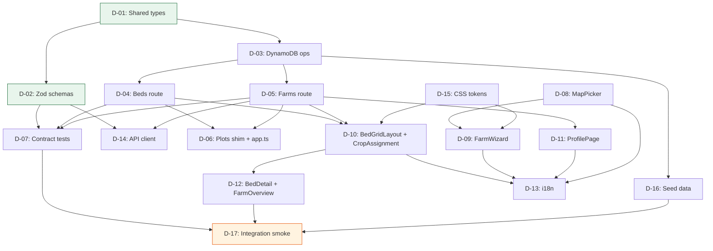

# Phase D Task Breakdown — UX Restructure (MVP+ v0.13)

> Created: 2026-03-22
> Scope: F-09 (Map Picker), F-10 (Elevation), BED (Bed-Grid), CROP (Crop-per-Bed), PROF (Profile)
> Design sources: PHASE-D-ARCHITECTURE.md, ADR-20260322-phase-d-bed-grid-data-model.md,
>   UX-DESIGNS.md §14, SYSTEM-DESIGN.md §10
> Estimated total effort: ~5.5h

---

## Summary Table

| ID | Title | Layer | Effort | Depends On |
|----|-------|-------|--------|------------|
| D-01 | Update shared domain types | shared | S | — |
| D-02 | Update Zod schemas + request types | shared | S | D-01 |
| D-03 | Update DynamoDB operations | api | L | D-01 |
| D-04 | Create beds API route | api | M | D-03 |
| D-05 | Modify farms API route | api | M | D-03 |
| D-06 | Add plots redirect shim + update app.ts | api | S | D-04, D-05 |
| D-07 | Update contract tests | test | M | D-02, D-04, D-05 |
| D-08 | Install Leaflet + create MapPicker component | frontend | M | — |
| D-09 | Create FarmWizard component | frontend | M | D-08 |
| D-10 | Create BedGridLayout + CropAssignment components | frontend | L | D-04, D-05 |
| D-11 | Create ProfilePage component + profile Astro page | frontend | M | D-05 |
| D-12 | Create BedDetail Astro page + update FarmOverview | frontend | M | D-10 |
| D-13 | Update i18n keys (EN + JA) | frontend | S | D-08, D-09, D-10, D-11 |
| D-14 | Update frontend API client | frontend | S | D-02, D-04, D-05 |
| D-15 | Add CSS tokens for bed grid and wizard | frontend | S | — |
| D-16 | Rewrite seed data script | seed | M | D-03 |
| D-17 | Integration smoke test pass | test | S | D-07, D-16, D-12 |

**Legend**: S = <30 min, M = 30 min–2 h, L = 2 h–4 h

---

## Detailed Task Descriptions

---

### D-01: Update shared domain types

**Layer**: shared
**Effort**: S (<30 min)
**Depends on**: —

**Files**:
- Modify: `/workspace/packages/shared/src/types/domain.ts`
- Modify: `/workspace/packages/shared/src/types/api.ts`
- Modify: `/workspace/packages/shared/src/types/requests.ts`
- Modify: `/workspace/packages/shared/src/constants.ts`

**What to do**:

In `domain.ts`:
- Add `grid_rows: number` and `grid_cols: number` to the `Farm` interface.
- Add `elevation_m?: number` is already present; confirm it is retained.
- Replace the `Bed` interface entirely: change `field_id` to `farm_id`, add `row: number`, `col: number`, make crop fields optional (`crop_type?`, `crop_variety?`, `planted_at?`, `expected_harvest?`, `notes?`), and change `latest_status` type from `PlotStatus` to `BedStatus`.
- Add `export type BedStatus = 'healthy' | 'issue' | 'critical' | 'no_data';` (the design uses 'critical' not 'animal_intrusion' for the flattened model per SYSTEM-DESIGN §10.3b).
- Remove the `Field` interface entirely.
- Remove the `Plot` interface entirely.
- Remove the `PlotStatus` type and `PLOT_STATUS` / `PLOT_STATUS_VALUES` constants in `constants.ts`; replace with `BED_STATUS` equivalents.
- On `Image`: remove the `plot_id` field. The `bed_id` field is the sole association. Remove the comment referencing SF-4 denormalization.

In `api.ts`:
- Update `FarmResponse` to remove the `fields` array; add `grid_rows: number`, `grid_cols: number`, and `beds: FarmBed[]`.
- Add `FarmBed` interface (id, row, col, name, crop_type | null, crop_variety | null, latest_status: BedStatus).
- Replace `FarmPlotItem` with `FarmBedItem` (id, row, col, name, crop_type | null, crop_variety | null, latest_status, latest_image).
- Replace `PlotDetailResponse` with `BedDetailResponse` (id, farm_id, row, col, name, crop fields nullable, notes, latest_status, latest_image with tags).
- Add `UpdateBedResponse` (the PATCH /beds/{bedId} full bed response).
- Remove `ImageDetailResponse`'s `plot_id` field; already has `bed_id`.

In `requests.ts`:
- Add `grid_rows?: number` and `grid_cols?: number` to `CreateFarmRequest`.
- Add `grid_rows?: number` and `grid_cols?: number` to `UpdateFarmRequest`.
- Remove `CreatePlotRequest`.
- Add `UpdateBedRequest` interface (crop_type?, crop_variety?, planted_at?, expected_harvest?, notes? — all nullable).

**Acceptance criteria**:
1. `tsc --noEmit` on the shared package passes with zero type errors after the changes.
2. The `Field` and `Plot` interfaces no longer exist in `domain.ts`; any file that imported them produces a TypeScript error (expected — surfaces all call-sites to fix in subsequent tasks).
3. `BedStatus` type is exported from `domain.ts` and re-exported from `packages/shared/src/index.ts`.

---

### D-02: Update Zod schemas + request types

**Layer**: shared
**Effort**: S (<30 min)
**Depends on**: D-01

**Files**:
- Modify: `/workspace/packages/shared/src/schemas/index.ts`
- Modify: `/workspace/packages/shared/src/index.ts`

**What to do**:

In `schemas/index.ts`:
- Replace `PlotStatusSchema` with `BedStatusSchema = z.enum(['healthy', 'issue', 'critical', 'no_data'])`.
- Replace `FarmResponseSchema`: remove `fields` array, add `grid_rows: z.number()`, `grid_cols: z.number()`, add `beds: z.array(FarmBedSchema)` where `FarmBedSchema` has id, row, col, name, crop_type (nullable), crop_variety (nullable), latest_status (BedStatusSchema).
- Replace `FarmPlotItemSchema` with `FarmBedItemSchema` (mirrors `FarmBedItem` from api.ts, adds latest_image).
- Replace `PlotDetailResponseSchema` with `BedDetailResponseSchema`.
- Add `UpdateBedRequestSchema` (validates PATCH /beds/{bedId} body: crop_type optional string 1-100, notes optional string max 500, etc.).
- Remove `NestedPlotSchema`, `FarmPlotsResponseSchema`, `FarmPlotItemSchema`, `PlotDetailResponseSchema`.
- Update `ImageDetailResponseSchema`: replace `plot_id` field with `bed_id`.
- Update `TagCreateResponseSchema`: remove `plot_status_updated` field (it still references a bed now — rename to `bed_status_updated` if design calls for it; otherwise simply retain as-is noting it still describes the bed's new derived status). [INFERRED: keep as `bed_status_updated` to match the entity rename]

In `index.ts`:
- Update all re-exports: remove `PlotStatus`, `Field`, `Plot`, `CreatePlotRequest`; add `BedStatus`, `UpdateBedRequest`, `FarmBed`, new schema names.

**Acceptance criteria**:
1. `packages/shared` tests pass (`npm test` in the shared package): validation tests must be updated or pass.
2. `FarmResponseSchema.parse()` accepts a response with `beds: []` and `grid_rows: 1`, and rejects a response that still has `fields: []`.
3. `BedDetailResponseSchema.parse()` accepts a valid bed detail response and rejects a payload missing `farm_id` or `row`.

---

### D-03: Update DynamoDB operations

**Layer**: api
**Effort**: L (2–4 h)
**Depends on**: D-01

**Files**:
- Modify: `/workspace/src/api/src/services/dynamodb.ts`

**What to do**:

Key builder changes:
- Add `sk.bed(row, col, bedId)` that produces `BED#{row padded 2}#{col padded 2}#{bedId}` (zero-padded to 2 digits for lexicographic sort across 1-5).
- Remove or deprecate `sk.field()`, `sk.plot()`.

New operations:
- `createBedsForFarm(farmId, gridRows, gridCols)`: generates Bed records for every (row, col) cell. Auto-generates name via row letter + col number (row 1 = 'A', row 2 = 'B', etc.). Uses `BatchWriteItem` for up to 25 items (5×5 = 25 beds), plus a separate `PutItem` for the farm meta. Accept that the 26-item edge case (5×5 + meta) uses two operations per SYSTEM-DESIGN §10.1b note.
- `getBedsForFarm(farmId)`: query `PK=FARM#{farmId}`, `SK begins_with BED#`. Returns all Bed items sorted by SK (row/col order).
- `getBedById(bedId)`: GSI1 query `PK=BED#{bedId}`, `SK=#META`. Returns the Bed item including its `farm_id` (stored on the item).
- `updateBed(farmId, bedId, row, col, updates)`: `UpdateItem` on the farm partition using the full SK.

Modified operations:
- `createFarm(data)`: extend to accept `grid_rows` and `grid_cols`; after writing the farm meta item, call `createBedsForFarm()`.
- `updateFarm(farmId, updates)`: if `grid_rows` or `grid_cols` change, handle grid resize:
  - Expanding: call `createBedsForFarm()` for the new cells only.
  - Shrinking: soft-delete beds outside new bounds (mark with `status: 'inactive'`). Check for occupied beds before soft-delete; return an error payload describing affected beds if any have crop data or images.
- `createImage(data)`: change `PK` from `PLOT#{plotId}` to `BED#{bedId}`. The `bed_id` field is already present on Image items (denormalized per SF-4); it becomes the primary PK prefix.
- `getLatestImageForBed(bedId)`: equivalent of old `getLatestImageForPlot`, queries `PK=BED#{bedId}`, `SK begins_with IMG#`, `ScanIndexForward: false`, `Limit: 1`.
- `getImagesForBed(bedId, limit, cursor)`: equivalent of old `getImagesForPlot`.

Deprecated operations (keep as stubs returning empty/null for one version to avoid breaking existing tests before D-07 rewrites them):
- `getFieldsForFarm`, `getBedsForField`, `createField`, `createBed`, `createPlot`, `getPlotsForBed`, `getPlotsForFarm`, `getPlotById`, `getLatestImageForPlot`, `getImagesForPlot`.

**Acceptance criteria**:
1. Unit tests in `/workspace/src/api/src/__tests__/services/dynamodb.test.ts` pass after updating mocks/fixtures for the new operations (the test file will need updating as part of this task).
2. `createFarm()` called with `{name, latitude, longitude, grid_rows: 2, grid_cols: 3}` calls DynamoDB with exactly 7 items (1 farm + 6 beds), with bed SKs in the format `BED#01#01#{uuid}` through `BED#02#03#{uuid}`.
3. `getBedById()` issues a GSI1 query (not a table scan) and returns null without throwing for a non-existent bedId.

---

### D-04: Create beds API route

**Layer**: api
**Effort**: M (30 min–2 h)
**Depends on**: D-03

**Files**:
- Create: `/workspace/src/api/src/routes/beds.ts`
- Create: `/workspace/src/api/src/__tests__/routes/beds.test.ts`

**What to do**:

Create a Hono router at `/api/v1/beds` with these handlers:

```
GET  /api/v1/beds/:bedId
PATCH /api/v1/beds/:bedId
GET  /api/v1/beds/:bedId/images
POST /api/v1/beds/:bedId/images
```

For each handler, mirror the pattern in `plots.ts` but target `getBedById`, `updateBed`, `getImagesForBed`, `createImage`. Key differences:

- `GET /beds/:bedId`: fetch bed via GSI1, resolve signed image URLs if latest_image present.
- `PATCH /beds/:bedId`: Zod-validate body with `UpdateBedRequestSchema`. Role check: admin or manager only (403 if observer). Update and return full bed.
- `GET /beds/:bedId/images`: paginated list using `getImagesForBed`. Same cursor logic as existing `GET /plots/:plotId/images`.
- `POST /beds/:bedId/images`: multipart upload. Same logic as existing `POST /plots/:plotId/images` but targets `BED#` PK. S3 key: `images/{farmId}/{bedId}/{imageId}.jpg`.

Also add `GET /api/v1/farms/:farmId/beds` to `farms.ts` (listed under D-05 since that file is already being modified).

Create a test file `/workspace/src/api/src/__tests__/routes/beds.test.ts` covering at minimum: GET 200, GET 404, PATCH 200, PATCH 403 (observer), PATCH 400 (validation), POST image 201.

**Acceptance criteria**:
1. `GET /api/v1/beds/:bedId` returns 200 with shape matching `BedDetailResponseSchema` for a valid bedId, and 404 for unknown bedId.
2. `PATCH /api/v1/beds/:bedId` with `crop_type: ""` (empty string) returns 400 VALIDATION_ERROR.
3. New test file runs without failures: `npx vitest run src/api/src/__tests__/routes/beds.test.ts`.

---

### D-05: Modify farms API route

**Layer**: api
**Effort**: M (30 min–2 h)
**Depends on**: D-03

**Files**:
- Modify: `/workspace/src/api/src/routes/farms.ts`
- Modify: `/workspace/src/api/src/__tests__/routes/farms.test.ts`

**What to do**:

- `GET /api/v1/farms/:farmId`: change response assembly. Replace `getFieldsForFarm()` + `getBedsForField()` + `getPlotsForBed()` call chain with the 2-query pattern: `getFarm()` + `getBedsForFarm()`. Flatten beds into `beds[]` array on response. Add `grid_rows`, `grid_cols` from farm record.
- `POST /api/v1/farms`: accept `grid_rows` (1–5, default 1) and `grid_cols` (1–5, default 1) in request body. Zod-validate. Pass to `createFarm()`.
- `PATCH /api/v1/farms/:farmId`: accept `grid_rows` and `grid_cols`. Validate 1–5. Pass to `updateFarm()`. Handle 409 CONFLICT response from DynamoDB layer when shrinking would remove occupied beds: return `409` with `affected_beds[]` in error details.
- Add `GET /api/v1/farms/:farmId/beds`: query `getBedsForFarm(farmId)`, resolve latest image per bed via `getLatestImageForBed()`, return `FarmBedItemSchema`-shaped array in `{ data: [] }` envelope.
- Update `farms.test.ts` mocks: replace `getFieldsForFarm`, `getBedsForField`, `getPlotsForBed`, `createField`, `createBed`, `createPlot` with `getBedsForFarm`, `createFarm` (updated), etc.

**Acceptance criteria**:
1. `GET /api/v1/farms/:farmId` response includes `beds: []` and `grid_rows: 1`, `grid_cols: 1`; `fields` key is absent.
2. `POST /api/v1/farms` with `grid_rows: 0` returns 400 VALIDATION_ERROR.
3. `GET /api/v1/farms/:farmId/beds` returns 200 with `{ data: FarmBedItem[] }`.

---

### D-06: Add plots redirect shim + update app.ts

**Layer**: api
**Effort**: S (<30 min)
**Depends on**: D-04, D-05

**Files**:
- Modify: `/workspace/src/api/src/routes/plots.ts`
- Modify: `/workspace/src/api/src/app.ts`

**What to do**:

In `plots.ts`:
- Add 301 redirects at the top of each handler for backward compat:
  - `GET /api/v1/plots/:plotId` → `GET /api/v1/beds/:plotId` (301).
  - `GET /api/v1/plots/:plotId/images` → `GET /api/v1/beds/:plotId/images` (301).
  - `POST /api/v1/plots/:plotId/images` → `POST /api/v1/beds/:plotId/images` (301).
  - `GET /api/v1/farms/:farmId/plots` → `GET /api/v1/farms/:farmId/beds` (301).
- Mark the file with a `// DEPRECATED: Phase D redirect shim — remove in v1.1` comment header.

In `app.ts`:
- Register the beds router: `app.route('/api/v1/beds', bedsRouter)`.
- Add auth middleware for `/api/v1/beds` and `/api/v1/beds/*`.
- Retain existing `plots` registration unchanged (the shim handles it).

**Acceptance criteria**:
1. `GET /api/v1/plots/{any-id}` returns HTTP 301 with `Location: /api/v1/beds/{any-id}`.
2. The health endpoint and all pre-existing routes still return expected status codes (no regression): `npx vitest run src/api/src/__tests__/app.test.ts`.
3. The beds router is reachable: `GET /api/v1/beds/{validId}` returns 200 or 404 (not 404 from routing miss).

---

### D-07: Update contract tests

**Layer**: test
**Effort**: M (30 min–2 h)
**Depends on**: D-02, D-04, D-05

**Files**:
- Modify: `/workspace/src/api/src/__tests__/contracts.test.ts`

**What to do**:

- Update the `dynamoRepo` mock to replace all Plot/Field functions with Bed equivalents:
  - Remove: `getFieldsForFarm`, `getBedsForField`, `getPlotsForBed`, `getPlotsForFarm`, `getPlotById`, `getLatestImageForPlot`, `getImagesForPlot`, `createField`, `createBed`, `createPlot`.
  - Add: `getBedsForFarm`, `getBedById`, `createBedsForFarm`, `updateBed`, `getLatestImageForBed`, `getImagesForBed`.
- Replace `FarmResponseSchema` test fixture to include `beds: []` and `grid_rows: 1`, `grid_cols: 1`; remove `fields` from fixture.
- Replace `FarmPlotsResponseSchema` contract test with a `FarmBedsResponseSchema` test covering `GET /farms/:farmId/beds`.
- Replace `PlotDetailResponseSchema` contract test with `BedDetailResponseSchema` covering `GET /beds/:bedId`.
- Update `ImageListResponseSchema` contract test: change URL from `/plots/:plotId/images` to `/beds/:bedId/images`.
- Update `ImageUploadResponseSchema` test: change POST URL to `/beds/:bedId/images`.
- Update `ImageDetailResponseSchema`: fixture must use `bed_id` instead of `plot_id`.
- All unchanged schemas (WeatherResponseSchema, ChatResponseSchema, UsageResponseSchema, TagCreateResponseSchema) remain as-is.
- Import new schema names from `@litcrop/shared`.

**Acceptance criteria**:
1. `npx vitest run src/api/src/__tests__/contracts.test.ts` passes with zero failures.
2. Each contract test asserts that `Schema.safeParse(response).success === true`, ensuring no shape drift.
3. The test count in `contracts.test.ts` is equal to or greater than before (no coverage regression — each removed plot test has a bed equivalent).

---

### D-08: Install Leaflet + create MapPicker component

**Layer**: frontend
**Effort**: M (30 min–2 h)
**Depends on**: — (independent of API changes)

**Files**:
- Modify: `/workspace/src/frontend/package.json`
- Create: `/workspace/src/frontend/src/components/MapPicker.tsx`

**What to do**:

Add to `package.json` dependencies:
```json
"leaflet": "^1.9.4",
"@types/leaflet": "^1.9.14"
```

Create `MapPicker.tsx` as a Preact component (not Astro island itself — it is imported by FarmWizard with `lazy()`). Key behaviors per UX-DESIGNS §14.1 and SYSTEM-DESIGN §10.5a:

- Render an `L.Map` inside a `ref`-attached div. Map height: 300px mobile / 400px desktop. Tile layer: `https://{s}.tile.openstreetmap.org/{z}/{x}/{y}.png`.
- Default center: Japan (35.6762, 139.6503), zoom 5.
- GPS button: custom Leaflet control (bottom-right). On click, calls `navigator.geolocation.getCurrentPosition()`. On success: fly to user location at zoom 14, auto-place pin.
- Crosshair overlay: CSS-positioned `div` centered on the map container. `aria-hidden="true"`.
- Pin placement: on map `click` event, place/move `L.marker()` at clicked coords. Emit `onLocationChange({ latitude, longitude })`.
- After pin placement, call Open-Meteo elevation API: `GET https://api.open-meteo.com/v1/elevation?latitude={lat}&longitude={lon}` with `AbortSignal.timeout(3000)`. On success, emit `onElevationChange(meters)`. On failure (timeout, HTTP error, missing array), emit `onElevationChange(null)`.
- Fallback: wrap the `lazy(() => import('./MapPicker'))` in an error boundary in FarmWizard (D-09). If `MapPicker` throws during import or render, the wizard Step 2 falls back to 3 plain `<input>` fields for lat, lon, elevation.
- Offline detection: listen to Leaflet `tileerror` events. After first tile error, show banner: "Map unavailable offline. Enter coordinates manually."
- Map container must have `role="application"` and `aria-label` per Section 14.8.
- Keyboard: arrow-key pan, +/- zoom, Enter to confirm location (places pin at current center).

Props interface:
```typescript
interface MapPickerProps {
  initialLatitude?: number | null;
  initialLongitude?: number | null;
  onLocationChange: (coords: { latitude: number; longitude: number }) => void;
  onElevationChange: (elevation: number | null) => void;
}
```

**Acceptance criteria**:
1. `MapPicker` renders without error when `initialLatitude` and `initialLongitude` are `null` (no-pin state).
2. Simulating a map click emits `onLocationChange` with lat/lon values; within 3s, either `onElevationChange(number)` or `onElevationChange(null)` fires.
3. Leaflet is not bundled into the main chunk: Astro/Vite treats the dynamic import as a separate chunk (verify in build output that `leaflet` does not appear in the main bundle's `import` graph).

---

### D-09: Create FarmWizard component

**Layer**: frontend
**Effort**: M (30 min–2 h)
**Depends on**: D-08

**Files**:
- Create: `/workspace/src/frontend/src/components/FarmWizard.tsx`

**What to do**:

Create `FarmWizard.tsx` as a Preact island component. The wizard is a full-screen modal on mobile and a centered card on desktop (max-width 640px). Follows SYSTEM-DESIGN §10.4a and UX-DESIGNS §14.2.

State interface:
```typescript
interface FarmWizardState {
  step: 1 | 2 | 3;
  name: string;
  description: string;
  latitude: number | null;
  longitude: number | null;
  elevation_m: number | null;
  elevationStatus: 'idle' | 'loading' | 'loaded' | 'error';
  mapLoaded: boolean;
  submitting: boolean;
  error: string | null;
  createdFarmId: string | null;
}
```

- Step 1: Farm Name (required, `maxlength=100`) + Description (`maxlength=500`). Next enabled when `name.trim().length >= 1`.
- Step 2: Lazy-load `MapPicker`. On import failure (error boundary), render 3 text inputs. On pin placement: update lat/lon state, set `elevationStatus: 'loading'`. On elevation callback: update state. Next enabled when lat and lon are non-null.
- Step 3: Review card (name, description, lat/lon rounded to 6 dp, elevation in meters or "Not set"). "Create Farm" button calls `createFarm({ name, description, latitude, longitude, elevation_m, grid_rows: 1, grid_cols: 1 })` from `lib/api.ts` (this API function must be updated in D-14). On success: show post-create dialog. On failure: toast error.
- Post-create dialog: "Switch Now" calls `setLocalFarmId(farmId)` then `window.location.assign('/')`. "Stay" closes wizard via `onClose` prop.
- "Cancel" button shows a `confirm()` dialog: "Discard this farm?".
- Transitions: 200ms slide-left on forward, slide-right on back. Respects `prefers-reduced-motion`.
- Accessibility: `role="dialog"`, `aria-modal="true"`, focus trap, step announcements via `aria-live`.

Props:
```typescript
interface FarmWizardProps {
  onClose: () => void;
}
```

**Acceptance criteria**:
1. Clicking "Next" on Step 1 without a farm name does not advance (Next button is disabled; no toast).
2. Clicking "Cancel" calls `window.confirm()` before invoking `onClose`.
3. On a successful POST /farms mock, `createdFarmId` becomes non-null and the post-create dialog renders.

---

### D-10: Create BedGridLayout + CropAssignment components

**Layer**: frontend
**Effort**: L (2–4 h)
**Depends on**: D-04, D-05

**Files**:
- Create: `/workspace/src/frontend/src/components/BedGridLayout.tsx`
- Create: `/workspace/src/frontend/src/components/CropAssignment.tsx`

**What to do**:

**BedGridLayout.tsx** — Preact island, renders the CSS Grid view for the active farm.

State interface follows SYSTEM-DESIGN §10.4b. Key behaviors per UX-DESIGNS §14.3:
- Renders a CSS Grid: `grid-template-columns: repeat({gridCols}, 1fr)`, `gap: var(--bed-cell-gap)`.
- Each cell: if `crop_type` is set, show assigned cell (status border + status badge + crop name + variety on desktop). If not set and user is not observer, show empty cell with "+" icon (tap to open CropAssignment). Empty cell for observer: grey, no "+".
- Status colors: use `STATUS_CSS` from `lib/status.ts` (already maps status values to CSS classes); extend to support `BedStatus` once D-01 renames the type.
- "Edit Grid" button (admin/manager only): opens an inline grid-size editor with pill selectors (1–5 per axis). On confirm, calls `updateFarm(farmId, { grid_rows, grid_cols })`. Handle 409 with a confirmation dialog naming affected beds.
- "List" / "Layout" toggle: controlled by `viewMode` state. In "List" mode, render the existing plot tile list (via existing `FarmOverview` or reuse its render logic); in "Layout" mode, render the grid.
- Grid row navigation: `role="grid"`, each row `role="row"`, each cell `role="gridcell"` with `aria-label="{bedName}, {cropType or 'empty'}..."`. Arrow keys move focus between cells.
- Cell minimum size: 64px on mobile. Use `overflow-x: auto` if `cols × 64px > viewport`.

Props:
```typescript
interface BedGridLayoutProps {
  farmId: string;
  userRole: 'admin' | 'manager' | 'observer';
}
```

**CropAssignment.tsx** — Bottom sheet on mobile, modal on desktop.

State interface follows SYSTEM-DESIGN §10.4c. Key behaviors:
- Triggered by tapping an empty bed cell. Opens as a bottom sheet (mobile: slides up from bottom 300px height, `position: fixed`, `bottom: 0`; desktop: centered modal, `max-width: 480px`).
- Form fields: crop type (dropdown with predefined list + "Other" option revealing a freeform input), variety (text, optional), planted_at (date input, default today), notes (textarea, `maxlength=500`).
- Predefined crop list: Tomato, Cucumber, Lettuce, Spinach, Carrot, Eggplant, Pepper, Herb, Other.
- "Save Crop" button: disabled when `cropType` is empty. On tap: optimistic UI — close sheet, update cell to show crop name immediately. Call `updateBed(bedId, { crop_type, crop_variety, planted_at })`. On API error: revert cell to empty state, show toast error.
- ESC or tap-outside closes the sheet (with state discard).
- Focus trap: on open, focus moves to first input. On close, focus returns to the triggering cell.
- Accessibility per §14.8.

Props:
```typescript
interface CropAssignmentProps {
  bedId: string;
  bedName: string;
  row: number;
  col: number;
  onClose: () => void;
  onAssigned: (bedId: string, cropType: string, cropVariety: string) => void;
}
```

**Acceptance criteria**:
1. A 3×2 grid with 6 beds renders exactly 6 cells, 3 per row. Cells have correct `aria-label` attributes.
2. Tapping an empty cell opens `CropAssignment`; ESC closes it without mutation; "Save Crop" disabled when `cropType` is blank.
3. Observer role: no "+" icon on empty cells; no "Edit Grid" button rendered.

---

### D-11: Create ProfilePage component + profile Astro page

**Layer**: frontend
**Effort**: M (30 min–2 h)
**Depends on**: D-05

**Files**:
- Create: `/workspace/src/frontend/src/components/ProfilePage.tsx`
- Modify: `/workspace/src/frontend/src/pages/setup.astro` (redesign content — route stays at `/setup`)

**What to do**:

Note: per UX-DESIGNS §14.5, the Profile page lives at the existing `/setup` route. The current `SetupForm` component is retired; `setup.astro` is updated to use `ProfilePage` instead.

**ProfilePage.tsx** — Preact island, `client:load`.

State interface follows SYSTEM-DESIGN §10.4d. Key behaviors per UX-DESIGNS §14.5:
- On mount: fetch `getMyFarms()` to get `Array<Farm & { role: FarmRole }>`. Read `activeFarmId` from `localStorage('litcrop-farmId')`.
- Render "Farms" section:
  - Each farm: card with farm name, `"{role} · {n} members"` meta, active badge (if active farm), expand arrow (toggle member list).
  - Member list: collapsible with 200ms slide animation. Each row: name + role badge + join date.
  - "Switch" button on non-active farms: calls `localStorage.setItem('litcrop-farmId', farmId)` then `window.location.reload()`.
  - "+" button: opens `FarmWizard` in a portal. On wizard close, refresh farm list.
- Render "You" section: read email from Cognito JWT claims (`decodeJwt(token).email`). Show email, role on active farm, join date. All read-only.
- Desktop: 2-column layout (farm list left, selected farm detail right). Clicking a farm card on the left selects it for detail view (does not switch).
- Empty state: "You haven't been added to any farms yet."
- Loading: skeleton for farm cards.
- Error: inline error with retry button.

Update `setup.astro`:
- Remove `<SetupForm client:load />`.
- Add `<ProfilePage client:load />`.
- Update page `<title>` to "Profile — LitCrop".

**Acceptance criteria**:
1. Navigating to `/setup` renders the new ProfilePage with the "Farms" and "You" sections (not the old SetupForm with farm name/coordinates fields).
2. The "Switch" button on a non-active farm calls `localStorage.setItem` with the correct farmId value.
3. The "[+] New Farm" button opens `FarmWizard`; after creation, the farm list refreshes without a full page reload.

---

### D-12: Create BedDetail Astro page + update FarmOverview

**Layer**: frontend
**Effort**: M (30 min–2 h)
**Depends on**: D-10

**Files**:
- Create: `/workspace/src/frontend/src/pages/beds/view.astro`
- Modify: `/workspace/src/frontend/src/components/FarmOverview.tsx`
- Modify: `/workspace/src/frontend/src/pages/index.astro` (minor: integrate BedGridLayout toggle)

**What to do**:

**Create `/pages/beds/view.astro`**:
- Mirrors `/pages/plots/view.astro` but uses bed-based API calls (`getBed(bedId)`, `getBedImages(bedId, limit, cursor)`).
- Displays: bed name, crop info (type, variety, planted/harvest dates, notes), status badge, image timeline with TimeLapsePlayer and Lightbox (both already exist from Phase C).
- URL: `/beds/view?id={bedId}`.
- Keep `/pages/plots/view.astro` in place for one version cycle with a client-side redirect to `/beds/view?id={query.id}` to honor the backward-compat redirect from D-06.

**Update `FarmOverview.tsx`**:
- The component currently calls `getPlots()`. Replace with calls that fit the bed model:
  - Import and use `getBedsForFarm(farmId)` for the list view (which returns `FarmBedItem[]`).
  - Retain the `List | Layout` toggle UI. In List mode, render bed tile cards (crop name, status badge, latest image thumbnail). In Layout mode, render `<BedGridLayout farmId={farmId} userRole={role} />`.
- Remove references to `FarmPlotItem`, `PlotStatus`; use `FarmBedItem`, `BedStatus`.
- Update navigation: "tap tile" navigates to `/beds/view?id={bedId}` instead of `/plots/view?id={plotId}`.

Update `/pages/index.astro`:
- Pass `farmId` and `userRole` as Astro props to `FarmOverview` (the island already receives `farmId`; add `userRole` from the farm membership lookup).

**Acceptance criteria**:
1. `/beds/view?id={validBedId}` renders the bed detail with crop information and the image timeline section.
2. On the Crops page (`/`), switching to Layout mode renders `BedGridLayout` (the CSS grid), not the old Field-based spatial layout.
3. Navigating from a list-mode bed tile card goes to `/beds/view?id=...`, not `/plots/view?id=...`.

---

### D-13: Update i18n keys (EN + JA)

**Layer**: frontend
**Effort**: S (<30 min)
**Depends on**: D-08, D-09, D-10, D-11

**Files**:
- Modify: `/workspace/src/frontend/src/i18n/en.json`
- Modify: `/workspace/src/frontend/src/i18n/ja.json`

**What to do**:

Add all keys from UX-DESIGNS §14.9 to both locale files. The full set of new keys covers:

- `map.*` — map picker (title, instruction, gps_button, gps_loading, gps_denied, elevation_auto, elevation_failed, offline_banner, edit_manually, lat, lon, elevation)
- `wizard.*` — farm creation wizard (step_n_of_m, step_name, description, location, review, create, next, back, cancel, discard_confirm, switch_now, stay_on, created_success)
- `bed_grid.*` — bed grid (bed_layout, edit_grid, create_grid, rows, cols, beds_total, no_grid_yet, create_first_grid, add_crop, change_crop, remove_crop, confirm_shrink)
- `crop.*` — crop assignment (assign_crop, crop_type, variety, planted_at, expected_harvest, notes, save_crop, other, predefined crop names)
- `profile.*` — profile page (title, farms, no_farms, active_badge, switch, members_count, role_admin, role_manager, role_observer, you, email, joined)

For Japanese translations: follow the existing pattern in `ja.json`. For any key where a high-quality Japanese translation is not certain, mark with `[NEEDS_REVIEW]` comment inline (acceptable for MVP+; review can happen before production deploy).

**Acceptance criteria**:
1. Both `en.json` and `ja.json` are valid JSON (no parse errors).
2. Every key referenced by `t('map.instruction')`, `t('wizard.create')`, `t('bed_grid.no_grid_yet')`, `t('crop.save_crop')`, `t('profile.active_badge')` resolves to a non-empty string in both locales.
3. No existing keys are removed or renamed (only additions).

---

### D-14: Update frontend API client

**Layer**: frontend
**Effort**: S (<30 min)
**Depends on**: D-02, D-04, D-05

**Files**:
- Modify: `/workspace/src/frontend/src/lib/api.ts`

**What to do**:

- Remove: `createPlot()`, `getPlots()`, `getPlot()`, `getPlotImages()`, `uploadPlotImage()`.
- Add:
  - `getBed(bedId: string): Promise<BedDetailResponse>`
  - `updateBed(bedId: string, data: UpdateBedRequest): Promise<BedDetailResponse>`
  - `getBedImages(bedId: string, cursor?: string): Promise<PaginatedResponse<ImageListItem>>`
  - `uploadBedImage(bedId: string, formData: FormData): Promise<ImageUploadResponse>`
  - `getBedsForFarm(farmId: string): Promise<FarmBedItem[]>`
- Modify `createFarm()`: accept `grid_rows?: number` and `grid_cols?: number` in the `CreateFarmRequest` type (already updated in D-02). Return type becomes `Farm` (the write-response which now includes `grid_rows`, `grid_cols`).
- Modify `updateFarm()`: accept `grid_rows?: number`, `grid_cols?: number`. Return type: `Farm`.
- Update all type imports to use new names from `@litcrop/shared`.

**Acceptance criteria**:
1. `tsc --noEmit` on the frontend package passes with zero type errors.
2. The removed functions (`createPlot`, `getPlots`, `getPlot`) are no longer exported; any component still importing them causes a TypeScript error (expected — confirms all call sites have been updated in D-10, D-11, D-12).
3. `getBed()` and `updateBed()` type signatures match the backend response shapes from `BedDetailResponseSchema`.

---

### D-15: Add CSS tokens for bed grid and wizard

**Layer**: frontend
**Effort**: S (<30 min)
**Depends on**: — (independent)

**Files**:
- Modify: `/workspace/src/frontend/src/styles/tokens.css`

**What to do**:

Add the Phase D CSS custom properties from UX-DESIGNS §14.7 under the `:root` block:

```css
/* -- Bed Grid -- */
--bed-cell-min:       64px;
--bed-cell-desktop:   120px;
--bed-cell-gap:       var(--space-2);
--bed-cell-radius:    var(--radius-lg);

/* -- Farm Card (Profile) -- */
--farm-card-padding:  var(--space-4);

/* -- Wizard -- */
--wizard-max-width:   640px;
--wizard-step-dot:    12px;
```

No changes to existing tokens. This task can be done in any order relative to D-08 through D-12; the CSS variables are referenced by the new components but the components will render (without the intended sizing) even before this task runs.

**Acceptance criteria**:
1. `tokens.css` parses without errors in a modern browser (no syntax errors).
2. `var(--bed-cell-min)` resolves to `64px` when inspected in DevTools on a page that imports `tokens.css`.
3. All existing token names remain intact.

---

### D-16: Rewrite seed data script

**Layer**: seed
**Effort**: M (30 min–2 h)
**Depends on**: D-03

**Files**:
- Modify: `/workspace/scripts/seed-data.ts`

**What to do**:

Rewrite the seed data script to produce the flattened `Farm -> Bed` model. The script must:

1. Create a Farm record: `PK=FARM#{demoFarmId}`, `SK=#META`, with `grid_rows: 3`, `grid_cols: 2` (6-bed demo layout), `elevation_m: 760` (pre-set, no API call from script), and all other existing demo farm fields.
2. Create 6 Bed records under `PK=FARM#{demoFarmId}`, with SKs `BED#01#01#...` through `BED#03#02#...`. Assign crops:
   - A1 (1,1): Tomato Cherry — latest_status: 'healthy'
   - A2 (1,2): Cucumber Japanese — latest_status: 'issue'
   - B1 (2,1): Lettuce Romaine — latest_status: 'no_data'
   - B2 (2,2): Spinach Bloomsdale — latest_status: 'healthy'
   - C1 (3,1): empty (no crop)
   - C2 (3,2): empty (no crop)
3. Create Image records under `PK=BED#{bedId}` (not `PLOT#{plotId}`). Use existing image IDs/keys from the old seed if convenient, but update PKs to `BED#` prefix.
4. Create Tag records unchanged (still reference image_id via GSI1).
5. Create FarmMember records unchanged.
6. Remove all `Field`, `Bed` (old), and `Plot` record creation logic.
7. The `camera-simulator` (if present in the repo) references plot IDs in upload paths; check `/workspace/scripts/` for any simulator script and update it to target `/api/v1/beds/{bedId}/images` instead of `/api/v1/plots/{plotId}/images`. [CONFIRMED: `/workspace/scripts/seed-data.ts` is the only relevant script; no separate camera simulator script was found in `/workspace/scripts/`]

**Acceptance criteria**:
1. Running `npx ts-node --project scripts/tsconfig.json scripts/seed-data.ts` against a local/test DynamoDB completes without error.
2. After seeding, `GET /api/v1/farms/{demoFarmId}` returns `beds` with 6 items (4 with crops, 2 empty) and `grid_rows: 3`, `grid_cols: 2`.
3. No `FIELD#` or `PLOT#` key prefixes appear in the seeded DynamoDB table.

---

### D-17: Integration smoke test pass

**Layer**: test
**Effort**: S (<30 min)
**Depends on**: D-07, D-16, D-12

**Files**:
- No new files. Verify the full test suite passes.

**What to do**:

Run the full test suite across all packages:
```bash
npm test --workspaces
```

Verify:
- All 303 existing tests pass (plus any new tests added in D-04, D-07).
- No TypeScript compile errors: `npm run typecheck` or equivalent per package.
- Build succeeds for frontend: `npm run build` in `src/frontend`.

Fix any remaining import errors, stale mocks, or type mismatches surfaced during the integration pass. This task is a final integration gate, not a code-authoring task. It surfaces the TypeScript compile errors from call-sites that imported `Field`, `Plot`, `PlotStatus`, or old API functions that were not caught in individual tasks.

**Acceptance criteria**:
1. `npm test --workspaces` exits with code 0 (no failing tests).
2. `tsc --noEmit` passes in all three packages (shared, api, frontend).
3. `npm run build` in `src/frontend` produces no build errors. Bundle stats show `leaflet` only in a dynamically-loaded chunk, not in the main bundle.

---

## Dependency Graph



---

## Parallelization Opportunities

Three independent work streams can run in parallel after D-01:

**Stream A — API Layer** (sequential within stream):
D-01 → D-02 → D-03 → D-04 + D-05 (parallel) → D-06 → D-07

**Stream B — Frontend Map** (independent until D-09 integrates with D-10):
D-08 → D-09

**Stream C — Frontend CSS** (fully independent):
D-15 (can run any time)

Once D-03 + D-04 + D-05 complete, Stream B and the frontend components (D-10, D-11) merge:
D-10 + D-11 (parallel, both depend on D-04+D-05) → D-12 → D-13 → D-14 → D-17

```
Time -->

D-01 (S)
  ├── D-02 (S) ──────────────────────────────────── D-07 (M)
  ├── D-03 (L) ── D-04 (M) ─┐                            │
  │               D-05 (M) ─┤── D-06 (S)                 │
  │                          │                             │
  │              Stream A ends here                        │
  │                                                        │
  ├── D-08 (M) ── D-09 (M) ──────────────────────────────┤
  │                                                        │
  ├── D-15 (S) [any time]                                 │
  │                                                        │
  After D-04+D-05:                                         │
  D-10 (L) ─┐                                             │
  D-11 (M) ─┤                                             │
  D-14 (S) ─┤── D-12 (M) ── D-13 (S) ────────────────── D-17 (S)
  D-16 (M)  ┘
```

Rough minimum-path time assuming single developer: ~5.5h (D-03 is the critical path bottleneck at L).

---

## Risk Notes

| Risk | Impact | Mitigation |
|------|--------|------------|
| DynamoDB BatchWriteItem for 5×5 grid (26 items > 25 limit) | Medium — farm creation fails silently or throws | Use a separate PutItem for farm meta + one BatchWriteItem for up to 25 beds. Document this split in code. For ≤4×5=20 beds, a single TransactWriteItems works safely. |
| Leaflet dynamic import fails in test environment | Low — MapPicker tests cannot run in Vitest (no DOM) | Wrap Leaflet-specific logic in `typeof window !== 'undefined'` guards. Unit-test MapPicker with jsdom; mock `L.map` with a stub. |
| TypeScript errors cascade from Field/Plot removal | High — D-01 will instantly break compilation across 20+ files | Treat D-01 as the gating task. All other tasks fix their own call-sites. Use `// @ts-expect-error — Phase D migration` temporarily if needed to preserve test runnability between tasks. |
| Existing plots.test.ts becomes unreachable after D-06 | Medium — test coverage for the shim is missing | D-07 notes the test count gate. Add a minimal shim redirect test to `plots.test.ts` rather than deleting the file. |
| Grid resize with occupied beds — 409 conflict flow not covered | Medium — frontend may crash on receiving 409 | D-10 notes the confirmation dialog requirement. Add a test in beds.test.ts for the 409 path to ensure the response shape is parseable by the frontend handler. |
| `FarmLayoutView.tsx` (existing file) conflicts with `BedGridLayout.tsx` | Low — old component is plot-based spatial view, now replaced | After D-12, `FarmLayoutView.tsx` is no longer referenced. Retain the file until D-17 confirms no imports remain, then mark for deletion in a follow-up cleanup task. |
| Japanese translation quality for new keys | Low — app is functional; display may be awkward | Mark uncertain keys with `[NEEDS_REVIEW]` per D-13 instructions. Engage a Japanese speaker before production. |

---

## Assumptions

- [CONFIRMED] Demo farm is the only data source (no live user data). Seed data rewrite (D-16) is the sole migration step.
- [CONFIRMED] `bed_id` is already denormalized on `Image` items (from SF-4). The `createImage()` PK change is the only DynamoDB key migration needed.
- [ASSUMED] The camera simulator (if active) is triggered by scripts only, not a live Lambda; updating `seed-data.ts` is sufficient. No separate camera-simulator file was found in `/workspace/scripts/`.
- [ASSUMED] `FarmLayoutView.tsx` (the current Phase C layout component at `src/frontend/src/components/FarmLayoutView.tsx`) will be retired by D-12 and can be deleted in a post-D-17 cleanup commit.
- [INFERRED] The existing `PlotDetail.tsx` component (`src/frontend/src/components/PlotDetail.tsx`) maps to the new `BedDetail` Astro page. `PlotDetail.tsx` is retired after D-12; it need not be modified, only de-referenced.
- [INFERRED] `AddPlotForm.tsx` (`src/frontend/src/components/AddPlotForm.tsx`) is retired in Phase D; its functionality is replaced by the `CropAssignment` sheet (D-10). It should not be modified, just de-referenced and left for cleanup.
- [ASSUMED] The Profile page stays at the `/setup` route. The navigation label already reads "Profile" from Phase C. No route changes are needed.
- [CONFIRMED] No new color tokens are required (UX-DESIGNS §14.7 explicitly states this).

---

## Next Recommended Action

Start with **D-01** immediately — it is the foundation for every other task and will surface all downstream type errors that must be resolved as part of Phase D. It is a small, focused task (<30 min) with a clear completion signal: `tsc --noEmit` passes on the shared package with `Field` and `Plot` removed.

After D-01, the three independent work streams (API: D-02→D-03; Frontend map: D-08; CSS tokens: D-15) can begin in parallel.
