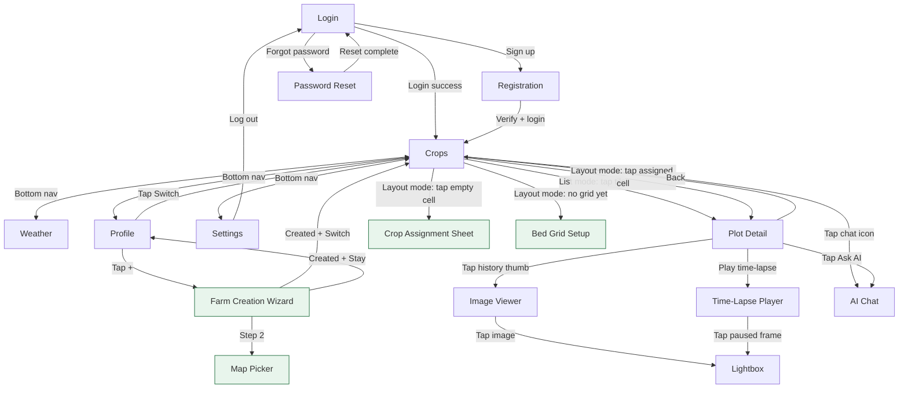

# UX-DESIGNS.md -- LitCrop MVP

> Generated by my-designer (Step 3) on 2026-03-17
> Updated for MVP scope on 2026-03-20
> Scope Level: **MVP** (incremental from PoC)

---

## 1. Design Principles

### P1: Glanceable Status -- "Is everything OK?" in under 3 seconds

Farmers check in for 1-3 minutes between tasks. Every screen must answer the most important question immediately through visual hierarchy: overall farm health first, individual plot status second, details on demand. No hunting, no scrolling to find the answer.

**Applied**: Farm Overview uses large status badges with color + icon on every tile. The highest-severity status appears at the top of the screen as a summary bar.

### P2: Forgiving Touch -- Design for dirty hands in bright sun

Outdoor use with wet or gloved hands demands oversized touch targets (minimum 48px, 12px gaps), high contrast (7:1 minimum), and status indicators that never rely on color alone. Every interactive element must be reachable in the thumb zone (bottom 60% of viewport).

**Applied**: Tag buttons are 56px tall, placed at the bottom of Plot Detail. Navigation uses large back arrows and tappable card regions, not small text links.

### P3: Progressive Depth -- Simple surface, rich on demand

The three-screen hub-and-spoke navigation (Farm Overview > Plot Detail > Image Timeline) provides progressive disclosure. The overview is maximally simple; detail screens reveal metadata, tagging, and history only when the user drills in.

**Applied**: Farm Overview shows only thumbnail + crop name + status. Plot Detail reveals full metadata, tagging controls, and image history. Image Timeline provides full-size viewing and chronological browsing.

### P4: Motion Means Attention -- Highlight what the camera saw move

Motion-triggered captures (wildlife, pest intrusion) are the key differentiator. These images must be visually distinct from scheduled captures at every level of the hierarchy, using a dedicated badge, contrasting color, and iconography.

**Applied**: Motion-triggered images carry an orange "MOTION" badge with a running-animal icon at every touchpoint -- overview tiles, detail hero, and history thumbnails.

---

## 2. Design Tokens

### 2.1 Color Palette

All colors tested against white (`#FFFFFF`) and dark backgrounds for 7:1+ contrast ratio (WCAG AAA for normal text, exceeding the AA requirement, to ensure outdoor readability).

```css
:root {
  /* -- Primary Palette -- */
  --color-primary:          #1B6B3A;  /* Deep green -- farm/growth association */
  --color-primary-dark:     #0E4D28;  /* Hover/active state */
  --color-primary-light:    #E8F5EC;  /* Subtle backgrounds */

  /* -- Neutral Palette -- */
  --color-gray-900:         #1A1A1A;  /* Primary text */
  --color-gray-700:         #4A4A4A;  /* Secondary text */
  --color-gray-500:         #767676;  /* Tertiary text (7:1 on white) */
  --color-gray-300:         #C4C4C4;  /* Borders */
  --color-gray-100:         #F2F2F2;  /* Backgrounds, skeleton */
  --color-white:            #FFFFFF;  /* Surface */

  /* -- Status Colors (semantic) -- */
  --color-status-healthy:     #1B7D3C;  /* Green -- 7.2:1 on white */
  --color-status-slow-growth: #B8860B;  /* Dark goldenrod -- 4.6:1 on white, paired with icon */
  --color-status-issue:       #C62828;  /* Deep red -- 7.1:1 on white */
  --color-status-animal:      #D84315;  /* Deep orange -- 5.2:1 on white, paired with icon */
  --color-status-no-data:     #616161;  /* Medium gray -- 7.0:1 on white */

  /* -- Status Background Tints -- */
  --color-status-healthy-bg:     #E8F5EC;
  --color-status-slow-growth-bg: #FFF8E1;
  --color-status-issue-bg:       #FFEBEE;
  --color-status-animal-bg:      #FFF3E0;
  --color-status-no-data-bg:     #F5F5F5;

  /* -- Motion Alert -- */
  --color-motion:           #E65100;  /* Vivid orange for motion badge */
  --color-motion-bg:        #FFF3E0;

  /* -- Semantic -- */
  --color-error:            #C62828;
  --color-success:          #1B7D3C;
  --color-info:             #1565C0;
  --color-warning:          #E65100;  /* [MVP] Form validation warnings */

  /* -- Auth / Form (MVP) -- */
  --color-input-border:     #C4C4C4;  /* Default input border */
  --color-input-focus:      #1B6B3A;  /* Focused input border — primary green */
  --color-input-error:      #C62828;  /* Invalid input border — error red */
  --color-input-bg:         #FFFFFF;  /* Input background */
  --color-link:             #1565C0;  /* Inline links (forgot password, sign up) */
  --color-link-visited:     #7B1FA2;  /* Visited link state */

  /* -- Surface -- */
  --color-surface:          #FFFFFF;
  --color-surface-elevated: #FFFFFF;
  --color-background:       #F5F5F5;
  --color-overlay:          rgba(0, 0, 0, 0.5);
}
```

### 2.2 Status Icon Mapping

Each status uses color AND a distinct icon AND text label -- triple redundancy for accessibility and outdoor readability.

| Status | Color Token | Icon | Label | Badge Shape |
|--------|-------------|------|-------|-------------|
| `healthy` | `--color-status-healthy` | Checkmark circle | "Healthy" | Rounded pill, green fill |
| `slow_growth` | `--color-status-slow-growth` | Upward arrow with clock | "Slow Growth" | Rounded pill, amber fill |
| `issue` | `--color-status-issue` | Warning triangle | "Issue" | Rounded pill, red fill |
| `animal_intrusion` | `--color-status-animal` | Animal silhouette (deer) | "Animal" | Rounded pill, orange fill |
| `no_data` | `--color-status-no-data` | Dash/empty circle | "No Data" | Rounded pill, gray fill |

### 2.3 Typography

System font stack for fastest loading and platform-native feel.

```css
:root {
  /* -- Font Family -- */
  --font-family:            -apple-system, BlinkMacSystemFont, "Segoe UI",
                            Roboto, "Hiragino Sans", "Noto Sans JP",
                            sans-serif;

  /* -- Type Scale (mobile 320-480px) -- */
  --font-size-xs:           12px;   /* Captions, timestamps */
  --font-size-sm:           14px;   /* Secondary text, metadata */
  --font-size-base:         16px;   /* Body text -- minimum for outdoor readability */
  --font-size-lg:           18px;   /* Subheadings */
  --font-size-xl:           22px;   /* Screen titles */
  --font-size-2xl:          28px;   /* Farm name (hero) */

  /* -- Font Weight -- */
  --font-weight-regular:    400;
  --font-weight-medium:     500;
  --font-weight-semibold:   600;
  --font-weight-bold:       700;

  /* -- Line Height -- */
  --line-height-tight:      1.2;    /* Headings */
  --line-height-normal:     1.5;    /* Body text */
  --line-height-relaxed:    1.75;   /* Long-form notes */
}
```

**Minimum sizes**: Body text never smaller than 16px. Captions (timestamps) at 12px use `--font-weight-medium` for legibility. All text scales to 200% per NFR-4.3 (tested by setting `font-size: 200%` on `<html>`).

### 2.4 Spacing System

8px base unit. Used consistently for all padding, margin, and gap values.

```css
:root {
  --space-0:    0px;
  --space-1:    4px;    /* Tight internal padding (icon-to-text) */
  --space-2:    8px;    /* Minimum gap between elements */
  --space-3:    12px;   /* Touch target gap (minimum) */
  --space-4:    16px;   /* Standard component padding */
  --space-5:    20px;   /* Section internal padding */
  --space-6:    24px;   /* Between components */
  --space-8:    32px;   /* Between sections */
  --space-10:   40px;   /* Major section breaks */
  --space-12:   48px;   /* Touch target minimum height */
  --space-16:   64px;   /* Large spacing */
}
```

### 2.5 Radius and Shadows

```css
:root {
  /* -- Border Radius -- */
  --radius-sm:    4px;    /* Small elements (badges) */
  --radius-md:    8px;    /* Buttons, inputs */
  --radius-lg:    12px;   /* Cards */
  --radius-xl:    16px;   /* Image containers */
  --radius-full:  9999px; /* Pills, circular elements */

  /* -- Shadows -- */
  --shadow-sm:    0 1px 2px rgba(0, 0, 0, 0.08);
  --shadow-md:    0 2px 8px rgba(0, 0, 0, 0.12);
  --shadow-lg:    0 4px 16px rgba(0, 0, 0, 0.16);

  /* -- Borders -- */
  --border-default: 1px solid var(--color-gray-300);
}
```

### 2.6 Touch and Interaction Tokens

```css
:root {
  /* -- Touch Targets -- */
  --touch-target-min:       48px;   /* Minimum tappable area */
  --touch-target-preferred:  56px;   /* Tag buttons, primary actions */
  --touch-gap-min:          12px;   /* Minimum gap between targets */

  /* -- Transitions -- */
  --transition-fast:        120ms ease-out;
  --transition-normal:      200ms ease-out;
  --transition-slow:        300ms ease-out;

  /* -- Focus Ring -- */
  --focus-ring:             0 0 0 3px rgba(27, 107, 58, 0.5);
}
```

---

## 3. Screen Designs

### 3.1 Farm Overview (Home Screen)

**Purpose**: Answer "Is everything OK across my farm?" in under 3 seconds.

**Navigation label**: "Crops" (bottom nav) `[MVP — updated per user feedback]`

**Visual Hierarchy**:
1. FIRST: Farm name (e.g., "LitCrop Demo Farm") in header `[MVP — user feedback: show farm name]` and status summary bar (count of plots by status)
2. SECOND: Grid of plot tiles with status badges, sorted by severity (issues first)
3. THIRD: Pull-to-refresh hint at top

#### Wireframe

```
+------------------------------------------+
| LitCrop Demo Farm                    [R]  |  <- Farm name + refresh icon
+------------------------------------------+
| [!2] [*1] [v3]                           |  <- Status summary: 2 issues, 1 motion, 3 healthy
+------------------------------------------+
|                                          |
| +--------------------------------------+ |
| | [img]  Cherry Tomato       [Healthy] | |  <- Plot tile card
| |        Plot A1                       | |
| +--------------------------------------+ |
|                                          |
| +--------------------------------------+ |
| | [img]  Basil            [MOTION][!]  | |  <- Motion alert badge
| |        Plot A2                       | |
| +--------------------------------------+ |
|                                          |
| +--------------------------------------+ |
| | [img]  Cucumber        [Slow Growth] | |
| |        Plot B1                       | |
| +--------------------------------------+ |
|                                          |
| +--------------------------------------+ |
| | [no img] Lettuce          [No Data]  | |  <- Empty state tile
| |          Plot B2                     | |
| +--------------------------------------+ |
|                                          |
| +--------------------------------------+ |
| | [img]  Strawberry          [Issue]   | |
| |        Plot C1                       | |
| +--------------------------------------+ |
|                                          |
| +--------------------------------------+ |
| | [img]  Eggplant           [Healthy]  | |
| |        Plot C2                       | |
| +--------------------------------------+ |
|                                          |
+------------------------------------------+
```

#### Layout Specifications

- **Viewport**: Full width (320-480px), single column
- **Page padding**: `var(--space-4)` (16px) horizontal
- **Header**: Fixed top, 56px height, farm name left-aligned, refresh icon right
- **Status summary bar**: Horizontal row of pill badges, scrollable if overflow, 40px height
- **Plot tile grid**: Vertical stack, `var(--space-3)` (12px) gap between tiles
- **Each tile**: Full width minus page padding, `var(--radius-lg)` (12px) rounded corners

#### Component: Status Summary Bar

Compact row of pills showing count per status. Tapping a pill scrolls to the first plot of that status.

| Element | Spec |
|---------|------|
| Container | Horizontal flex, gap 8px, overflow-x auto, padding 8px 0 |
| Pill | Height 32px, padding 0 12px, radius full, font-size 14px semibold |
| Pill color | Uses status background tint with status text color |

#### Component: Plot Tile Card

| Element | Spec |
|---------|------|
| Container | `min-height: 80px`, `padding: var(--space-3)`, flex row, `border-radius: var(--radius-lg)`, `background: var(--color-surface)`, `box-shadow: var(--shadow-sm)`, `border: var(--border-default)` |
| Thumbnail | 64x64px, `border-radius: var(--radius-md)`, `object-fit: cover`, left side. `[MVP]` Uses `thumbnail_url` (320px server-generated derivative) instead of full image (FR-13.4). |
| Text area | Flex column, `margin-left: var(--space-3)`, grows to fill |
| Crop name | `font-size: var(--font-size-base)`, `font-weight: var(--font-weight-semibold)`, `color: var(--color-gray-900)` |
| Plot label | `font-size: var(--font-size-sm)`, `color: var(--color-gray-700)` |
| Status badge | Positioned right side, vertically centered, pill shape, see Status Badge component |
| Motion badge | Orange pill "MOTION" with running-animal icon, positioned above status badge if present |
| Tap target | Entire card is tappable (navigates to Plot Detail) |
| Tap feedback | Background tint to `var(--color-gray-100)` on `:active` |

#### States

| State | Behavior |
|-------|----------|
| **Default** | All tiles visible, data loaded |
| **Loading (skeleton)** | 6 skeleton tile cards: gray rectangle for image (64x64), two gray bars for text (60% and 40% width), gray pill for badge. Pulse animation at `1.5s infinite`. Respects `prefers-reduced-motion` (static gray, no pulse). |
| **Empty (no plots)** | Full-page centered message: illustration of a seedling, "No plots yet" heading, "Plots will appear here once your farm is set up." body text. |
| **Error (network)** | Full-page centered: warning triangle icon, "Could not load farm data" heading, "Check your connection and try again." body, "Retry" button (primary, 56px tall). |
| **Pull-to-refresh** | Overscroll top reveals spinner and "Pull to refresh" text. Releases at 80px threshold. |

---

### 3.2 Plot Detail

**Purpose**: View latest crop image, understand current status, tag observations, browse history.

**Visual Hierarchy**:
1. FIRST: Hero image (latest capture) at full width -- immediate visual check
2. SECOND: Status badge and trigger indicator overlaid on image
3. THIRD: Crop metadata (name, variety, dates)
4. FOURTH: Tag buttons in thumb zone
5. FIFTH: Image history grid (scroll down)

#### Wireframe

```
+------------------------------------------+
| [<-]  Plot A1: Cherry Tomato             |  <- Back button + title
+------------------------------------------+
|                                          |
| +--------------------------------------+ |
| |                                      | |
| |           LATEST IMAGE               | |  <- Full-width, 16:9 aspect
| |           (hero, full width)         | |
| |                                      | |
| |  [Scheduled]              [Healthy]  | |  <- Trigger + status overlaid
| +--------------------------------------+ |
|                                          |
| Captured: Mar 17, 2026 at 2:00 PM       |  <- Timestamp
|                                          |
+--  Crop Info  ---------------------------+
| Type:      Tomato                        |
| Variety:   Cherry Tomato                 |
| Planted:   Feb 15, 2026                  |
| Harvest:   ~Jun 2026                     |
| Notes:     Row closest to fence          |
+------------------------------------------+
|                                          |
| Tag this image:                          |
| +--------+ +------------+ +-------+     |
| |Healthy | |Slow Growth | | Issue |     |  <- Tag buttons (bottom zone)
| +--------+ +------------+ +-------+     |
| +------------------+                     |
| | Animal Intrusion |                     |
| +------------------+                     |
|                                          |
+--  Image History  -----------------------+
| +------+ +------+ +------+ +------+     |
| | img  | | img  | | img  | | img  |     |  <- Thumbnail grid
| | 3/17 | | 3/17 | | 3/16 | | 3/16 |     |
| |      | |MOTION| |      | |      |     |  <- Motion badge on triggered
| +------+ +------+ +------+ +------+     |
|                                          |
| +------+ +------+ +------+ +------+     |
| | img  | | img  | | img  | | img  |     |
| | 3/15 | | 3/15 | | 3/14 | | 3/14 |     |
| +------+ +------+ +------+ +------+     |
|                                          |
| [ Load More ]                            |  <- Pagination trigger
+------------------------------------------+
```

#### Layout Specifications

- **Header**: Fixed top, 56px, back arrow (48x48 tap target) + "Plot [label]: [crop]" title
- **Hero image**: Full width (edge to edge, no padding), 16:9 aspect ratio, `object-fit: cover`
- **Trigger indicator**: Pill badge overlaid bottom-left of hero image, 12px from edges
  - Scheduled: Gray pill with clock icon, text "Scheduled"
  - Motion: Orange pill with running-animal icon, text "Motion" -- visually prominent
- **Status badge**: Overlaid bottom-right of hero image, 12px from edges
- **Timestamp**: Below image, `padding: var(--space-4)`, `font-size: var(--font-size-sm)`, `color: var(--color-gray-700)`
- **Crop info section**: `padding: var(--space-4)`, definition list layout, `font-size: var(--font-size-base)`
- **Tag section heading**: `font-size: var(--font-size-lg)`, `font-weight: var(--font-weight-semibold)`, `padding: var(--space-4) var(--space-4) var(--space-2)`
- **Tag buttons area**: `padding: 0 var(--space-4) var(--space-6)`, flex wrap, gap 12px
- **Image history heading**: Section divider line, heading, `padding: var(--space-4)`
- **History grid**: 4 columns, gap 8px, `padding: 0 var(--space-4)`

#### Component: Tag Buttons

| Element | Spec |
|---------|------|
| Container | Flex wrap, `gap: var(--space-3)` (12px) |
| Button | `height: var(--touch-target-preferred)` (56px), `padding: 0 var(--space-5)` (20px), `border-radius: var(--radius-md)`, `font-size: var(--font-size-base)`, `font-weight: var(--font-weight-semibold)` |
| Icon | 20x20px, left of text, `margin-right: var(--space-2)` |
| Default state | `background: var(--color-surface)`, `border: 2px solid var(--color-gray-300)`, `color: var(--color-gray-900)` |
| Active/selected state | `background: [status-bg-tint]`, `border: 2px solid [status-color]`, `color: [status-color]` |
| Tap feedback | Scale to 0.97 for 120ms, then apply selected state |
| Confirmation | Brief checkmark animation (200ms), then badge updates on hero image. Toast: "[Tag] applied" (2 seconds, bottom of screen). |

Tag buttons for each tag type:

| Tag | Icon | Border Color (active) | Background (active) |
|-----|------|-----------------------|--------------------|
| Healthy | Checkmark circle | `--color-status-healthy` | `--color-status-healthy-bg` |
| Slow Growth | Arrow-clock | `--color-status-slow-growth` | `--color-status-slow-growth-bg` |
| Issue | Warning triangle | `--color-status-issue` | `--color-status-issue-bg` |
| Animal Intrusion | Animal silhouette | `--color-status-animal` | `--color-status-animal-bg` |

#### Component: Image History Thumbnail

| Element | Spec |
|---------|------|
| Container | Square aspect ratio (1:1), `border-radius: var(--radius-md)`, overflow hidden, position relative |
| Image | `object-fit: cover`, fill container |
| Date label | Absolute bottom, full width, `background: linear-gradient(transparent, rgba(0,0,0,0.6))`, `color: white`, `font-size: var(--font-size-xs)`, `padding: var(--space-1) var(--space-2)` |
| Motion badge | Absolute top-right, 4px from edges, small orange pill: "M" with running-animal icon, `font-size: 10px`, `height: 20px` |
| Tag indicator | Colored 4px bottom border matching the tag status color (if tagged) |
| Tap target | Entire thumbnail is tappable (navigates to Image Timeline) |

#### States

| State | Behavior |
|-------|----------|
| **Default** | Hero image loaded, metadata visible, tag buttons in default state |
| **Loading (skeleton)** | Gray rectangle at 16:9 for hero, three gray text bars for metadata, four gray rounded rectangles for tag buttons, 8 gray squares for history grid |
| **No images** | Hero area shows dashed border placeholder with camera icon, "No images yet -- waiting for camera to upload first image." body text |
| **Tag applied** | Selected tag button transitions to active state. Toast appears bottom-center: checkmark + "[Tag] applied to image". Hero status badge updates. If this is the latest image, Farm Overview tile badge also updates on return. |
| **Tag error** | Toast appears bottom-center: warning icon + "Could not save tag. Tap to retry." Tap toast retries the request. |
| **Image loading** | Hero image area shows skeleton with progress indicator. History thumbnails load progressively (top-left to bottom-right). |

---

### 3.3 Image Timeline / Viewer

**Purpose**: View a full-size image with metadata, browse chronologically through the plot's image history.

**Visual Hierarchy**:
1. FIRST: Full-size image (maximum viewport usage)
2. SECOND: Image metadata (date, trigger type, tags)
3. THIRD: Navigation controls (prev/next)

#### Wireframe

```
+------------------------------------------+
| [<-]  Plot A1 Images           [3 of 47] |  <- Back + position indicator
+------------------------------------------+
|                                          |
|                                          |
|                                          |
|         FULL-SIZE IMAGE                  |  <- Full viewport width,
|         (pinch to zoom)                  |     flexible height
|                                          |
|                                          |
|                                          |
+------------------------------------------+
| Mar 17, 2026 at 2:00 PM                 |  <- Timestamp
| [Scheduled]  [Healthy]                   |  <- Trigger + tag badges
+------------------------------------------+
|                                          |
|   [  <  Prev  ]      [  Next  >  ]      |  <- Navigation buttons
|                                          |
+------------------------------------------+
```

#### Layout Specifications

- **Header**: Fixed top, 56px, back arrow + "Plot [label] Images" + position counter ("3 of 47")
- **Image area**: Full width, flexible height (maintains original aspect ratio, max `calc(100vh - 200px)`), `background: var(--color-gray-900)` (dark surround for image viewing)
- **Image**: `object-fit: contain` within the dark area, centered
- **Metadata bar**: Below image, `padding: var(--space-4)`, white background
  - Timestamp: `font-size: var(--font-size-base)`, `color: var(--color-gray-900)`
  - Badges: Trigger pill + tag pill(s), `margin-top: var(--space-2)`, flex row, gap 8px
- **Navigation**: Fixed bottom, `height: 72px`, `padding: var(--space-4)`, flex row justify between
  - Prev/Next buttons: `height: var(--touch-target-preferred)` (56px), `min-width: 120px`, `border-radius: var(--radius-md)`, secondary button style
  - Disabled state (at first/last image): `opacity: 0.4`, non-interactive

#### Interaction: Chronological Navigation

| Gesture | Action |
|---------|--------|
| Tap "Next" button | Load next (older) image with slide-left transition |
| Tap "Prev" button | Load previous (newer) image with slide-right transition |
| Swipe left on image | Same as "Next" (older) |
| Swipe right on image | Same as "Prev" (newer) |
| Pinch on image | Zoom in/out (Could level -- if implemented, use CSS `transform: scale()` with touch event handling) |

Transitions: Images slide horizontally (200ms ease-out). Under `prefers-reduced-motion`, transitions are instant (no animation).

#### States

| State | Behavior |
|-------|----------|
| **Default** | Image displayed, metadata visible, nav buttons active |
| **Loading** | Dark background with centered spinner (32px), metadata area shows skeleton bars |
| **First image** | "Prev" button disabled (grayed, `aria-disabled="true"`) |
| **Last image** | "Next" button disabled |
| **Single image** | Both nav buttons disabled, position shows "1 of 1" |
| **Image load error** | Dark background with broken-image icon, "Image could not be loaded" text, "Retry" link |
| **Swipe hint** | On first visit, subtle left-arrow animation on image (once, 1 second) to hint swipe navigation |

---

## 4. Interaction Specifications

### 4.1 Navigation Model

Hub-and-spoke with maximum depth of 3 (authenticated section). Auth screens are a separate gate layer.

```mermaid
graph TD
    %% Auth Gate (MVP)
    L[Login Screen] -->|Login success| A
    L -->|Tap "Sign up"| R[Registration Screen]
    R -->|Verify email + login| A
    L -->|Tap "Forgot password?"| P[Password Reset Screen]
    P -->|Reset complete| L

    %% Authenticated Hub-and-Spoke
    A[Crops] -->|Tap plot tile| B[Plot Detail]
    B -->|Tap back arrow| A
    B -->|Tap tag button| B2[Tag Applied - inline]
    B -->|Tap history thumbnail| C[Image Timeline]
    C -->|Tap back arrow| B
    C -->|Swipe left/right| C2[Next/Prev Image]

    %% Bottom Nav (MVP)
    A <-->|Bottom nav| W[Weather]
    A <-->|Bottom nav| PR[Profile]
    A <-->|Bottom nav| S[Settings]
    S -->|Tap "Log out"| L
```

**Navigation labels** `[MVP]`: Updated per user feedback — "Farm" → **"Crops"** (plot/crop overview), "My Farm" → **"Profile"** (farm identity, location, setup).

Bottom nav bar (mobile): `🌾 Crops  |  ⛅ Weather  |  🌱 Profile  |  ⚙️ Settings`

**Auth gate**: All dashboard routes require valid JWT. Unauthenticated users are redirected to Login. After login, users land on Crops (Farm Overview).

**Back navigation**: Hardware back button and on-screen back arrow both return to the previous screen. State is preserved (scroll position on Farm Overview, scroll position on Plot Detail).

### 4.2 Tag Application Flow

```
1. User views Plot Detail with latest image
2. User taps one of 4 tag buttons
3. Button shows active state immediately (optimistic UI)
4. POST /api/v1/images/{imageId}/tags fires
5a. Success: Toast "Healthy applied" (2s), status badge on hero updates
5b. Failure: Button reverts to default, error toast "Could not save tag. Tap to retry."
6. On return to Farm Overview, tile badge reflects updated status
```

- Tagging is additive (audit trail). Tapping a different tag adds a new tag; the latest tag determines the displayed status.
- No confirmation dialog -- one-tap application with undo via applying a different tag.

### 4.3 Pull-to-Refresh (Farm Overview)

| Phase | Visual |
|-------|--------|
| Overscroll begins | Spinner icon appears at top, faded |
| Pull past 80px threshold | Spinner becomes full opacity, "Release to refresh" text |
| Release | Spinner animates, "Refreshing..." text |
| Data loaded | Spinner hides, tiles update with fade transition (200ms) |
| Error | Spinner hides, error toast "Could not refresh. Try again." (3s) |

### 4.4 Image Lazy Loading

- Farm Overview: Tile thumbnails load with `loading="lazy"` (native browser lazy loading)
- Plot Detail: Hero image loads eagerly; history grid thumbnails use `loading="lazy"`
- All images use `` with explicit `width` and `height` attributes to prevent layout shift
- Placeholder: `background: var(--color-gray-100)` matching skeleton color

### 4.5 Error States

| Error | Screen | Display |
|-------|--------|---------|
| Network offline | All screens | Top banner (56px, yellow background): "You are offline. Showing cached data." with offline icon. Banner is sticky, dismissible. |
| API 500 error | Farm Overview | Full-page error state (see Farm Overview states) |
| API 500 error | Plot Detail | Inline error below header: "Could not load plot data." with retry button |
| Image upload failure | N/A (server-side) | Camera simulator handles retry with exponential backoff |
| Tag save failure | Plot Detail | Error toast with retry action (see Tag Application Flow) |
| Image not found (404) | Image Timeline | Broken-image placeholder with message |
| `[MVP]` 401 Unauthorized | All authenticated screens | Redirect to Login screen. If mid-session (token expired), show toast: "Your session has expired. Please log in again." before redirect. Preserve return URL for post-login redirect. |
| `[MVP]` 404 Not Found | Farm/Plot screens | Inline error: "Farm not found." with "Go to my farm" button. |
| `[MVP]` Login failure | Login screen | Inline error below form: "Incorrect email or password." Input fields highlighted with error border. |
| `[MVP]` Registration failure | Registration screen | Field-level error messages (see Section 12.2 validation rules). |
| `[MVP]` Email not verified | Login screen | Inline message: "Please verify your email before logging in." with "Resend verification email" link. |
| `[MVP]` Password reset failure | Password Reset screen | Inline error appropriate to step: "Email not found" or "Invalid verification code". |

---

## 5. Component Specifications

### 5.1 Plot Tile Card

**Anatomy**:
```
+--[ Card Container ]----------------------------+
| +--------+  Crop Name (semibold, 16px)  [Badge]|
| |  Thumb |  Plot Label (regular, 14px)         |
| | 64x64  |                             [Motion]|
| +--------+                                     |
+-------------------------------------------------+
```

| Property | Value |
|----------|-------|
| Width | 100% (full column width) |
| Min height | 80px |
| Padding | 12px |
| Background | `var(--color-surface)` |
| Border | `var(--border-default)` |
| Border radius | `var(--radius-lg)` (12px) |
| Shadow | `var(--shadow-sm)` |
| Thumbnail size | 64x64px |
| Thumbnail radius | `var(--radius-md)` (8px) |
| Gap (thumb to text) | 12px |
| Tap target | Entire card (link wrapping) |
| Active state | `background: var(--color-gray-100)` |
| Focus state | `box-shadow: var(--focus-ring)` |
| Role | `role="link"` or `<a>` wrapping |
| Aria label | "[Crop name], Plot [label], Status: [status]" |

### 5.2 Status Badge

**Anatomy**: `[Icon] [Label]` in a pill shape.

| Property | Value |
|----------|-------|
| Height | 28px |
| Padding | 0 10px |
| Border radius | `var(--radius-full)` (pill) |
| Font size | `var(--font-size-xs)` (12px) |
| Font weight | `var(--font-weight-semibold)` |
| Icon size | 14x14px |
| Icon-to-text gap | 4px |
| Background | Status-specific bg tint token |
| Text color | Status-specific color token |
| Border | None (background provides contrast) |

**Variants**:

| Status | Background | Text/Icon Color | Icon |
|--------|------------|-----------------|------|
| healthy | `#E8F5EC` | `#1B7D3C` | Checkmark circle |
| slow_growth | `#FFF8E1` | `#B8860B` | Arrow with clock |
| issue | `#FFEBEE` | `#C62828` | Warning triangle |
| animal_intrusion | `#FFF3E0` | `#D84315` | Animal silhouette |
| no_data | `#F5F5F5` | `#616161` | Dash circle |

### 5.3 Motion Alert Badge

Distinct from status badges. Used to indicate motion-triggered capture.

| Property | Value |
|----------|-------|
| Height | 24px (small variant on thumbnails: 20px) |
| Padding | 0 8px |
| Border radius | `var(--radius-full)` |
| Background | `var(--color-motion)` (#E65100) |
| Text color | `#FFFFFF` |
| Font size | 11px (small variant: 10px) |
| Font weight | `var(--font-weight-bold)` |
| Icon | Running animal, 12px (small: 10px) |
| Text | "MOTION" (small: "M") |
| Position | Absolute, top-right with 4px offset from container edges |

### 5.4 Tag Button

| Property | Value |
|----------|-------|
| Height | 56px (`var(--touch-target-preferred)`) |
| Min width | Fit content |
| Padding | 0 20px |
| Border radius | `var(--radius-md)` (8px) |
| Font size | `var(--font-size-base)` (16px) |
| Font weight | `var(--font-weight-semibold)` |
| Icon size | 20x20px |
| Icon position | Left of text, 8px gap |
| Cursor | pointer |

**States**:

| State | Background | Border | Text Color |
|-------|------------|--------|------------|
| Default | `var(--color-surface)` | `2px solid var(--color-gray-300)` | `var(--color-gray-900)` |
| Hover | `var(--color-gray-100)` | `2px solid var(--color-gray-300)` | `var(--color-gray-900)` |
| Active (pressed) | `var(--color-gray-100)` | `2px solid var(--color-gray-700)` | `var(--color-gray-900)`, `transform: scale(0.97)` |
| Selected | Status-specific bg tint | `2px solid [status-color]` | Status-specific color |
| Focus | Default + `box-shadow: var(--focus-ring)` | -- | -- |

### 5.5 Image Thumbnail with Date Label

| Property | Value |
|----------|-------|
| Aspect ratio | 1:1 (square) |
| Border radius | `var(--radius-md)` (8px) |
| Overflow | Hidden |
| Image fit | `object-fit: cover` |
| Date label | Absolute positioned at bottom, gradient overlay (`transparent` to `rgba(0,0,0,0.6)`), white text, 12px font, 4px + 8px padding |
| Motion badge | Absolute top-right, 4px offset, small variant (20px height) |
| Tag border | 4px bottom border in tag status color (if image has a tag) |
| Tap target | Entire thumbnail |
| Aria label | "Image captured [date] at [time], [trigger type], tagged [status]" |

### 5.6 Skeleton Loading Components

All skeleton elements use:
- Background: `var(--color-gray-100)` (#F2F2F2)
- Animation: Pulse (opacity 1 to 0.5, 1.5s infinite ease-in-out)
- `prefers-reduced-motion`: No animation, static gray
- Border radius: Match the component they replace

| Skeleton | Dimensions |
|----------|------------|
| Tile card | Full width, 80px height, 12px radius |
| Hero image | Full width, 16:9 aspect, 0 radius (edge to edge) |
| Text line (short) | 40% width, 16px height, 4px radius |
| Text line (long) | 70% width, 16px height, 4px radius |
| Tag button | 100px width, 56px height, 8px radius |
| History thumbnail | Square (calculated from grid), 8px radius |
| Status badge | 80px width, 28px height, full radius |

### 5.7 Form Input `[MVP]`

Shared component used across Login, Registration, and Password Reset screens.

| Property | Value |
|----------|-------|
| Height | 48px (`var(--touch-target-min)`) |
| Width | 100% (full card width) |
| Padding | 0 `var(--space-4)` (16px) |
| Border | `2px solid var(--color-input-border)` |
| Border radius | `var(--radius-md)` (8px) |
| Font size | `var(--font-size-base)` (16px) — prevents iOS zoom on focus |
| Font family | `var(--font-family)` |
| Background | `var(--color-input-bg)` |
| Placeholder color | `var(--color-gray-500)` |
| Caret color | `var(--color-primary)` |

**States**:

| State | Border | Shadow | Label |
|-------|--------|--------|-------|
| Default | `var(--color-input-border)` | None | `var(--color-gray-700)` |
| Focused | `var(--color-input-focus)` | `var(--focus-ring)` | `var(--color-primary)` |
| Error | `var(--color-input-error)` | `0 0 0 3px rgba(198, 40, 40, 0.2)` | `var(--color-error)` |
| Disabled | `var(--color-gray-300)`, `background: var(--color-gray-100)` | None | `var(--color-gray-500)` |

**Label**: Floating label or above-field label. Position: above input, `font-size: var(--font-size-sm)` (14px), `font-weight: var(--font-weight-medium)`, `margin-bottom: var(--space-1)` (4px).

**Error message**: Below input, `font-size: var(--font-size-sm)` (14px), `color: var(--color-error)`, `margin-top: var(--space-1)` (4px). Icon: warning triangle (12px) left of text.

**Password input**: Includes "show/hide" toggle icon button (eye/eye-off) at right edge of input, 48x48 tap target.

### 5.8 Auth Form Card `[MVP]`

Container for login, registration, and password reset forms.

| Property | Value |
|----------|-------|
| Max width | 440px |
| Width | `calc(100% - var(--space-8))` (32px total margin on mobile) |
| Padding | `var(--space-8)` (32px) top/bottom, `var(--space-6)` (24px) left/right |
| Background | `var(--color-surface)` |
| Border radius | `var(--radius-lg)` (12px) |
| Shadow | `var(--shadow-md)` |
| Border | `var(--border-default)` |
| Position (mobile) | Top of viewport, below logo area |
| Position (desktop) | Centered vertically and horizontally in viewport |

**Layout inside card**:
1. Logo + app name (centered): LitCrop icon + "LitCrop" text, `font-size: var(--font-size-2xl)`, `color: var(--color-primary)`
2. Heading: screen title (e.g., "Log in"), `font-size: var(--font-size-xl)`, `font-weight: var(--font-weight-bold)`, centered
3. Form fields: stacked vertically, `gap: var(--space-5)` (20px)
4. Primary action button: full width, 48px height, `var(--color-primary)` background, white text
5. Secondary links: centered text links below button (e.g., "Don't have an account? Sign up")

### 5.9 Primary Button `[MVP]`

Full-width action button used in auth forms and other primary actions.

| Property | Value |
|----------|-------|
| Height | 48px (`var(--touch-target-min)`) |
| Width | 100% (within form card) |
| Background | `var(--color-primary)` |
| Text color | `#FFFFFF` |
| Font size | `var(--font-size-base)` (16px) |
| Font weight | `var(--font-weight-semibold)` |
| Border | None |
| Border radius | `var(--radius-md)` (8px) |
| Cursor | pointer |

**States**:

| State | Background | Other |
|-------|------------|-------|
| Default | `var(--color-primary)` | — |
| Hover | `var(--color-primary-dark)` | — |
| Active | `var(--color-primary-dark)` | `transform: scale(0.98)` |
| Loading | `var(--color-primary)` with `opacity: 0.7` | Spinner icon (20px) replaces text |
| Disabled | `var(--color-gray-300)` | `cursor: not-allowed`, `color: var(--color-gray-500)` |
| Focus | Default + `box-shadow: var(--focus-ring)` | — |

### 5.10 Navigation Header (updated)

| Property | Value |
|----------|-------|
| Height | 56px |
| Background | `var(--color-surface)` |
| Border bottom | `var(--border-default)` |
| Padding | 0 `var(--space-4)` |
| Position | Sticky top |
| Z-index | 100 |
| Back button area | 48x48px tap target, left-aligned, contains left-arrow icon (24px) |
| Title | `font-size: var(--font-size-lg)` (18px), `font-weight: var(--font-weight-semibold)`, truncate with ellipsis |
| Right action area | 48x48px, right-aligned (for refresh icon on Farm Overview, position counter on Image Timeline) |
| Focus | Back button receives focus ring on keyboard navigation |
| Aria | `role="navigation"`, back button has `aria-label="Back to [previous screen]"` |

### 5.11 Toast Notification

| Property | Value |
|----------|-------|
| Position | Fixed bottom center, 16px from bottom edge |
| Width | `calc(100% - 32px)` (16px margin each side) |
| Max width | 400px |
| Height | Auto, min 48px |
| Padding | 12px 16px |
| Background | `var(--color-gray-900)` |
| Text color | `var(--color-white)` |
| Font size | `var(--font-size-sm)` (14px) |
| Border radius | `var(--radius-md)` (8px) |
| Shadow | `var(--shadow-lg)` |
| Icon | 20px, left of text, 8px gap |
| Duration | 2 seconds for success, 4 seconds for error |
| Dismiss | Auto-dismiss or tap to dismiss |
| Animation | Slide up 16px + fade in (200ms). `prefers-reduced-motion`: instant appear/disappear |
| Aria | `role="status"`, `aria-live="polite"` |

---

## 6. API Design Details

> `[MVP]` **Consolidated.** API endpoint specifications, request/response shapes, error catalogs, authentication contracts, and thumbnail contracts are maintained in [API-CONTRACTS.md](API-CONTRACTS.md) as the single source of truth. The PoC-era duplicate endpoint descriptions that were previously in this section have been removed to prevent drift.

### Quick Reference

- **Base URL**: `https://{api-gateway-id}.execute-api.ap-northeast-1.amazonaws.com/api/v1`
- **Auth**: `[MVP]` All `/api/v1/*` endpoints require `Authorization: Bearer {accessToken}` (Cognito JWT). Exceptions: `/health`, `/api/v1/health`.
- **Content Types**: Request: `application/json` or `multipart/form-data`. Response: `application/json`.
- **Pagination**: Cursor-based (see API-CONTRACTS.md Section 3).
- **Errors**: Consistent `ErrorResponse` envelope with machine-readable `code` field including `[MVP]` `UNAUTHORIZED`, `FORBIDDEN`, `RATE_LIMITED` (see API-CONTRACTS.md Section 2).
- **Thumbnails**: `[MVP]` `thumbnail_url` field on image responses — 320px server-generated derivatives (see API-CONTRACTS.md Section 10).
- **11 endpoints** covering: farms, plots, images, tags, weather, chat (see API-CONTRACTS.md Appendix A).

---

## 7. Accessibility Audit Checklist

### 7.1 Global Requirements

- [x] Semantic HTML5 elements: `<header>`, `<nav>`, `<main>`, `<section>`, `<article>`, `<footer>`
- [x] ARIA landmarks: `role="banner"` (header), `role="navigation"`, `role="main"`, `role="status"` (toast)
- [x] Language attribute: `<html lang="en">` (or `lang="ja"` for Japanese locale)
- [x] Viewport meta: `<meta name="viewport" content="width=device-width, initial-scale=1">` (no `maximum-scale` or `user-scalable=no`)
- [x] Text scales to 200% without loss of content or functionality (NFR-4.3)
- [x] `prefers-reduced-motion` media query disables all animations and transitions (NFR-4.4)
- [x] All color-conveyed information has a non-color alternative (icon + text label)
- [x] Focus indicators visible: 3px outline using `var(--focus-ring)`, minimum 3:1 contrast ratio
- [x] Skip-to-content link (visually hidden, visible on focus) on every page

### 7.2 Farm Overview Screen

| Element | ARIA / Semantic | Keyboard |
|---------|----------------|----------|
| Page | `<main aria-label="Farm Overview">` | -- |
| Status summary pills | `role="status"`, `aria-label="2 plots with issues, 1 motion alert, 3 healthy"` | Not focusable (informational) |
| Plot tile list | `<ul role="list">` with `<li>` per tile | Tab focuses each tile sequentially |
| Plot tile | `<a>` wrapping the card, `aria-label="Cherry Tomato, Plot A1, Status: Healthy"` | Enter/Space activates navigation |
| Motion badge | `aria-label="Motion-triggered capture detected"` | Included in parent tile's label |
| Skeleton loading | `aria-busy="true"` on the list container, `aria-label="Loading farm data"` | -- |
| Error state | `role="alert"`, auto-announced by screen reader | Retry button focusable |
| Pull-to-refresh | `aria-live="polite"` region for status text changes | Not keyboard-accessible (touch only, keyboard users use refresh icon) |
| Refresh icon button | `<button aria-label="Refresh farm data">` | Tab-focusable, Enter/Space activates |

### 7.3 Plot Detail Screen

| Element | ARIA / Semantic | Keyboard |
|---------|----------------|----------|
| Page | `<main aria-label="Plot Detail for A1: Cherry Tomato">` | -- |
| Back button | `<button aria-label="Back to Farm Overview">` or `<a>` | Tab-focusable, Enter activates |
| Hero image | `` (NFR-4.2) | -- |
| Trigger badge | `aria-label="Capture trigger: Scheduled"` | Not independently focusable |
| Status badge | `aria-label="Current status: Healthy"` | Not independently focusable |
| Crop info section | `<section aria-label="Crop information">`, `<dl>` for key-value pairs | Tab through section |
| Tag buttons | `<button aria-label="Tag as Healthy" aria-pressed="false">` | Tab between buttons, Enter/Space activates |
| Tag confirmation | Toast has `role="status"`, `aria-live="polite"` | Auto-announced |
| Image history grid | `<section aria-label="Image history">`, `<ul role="list">` | Tab through thumbnails |
| History thumbnail | `<a aria-label="Image captured March 16, 2026 at 10:00 AM, Scheduled, Tagged: Healthy">` | Enter/Space navigates to viewer |
| Load More button | `<button aria-label="Load more images">` | Tab-focusable |

### 7.4 Image Timeline Screen

| Element | ARIA / Semantic | Keyboard |
|---------|----------------|----------|
| Page | `<main aria-label="Image viewer for Plot A1">` | -- |
| Back button | `<button aria-label="Back to Plot A1 detail">` | Tab-focusable |
| Position counter | `aria-live="polite"`, updates on navigation: "Image 3 of 47" | Auto-announced on change |
| Image | `` | -- |
| Previous button | `<button aria-label="Previous image (newer)">`, `aria-disabled="true"` when at first | Tab-focusable, Enter activates |
| Next button | `<button aria-label="Next image (older)">`, `aria-disabled="true"` when at last | Tab-focusable, Enter activates |
| Trigger badge | `aria-label="Capture trigger: Motion"` | -- |
| Tag badges | `aria-label="Tagged: Animal Intrusion"` | -- |
| Swipe gesture | Not keyboard-accessible; Prev/Next buttons provide equivalent functionality | -- |

### 7.5 Screen Reader Announcement Strategy

| Event | Announcement Method | Text |
|-------|---------------------|------|
| Page load complete | `aria-busy` toggles from true to false | Screen reader announces page title |
| Tag applied | `aria-live="polite"` toast region | "Healthy tag applied to image" |
| Tag error | `aria-live="assertive"` toast region | "Error: Could not save tag. Tap to retry." |
| Image navigation | `aria-live="polite"` on position counter | "Image 4 of 47" |
| Data refresh | `aria-live="polite"` on status region | "Farm data refreshed" |
| Network error | `role="alert"` banner | "You are offline. Showing cached data." |
| Skeleton loading | `aria-busy="true"` on container | "Loading" (announced once) |
| `[MVP]` Login error | `role="alert"` on error container | "Incorrect email or password." |
| `[MVP]` Registration step change | `aria-live="polite"` on form region | "Verify your email" (heading of new step) |
| `[MVP]` Email verified | `aria-live="polite"` toast | "Email verified!" |
| `[MVP]` Password reset step change | `aria-live="polite"` on form region | "Set new password" (heading of new step) |
| `[MVP]` Session expired | `role="alert"` toast before redirect | "Your session has expired. Please log in again." |
| `[MVP]` Logout | `aria-live="polite"` toast | "You've been logged out." |

---

## 8. Implementation Notes for my-builder

### 8.1 Astro + Preact Island Boundaries

| Component | Rendering | Island? | Rationale |
|-----------|-----------|---------|-----------|
| `[MVP]` Login page | Astro SSG + Preact island (`client:load`) | Yes | Form state, Cognito SDK calls, error handling |
| `[MVP]` Registration page | Astro SSG + Preact island (`client:load`) | Yes | Multi-step form (register + verify), Cognito SDK |
| `[MVP]` Password Reset page | Astro SSG + Preact island (`client:load`) | Yes | Multi-step form (request + verify + reset), Cognito SDK |
| `[MVP]` Auth guard (layout) | Preact island (`client:load`) | Yes | Checks JWT on mount, redirects to login if invalid/expired |
| `[MVP]` Desktop nav bar | Preact island (`client:load`) | Yes | Active state tracking, user email display, logout action |
| Farm Overview page shell | Astro SSG (static HTML) | No | Static layout, zero JS |
| Plot tile list | Preact island (`client:load`) | Yes | Fetches API data on mount, updates on refresh |
| Status summary bar | Part of Plot tile list island | -- | Updates with same data |
| Plot Detail page shell | Astro SSG | No | Static layout |
| Hero image + metadata | Preact island (`client:load`) | Yes | Fetches plot + latest image data |
| Tag buttons | Preact island (`client:load`) | Yes | Handles tap events, POST to API |
| Image history grid | Preact island (`client:visible`) | Yes | Lazy-loaded, pagination |
| Image Timeline viewer | Preact island (`client:load`) | Yes | Navigation state, swipe handling |
| Toast notifications | Preact island (`client:load`) | Yes | Global, rendered in layout |

### 8.2 CSS Organization

```
src/frontend/src/styles/
  tokens.css          -- All CSS custom properties from Section 2
  reset.css           -- Minimal reset (box-sizing, margin)
  base.css            -- Typography, body defaults
  components/
    card.css          -- Plot tile card
    badge.css         -- Status badge, motion badge
    button.css        -- Tag buttons, nav buttons
    skeleton.css      -- Skeleton loading animations
    toast.css         -- Toast notification
    header.css        -- Navigation header
    thumbnail.css     -- Image thumbnail with date
  pages/
    farm-overview.css
    plot-detail.css
    image-timeline.css
    auth.css             -- [MVP] Login, Registration, Password Reset shared styles
    desktop.css          -- [MVP] Desktop breakpoint overrides (1024px+)
```

### 8.3 Key Implementation Details

1. **Signed URL expiry**: URLs last 15 minutes. The frontend should not cache them beyond that. If an image fails to load (403 from S3), re-fetch the parent resource to get fresh URLs.

2. **Optimistic tagging**: Apply the tag UI state immediately on tap. If the API call fails, revert the UI state and show error toast. This ensures the 1-3 minute check-in feels responsive even on slow connections.

3. **Image aspect ratios**: Always specify `width` and `height` attributes on `` tags to prevent Cumulative Layout Shift (CLS). Hero: `width="480" height="270"` (16:9). Thumbnails: `width="1" height="1"` (1:1, CSS sized).

4. **Touch vs mouse**: Use `@media (pointer: coarse)` to increase touch targets on touch devices. The 48px minimum applies universally, but 56px is preferred on touch.

5. **Japanese locale**: The system should support `ja` locale for date formatting (e.g., `2026年3月17日 14:00`). Use `Intl.DateTimeFormat` with the user's locale. Design tokens and layout accommodate longer Japanese text strings.

---

---

## 9. Additional Screens (from Step 4 Mockup Feedback)

> The following screens were added during the Step 4 mockup phase based on user feedback.
> They expand the PoC from 3 screens to 7, plus desktop layouts.

### 9.1 Farm Layout View (Spatial)

**Purpose**: Show the farm's physical arrangement — Fields as sections, Beds as ridges, Plots as tappable cells. Toggle between List and Layout views on Farm Overview.

**Key Components**:
- **View toggle**: Tab bar at top of Farm Overview (`List | Layout`)
- **Field sections**: Labeled groups with field name and icon
- **Bed rows**: Labeled ridges within fields
- **Plot cells**: Tappable cells with status-tinted backgrounds, crop icon, label, status badge
- **Empty plots**: Dashed border placeholder for unassigned areas
- **Compass**: Orientation indicator (North arrow)
- **Status legend**: Color + icon mapping for all status types

**PoC + MVP scope**: Read-only spatial view with seed data. Interactive editor (draw ridge, split plot, assign crop) is deferred to **Production** — shown as a preview section in mockups.

**Mockup**: `docs/mockups/farm-layout.html`

### 9.2 Weather & Environment

**Purpose**: Weather data integration at three levels — ambient strip on Farm Overview, detailed panel with forecasts, and crop impact analysis.

**Navigation label**: "Weather" (bottom nav)

**Key Components**:
- **Page heading**: `[MVP]` Display farm name + location: "Weather — LitCrop Demo Farm" or "Weather — Nagano" `[user feedback: confirm location context]`
- **Weather strip** (Farm Overview): Tappable bar showing current temp, condition, hi/lo, rain probability. Background: light blue gradient.
- **Weather alert banner**: Frost warning, heavy rain alert. Prominent colored bar below header.
- **Weather detail panel**: Expanded view with current conditions grid (humidity, wind, UV, soil temp, rainfall, sunrise/set), hourly forecast (horizontal scroll), 7-day forecast (temperature range bars).
- **Crop impact cards**: Actionable cards linking weather to specific plots. Border-left color indicates severity (danger=red, warning=amber, good=green, info=blue). Each card names specific crops affected.
- **Plot weather context**: Compact 4-stat bar on Plot Detail (air temp, soil temp, humidity, rain %).
- **Data source indicator**: Badge showing `API` (Open-Meteo) or `SENSOR` (on-site, Production).

**`[MVP]` Weather display fixes** (from PoC feedback):
1. **WMO code labels**: Map snake_case API codes (e.g., `partly_cloudy`) to human-readable i18n strings: "Partly Cloudy" (EN) / "晴れ時々曇り" (JA). Add weather condition translations to `en.json`/`ja.json`.
2. **Layout overflow**: Today summary row — add `overflow: hidden; text-overflow: ellipsis` for condition text. Ensure flex layout accommodates long condition strings + temperature at 375px.
3. **Farm name in heading**: Fetch `farm.name` and display in Weather heading. Same pattern as Crops page.

**Mockup**: `docs/mockups/farm-weather.html`

### 9.3 Farm Setup & AI Assistant

**Navigation label**: "Profile" (bottom nav) `[MVP — renamed from "My Farm" per user feedback]`

**Purpose**: Onboarding flow for location input + AI chatbot for crop planning.

**Key Components**:
- **Step indicator**: 3-step progress dots (Location → Crops → Layout)
- **Location methods**: 4 tappable cards (GPS, Coordinates, Address Search, AI Assistant)
- **Coordinate input**: Lat/lon fields with map placeholder showing pin
- **Location result card**: Green confirmation with detected place name, elevation, climate zone
- **Climate profile card**: Auto-detected grid (summer high, winter low, frost dates, growing season, annual rain)
- **AI chatbot**: Full chat interface with bot/user message bubbles, quick-action buttons, crop suggestion cards with planting schedules, chatbot-assisted layout creation flow.
- **Chat input**: Text field with send button, rounded pill style.

**Mockup**: `docs/mockups/farm-setup.html`

### 9.4 Settings

**Purpose**: App preferences — theme, language, weather config, camera settings, AI assistant.

**Key Components**:
- **Farm profile card**: Green-tinted card showing farm name, location, edit button
- **Theme selection**: 4 preview cards (Light, Dark, Earthy, System) with visual previews showing font/background samples
- **Language selection**: 2 cards with flag emoji, language name, native name, checkmark for selected
- **i18n preview table**: Side-by-side EN/JA translations of key UI terms
- **Toggle switches**: For weather alerts, motion detection, crop impact analysis
- **Segmented control**: For temperature unit (°C / °F)
- **Setting rows**: Icon + label + value/control pattern, grouped in bordered sections
- **Live View placeholder**: Grayed-out future feature section for realtime camera

**Mockup**: `docs/mockups/settings.html`

#### 9.4a AI Assistant — Usage Budget Display (MVP)

Within the Settings > AI Assistant section, display the user's current daily budget status:

| Element | Spec |
|---------|------|
| **Section header** | "AI Assistant" with robot icon (`🤖`) |
| **Usage bar** | Horizontal progress bar showing `max(input_pct, output_pct)` where `pct = tokens_used / tokens_limit * 100`. This ensures the tighter budget (output at 10K is 5x tighter than input at 50K) is visible. Color: `var(--color-primary)` at 0-79%, `var(--color-warning)` at 80-99%, `var(--color-error)` at 100%. Height: 8px, border-radius: 4px. Tooltip shows both: "Input: X/50K · Output: Y/10K". |
| **Usage label** | "Today's usage: {used} / {limit} tokens" — `var(--font-size-sm)`, `var(--color-gray-700)` |
| **Reset countdown** | "Resets in {hours}h {minutes}m" — `var(--font-size-xs)`, `var(--color-gray-500)` |
| **Model badge** | Pill showing current model: "Haiku 4.5" — `var(--font-size-xs)`, `background: var(--color-primary-light)`, `color: var(--color-primary)` |

**Data source**: `GET /api/v1/usage` — polled on Settings page load, not auto-refreshed.

#### 9.4b API Key Settings `[Production]`

**Purpose**: BYOK (Bring Your Own Key) — allows users to provide their own Anthropic API key for unlimited AI chat usage without shared budget constraints.

**Location**: Settings > AI Assistant section, below the usage budget display.

**Key Components**:

| State | UI |
|-------|----|
| **No key set** | Card with dashed border: "Use your own API key for unlimited chat" + "Add API Key" button (`var(--color-primary)`, full-width). Informational text: "Your key is encrypted and never shared." `var(--font-size-xs)`, `var(--color-gray-500)`. |
| **Key active** | Card with solid green border (`var(--color-success)`): status badge "Active ✓" + masked key hint "sk-ant-...a1b2" in monospace. "Remove Key" destructive button (`var(--color-error)`, text style). |
| **Adding key** | Modal overlay: text input (type `password`) with label "Anthropic API Key", placeholder "sk-ant-...", "Validate & Save" primary button + "Cancel" secondary. Validation spinner during API check. |
| **Validation failed** | Input border turns `var(--color-error)`, inline error: "Invalid API key. Please check and try again." |

**Interaction flow**:
1. User taps "Add API Key" → modal opens
2. User pastes key → taps "Validate & Save"
3. Spinner shows "Validating..." (server calls Anthropic `/v1/models`)
4. Success: modal closes, card shows active state with key hint
5. Failure: inline error, user can retry or cancel

**Accessibility**:
- Input uses `type="password"` with show/hide toggle (eye icon)
- Modal has focus trap, Escape to close
- "Remove Key" requires confirmation dialog: "Remove your API key? You'll return to the shared budget."
- All interactive elements meet 48px minimum touch target

**Mockup**: `docs/mockups/settings.html` (section added below AI Assistant)

---

## 10. Earthy Theme Tokens

> Added as a third theme option alongside Light and Dark. Activated via `data-theme="earthy"` on `<html>`.

| Category | Token | Earthy Value | Description |
|----------|-------|-------------|-------------|
| Primary | `--color-primary` | `#6B7F5E` | Sage green (muted, warm) |
| Primary | `--color-primary-dark` | `#4A5A3F` | Deep sage |
| Primary | `--color-primary-light` | `#F0EDE4` | Warm linen |
| Surface | `--color-surface` | `#FDFBF7` | Cream |
| Surface | `--color-background` | `#F0EDE4` | Warm linen |
| Text | `--color-gray-900` | `#3B3530` | Warm charcoal |
| Text | `--color-gray-500` | `#857A6E` | Warm gray |
| Status | `--color-status-healthy` | `#6B8F5E` | Sage green |
| Status | `--color-status-slow-growth` | `#B89B5E` | Wheat amber |
| Status | `--color-status-issue` | `#B85C4A` | Terracotta red |
| Status | `--color-status-animal` | `#C07842` | Burnt sienna |
| Status | `--color-status-no-data` | `#8A7F73` | Warm gray |
| Motion | `--color-motion` | `#C07842` | Warm orange |
| Border | `--border-default` | `1px solid #C9BFB3` | Warm border |
| Focus | `--focus-ring` | `rgba(107, 127, 94, 0.4)` | Sage tint ring |

**Design rationale**: Soft pastel palette with warm earth tones — reflects the farming context. Cream backgrounds reduce eye strain for outdoor use. Desaturated status colors feel natural without losing semantic meaning.

**Mockup**: `docs/mockups/theme-earthy-preview.html` (interactive comparison with Light and Dark)

---

## 11. Desktop Layout Specifications `[MVP — promoted to implementation target]`

> `[PoC]` Reference design only (documented but not implemented).
> `[MVP]` **Implementation target** — FR-12 requires desktop-responsive layout at 1024px+ (FR-12.1–FR-12.7).

### 11.1 Responsive Breakpoints (FR-12.7)

| Breakpoint | Target | Layout | CSS Strategy |
|------------|--------|--------|-------------|
| 320-480px | Phone (primary) | Single column | Default (no media query) |
| 481-767px | Large phone | Single column, wider cards | `@media (min-width: 481px)` |
| 768-1023px | Tablet | 2-column plot grid, stacked sidebars | `@media (min-width: 768px)` |
| **1024px+** | **Desktop** | **Full 2-column with sidebars** | `@media (min-width: 1024px)` |

**Max content width**: 1280px, centered with `margin: 0 auto`. Prevents excessive line lengths on wide monitors.

### 11.2 Desktop Layout Patterns (FR-12.1–FR-12.5)

| Screen | Mobile Layout | Desktop Layout (1024px+) |
|--------|--------------|--------------------------|
| **Crops** (Farm Overview) | Stacked: header → weather strip → status bar → plot list | 2-column: plot card grid (auto-fill, min 280px) + weather/impact sidebar (320px fixed right). FR-12.1. |
| **Plot Detail** | Stacked: image → metadata → tags → history | 2-column: image+history (left, 1fr) + tags/metadata/weather (right, 340px). FR-12.2. |
| **Farm Layout** | Fields stacked vertically | Fields side by side (2-column grid, align-items: start) |
| **Weather** | Stacked: current → hourly scroll → 7-day → crop impact | Multi-column: current+hourly (left, 1fr) + 7-day+crop impact (right, 1fr). FR-12.3. |
| **AI Chat** | Full-screen chat | 2-column: farm context panel (left, 1fr) + chat panel (right, 340-400px) |
| **Profile** | Stacked sections | Centered card (max-width: 600px) with inline form fields |
| **Settings** | Stacked sections | Sidebar nav (220px) + content panel (1fr). FR-12.4. |
| `[MVP]` **Login** | Centered card, full width | Centered card (max-width: 440px), vertically centered |
| `[MVP]` **Registration** | Centered card, full width | Centered card (max-width: 440px), vertically centered |
| `[MVP]` **Password Reset** | Centered card, full width | Centered card (max-width: 440px), vertically centered |
| **Navigation** | Bottom nav bar (mobile) | Horizontal top nav bar with logo, nav items, user avatar/logout. FR-12.5. |

### 11.3 Desktop-Specific Components

- **Top navigation bar** (FR-12.5): Replaces bottom nav at 1024px+. Logo (left) → nav items: Crops, Weather, Profile, Settings (center) → user email + "Log out" button (right). Active item: `border-bottom: 2px solid var(--color-primary)`, `color: var(--color-primary)`. Height: 56px. `background: var(--color-surface)`, `border-bottom: var(--border-default)`.
- **Plot card grid**: At desktop, cards switch to vertical layout (image top 16:9, body bottom) instead of horizontal tile. 3-column grid at 1024px+, 4-column at 1440px+. Hover effect: `transform: translateY(-2px)`, `box-shadow: var(--shadow-md)`, `transition: var(--transition-fast)`.
- **Sidebar weather panel**: Persistent weather + crop impact, always visible alongside plot data. Fixed width: 320px. Scrollable independently.
- **Settings sidebar**: Left navigation with icon + label, active-state: `background: var(--color-primary-light)`, `border-left: 3px solid var(--color-primary)`. Content panel on right.

### 11.4 Desktop Navigation Bar Component `[MVP]`

| Property | Value |
|----------|-------|
| Height | 56px |
| Background | `var(--color-surface)` |
| Border bottom | `var(--border-default)` |
| Max width | 1280px (centered) |
| Padding | 0 `var(--space-6)` (24px) |
| Logo | Farm icon + "LitCrop" text, `font-size: var(--font-size-lg)`, `font-weight: var(--font-weight-bold)`, `color: var(--color-primary)` |
| Nav items | Flex row, `gap: var(--space-8)` (32px), centered |
| Active item | `color: var(--color-primary)`, `border-bottom: 2px solid var(--color-primary)`, `padding-bottom: 14px` |
| Inactive item | `color: var(--color-gray-700)`, hover: `color: var(--color-gray-900)` |
| User area (right) | User email (truncated, max 200px) + "Log out" text button |
| Keyboard | Tab focuses each nav item and logout button sequentially |
| ARIA | `<nav aria-label="Main navigation">`, items are `<a>` links |

**Mockup**: `docs/mockups/desktop-preview.html` (interactive theme switcher included)

---

## 12. Authentication Screens `[MVP]`

> 3 new screens added for MVP scope. Based on FR-11 (Authentication & User Management) and ADR-007 (AWS Cognito).

### 12.1 Login Screen

**Purpose**: Authenticate existing users with email and password. Entry point for unauthenticated users.

**Route**: `/login`

**Visual Hierarchy**:
1. FIRST: LitCrop logo and app name (brand recognition)
2. SECOND: Email and password fields (action)
3. THIRD: "Log in" primary button
4. FOURTH: Helper links (forgot password, sign up)

#### Wireframe

```
+------------------------------------------+
|                                          |
|           [🌱 LitCrop Logo]             |
|            LitCrop                       |
|                                          |
| +--------------------------------------+ |
| |            Log in                    | |
| |                                      | |
| | Email                               | |
| | +----------------------------------+ | |
| | | user@example.com                 | | |
| | +----------------------------------+ | |
| |                                      | |
| | Password                            | |
| | +----------------------------------+ | |
| | | ••••••••              [👁]       | | |
| | +----------------------------------+ | |
| |                                      | |
| | [  Forgot password?  ]              | |
| |                                      | |
| | +----------------------------------+ | |
| | |          Log in                  | | |
| | +----------------------------------+ | |
| |                                      | |
| | Don't have an account? [Sign up]   | |
| +--------------------------------------+ |
|                                          |
+------------------------------------------+
```

#### Layout Specifications

- **Background**: `var(--color-background)` (light gray)
- **Logo area**: Centered, `margin-top: var(--space-16)` (64px) on mobile, vertically centered on desktop. Logo icon 48x48px + "LitCrop" text `font-size: var(--font-size-2xl)`, `color: var(--color-primary)`.
- **Form card**: Auth Form Card component (Section 5.8)
- **Email field**: Form Input component, `type="email"`, `autocomplete="email"`, `inputmode="email"`
- **Password field**: Form Input component, `type="password"`, `autocomplete="current-password"`, show/hide toggle
- **"Forgot password?" link**: Left-aligned below password field, `color: var(--color-link)`, `font-size: var(--font-size-sm)`, tap target: 48px height via padding
- **"Log in" button**: Primary Button component (Section 5.9), full width
- **"Sign up" link**: Centered below button, `color: var(--color-link)`, inline with "Don't have an account?" text

#### Form Validation Rules

| Field | Rule | Error Message |
|-------|------|---------------|
| Email | Required | "Email is required" |
| Email | Valid email format | "Enter a valid email address" |
| Password | Required | "Password is required" |

**Client-side validation**: Validate on blur (first pass) and on submit. Show error state on field + error message below. Do not validate password strength on login (only on registration).

**Server-side errors** (from Cognito):

| Cognito Error | Display |
|---------------|---------|
| `NotAuthorizedException` | "Incorrect email or password." (generic — do not reveal which is wrong) |
| `UserNotConfirmedException` | "Please verify your email before logging in." + "Resend verification email" link |
| `UserNotFoundException` | "Incorrect email or password." (same as above — prevent user enumeration) |
| `TooManyRequestsException` | "Too many attempts. Please wait a moment and try again." |
| Network error | "Could not connect to server. Check your connection and try again." |

#### Login Flow

```
1. User enters email + password
2. User taps "Log in"
3. Button enters loading state (spinner)
4. Client calls Cognito `initiateAuth` (USER_PASSWORD_AUTH)
5a. Success: Store access token in memory, refresh token in localStorage.
    Redirect to return URL (if saved) or default to /crops (Farm Overview).
5b. UserNotConfirmedException: Show verification prompt with "Resend" link.
5c. Other error: Show inline error message below form. Button returns to default.
6. All subsequent API requests include `Authorization: Bearer {accessToken}`
```

#### States

| State | Behavior |
|-------|----------|
| **Default** | Empty form, "Log in" button enabled |
| **Field focused** | Input border changes to `var(--color-input-focus)`, label highlighted |
| **Field error** | Input border changes to `var(--color-input-error)`, error message appears below |
| **Submitting** | "Log in" button shows spinner, fields disabled, form non-interactive |
| **Server error** | Error message appears above form card: red-tinted card with error icon + message. Fields re-enabled. |
| **Unverified email** | Yellow-tinted info card: "Please verify your email" + "Resend verification email" button |

#### Accessibility

| Element | ARIA / Semantic | Keyboard |
|---------|----------------|----------|
| Page | `<main aria-label="Log in">` | — |
| Email input | `<input type="email" aria-required="true" aria-describedby="email-error">` | Tab-focusable |
| Password input | `<input type="password" aria-required="true">` | Tab-focusable |
| Show/hide toggle | `<button aria-label="Show password" aria-pressed="false">` | Tab-focusable, Enter toggles |
| Error messages | `aria-live="polite"`, `role="alert"` for server errors | Auto-announced |
| "Log in" button | `<button type="submit">` | Enter submits form |
| Links | `<a>` elements | Tab-focusable, Enter activates |

---

### 12.2 Registration Screen

**Purpose**: Create a new account with email and password. Includes email verification step.

**Route**: `/register`

**Visual Hierarchy**:
1. FIRST: Logo + "Create your account" heading
2. SECOND: Email and password fields with inline requirements
3. THIRD: "Create account" primary button
4. FOURTH: "Already have an account? Log in" link

#### Wireframe

```
+------------------------------------------+
|                                          |
|           [🌱 LitCrop Logo]             |
|            LitCrop                       |
|                                          |
| +--------------------------------------+ |
| |       Create your account            | |
| |                                      | |
| | Email                               | |
| | +----------------------------------+ | |
| | | user@example.com                 | | |
| | +----------------------------------+ | |
| |                                      | |
| | Password                            | |
| | +----------------------------------+ | |
| | | ••••••••              [👁]       | | |
| | +----------------------------------+ | |
| | ✓ 8+ characters  ✓ Uppercase      | |
| | ✓ Lowercase      ✓ Number         | |
| |                                      | |
| | Confirm password                    | |
| | +----------------------------------+ | |
| | | ••••••••                         | | |
| | +----------------------------------+ | |
| |                                      | |
| | +----------------------------------+ | |
| | |      Create account              | | |
| | +----------------------------------+ | |
| |                                      | |
| | Already have an account? [Log in]  | |
| +--------------------------------------+ |
|                                          |
+------------------------------------------+
```

#### Form Validation Rules

| Field | Rule | Error Message |
|-------|------|---------------|
| Email | Required | "Email is required" |
| Email | Valid email format | "Enter a valid email address" |
| Password | Required | "Password is required" |
| Password | Minimum 8 characters | Inline indicator turns green when met |
| Password | At least 1 uppercase letter | Inline indicator turns green when met |
| Password | At least 1 lowercase letter | Inline indicator turns green when met |
| Password | At least 1 number | Inline indicator turns green when met |
| Confirm password | Required | "Please confirm your password" |
| Confirm password | Must match password | "Passwords do not match" |

**Password strength indicator**: Below password field, 4 inline items in a 2x2 grid. Each item: checkmark icon (green when met, gray when not) + requirement text. Updates in real-time as user types. All 4 must be met before form can submit.

**Server-side errors** (from Cognito):

| Cognito Error | Display |
|---------------|---------|
| `UsernameExistsException` | "An account with this email already exists. [Log in instead?]" |
| `InvalidPasswordException` | "Password does not meet requirements." (shouldn't happen if client validates) |
| `TooManyRequestsException` | "Too many attempts. Please wait a moment and try again." |

#### Email Verification Step

After successful registration, the screen transitions to a verification view **within the same page** (no navigation):

```
+------------------------------------------+
|                                          |
|           [🌱 LitCrop Logo]             |
|            LitCrop                       |
|                                          |
| +--------------------------------------+ |
| |        Verify your email             | |
| |                                      | |
| |   📧 We've sent a verification      | |
| |   code to user@example.com           | |
| |                                      | |
| | Verification code                    | |
| | +----------------------------------+ | |
| | | 123456                           | | |
| | +----------------------------------+ | |
| |                                      | |
| | +----------------------------------+ | |
| | |       Verify email               | | |
| | +----------------------------------+ | |
| |                                      | |
| | Didn't get the email?               | |
| | [Resend code]  [Change email]       | |
| +--------------------------------------+ |
|                                          |
+------------------------------------------+
```

**Verification code field**: 6-digit code, `inputmode="numeric"`, `autocomplete="one-time-code"`, `maxlength="6"`.

**Post-verification**: On successful verification, show success toast "Email verified!" and auto-redirect to Login screen after 2 seconds.

#### Registration Flow

```
1. User enters email, password, confirm password
2. Client validates all fields (inline, real-time for password strength)
3. User taps "Create account"
4. Button enters loading state
5. Client calls Cognito `signUp`
6a. Success: Transition to verification code view (same page)
6b. UsernameExistsException: Show error with "Log in" link
7. User enters 6-digit verification code from email
8. User taps "Verify email"
9. Client calls Cognito `confirmSignUp`
10a. Success: Toast "Email verified!", redirect to Login after 2s
10b. CodeMismatchException: "Invalid code. Please check and try again."
10c. ExpiredCodeException: "Code expired. [Resend code]"
```

#### States

| State | Behavior |
|-------|----------|
| **Default** | Empty form, password indicators all gray, button disabled until all fields valid |
| **Typing password** | Password indicators update in real-time (gray → green checkmarks) |
| **Passwords match** | Confirm password field shows green checkmark icon at right |
| **Passwords don't match** | Confirm password field shows error state + "Passwords do not match" |
| **Submitting** | Button shows spinner, all fields disabled |
| **Verification step** | Form card transitions (slide-left animation, 200ms) to verification code view |
| **Resend code** | "Resend code" link enters loading state, then shows toast "Verification code resent" |
| **Verification success** | Green checkmark animation, "Email verified!" toast, auto-redirect to Login |

#### Accessibility

| Element | ARIA / Semantic | Keyboard |
|---------|----------------|----------|
| Page | `<main aria-label="Create account">` | — |
| Password requirements | `aria-describedby` linked to password input, `aria-live="polite"` on requirement list | Auto-announced as requirements are met |
| Confirm password mismatch | `aria-invalid="true"`, `aria-describedby="confirm-error"` | — |
| Verification code input | `<input type="text" inputmode="numeric" aria-label="6-digit verification code">` | Tab-focusable |
| Step transition | `aria-live="polite"` region wrapping form content | Screen reader announces "Verify your email" heading |

---

### 12.3 Password Reset Screen

**Purpose**: Allow users to reset a forgotten password via email verification code.

**Route**: `/reset-password`

**Visual Hierarchy**: Multi-step — request code, enter code, set new password.

#### Step 1: Request Reset Code

```
+------------------------------------------+
|                                          |
|           [🌱 LitCrop Logo]             |
|            LitCrop                       |
|                                          |
| +--------------------------------------+ |
| |       Reset your password            | |
| |                                      | |
| | Enter the email address associated   | |
| | with your account.                   | |
| |                                      | |
| | Email                               | |
| | +----------------------------------+ | |
| | | user@example.com                 | | |
| | +----------------------------------+ | |
| |                                      | |
| | +----------------------------------+ | |
| | |       Send reset code            | | |
| | +----------------------------------+ | |
| |                                      | |
| | Remember your password? [Log in]   | |
| +--------------------------------------+ |
|                                          |
+------------------------------------------+
```

#### Step 2: Enter Code + New Password

```
+------------------------------------------+
|                                          |
|           [🌱 LitCrop Logo]             |
|            LitCrop                       |
|                                          |
| +--------------------------------------+ |
| |       Set new password               | |
| |                                      | |
| |   📧 We've sent a reset code to     | |
| |   user@example.com                   | |
| |                                      | |
| | Reset code                          | |
| | +----------------------------------+ | |
| | | 123456                           | | |
| | +----------------------------------+ | |
| |                                      | |
| | New password                        | |
| | +----------------------------------+ | |
| | | ••••••••              [👁]       | | |
| | +----------------------------------+ | |
| | ✓ 8+ characters  ✓ Uppercase      | |
| | ✓ Lowercase      ✓ Number         | |
| |                                      | |
| | Confirm new password                | |
| | +----------------------------------+ | |
| | | ••••••••                         | | |
| | +----------------------------------+ | |
| |                                      | |
| | +----------------------------------+ | |
| | |     Reset password               | | |
| | +----------------------------------+ | |
| |                                      | |
| | [Resend code]   [Back to login]    | |
| +--------------------------------------+ |
|                                          |
+------------------------------------------+
```

#### Form Validation Rules

**Step 1**:

| Field | Rule | Error Message |
|-------|------|---------------|
| Email | Required | "Email is required" |
| Email | Valid email format | "Enter a valid email address" |

**Step 2**:

| Field | Rule | Error Message |
|-------|------|---------------|
| Reset code | Required | "Reset code is required" |
| Reset code | 6 digits | "Enter the 6-digit code from your email" |
| New password | Same rules as Registration password | Same indicators |
| Confirm password | Must match new password | "Passwords do not match" |

**Server-side errors** (from Cognito):

| Cognito Error | Display |
|---------------|---------|
| `UserNotFoundException` | "If an account exists with this email, we've sent a reset code." (prevent enumeration) |
| `CodeMismatchException` | "Invalid code. Please check and try again." |
| `ExpiredCodeException` | "Code expired. [Resend code]" |
| `InvalidPasswordException` | "Password does not meet requirements." |
| `LimitExceededException` | "Too many attempts. Please wait before trying again." |

#### Password Reset Flow

```
1. User enters email, taps "Send reset code"
2. Client calls Cognito `forgotPassword`
3. Success: Transition to Step 2 (code + new password)
   Note: Always show success message even if email not found (prevent enumeration)
4. User enters 6-digit code + new password + confirm password
5. Client validates password strength (same as registration)
6. User taps "Reset password"
7. Client calls Cognito `confirmForgotPassword`
8a. Success: Toast "Password reset successfully!", redirect to Login after 2s
8b. Error: Show appropriate error message inline
```

#### States

| State | Behavior |
|-------|----------|
| **Step 1: Default** | Email field empty, button enabled |
| **Step 1: Submitting** | Button shows spinner |
| **Step 1→2 transition** | Slide-left animation to Step 2 |
| **Step 2: Default** | Code + password fields empty |
| **Step 2: Code error** | Code field shows error state |
| **Step 2: Submitting** | Button shows spinner, all fields disabled |
| **Success** | Green checkmark animation, toast, redirect to Login |

#### Accessibility

| Element | ARIA / Semantic | Keyboard |
|---------|----------------|----------|
| Page | `<main aria-label="Reset password">` | — |
| Step indicator | `aria-label="Step 1 of 2: Enter email"` → `"Step 2 of 2: Set new password"` | — |
| Step transition | `aria-live="polite"` region | Screen reader announces new step heading |
| Reset code input | `<input type="text" inputmode="numeric" aria-label="6-digit reset code">` | Tab-focusable |
| Password requirements | Same as Registration (Section 12.2) | — |

---

### 12.4 Auth Screen Shared Specifications

#### Background Pattern

Auth screens use a subtle background pattern to differentiate from the authenticated dashboard:

- Mobile: `var(--color-background)` solid background
- Desktop: Optional subtle pattern overlay (radial gradient with `var(--color-primary-light)` at 10% opacity), centered farm illustration or abstract crop pattern at very low opacity (5%)

#### Session Management (FR-11.7)

| Concern | Implementation |
|---------|---------------|
| Access token storage | Preact state (in-memory only) — cleared on page reload |
| Refresh token storage | `localStorage` key: `litcrop_refresh_token` |
| Auto-refresh | Refresh access token when remaining TTL < 5 minutes, using Cognito `initiateAuth` with `REFRESH_TOKEN_AUTH` |
| Token expiry handling | On 401 API response → attempt token refresh. If refresh fails → redirect to Login with toast "Session expired. Please log in again." |
| Logout | Clear access token from state, remove refresh token from localStorage, redirect to Login. Optionally call Cognito `globalSignOut` to invalidate all sessions. |
| Return URL | On redirect to Login, save current path in `sessionStorage` key `litcrop_return_url`. After login, redirect there (default: `/crops`). |

#### Logout Flow

```
1. User taps "Log out" (in Settings page or desktop nav bar)
2. Confirmation: No dialog — immediate action (logging out is low-risk, easily reversed)
3. Clear access token from Preact state
4. Remove `litcrop_refresh_token` from localStorage
5. Remove `litcrop_return_url` from sessionStorage
6. Redirect to /login
7. Toast: "You've been logged out." (2s)
```

#### i18n for Auth Screens

All auth screen strings must be localized (EN/JA). Key translations:

| Key | EN | JA |
|-----|----|----|
| `auth.login.title` | Log in | ログイン |
| `auth.login.button` | Log in | ログイン |
| `auth.register.title` | Create your account | アカウントを作成 |
| `auth.register.button` | Create account | アカウント作成 |
| `auth.register.verify_title` | Verify your email | メールアドレスを確認 |
| `auth.reset.title` | Reset your password | パスワードをリセット |
| `auth.reset.send_code` | Send reset code | リセットコードを送信 |
| `auth.reset.button` | Reset password | パスワードをリセット |
| `auth.email.label` | Email | メールアドレス |
| `auth.password.label` | Password | パスワード |
| `auth.password.confirm` | Confirm password | パスワード確認 |
| `auth.password.new` | New password | 新しいパスワード |
| `auth.forgot_password` | Forgot password? | パスワードをお忘れですか？ |
| `auth.no_account` | Don't have an account? | アカウントをお持ちでないですか？ |
| `auth.has_account` | Already have an account? | すでにアカウントをお持ちですか？ |
| `auth.signup_link` | Sign up | 新規登録 |
| `auth.login_link` | Log in | ログイン |
| `auth.verification_code` | Verification code | 確認コード |
| `auth.reset_code` | Reset code | リセットコード |
| `auth.resend_code` | Resend code | コードを再送信 |
| `auth.logout` | Log out | ログアウト |
| `auth.session_expired` | Your session has expired. Please log in again. | セッションが期限切れです。再度ログインしてください。 |

---

### 12.5 Auth Screens Accessibility Audit

| Requirement | Status | Notes |
|-------------|--------|-------|
| All form inputs have associated `<label>` elements | Required | Linked via `for`/`id` attributes |
| Error messages linked to inputs via `aria-describedby` | Required | Dynamic: added when error appears |
| Server errors announced via `aria-live="assertive"` | Required | `role="alert"` on error container |
| Password show/hide toggle has `aria-label` and `aria-pressed` | Required | Label updates: "Show password" ↔ "Hide password" |
| Password strength indicators update `aria-live="polite"` | Required | Screen reader announces each requirement as met |
| Form submission via Enter key works on all auth forms | Required | `<form>` wrapping with `type="submit"` button |
| Focus management on step transitions | Required | Focus moves to new step heading after transition |
| Tab order is logical (top to bottom within card) | Required | No focus traps, all links reachable |
| Color contrast on auth screens meets 7:1 (AAA) | Required | Same outdoor readability standard as dashboard |
| Touch targets ≥ 48px on all interactive elements | Required | Inputs 48px, buttons 48px, links 48px via padding |

---

## 13. Phase C: Vision Closure — UX Designs (MVP+ v0.12)

> Added 2026-03-22 — UX specifications for F-14, FR-3.5, SF-4.
> Follows existing Design Principles P1-P4.

### 13.1 Time-Lapse Player (F-14) — Vision MVP Deliverable #3

**Purpose**: Animate a plot's image history as a time-lapse, showing crop growth over days/weeks. This is the last missing Vision MVP deliverable.

**Entry point**: New "Play" button on Plot Detail page, below hero image, above image history grid.

**Design Principles applied**:
- **P1 (Glanceable)**: Time-lapse answers "How has this crop been growing?" in seconds
- **P2 (Forgiving Touch)**: Large playback controls (56px), bottom-positioned
- **P3 (Progressive Depth)**: Play button on detail page → fullscreen player on demand

#### Camera Capture Context

Images are captured 5:00-20:00 daily with variable frequency:
- **Morning golden hour** (6:00-9:00): 1 pic / 15 min → 12/day
- **Afternoon golden hour** (15:00-18:00): 1 pic / 15 min → 12/day
- **Other active hours** (5-6, 9-15, 18-20): 1 pic / 30 min → 18/day
- **Night** (20:00-5:00): no capture
- **Daily total**: ~42 pics. **Weekly total**: ~294 pics (~5.7 MB thumbnails).

Time-lapse operates as a **weekly compilation**: a full week of images plays as one sequence. Incomplete weeks (current week in progress) show a progress indicator but are not yet playable.

#### Wireframe — Inline Player (default)

```
+------------------------------------------+
| [<-]  Plot A1 - Cherry Tomato    [Edit]  |
+------------------------------------------+
|                                          |
|         HERO IMAGE (current)             |
|                                          |
+------------------------------------------+
| Time-lapse                               |  <- NEW section
| [< Week]  Mar 15 - Mar 21  [Week >]     |  <- Week selector
| 294 images · 7 days                      |
| [▶ Play This Week]                       |  <- Play button
+------------------------------------------+
| Tag this image                           |
| [Healthy] [Slow] [Issue] [Animal]        |
+------------------------------------------+
| Image History                  [Upload]  |
| [thumb] [thumb] [thumb] [thumb] ...      |
+------------------------------------------+
```

#### Wireframe — Active Playback (replaces hero area)

```
+------------------------------------------+
| [<-]  Time-lapse: Cherry Tomato  [×]     |  <- Close returns to normal view
+------------------------------------------+
|                                          |
|        ANIMATED FRAME (300x300)          |  <- Thumbnail images, cycling
|                                          |
+------------------------------------------+
| Mar 15          ████████░░     Mar 21    |  <- Time-proportional progress bar
| Mon 06:15                                |  <- Current frame timestamp
+------------------------------------------+
|  [|<]  [<]   [▶/⏸]   [>]   [>|]       |  <- Transport controls
|                                          |
|  Speed: [0.5x] [1x] [2x]                |  <- Speed selector (1x=30fps default)
|  Frame: 147 of 294                       |  <- Frame counter
+------------------------------------------+
```

#### Layout Specifications

| Element | Spec |
|---------|------|
| **Week selector** | Horizontal row: `[<]` prev-week button + "Mar 15 - Mar 21" label + `[>]` next-week button. Each arrow `48px × 48px`. Date range: `font-size: var(--font-size-base)`, `font-weight: var(--font-weight-medium)`. Disabled arrows when no prev/next week available. |
| **Week summary** | Below week selector: "{N} images, {days} days", `font-size: var(--font-size-sm)`, `color: var(--color-gray-500)` |
| **Play button** | `height: 48px`, `border-radius: var(--radius-md)`, secondary button style, full width, icon `▶` + "Play This Week" text |
| **Frame display** | `width: 100%`, `aspect-ratio: 1/1` (square, matches thumbnail crop), `object-fit: cover`, `background: var(--color-gray-900)` |
| **Date bar** | Below frame. **Time-proportional**: bar width maps to real clock time (5:00-20:00 per day, Mon-Sun). Morning/afternoon dense clusters are visually compact; midday gaps are wider. `height: 4px`, `background: var(--color-gray-300)`, filled portion `var(--color-primary)`. Start/end date labels `font-size: var(--font-size-xs)`. |
| **Frame timestamp** | Below date bar: "Mon 06:15", `font-size: var(--font-size-xs)`, `color: var(--color-gray-700)`. Updates per frame. |
| **Transport controls** | Centered row, each button `48px × 48px`, gap `var(--space-3)`. Icons: `\|<` (first), `<` (prev), `▶/⏸` (play/pause, 56px), `>` (next), `>\|` (last) |
| **Speed selector** | Row of 3 pill buttons: 0.5x, 1x, 2x. `height: 32px`, `padding: 0 var(--space-3)`, active state: `background: var(--color-primary)`, `color: white`. **Default: 1x** (30fps, ~10s for 294 frames). 0.5x=15fps (~20s), 2x=skip every 2nd frame at 30fps (~5s). |
| **Frame counter** | `font-size: var(--font-size-xs)`, `color: var(--color-gray-500)`, centered below speed selector |

#### Interaction

| Action | Behavior |
|--------|----------|
| Tap week `[<]` / `[>]` | Navigate to previous/next available week. Updates summary count. |
| Tap "Play This Week" | Starts playback if 50+ frames preloaded (preloading starts on week select). Default 1x (30fps, ~10s). |
| Play/Pause toggle | Toggles animation. Pause freezes on current frame. |
| Speed buttons | 0.5x=15fps (~20s), 1x=30fps (~10s, default), 2x=skip every 2nd frame (~5s). Active speed highlighted. |
| Tap frame (during pause) | Opens Lightbox (FR-3.5) for full-size view of that image |
| First/Last buttons | Jump to first/last frame, pause playback |
| Prev/Next buttons | Step one frame, pause playback |
| Close (×) | Exit time-lapse, return to normal PlotDetail view |
| Loop | Auto-loops: when last frame reached, wraps to first frame |
| `prefers-reduced-motion` | Auto-play disabled. Manual stepping only (prev/next). Speed selector hidden. |

#### States

| State | Behavior |
|-------|----------|
| **No complete weeks** | Section shows "Time-lapse available after first full week of captures" with progress: "This week: 126/294 images (3 of 7 days)" |
| **Preloading** | On week select, thumbnails preload in background. Progress bar fills: "Loading... (150/294)". Play button enables after 50 frames. |
| **Playing** | Frame animates, play button shows ⏸, transport active |
| **Paused** | Frame frozen, play button shows ▶, transport active |
| **Error** | "Could not load images" with retry button |

#### Accessibility

| Element | ARIA |
|---------|------|
| Week selector | `role="group"`, `aria-label="Select week"`, arrows `aria-label="Previous week"` / `"Next week"` |
| Play button | `aria-label="Play time-lapse for Cherry Tomato, 294 images, March 15 to 21"` |
| Frame image | `alt="Cherry Tomato - Monday March 17, 06:15"` (updates per frame) |
| Date progress | `role="progressbar"`, `aria-valuenow`, `aria-valuemin`, `aria-valuemax`, `aria-label="Time-lapse progress"` |
| Play/Pause | `aria-label="Pause time-lapse"` / `"Resume time-lapse"` |
| Speed buttons | `role="radiogroup"`, `aria-label="Playback speed"`, each button `aria-checked` |
| Frame counter | `aria-live="polite"` — announces frame changes (debounced: every 10th frame to avoid flooding at 8fps) |

---

### 13.2 Image Lightbox (FR-3.5)

**Purpose**: Full-screen image viewing with zoom capability, triggered from thumbnails and the image viewer.

**Entry points**:
1. Tap thumbnail in PlotDetail image history grid → lightbox with that image
2. Tap frame in TimeLapsePlayer (when paused) → lightbox with that frame's full-size image
3. Tap main image in ImageViewer → lightbox with current full-size image

**Design Principle P2**: Close button is 48px, top-right corner, always visible. Backdrop tap also closes (large target).

#### Wireframe

```
+------------------------------------------+
|                                    [×]   |  <- Close button (48px, top-right)
|                                          |
|                                          |
|         FULL-SIZE IMAGE                  |  <- Centered, object-fit: contain
|         (pinch to zoom)                  |     max-width: 100vw
|                                          |     max-height: 100vh
|                                          |
|                                          |
+------------------------------------------+
|  Mar 17, 2026 2:00 PM  [Scheduled]      |  <- Optional: date + trigger badge
+------------------------------------------+
```

#### Layout Specifications

| Element | Spec |
|---------|------|
| **Overlay backdrop** | `position: fixed`, `inset: 0`, `background: rgba(0,0,0,0.92)`, `z-index: 1000` |
| **Close button** | `position: absolute`, `top: var(--space-3)`, `right: var(--space-3)`, `width: 48px`, `height: 48px`, `border-radius: 50%`, `background: rgba(255,255,255,0.15)`, `color: white`, `font-size: 24px` |
| **Image** | `max-width: calc(100vw - 32px)`, `max-height: calc(100vh - 80px)`, `object-fit: contain`, centered with flexbox |
| **Metadata bar** | `position: absolute`, `bottom: 0`, `width: 100%`, `padding: var(--space-3)`, `background: linear-gradient(transparent, rgba(0,0,0,0.6))`, `color: white`, `font-size: var(--font-size-sm)` |

#### Interaction

| Action | Behavior |
|--------|----------|
| Tap close button | Close lightbox, restore scroll |
| Tap backdrop (outside image) | Close lightbox |
| Press ESC | Close lightbox |
| Press Back button | Close lightbox (via `history.pushState` guard) |
| Pinch to zoom (mobile) | CSS `transform: scale()` with touch event handling, min 1x max 3x |
| Double-tap (mobile) | Toggle between 1x and 2x zoom |
| Body scroll | Locked while lightbox open (`overflow: hidden` on `<body>`) |

#### States

| State | Behavior |
|-------|----------|
| **Loading** | Dark overlay with centered spinner while full-size image loads |
| **Loaded** | Image displayed, metadata visible |
| **Zoomed** | Image scaled, pan enabled via touch-move |
| **Error** | "Image could not be loaded" text, retry button |

#### Accessibility

| Element | ARIA |
|---------|------|
| Overlay | `role="dialog"`, `aria-modal="true"`, `aria-label="Image lightbox"` |
| Close button | `aria-label="Close lightbox"` |
| Image | `alt="Cherry Tomato - captured March 17, 2026 at 2:00 PM"` |
| Focus trap | Focus contained within lightbox while open; on close, focus returns to trigger element |

---

### 13.3 Chat Markdown Rendering (SF-4)

**Purpose**: Render AI assistant responses with proper formatting (bold, lists, code blocks, headings) instead of plain text.

**Scope**: Assistant messages only. User messages remain plain text.

**Design Principle P3 (Progressive Depth)**: Markdown enables the AI to provide structured, scannable responses — numbered recommendations, bold key terms, code snippets for farm configuration.

#### Before/After

```
BEFORE (plain text):
+--------------------------------------+
| Here are my recommendations:          |
| 1. Check soil drainage around the     |
| tomato bed 2. Add mulch to retain     |
| moisture 3. Consider shade cloth if   |
| temperature exceeds 35C               |
+--------------------------------------+

AFTER (rendered markdown):
+--------------------------------------+
| Here are my recommendations:          |
|                                       |
| 1. Check **soil drainage** around     |
|    the tomato bed                     |
| 2. Add **mulch** to retain moisture   |
| 3. Consider shade cloth if            |
|    temperature exceeds 35°C           |
|                                       |
| > Tip: Water early morning to reduce  |
| > evaporation.                        |
+--------------------------------------+
```

#### Styling Specifications

Markdown HTML rendered inside assistant message bubbles. Styles scoped with `.chat-markdown` wrapper class.

| Element | Style |
|---------|-------|
| **Wrapper** | `.chat-markdown` — inherits bubble font-size (`var(--font-size-sm)`) and line-height (`var(--line-height-relaxed)`) |
| **Paragraphs** | `margin: 0 0 var(--space-2) 0` (compact spacing within bubbles) |
| **Bold** | `font-weight: var(--font-weight-bold)` |
| **Italic** | `font-style: italic` |
| **Lists (ol, ul)** | `margin: var(--space-2) 0`, `padding-left: var(--space-5)`, `list-style: decimal / disc` |
| **List items** | `margin-bottom: var(--space-1)` |
| **Code inline** | `background: var(--color-gray-200)`, `padding: 1px 4px`, `border-radius: 3px`, `font-family: monospace`, `font-size: 0.9em` |
| **Code block** | `background: var(--color-gray-900)`, `color: var(--color-gray-100)`, `padding: var(--space-3)`, `border-radius: var(--radius-md)`, `overflow-x: auto`, `font-size: var(--font-size-xs)` |
| **Blockquote** | `border-left: 3px solid var(--color-primary)`, `padding-left: var(--space-3)`, `color: var(--color-gray-700)`, `margin: var(--space-2) 0` |
| **Headings (h3, h4)** | `font-weight: var(--font-weight-bold)`, `margin: var(--space-3) 0 var(--space-1) 0`. Ignore h1/h2 (too large for chat bubbles). |
| **Links** | `color: var(--color-link)`, `text-decoration: underline`. Open in new tab (`target="_blank"`, `rel="noopener"`). |
| **Dark theme** | Code inline uses `var(--color-gray-700)` bg. Code block inverts. All other elements inherit theme colors. |

#### Interaction

| Action | Behavior |
|--------|----------|
| User sends message | Rendered as plain text (no markdown processing) |
| Assistant responds | `marked.parse()` → `DOMPurify.sanitize()` → rendered HTML |
| Tap link in response | Opens in new tab |
| Copy text | Standard browser text selection works on rendered HTML |

#### marked Configuration

```typescript
const markedOptions = {
  breaks: true,       // GFM line breaks (single \n → <br>)
  gfm: true,          // GitHub-flavored markdown (tables, task lists)
  headerIds: false,    // No auto-generated IDs on headings
  mangle: false,       // Don't mangle email addresses
};
```

---

### 13.4 Phase C Accessibility Audit Checklist

| Requirement | Component | Status |
|-------------|-----------|--------|
| Time-lapse controls keyboard-accessible | TimeLapsePlayer | Required |
| Play/pause announced to screen reader | TimeLapsePlayer | Required — `aria-live="polite"` on frame counter |
| Speed change announced | TimeLapsePlayer | Required — radiogroup pattern |
| `prefers-reduced-motion` disables auto-play | TimeLapsePlayer | Required |
| Lightbox traps focus | Lightbox | Required — focus on close button, tab cycles within |
| ESC closes lightbox | Lightbox | Required |
| Lightbox image has descriptive alt | Lightbox | Required |
| Focus returns to trigger on close | Lightbox | Required |
| Markdown links have `rel="noopener"` | ChatMarkdown | Required |
| Markdown content readable by screen reader | ChatMarkdown | Required — semantic HTML from marked |
| All new interactive elements ≥ 48px touch target | All | Required |
| Dark theme renders correctly | All | Required |
| Earthy theme renders correctly | All | Required |

---

### 13.5 Phase C i18n Keys (EN/JA)

New translation keys to add to `en.json` and `ja.json`:

```json
{
  "timelapse": {
    "title": "Time-lapse",
    "play": "Play This Week",
    "pause": "Pause",
    "resume": "Resume",
    "close": "Close time-lapse",
    "loading": "Loading...",
    "loading_progress": "Loading... ({current}/{total})",
    "frame_of": "{current} of {total}",
    "images_days": "{images} images · {days} days",
    "no_complete_weeks": "Time-lapse available after first full week of captures",
    "week_progress": "This week: {current}/{expected} images ({days} of 7 days)",
    "error": "Could not load images",
    "speed": "Speed",
    "first": "First frame",
    "last": "Last frame",
    "prev": "Previous frame",
    "next": "Next frame",
    "prev_week": "Previous week",
    "next_week": "Next week",
    "week_range": "{start} - {end}"
  },
  "lightbox": {
    "close": "Close",
    "loading": "Loading image...",
    "error": "Image could not be loaded",
    "zoom_in": "Zoom in",
    "zoom_out": "Zoom out"
  }
}
```

---

## References

- [REQUIREMENTS.md](../REQUIREMENTS.md) -- Full requirements specification (87+ FRs including FR-11 through FR-14, 24+ NFRs)
- [ARCHITECTURE.md](ARCHITECTURE.md) -- System architecture and tech stack
- [API-CONTRACTS.md](API-CONTRACTS.md) -- API endpoint contracts (PoC + MVP auth updates)
- [Vision.md](../Vision.md) -- Project vision and long-term direction
- [PLANS.md](../PLANS.md) -- MVP scope (10 screens, 8 deliverables)
- [ADR-007](decisions/ADR-20260320-authentication-provider.md) -- AWS Cognito User Pools + JWT
- [ADR-008](decisions/ADR-20260320-iac-tool-selection.md) -- AWS CDK (TypeScript)
- [ADR-009](decisions/ADR-20260320-ai-llm-framework.md) -- Anthropic SDK
- [Apple Human Interface Guidelines](https://developer.apple.com/design/human-interface-guidelines/) -- Design principles reference
- [WCAG 2.1 AA](https://www.w3.org/WAI/WCAG21/quickref/) -- Accessibility compliance reference
- Mock-ups: `docs/mockups/` (10+ HTML files + 1 CSS file)

> Updated 2026-03-17 after Step 4 mockup feedback consolidation.
> Updated 2026-03-20 for MVP scope: +3 auth screens, desktop layout promotion, auth flows, nav renaming.
> Updated 2026-03-22 for Phase C: +time-lapse player, +lightbox, +chat markdown rendering.
> Updated 2026-03-22 for Phase D: +map picker, +bed-grid editor, +crop assignment, +profile page redesign, +navigation updates.

---

## 14. Phase D: UX Restructure -- Map, Bed Grid, Profile (MVP+ v1.0)

> Added 2026-03-22 -- UX specifications for F-09, F-10, BED, CROP, PROF.
> Follows existing Design Principles P1-P4. Extends navigation model from Section 4.1.
> Driven by MVP-PLUS-SCENARIO.md Steps 2 (Farm Creation) and 3 (Crop Setup).

### 14.0 Phase D Design Principles

Phase D introduces farm creation and layout editing -- the first *write-heavy* workflows. The existing design system is optimized for *read-heavy* monitoring. These additional principles apply:

- **Wizard Simplicity**: Multi-step wizards use linear progression with clear step indicators. Each step has a single focus. Back navigation is always available.
- **Immediate Feedback**: Every user action (pin drop, grid resize, crop assignment) produces immediate visual feedback. No "silent saves."
- **Fallback Gracefully**: If Leaflet fails to load (JS error, offline), fall back to manual lat/lon text inputs. If elevation API fails, show manual entry field.
- **Role Awareness**: Observers (C) see read-only views of bed grids and profiles. Edit controls are hidden, not disabled (progressive disclosure per P3).

---

### 14.1 Map Picker Component (F-09 + F-10)

**Purpose**: Allow users to set farm location by tapping a point on an embedded map. Auto-fills latitude, longitude, and elevation.

**Context**: Replaces the current manual coordinate text inputs in SetupForm. Integrated into the farm creation wizard (Step 2 of MVP+ scenario). Also used for editing existing farm location from Profile.

**Design Principles applied**:
- **P2 (Forgiving Touch)**: Map is a large tap target. Pin placement uses the center of the map viewport (crosshair pattern) rather than requiring precise tap on small screen.
- **P3 (Progressive Depth)**: Simple surface (tap map, get location) with coordinate preview for technical users.

#### Wireframe -- Mobile (375px)

```
+------------------------------------------+
| Farm Location                            |
+------------------------------------------+
|                                          |
| +--------------------------------------+ |
| |                                      | |
| |          LEAFLET MAP                 | |  <- 300px height, full width
| |          (tile layer)                | |
| |                                      | |
| |              [+]                     | |  <- Crosshair center marker
| |                                      | |
| |     [-]  [+]              [GPS]     | |  <- Zoom controls + GPS button
| +--------------------------------------+ |
|                                          |
| Tap the map to set your farm location.   |  <- Instruction text
|                                          |
| +--------------------------------------+ |
| | Location Preview                     | |  <- Coordinate card (appears after pin)
| | Lat:  36.0                      | |
| | Lon: 138.3                      | |
| | Elev: 760m (auto)         [loading]  | |  <- Elevation auto-fetches
| +--------------------------------------+ |
|                                          |
+------------------------------------------+
```

#### Wireframe -- Desktop (1024px+)

```
+--------------------------------------------------------------+
| Farm Location                                                |
+--------------------------------------------------------------+
| +------------------------------------+  +------------------+ |
| |                                    |  | Location Preview | |
| |          LEAFLET MAP               |  |                  | |
| |          (tile layer)              |  | Lat:  36.0  | |
| |                                    |  | Lon: 138.3  | |
| |              [+]                   |  |                  | |
| |                                    |  | Elevation        | |
| |     [-]  [+]            [GPS]     |  | 760m (auto)      | |
| +------------------------------------+  |                  | |
|                                         | [Edit manually]  | |
|                                         +------------------+ |
+--------------------------------------------------------------+
```

#### Layout Specifications

| Element | Spec |
|---------|------|
| **Map container** | Mobile: `width: 100%`, `height: 300px`, `border-radius: var(--radius-lg)`, `overflow: hidden`, `border: var(--border-default)`. Desktop: `height: 400px`, flex grows to fill available width. |
| **Map tiles** | OpenStreetMap tiles via Leaflet. Default center: Japan (35.6762, 139.6503) at zoom 5. If GPS available, center on user location at zoom 14. |
| **Crosshair marker** | CSS overlay centered on map: 32px circle with crosshair lines extending 16px in each direction. `border: 2px solid var(--color-primary)`, `background: rgba(27, 107, 58, 0.2)`. Fixed position (does not move with map -- the map moves under it). |
| **Pin marker** | After placement: Leaflet default marker at selected coordinates. Green tint via CSS filter to match primary color. |
| **Zoom controls** | Leaflet default `L.control.zoom`, positioned bottom-left. Each button `40px x 40px`. |
| **GPS button** | Custom control, bottom-right of map: `48px x 48px`, `border-radius: 50%`, `background: var(--color-surface)`, `box-shadow: var(--shadow-md)`, crosshair/location icon (24px), `color: var(--color-gray-700)`. Hover: `background: var(--color-gray-100)`. Active (GPS acquired): `color: var(--color-primary)`. |
| **Instruction text** | Below map, `font-size: var(--font-size-sm)`, `color: var(--color-gray-500)`, `padding: var(--space-2) 0`. Hidden after pin is placed. |
| **Coordinate preview card** | `padding: var(--space-4)`, `background: var(--color-surface)`, `border: var(--border-default)`, `border-radius: var(--radius-lg)`. Appears after pin placed. Desktop: side panel, fixed width 280px. |
| **Coordinate values** | `font-family: monospace`, `font-size: var(--font-size-sm)`, `color: var(--color-gray-900)`. Labels: `font-size: var(--font-size-xs)`, `color: var(--color-gray-500)`. |
| **Elevation row** | Value + "(auto)" badge. Badge: `font-size: var(--font-size-xs)`, `background: var(--color-primary-light)`, `color: var(--color-primary)`, `border-radius: var(--radius-full)`, `padding: 2px 8px`. Loading state: 16px spinner replacing value. |
| **"Edit manually" link** | Desktop only (below coordinate card): `color: var(--color-link)`, `font-size: var(--font-size-sm)`. Expands to show lat/lon/elevation text inputs for manual override. |

#### Interaction

| Action | Behavior |
|--------|----------|
| Pan/zoom map | Standard Leaflet touch gestures. Crosshair stays centered. |
| Tap map (mobile) | Places pin at tap point. Coordinate card appears/updates. Elevation fetch starts. |
| Stop panning (alternative) | After pan ends, a "Set location here" floating button appears at center for 3 seconds. Tap to confirm. This avoids accidental pin placement from casual map exploration. |
| Tap GPS button | Requests geolocation API. If granted: map centers on user position at zoom 16, pin auto-placed. If denied: toast "Location access denied. Tap the map to set manually." |
| Elevation auto-fetch | On pin placement, calls Open-Meteo Elevation API: `GET https://api.open-meteo.com/v1/elevation?latitude={lat}&longitude={lng}`. Shows spinner (max 3s timeout). On success: fills elevation. On failure: shows "-- m" with manual input field. |
| Tap "Edit manually" | Reveals 3 text inputs (lat, lon, elevation) pre-filled with current values. Changes here update the map pin position. |
| Keyboard (desktop) | Arrow keys pan map. +/- zoom. Enter confirms location at crosshair center. Tab to GPS button and coordinate fields. |

#### States

| State | Behavior |
|-------|----------|
| **No pin** | Map shows with crosshair. Instruction text visible. Coordinate card hidden. Wizard "Next" button disabled. |
| **Pin placed** | Marker visible on map. Coordinate card shows lat/lon. Elevation loading. Instruction text hidden. |
| **Elevation loaded** | Elevation value appears with "(auto)" badge. Wizard "Next" button enabled. |
| **Elevation failed** | Shows "-- m" with editable text input below. Manual entry enables "Next" button. |
| **GPS loading** | GPS button shows spinner. `aria-label="Detecting your location..."` |
| **GPS denied** | Toast error. GPS button returns to default state. |
| **Map failed to load** | Fallback: 3 text inputs (latitude, longitude, elevation) with helper text "Enter your farm coordinates manually." Uses existing SetupForm input pattern. |
| **Offline** | Map tiles fail to load (gray squares). A banner above map: "Map unavailable offline. Enter coordinates manually." with text inputs below. |

#### Accessibility

| Element | ARIA | Keyboard |
|---------|------|----------|
| Map container | `role="application"`, `aria-label="Farm location map. Use arrow keys to pan, plus and minus to zoom, Enter to set location."` | Arrow keys pan, +/- zoom, Enter places pin |
| GPS button | `<button aria-label="Detect my location using GPS">` | Tab-focusable, Enter activates |
| Crosshair | `aria-hidden="true"` (decorative) | -- |
| Coordinate card | `aria-live="polite"`, `aria-label="Selected location"` | Auto-announced on pin change |
| Elevation loading | `aria-busy="true"` on elevation row | -- |
| Manual inputs | Standard form input pattern (Section 5.7) with `aria-label` | Tab-focusable |

---

### 14.2 Farm Creation Wizard

**Purpose**: Guided multi-step flow for creating a new farm. Accessed from Profile page [+] button.

**Steps**: 3 steps -- Name/Description, Location (map picker), Confirmation.

**Design Principle P3**: Each step has a single focus. Progressive disclosure -- do not show all fields at once.

#### Wireframe -- Step Indicator + Step 1 (Name)

```
+------------------------------------------+
| [<- Back]     New Farm      [Cancel]     |  <- Header
+------------------------------------------+
| Step 1 of 3   [*] [o] [o]               |  <- Step dots
+------------------------------------------+
|                                          |
| Farm Name *                              |
| +--------------------------------------+ |
| | My Farm                              | |
| +--------------------------------------+ |
|                                          |
| Description                              |
| +--------------------------------------+ |
| | Small vegetable farm in Nagano       | |
| | Prefecture.                          | |
| +--------------------------------------+ |
|                                          |
|                                          |
|           [     Next     ]               |  <- Primary button
|                                          |
+------------------------------------------+
```

#### Wireframe -- Step 2 (Location)

```
+------------------------------------------+
| [<- Back]     New Farm      [Cancel]     |
+------------------------------------------+
| Step 2 of 3   [*] [*] [o]               |
+------------------------------------------+
|                                          |
| [ MAP PICKER COMPONENT (Section 14.1) ] |
|                                          |
| Lat: 36.0  Lon: 138.3         |
| Elevation: 760m (auto)                  |
|                                          |
|           [     Next     ]               |
|                                          |
+------------------------------------------+
```

#### Wireframe -- Step 3 (Confirm)

```
+------------------------------------------+
| [<- Back]     New Farm      [Cancel]     |
+------------------------------------------+
| Step 3 of 3   [*] [*] [*]               |
+------------------------------------------+
|                                          |
| Review your farm                         |
|                                          |
| +--------------------------------------+ |
| | Name:        My Farm                 | |
| | Description: Small vegetable farm... | |
| | Location:    36.03, 138.26           | |
| | Elevation:   760m                    | |
| +--------------------------------------+ |
|                                          |
|        [   Create Farm   ]               |  <- Primary button
|                                          |
+------------------------------------------+
```

#### Wireframe -- Post-Create Prompt

```
+------------------------------------------+
|                                          |
|       Farm created successfully!         |
|                                          |
|   You're currently viewing "Demo Farm".  |
|   Switch to "My Farm" now?              |
|                                          |
|   [  Stay on Demo  ]  [ Switch Now ]     |
|                                          |
+------------------------------------------+
```

#### Layout Specifications

| Element | Spec |
|---------|------|
| **Wizard container** | Full-screen modal on mobile (`position: fixed`, `inset: 0`, `z-index: 500`, `background: var(--color-background)`). Desktop: centered card, `max-width: 640px`, `margin: var(--space-8) auto`, `padding: var(--space-8)`, `border-radius: var(--radius-lg)`, `box-shadow: var(--shadow-lg)`. |
| **Header** | 56px height, `padding: 0 var(--space-4)`. Back arrow left (returns to previous step or closes on Step 1). "New Farm" title centered. "Cancel" text button right (`color: var(--color-gray-700)`). |
| **Step indicator** | `padding: var(--space-3) var(--space-4)`. "Step N of 3" label + 3 dots. Active dot: `12px` circle, `background: var(--color-primary)`. Completed dot: same, with checkmark overlay. Future dot: `12px` circle, `border: 2px solid var(--color-gray-300)`. Dots gap: `var(--space-2)`. |
| **Form content** | `padding: var(--space-4)`. Vertical stack, `gap: var(--space-5)`. |
| **Name input** | Standard Form Input (Section 5.7), `maxlength: 100`. Required indicator: `*` in red. |
| **Description textarea** | `min-height: 96px`, `resize: vertical`, same border/focus styles as Form Input. `maxlength: 500`. |
| **"Next" / "Create Farm" button** | Primary Button (Section 5.9), full width, `margin-top: var(--space-6)`. Disabled until step requirements met. |
| **Review card** | Step 3: `background: var(--color-gray-100)`, `border-radius: var(--radius-lg)`, `padding: var(--space-4)`. Key-value pairs in `<dl>` layout. |
| **Post-create dialog** | Centered within wizard area. Two buttons side by side: secondary ("Stay on Demo") and primary ("Switch Now"). |
| **Step transition** | Slide-left on forward, slide-right on back, 200ms. `prefers-reduced-motion`: instant. |

#### Interaction

| Action | Behavior |
|--------|----------|
| Tap "Next" (Step 1) | Validates name (required). If valid, slide to Step 2. |
| Tap "Next" (Step 2) | Validates location (pin placed, lat/lon present). Slide to Step 3. |
| Tap "Back" (any step) | Returns to previous step, preserving entered data. |
| Tap "Cancel" | Confirmation dialog: "Discard this farm?" [Cancel] / [Discard]. If discard, returns to Profile. |
| Tap "Create Farm" (Step 3) | Button enters loading state. POST /api/v1/farms. On success: post-create prompt appears. On error: toast with error message, button returns to default. |
| Tap "Switch Now" | Sets new farm as active (`setLocalFarmId`), reloads page. |
| Tap "Stay on Demo" | Closes wizard, returns to Profile. New farm appears in farm list. |

#### States

| State | Behavior |
|-------|----------|
| **Step 1 default** | Name empty, Next disabled. |
| **Step 1 valid** | Name filled (1+ chars), Next enabled. |
| **Step 2 no pin** | Map shown, Next disabled. |
| **Step 2 pin placed** | Coordinates visible, Next enabled (even if elevation is loading -- elevation is optional). |
| **Step 3 review** | All values displayed. "Create Farm" button enabled. |
| **Creating** | Button spinner, form non-interactive. |
| **Created** | Post-create prompt shown. |
| **Error** | Toast error, button returns to default. User can retry. |

#### Accessibility

| Element | ARIA | Keyboard |
|---------|------|----------|
| Wizard container | `role="dialog"`, `aria-label="Create new farm"`, `aria-modal="true"` | Focus trapped within wizard |
| Step indicator | `aria-label="Step {n} of 3: {step name}"`, `aria-live="polite"` | Auto-announced on step change |
| Cancel button | `<button aria-label="Cancel farm creation">` | Tab-focusable |
| Back button | `<button aria-label="Go back to step {n-1}">` | Tab-focusable |
| Post-create dialog | `role="alertdialog"`, `aria-label="Farm created. Switch to new farm?"` | Focus on primary action |

---

### 14.3 Bed-Grid Editor (BED + CROP)

**Purpose**: Create and manage a grid of beds (rows x cols, max 5x5) for the current farm. Each bed cell can be assigned one crop.

**Entry point**: Crops page > "Layout" view mode (existing toggle). When no beds exist, shows empty state with "Create Bed Grid" CTA.

**Design Principles applied**:
- **P1 (Glanceable)**: Grid cells use status colors from existing tokens. Assigned cells show crop icon + name at a glance.
- **P2 (Forgiving Touch)**: Minimum cell size 64px on mobile. Grid auto-scales based on dimensions.
- **P3 (Progressive Depth)**: Grid overview first, tap cell for crop assignment detail.

#### Wireframe -- Grid Size Selector (first-time setup)

```
+------------------------------------------+
| Bed Layout                               |
+------------------------------------------+
|                                          |
| Create your bed layout                   |
|                                          |
| Rows:   [1] [2] [3] [4] [5]            |  <- Pill selector
| Columns: [1] [2] [3] [4] [5]            |
|                                          |
| Preview:                                 |
| +--+ +--+ +--+                          |  <- Live preview grid
| |  | |  | |  |                          |     (2 rows x 3 cols shown)
| +--+ +--+ +--+                          |
| +--+ +--+ +--+                          |
| |  | |  | |  |                          |
| +--+ +--+ +--+                          |
|                                          |
| 6 beds total                             |
|                                          |
|        [  Create Grid  ]                 |
|                                          |
+------------------------------------------+
```

#### Wireframe -- Bed Grid (populated, mobile 375px)

```
+------------------------------------------+
| Crops                     [List|Layout]  |
+------------------------------------------+
|                                          |
| Bed Layout (3x2)            [Edit Grid]  |
|                                          |
| +----------+ +----------+ +----------+  |
| |  Tomato  | | Lettuce  | |          |  |  <- Row 1
| |  [icon]  | | [icon]   | | [+ Add]  |  |
| | Healthy  | | No Data  | |          |  |
| +----------+ +----------+ +----------+  |
|                                          |
| +----------+ +----------+ +----------+  |
| | Cucumber | |          | | Spinach  |  |  <- Row 2
| |  [icon]  | | [+ Add]  | | [icon]   |  |
| |  Issue   | |          | | Healthy  |  |
| +----------+ +----------+ +----------+  |
|                                          |
+------------------------------------------+
```

#### Wireframe -- Bed Grid (desktop 1024px+)

```
+--------------------------------------------------------------+
| Crops                              [List | Layout]           |
+--------------------------------------------------------------+
|                                                              |
| Bed Layout (3x2)                             [Edit Grid]     |
|                                                              |
| +--------------+ +--------------+ +--------------+          |
| |              | |              | |              |          |
| |   Tomato     | |   Lettuce   | |              |          |
| |   Cherry     | |   Romaine   | |   [+ Add]    |          |
| |   Healthy    | |   No Data   | |              |          |
| |  Feb 15      | |  Mar 01     | |              |          |
| |              | |              | |              |          |
| +--------------+ +--------------+ +--------------+          |
|                                                              |
| +--------------+ +--------------+ +--------------+          |
| |              | |              | |              |          |
| |   Cucumber   | |              | |   Spinach    |          |
| |   Japanese   | |   [+ Add]    | |   Bloomsdale |          |
| |   Issue      | |              | |   Healthy    |          |
| |  Mar 05      | |              | |  Feb 20      |          |
| |              | |              | |              |          |
| +--------------+ +--------------+ +--------------+          |
|                                                              |
+--------------------------------------------------------------+
```

#### Layout Specifications

| Element | Spec |
|---------|------|
| **Grid container** | CSS Grid: `grid-template-columns: repeat({cols}, 1fr)`, `gap: var(--space-2)`. `padding: var(--space-4)`. Mobile: `min-width` per cell: 64px. If cols * 64px > viewport, horizontal scroll with `overflow-x: auto`. |
| **Cell (assigned)** | `min-height: 80px` (mobile), `min-height: 120px` (desktop). `border-radius: var(--radius-lg)`, `padding: var(--space-3)`. `background: [status-bg-tint]` from status tokens. `border: 2px solid [status-color]`. Centered flex column layout. |
| **Cell content (mobile)** | Crop name: `font-size: var(--font-size-sm)`, `font-weight: var(--font-weight-semibold)`, `color: var(--color-gray-900)`, truncate with ellipsis. Status badge: small pill (Section 5.2), 24px height. |
| **Cell content (desktop)** | Adds: variety name (`font-size: var(--font-size-xs)`, `color: var(--color-gray-700)`), planting date (`font-size: var(--font-size-xs)`, `color: var(--color-gray-500)`). |
| **Cell (empty)** | `background: var(--color-gray-100)`, `border: 2px dashed var(--color-gray-300)`, centered "+" icon (24px, `color: var(--color-gray-500)`) + "Add" text below (`font-size: var(--font-size-xs)`). |
| **Grid size selector** | Row of 5 pill buttons (1-5) for each dimension. Each pill: `width: 40px`, `height: 40px`, `border-radius: 50%`, `font-size: var(--font-size-base)`, `font-weight: var(--font-weight-semibold)`. Default: `background: var(--color-surface)`, `border: 2px solid var(--color-gray-300)`. Selected: `background: var(--color-primary)`, `color: white`. |
| **"Edit Grid" button** | Text button, `color: var(--color-link)`, `font-size: var(--font-size-sm)`. Opens grid size editor (same selector) as a sheet. Warns if resizing removes assigned beds. |
| **Grid label** | "Bed Layout ({cols}x{rows})" -- `font-size: var(--font-size-lg)`, `font-weight: var(--font-weight-semibold)`. |
| **Bed count** | Below preview grid in setup: "{N} beds total", `font-size: var(--font-size-sm)`, `color: var(--color-gray-500)`. |

#### Interaction

| Action | Behavior |
|--------|----------|
| Tap row/col pill (setup) | Updates grid dimension. Live preview updates immediately. |
| Tap "Create Grid" | POST creates beds for current farm. Transitions to populated grid view. |
| Tap assigned cell | Navigates to plot detail (existing behavior -- bed-as-plot). |
| Tap empty cell | Opens Crop Assignment Sheet (Section 14.4). |
| Long-press assigned cell | Opens context menu: "Change Crop" / "Remove Crop". |
| Tap "Edit Grid" | Shows grid size selector. If reducing size would remove assigned beds, confirmation dialog: "Removing rows will delete {N} beds with crops. Continue?" |
| Observer role | Empty cells show no "+" button. Long-press is disabled. "Edit Grid" hidden. Grid is read-only. |

#### States

| State | Behavior |
|-------|----------|
| **No grid** | Empty state: seedling icon, "No bed layout yet", "Create your first bed layout to start planting." body text, "Create Bed Grid" primary button. |
| **Setup mode** | Grid size selector + live preview. "Create Grid" button. |
| **Populated** | Grid cells with crop names and status colors. Tappable. |
| **Loading** | Skeleton grid: gray cells matching grid dimensions. |
| **Error** | Inline error with retry button. |

#### Accessibility

| Element | ARIA | Keyboard |
|---------|------|----------|
| Grid | `role="grid"`, `aria-label="Bed layout, {rows} rows by {cols} columns"` | Arrow keys navigate between cells |
| Grid row | `role="row"` | -- |
| Cell (assigned) | `role="gridcell"`, `aria-label="{crop name}, status: {status}, row {r} column {c}"` | Enter navigates to plot detail |
| Cell (empty) | `role="gridcell"`, `aria-label="Empty bed, row {r} column {c}. Press Enter to assign a crop."` | Enter opens crop assignment |
| Size selector pills | `role="radiogroup"`, `aria-label="Number of rows"` / `"Number of columns"`. Each pill: `role="radio"`, `aria-checked`. | Arrow keys cycle, Enter selects |
| "Create Grid" | `<button aria-label="Create bed grid with {rows} rows and {cols} columns">` | Tab-focusable |

---

### 14.4 Crop Assignment Sheet (CROP)

**Purpose**: Assign a crop to an empty bed cell. Bottom sheet on mobile, modal on desktop.

**Design Principle P2**: Large touch targets for crop type selection. Bottom sheet slides up from thumb zone.

#### Wireframe -- Mobile (bottom sheet)

```
+------------------------------------------+
|                                          |
|   (dimmed grid behind)                   |
|                                          |
+==========================================+
| ----  Assign Crop to Bed R1C3  ----     |  <- Drag handle + title
|                                          |
| Crop Type *                              |
| +--------------------------------------+ |
| | Select crop...                   [v] | |  <- Dropdown / picker
| +--------------------------------------+ |
|                                          |
| Variety                                  |
| +--------------------------------------+ |
| | Cherry Tomato                        | |  <- Text input
| +--------------------------------------+ |
|                                          |
| Planting Date                            |
| +--------------------------------------+ |
| | 2026-02-15                       [c] | |  <- Date picker
| +--------------------------------------+ |
|                                          |
|        [    Save Crop    ]               |  <- Primary button
|                                          |
+------------------------------------------+
```

#### Wireframe -- Desktop (modal)

```
+------------------------------------------+
|     Assign Crop to Bed R1C3       [x]   |
+------------------------------------------+
|                                          |
| Crop Type *         Variety              |
| [Select crop... v]  [Cherry Tomato    ]  |  <- Side-by-side inputs
|                                          |
| Planting Date                            |
| [2026-02-15     ]                        |
|                                          |
|  [Cancel]           [Save Crop]          |
|                                          |
+------------------------------------------+
```

#### Layout Specifications

| Element | Spec |
|---------|------|
| **Bottom sheet (mobile)** | `position: fixed`, `bottom: 0`, `left: 0`, `right: 0`, `background: var(--color-surface)`, `border-radius: var(--radius-xl) var(--radius-xl) 0 0`, `box-shadow: 0 -4px 16px rgba(0,0,0,0.12)`, `padding: var(--space-4) var(--space-4) var(--space-8)`, `z-index: 600`. |
| **Drag handle** | Centered, `width: 40px`, `height: 4px`, `background: var(--color-gray-300)`, `border-radius: 2px`, `margin-bottom: var(--space-3)`. |
| **Sheet title** | `font-size: var(--font-size-lg)`, `font-weight: var(--font-weight-semibold)`, `margin-bottom: var(--space-5)`. |
| **Modal (desktop)** | Centered, `max-width: 480px`, `padding: var(--space-6)`, `border-radius: var(--radius-lg)`, `box-shadow: var(--shadow-lg)`. Backdrop: `var(--color-overlay)`. |
| **Crop type dropdown** | Standard Form Input (Section 5.7), with chevron icon right. Options: common crop types (Tomato, Lettuce, Cucumber, Spinach, Daikon, Strawberry, Eggplant, Basil, Other). If "Other" selected, a freeform text input appears below. |
| **Variety input** | Standard Form Input, optional, `placeholder: "e.g., Cherry, Roma..."`. |
| **Date picker** | Standard Form Input with `type="date"`. Calendar icon right. Default: today. |
| **"Save Crop" button** | Primary Button (Section 5.9). Disabled until crop type selected. |
| **"Cancel" button** | Desktop only, secondary style: `background: transparent`, `border: 2px solid var(--color-gray-300)`, `color: var(--color-gray-700)`. |
| **Backdrop** | Mobile: `background: rgba(0,0,0,0.3)`. Tap backdrop or swipe sheet down to dismiss. |

#### Crop Type Options (with i18n)

| EN | JA | Icon |
|----|----|----- |
| Tomato | トマト | -- |
| Lettuce | レタス | -- |
| Cucumber | きゅうり | -- |
| Spinach | ほうれん草 | -- |
| Daikon | 大根 | -- |
| Strawberry | いちご | -- |
| Eggplant | なす | -- |
| Basil | バジル | -- |
| Other | その他 | -- |

#### Interaction

| Action | Behavior |
|--------|----------|
| Tap empty cell in grid | Sheet slides up (mobile) or modal appears (desktop). |
| Select crop type | Dropdown closes, type filled. If "Other", freeform input appears. |
| Tap "Save Crop" | POST /api/v1/beds/{bedId}/crop. Optimistic UI: cell immediately shows crop name with "No Data" status. Sheet closes. Toast: "Crop assigned to bed R{r}C{c}". |
| Tap backdrop / swipe down | Dismisses sheet without saving. If form has data, confirm: "Discard changes?" |
| Save error | Toast error, sheet stays open for retry. |

#### States

| State | Behavior |
|-------|----------|
| **Default** | Crop type empty (required), variety empty, date = today. Save disabled. |
| **Crop selected** | Save enabled. |
| **Saving** | Button spinner, inputs disabled. |
| **Success** | Sheet closes, grid cell updates. |

#### Accessibility

| Element | ARIA | Keyboard |
|---------|------|----------|
| Sheet / modal | `role="dialog"`, `aria-label="Assign crop to bed row {r} column {c}"`, `aria-modal="true"` | Focus trapped |
| Drag handle | `aria-hidden="true"` | -- |
| Crop type select | `<select aria-label="Crop type" aria-required="true">` or listbox pattern | Tab-focusable, arrows cycle options |
| Close (desktop) | `<button aria-label="Close">` | Tab-focusable, ESC closes |
| Backdrop dismiss | -- | ESC closes |

---

### 14.5 Profile Page Redesign (PROF)

**Purpose**: Central hub for farm management and user identity. Two sections: "Farms" (farm list, switch, create) and "You" (user info from Cognito).

**Route**: `/setup` (existing Profile route, redesigned content)

**Replaces**: The current SetupForm component (farm setup wizard). Farm creation moves to the wizard (Section 14.2). The Profile page becomes a *management hub*.

**Design Principle P3**: Farm list is the primary view. Member details are progressive (expandable per farm). User info is secondary (below farms).

#### Wireframe -- Mobile (375px)

```
+------------------------------------------+
| Profile                                  |
+------------------------------------------+
|                                          |
| Farms                              [+]   |  <- Section heading + create button
|                                          |
| +--------------------------------------+ |
| | Demo Farm                   [Active] | |  <- Active farm indicator
| | Manager · 3 members                  | |
| | [Switch]                     [v]     | |  <- Switch action + expand arrow
| +--------------------------------------+ |
|                                          |
| +--------------------------------------+ |
| | Tanaka Farm                          | |
| | Observer · 2 members                 | |
| | [Switch]                     [v]     | |
| +--------------------------------------+ |
|                                          |
+-- Members (expanded for Demo Farm) ------+
| | Muk          Admin     Mar 15, 2026  | |
| | Kiku         Manager   Mar 16, 2026  | |
| | Yama         Observer  Mar 18, 2026  | |
+------------------------------------------+
|                                          |
| You                                      |  <- Section heading
|                                          |
| +--------------------------------------+ |
| | Email:   kiku@example.com            | |
| | Role:    Manager (Demo Farm)         | |
| | Joined:  Mar 16, 2026               | |
| +--------------------------------------+ |
|                                          |
+------------------------------------------+
```

#### Wireframe -- Desktop (1024px+)

```
+--------------------------------------------------------------+
| Profile                                                      |
+--------------------------------------------------------------+
| Farms                         [+]  |  Farm Detail            |
|                                     |                         |
| +-------------------------------+  |  Demo Farm              |
| | Demo Farm          [Active]   |  |  Manager · 3 members    |
| | Manager · 3 members           |  |                         |
| +-------------------------------+  |  Members                |
|                                     |  +--------------------+ |
| +-------------------------------+  |  | Muk     Admin      | |
| | Tanaka Farm                   |  |  | Kiku    Manager    | |
| | Observer · 2 members          |  |  | Yama    Observer   | |
| +-------------------------------+  |  +--------------------+ |
|                                     |                         |
|                                     |  Location               |
| You                                 |  36.03, 138.26 · 760m  |
| Email: kiku@example.com            |                         |
| Joined: Mar 16, 2026               |  Description             |
|                                     |  Pre-seeded demo farm   |
|                                     |  for onboarding.        |
+--------------------------------------------------------------+
```

#### Layout Specifications

| Element | Spec |
|---------|------|
| **Page container** | Mobile: single column, `padding: var(--space-4)`. Desktop: 2-column layout. Left: farm list (360px fixed). Right: selected farm detail (1fr). `gap: var(--space-6)`. |
| **Section heading** | `font-size: var(--font-size-xl)`, `font-weight: var(--font-weight-bold)`, `color: var(--color-gray-900)`, `margin-bottom: var(--space-4)`. |
| **[+] Create button** | Positioned right of "Farms" heading. `width: 40px`, `height: 40px`, `border-radius: 50%`, `background: var(--color-primary)`, `color: white`, `font-size: 24px`, `box-shadow: var(--shadow-sm)`. Hover: `background: var(--color-primary-dark)`. |
| **Farm card** | `padding: var(--space-4)`, `background: var(--color-surface)`, `border: var(--border-default)`, `border-radius: var(--radius-lg)`, `margin-bottom: var(--space-3)`. |
| **Active badge** | On current farm card: pill `background: var(--color-primary-light)`, `color: var(--color-primary)`, `font-size: var(--font-size-xs)`, `font-weight: var(--font-weight-semibold)`, `padding: 2px 10px`, `border-radius: var(--radius-full)`. Text: "Active". |
| **Farm name** | `font-size: var(--font-size-base)`, `font-weight: var(--font-weight-semibold)`, `color: var(--color-gray-900)`. |
| **Farm meta** | `font-size: var(--font-size-sm)`, `color: var(--color-gray-700)`. Format: "{role} . {N} members". |
| **Switch button** | On non-active farms: text button, `color: var(--color-link)`, `font-size: var(--font-size-sm)`, `height: 36px`, `padding: 0 var(--space-3)`. On active farm: hidden (already active). |
| **Expand arrow** | `48px x 48px` tap target, chevron icon (16px), rotates 180 degrees when expanded. `transition: var(--transition-fast)`. |
| **Member list** | Collapsible section within farm card. `padding: var(--space-3)`, `background: var(--color-gray-100)`, `border-radius: var(--radius-md)`, `margin-top: var(--space-2)`. |
| **Member row** | Flex row: name (1fr, `font-size: var(--font-size-sm)`, `font-weight: var(--font-weight-medium)`), role badge (pill, smaller variant), join date (`font-size: var(--font-size-xs)`, `color: var(--color-gray-500)`). Height: 40px. |
| **Role badge (member list)** | `font-size: 11px`, `padding: 1px 8px`, `border-radius: var(--radius-full)`. Admin: `background: #FFF3E0`, `color: #D84315`. Manager: `background: var(--color-primary-light)`, `color: var(--color-primary)`. Observer: `background: var(--color-gray-100)`, `color: var(--color-gray-700)`. |
| **"You" section** | `margin-top: var(--space-8)`. Card with `background: var(--color-surface)`, `border: var(--border-default)`, `border-radius: var(--radius-lg)`, `padding: var(--space-4)`. Key-value pairs in `<dl>`. All fields read-only (sourced from Cognito). |
| **Desktop: Farm detail panel** | Right column shows full detail of the selected (or active) farm: name, description, location, elevation, member list. Clicking a farm card on the left selects it for detail view. |

#### Interaction

| Action | Behavior |
|--------|----------|
| Tap [+] | Opens Farm Creation Wizard (Section 14.2). |
| Tap "Switch" on a farm | Sets farm as active (`setLocalFarmId(farmId)`), reloads page. All screens now show the new farm's data. Active badge moves. |
| Tap expand arrow | Toggles member list visibility with slide animation (200ms). |
| Tap farm card (desktop) | Selects farm, shows detail in right panel. Does not switch. "Switch" button in detail panel switches. |
| Observer role | No [+] button. No "Switch" to farms they are not a member of. Member list is read-only. |

#### States

| State | Behavior |
|-------|----------|
| **Loading** | Skeleton: 2 card skeletons (farm list) + "You" card skeleton. |
| **Single farm** | One farm card with "Active" badge. No "Switch" button. [+] button available (if Manager/Admin). |
| **Multiple farms** | List of farm cards. Active farm has badge. Others have "Switch" button. |
| **Empty (no farms)** | Only for Observers who have not been added to any farm: "You haven't been added to any farms yet. Ask a farm manager to add you." |
| **Error** | Inline error with retry. |

#### Accessibility

| Element | ARIA | Keyboard |
|---------|------|----------|
| Page | `<main aria-label="Profile">` | -- |
| Farms section | `<section aria-label="Your farms">` | -- |
| [+] button | `<button aria-label="Create new farm">` | Tab-focusable, Enter activates |
| Farm card | `<article aria-label="Demo Farm, Manager role, 3 members, currently active">` | -- |
| Switch button | `<button aria-label="Switch to Tanaka Farm">` | Tab-focusable |
| Expand arrow | `<button aria-expanded="false" aria-label="Show members of Demo Farm">` | Tab-focusable, Enter toggles |
| Member list | `<ul role="list" aria-label="Members of Demo Farm">` | Tab through members |
| "You" section | `<section aria-label="Your account information">` | -- |

---

### 14.6 Navigation Updates

**Changes to existing navigation** (Section 4.1 and Section 11):

#### Bottom Nav (Mobile) -- No Changes

The existing 4-tab bottom nav remains unchanged:

```
🌾 Crops  |  ⛅ Weather  |  🌱 Profile  |  ⚙️ Settings
```

- **Crops** (`/`): Farm Overview with List/Layout toggle. Layout mode now shows the bed grid (Section 14.3).
- **Weather** (`/weather`): Unchanged.
- **Profile** (`/setup`): Redesigned content (Section 14.5). Farm list + "You" section.
- **Settings** (`/settings`): Unchanged.

The "Profile" tab label was already renamed from "My Farm" in MVP. No further nav label changes needed.

#### Desktop Nav -- No Changes

The desktop top nav (Section 11.4) uses the same 4 items. No structural changes.

#### Crops Page: List/Layout Toggle Enhancement

The existing toggle (`List | Layout`) gains new behavior in Layout mode:

| View Mode | Before (Phase C) | After (Phase D) |
|-----------|-------------------|-----------------|
| **List** | Plot tile cards (stacked) | Unchanged |
| **Layout** | Read-only spatial grid (Field > Bed > Plot) | **Editable bed grid** (rows x cols, tap to assign crop). For Observers: read-only as before. |

The layout toggle is positioned in the page header, right-aligned:

```
+------------------------------------------+
| Crops                   [List | Layout]  |
+------------------------------------------+
```

Toggle spec (unchanged from existing):

| Element | Spec |
|---------|------|
| Container | `height: 36px`, `border-radius: var(--radius-md)`, `border: var(--border-default)`, `background: var(--color-gray-100)`, inline-flex |
| Button | `padding: 0 var(--space-3)`, `font-size: var(--font-size-sm)`, `font-weight: var(--font-weight-medium)` |
| Active | `background: var(--color-surface)`, `color: var(--color-gray-900)`, `box-shadow: var(--shadow-sm)` |
| Inactive | `background: transparent`, `color: var(--color-gray-700)` |

#### Updated Screen Flow Diagram



Green-highlighted nodes are new in Phase D.

---

### 14.7 Phase D New Design Tokens

No new color tokens are introduced. Phase D reuses existing tokens. The following CSS custom properties are added for grid-specific layout:

```css
:root {
  /* -- Bed Grid -- */
  --bed-cell-min:       64px;    /* Minimum cell size on mobile */
  --bed-cell-desktop:   120px;   /* Preferred cell size on desktop */
  --bed-cell-gap:       var(--space-2);  /* 8px gap between cells */
  --bed-cell-radius:    var(--radius-lg); /* 12px — matches card radius */

  /* -- Farm Card (Profile) -- */
  --farm-card-padding:  var(--space-4);  /* 16px */

  /* -- Wizard -- */
  --wizard-max-width:   640px;  /* Desktop wizard card */
  --wizard-step-dot:    12px;   /* Step indicator dot size */
}
```

---

### 14.8 Phase D Accessibility Audit Checklist

| Requirement | Component | Status |
|-------------|-----------|--------|
| Map is keyboard-navigable (arrows, +/-, Enter) | MapPicker | Required |
| Map has `role="application"` with descriptive `aria-label` | MapPicker | Required |
| GPS button has `aria-label` and loading state announcement | MapPicker | Required |
| Coordinate card announced on pin change (`aria-live`) | MapPicker | Required |
| Fallback to text inputs when map fails | MapPicker | Required |
| Wizard has focus trap and step announcements | FarmWizard | Required |
| Cancel and back buttons keyboard-accessible | FarmWizard | Required |
| Bed grid uses `role="grid"` with arrow key navigation | BedGrid | Required |
| Each cell has descriptive `aria-label` | BedGrid | Required |
| Empty cells announce "press Enter to assign" | BedGrid | Required |
| Grid size selector uses `role="radiogroup"` | BedGridSetup | Required |
| Crop assignment sheet has focus trap | CropAssignment | Required |
| ESC closes sheet/modal | CropAssignment | Required |
| Focus returns to trigger cell on sheet close | CropAssignment | Required |
| Profile farm cards have descriptive `aria-label` | Profile | Required |
| Expand/collapse uses `aria-expanded` | Profile | Required |
| All new interactive elements >= 48px touch target | All | Required |
| Dark theme renders correctly | All | Required |
| Earthy theme renders correctly | All | Required |
| `prefers-reduced-motion` disables slide transitions | All | Required |

---

### 14.9 Phase D i18n Keys (EN/JA)

New translation keys to add to `en.json` and `ja.json`:

```json
{
  "map": {
    "title": "Farm Location",
    "instruction": "Tap the map to set your farm location.",
    "gps_button": "Detect my location",
    "gps_loading": "Detecting your location...",
    "gps_denied": "Location access denied. Tap the map to set manually.",
    "elevation_auto": "auto",
    "elevation_failed": "Could not detect elevation. Enter manually.",
    "offline_banner": "Map unavailable offline. Enter coordinates manually.",
    "edit_manually": "Edit manually",
    "lat": "Latitude",
    "lon": "Longitude",
    "elevation": "Elevation"
  },
  "wizard": {
    "title": "New Farm",
    "step_of": "Step {current} of {total}",
    "step1_name": "Name",
    "step2_location": "Location",
    "step3_review": "Review",
    "farm_name": "Farm Name",
    "farm_name_required": "Farm name is required",
    "description": "Description",
    "description_placeholder": "Describe your farm (optional)",
    "review_heading": "Review your farm",
    "create_button": "Create Farm",
    "creating": "Creating...",
    "created_title": "Farm created successfully!",
    "switch_prompt": "You're currently viewing \"{currentFarm}\". Switch to \"{newFarm}\" now?",
    "switch_now": "Switch Now",
    "stay_current": "Stay on {farm}",
    "cancel": "Cancel",
    "discard_confirm": "Discard this farm?",
    "discard": "Discard",
    "next": "Next",
    "back": "Back"
  },
  "bed": {
    "title": "Bed Layout",
    "create_heading": "Create your bed layout",
    "rows": "Rows",
    "columns": "Columns",
    "beds_total": "{count} beds total",
    "create_button": "Create Grid",
    "edit_grid": "Edit Grid",
    "no_grid_heading": "No bed layout yet",
    "no_grid_body": "Create your first bed layout to start planting.",
    "add_crop": "Add",
    "resize_warning": "Removing rows will delete {count} beds with crops. Continue?",
    "cell_empty": "Empty bed",
    "cell_label": "{crop}, status: {status}, row {row} column {col}"
  },
  "crop_assign": {
    "title": "Assign Crop to Bed R{row}C{col}",
    "crop_type": "Crop Type",
    "crop_type_required": "Select a crop type",
    "select_crop": "Select crop...",
    "variety": "Variety",
    "variety_placeholder": "e.g., Cherry, Roma...",
    "planting_date": "Planting Date",
    "save": "Save Crop",
    "saving": "Saving...",
    "saved_toast": "Crop assigned to bed R{row}C{col}",
    "discard_confirm": "Discard changes?",
    "crop_tomato": "Tomato",
    "crop_lettuce": "Lettuce",
    "crop_cucumber": "Cucumber",
    "crop_spinach": "Spinach",
    "crop_daikon": "Daikon",
    "crop_strawberry": "Strawberry",
    "crop_eggplant": "Eggplant",
    "crop_basil": "Basil",
    "crop_other": "Other"
  },
  "profile": {
    "title": "Profile",
    "farms_heading": "Farms",
    "create_farm": "Create new farm",
    "active_badge": "Active",
    "switch_farm": "Switch",
    "show_members": "Show members",
    "hide_members": "Hide members",
    "members_count": "{count} members",
    "role_admin": "Admin",
    "role_manager": "Manager",
    "role_observer": "Observer",
    "joined_date": "Joined {date}",
    "you_heading": "You",
    "email_label": "Email",
    "role_label": "Role",
    "joined_label": "Joined",
    "no_farms_heading": "No farms yet",
    "no_farms_body": "You haven't been added to any farms yet. Ask a farm manager to add you."
  }
}
```

Japanese translations:

```json
{
  "map": {
    "title": "農場の場所",
    "instruction": "地図をタップして農場の場所を設定してください。",
    "gps_button": "現在地を取得",
    "gps_loading": "現在地を検出中...",
    "gps_denied": "位置情報へのアクセスが拒否されました。地図をタップして手動で設定してください。",
    "elevation_auto": "自動",
    "elevation_failed": "標高を検出できませんでした。手動で入力してください。",
    "offline_banner": "オフラインのため地図を利用できません。座標を手動で入力してください。",
    "edit_manually": "手動で編集",
    "lat": "緯度",
    "lon": "経度",
    "elevation": "標高"
  },
  "wizard": {
    "title": "新しい農場",
    "step_of": "ステップ {current} / {total}",
    "step1_name": "名前",
    "step2_location": "場所",
    "step3_review": "確認",
    "farm_name": "農場名",
    "farm_name_required": "農場名は必須です",
    "description": "説明",
    "description_placeholder": "農場の説明（任意）",
    "review_heading": "農場の確認",
    "create_button": "農場を作成",
    "creating": "作成中...",
    "created_title": "農場が作成されました！",
    "switch_prompt": "現在「{currentFarm}」を表示中です。「{newFarm}」に切り替えますか？",
    "switch_now": "切り替える",
    "stay_current": "「{farm}」のまま",
    "cancel": "キャンセル",
    "discard_confirm": "この農場を破棄しますか？",
    "discard": "破棄",
    "next": "次へ",
    "back": "戻る"
  },
  "bed": {
    "title": "畝レイアウト",
    "create_heading": "畝レイアウトを作成",
    "rows": "行",
    "columns": "列",
    "beds_total": "合計 {count} 畝",
    "create_button": "グリッドを作成",
    "edit_grid": "グリッドを編集",
    "no_grid_heading": "畝レイアウトがありません",
    "no_grid_body": "最初の畝レイアウトを作成して、栽培を始めましょう。",
    "add_crop": "追加",
    "resize_warning": "行を削除すると、作物が割り当てられた {count} 畝が削除されます。続行しますか？",
    "cell_empty": "空の畝",
    "cell_label": "{crop}、状態：{status}、{row}行{col}列"
  },
  "crop_assign": {
    "title": "畝 R{row}C{col} に作物を割り当て",
    "crop_type": "作物の種類",
    "crop_type_required": "作物の種類を選択してください",
    "select_crop": "作物を選択...",
    "variety": "品種",
    "variety_placeholder": "例：チェリー、ロマ...",
    "planting_date": "植付日",
    "save": "作物を保存",
    "saving": "保存中...",
    "saved_toast": "畝 R{row}C{col} に作物を割り当てました",
    "discard_confirm": "変更を破棄しますか？",
    "crop_tomato": "トマト",
    "crop_lettuce": "レタス",
    "crop_cucumber": "きゅうり",
    "crop_spinach": "ほうれん草",
    "crop_daikon": "大根",
    "crop_strawberry": "いちご",
    "crop_eggplant": "なす",
    "crop_basil": "バジル",
    "crop_other": "その他"
  },
  "profile": {
    "title": "プロフィール",
    "farms_heading": "農場",
    "create_farm": "新しい農場を作成",
    "active_badge": "アクティブ",
    "switch_farm": "切替",
    "show_members": "メンバーを表示",
    "hide_members": "メンバーを非表示",
    "members_count": "{count} メンバー",
    "role_admin": "管理者",
    "role_manager": "管理者",
    "role_observer": "閲覧者",
    "joined_date": "{date} 参加",
    "you_heading": "あなた",
    "email_label": "メールアドレス",
    "role_label": "役割",
    "joined_label": "参加日",
    "no_farms_heading": "農場がありません",
    "no_farms_body": "まだ農場に追加されていません。農場管理者に追加を依頼してください。"
  }
}
```

---

### 14.10 Phase D Implementation Notes for my-builder

#### Astro + Preact Island Boundaries

| Component | Rendering | Island? | Rationale |
|-----------|-----------|---------|-----------|
| MapPicker | Preact island (`client:load`) | Yes | Leaflet requires DOM access, GPS API, elevation fetch |
| FarmWizard | Preact island (`client:load`) | Yes | Multi-step form state, API calls, dialog management |
| BedGridEditor | Preact island (`client:load`) | Yes | Grid state, cell interactions, API calls |
| CropAssignSheet | Preact island (`client:load`) | Yes | Bottom sheet / modal, form state |
| ProfilePage | Preact island (`client:load`) | Yes | Farm list fetch, expand/collapse, switch actions |

#### CSS Organization (additions)

```
src/frontend/src/styles/
  components/
    map-picker.css     -- Map container, crosshair, GPS button, coordinate card
    bed-grid.css       -- Grid layout, cell states, size selector
    crop-sheet.css     -- Bottom sheet (mobile), modal (desktop)
    farm-card.css      -- Profile farm card, member list, role badges
    wizard.css         -- Step indicator, wizard container, transitions
```

#### Key Dependencies

| Package | Purpose | Size |
|---------|---------|------|
| `leaflet` | Map rendering | ~40KB gzip |
| `leaflet` CSS | Map tile styles | ~15KB |

Leaflet should be dynamically imported only when MapPicker mounts (code-splitting). Do not include in main bundle.

#### Elevation API

```
GET https://api.open-meteo.com/v1/elevation?latitude={lat}&longitude={lng}
Response: { "elevation": [760.0] }
```

No API key required. Rate limit: 10,000 requests/day (sufficient for MVP+).

#### Fallback Strategy

1. **Leaflet CDN fails**: Show text inputs for lat/lon/elevation (same as current SetupForm).
2. **Elevation API fails**: Show manual elevation input with helper text.
3. **GPS denied/unavailable**: GPS button disabled with tooltip, map tap still works.

---

### 14.11 Phase D Component State Matrix

| Component | Default | Loading | Error | Empty | Active/Selected | Disabled |
|-----------|---------|---------|-------|-------|-----------------|----------|
| **MapPicker** | Map with crosshair, no pin | GPS spinner | "Map unavailable" + fallback inputs | -- | Pin placed, coordinates showing | -- |
| **FarmWizard** | Step 1, name field empty | "Creating..." spinner on button | Toast error, button returns | -- | Step active (dot filled) | "Next" disabled until step valid |
| **BedGrid cell (assigned)** | Status-tinted bg, crop name, badge | Skeleton cell | -- | -- | -- | Observer: no tap action |
| **BedGrid cell (empty)** | Dashed border, "+" icon | -- | -- | -- | -- | Observer: no "+" icon |
| **CropAssignSheet** | Crop type empty, Save disabled | "Saving..." spinner | Toast error, sheet stays | -- | Crop selected, Save enabled | -- |
| **ProfileFarmCard** | Card with name, role, count | Skeleton cards | Inline error + retry | "No farms yet" message | "Active" badge on current farm | Observer: no [+], no edit |
| **GridSizeSelector** | All pills unselected | -- | -- | -- | Selected pill: green fill | -- |

---

### 14.12 Phase D Responsive Behavior Summary

| Screen/Component | Mobile (375px) | Tablet (768px) | Desktop (1024px+) |
|------------------|---------------|----------------|-------------------|
| **Map Picker** | Full-width, 300px height. Coordinate card below. | Same, wider card. | Map + side panel (coordinate card 280px fixed right). 400px height. |
| **Farm Wizard** | Full-screen modal. | Full-screen modal. | Centered card, max-width 640px, backdrop overlay. |
| **Bed Grid** | `min 64px` cells, horizontal scroll if 5 cols > viewport. | Cells expand, no scroll needed. | `120px` cells with variety + date shown. |
| **Crop Assignment** | Bottom sheet slides up. | Bottom sheet. | Centered modal, max-width 480px. |
| **Profile** | Single column: farm cards stacked, "You" below. | Same. | 2-column: farm list left (360px), farm detail right (1fr). |
| **List/Layout toggle** | In header, right-aligned. | Same. | Same. |
