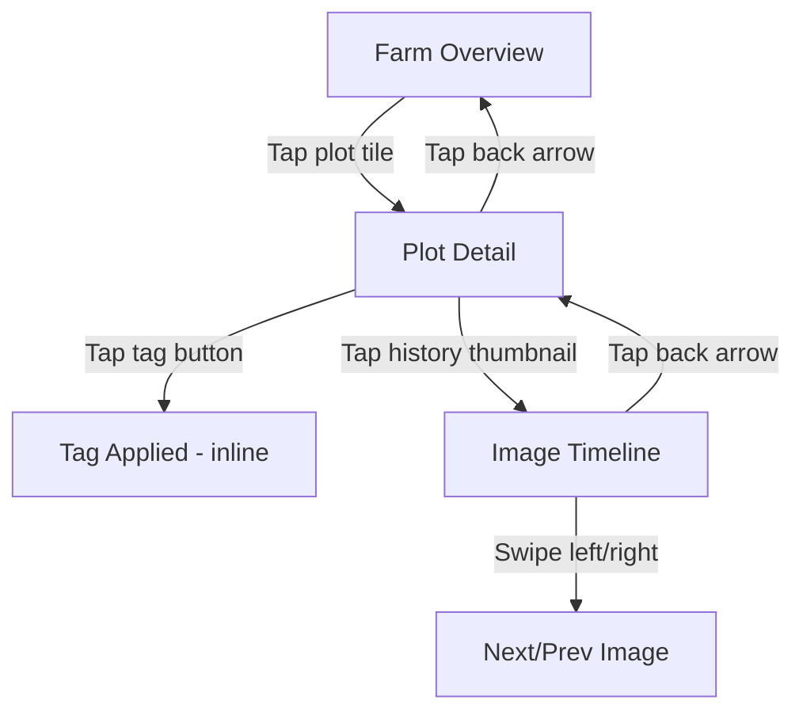

# UX-DESIGNS.md -- LitCrop PoC

> Generated by my-designer (Step 3) on 2026-03-17
> Scope Level: **PoC**

---

## 1. Design Principles

### P1: Glanceable Status -- "Is everything OK?" in under 3 seconds

Farmers check in for 1-3 minutes between tasks. Every screen must answer the most important question immediately through visual hierarchy: overall farm health first, individual plot status second, details on demand. No hunting, no scrolling to find the answer.

**Applied**: Farm Overview uses large status badges with color + icon on every tile. The highest-severity status appears at the top of the screen as a summary bar.

### P2: Forgiving Touch -- Design for dirty hands in bright sun

Outdoor use with wet or gloved hands demands oversized touch targets (minimum 48px, 12px gaps), high contrast (7:1 minimum), and status indicators that never rely on color alone. Every interactive element must be reachable in the thumb zone (bottom 60% of viewport).

**Applied**: Tag buttons are 56px tall, placed at the bottom of Plot Detail. Navigation uses large back arrows and tappable card regions, not small text links.

### P3: Progressive Depth -- Simple surface, rich on demand

The three-screen hub-and-spoke navigation (Farm Overview > Plot Detail > Image Timeline) provides progressive disclosure. The overview is maximally simple; detail screens reveal metadata, tagging, and history only when the user drills in.

**Applied**: Farm Overview shows only thumbnail + crop name + status. Plot Detail reveals full metadata, tagging controls, and image history. Image Timeline provides full-size viewing and chronological browsing.

### P4: Motion Means Attention -- Highlight what the camera saw move

Motion-triggered captures (wildlife, pest intrusion) are the key differentiator. These images must be visually distinct from scheduled captures at every level of the hierarchy, using a dedicated badge, contrasting color, and iconography.

**Applied**: Motion-triggered images carry an orange "MOTION" badge with a running-animal icon at every touchpoint -- overview tiles, detail hero, and history thumbnails.

---

## 2. Design Tokens

### 2.1 Color Palette

All colors tested against white (`#FFFFFF`) and dark backgrounds for 7:1+ contrast ratio (WCAG AAA for normal text, exceeding the AA requirement, to ensure outdoor readability).

```css
:root {
  /* -- Primary Palette -- */
  --color-primary:          #1B6B3A;  /* Deep green -- farm/growth association */
  --color-primary-dark:     #0E4D28;  /* Hover/active state */
  --color-primary-light:    #E8F5EC;  /* Subtle backgrounds */

  /* -- Neutral Palette -- */
  --color-gray-900:         #1A1A1A;  /* Primary text */
  --color-gray-700:         #4A4A4A;  /* Secondary text */
  --color-gray-500:         #767676;  /* Tertiary text (7:1 on white) */
  --color-gray-300:         #C4C4C4;  /* Borders */
  --color-gray-100:         #F2F2F2;  /* Backgrounds, skeleton */
  --color-white:            #FFFFFF;  /* Surface */

  /* -- Status Colors (semantic) -- */
  --color-status-healthy:     #1B7D3C;  /* Green -- 7.2:1 on white */
  --color-status-slow-growth: #B8860B;  /* Dark goldenrod -- 4.6:1 on white, paired with icon */
  --color-status-issue:       #C62828;  /* Deep red -- 7.1:1 on white */
  --color-status-animal:      #D84315;  /* Deep orange -- 5.2:1 on white, paired with icon */
  --color-status-no-data:     #616161;  /* Medium gray -- 7.0:1 on white */

  /* -- Status Background Tints -- */
  --color-status-healthy-bg:     #E8F5EC;
  --color-status-slow-growth-bg: #FFF8E1;
  --color-status-issue-bg:       #FFEBEE;
  --color-status-animal-bg:      #FFF3E0;
  --color-status-no-data-bg:     #F5F5F5;

  /* -- Motion Alert -- */
  --color-motion:           #E65100;  /* Vivid orange for motion badge */
  --color-motion-bg:        #FFF3E0;

  /* -- Semantic -- */
  --color-error:            #C62828;
  --color-success:          #1B7D3C;
  --color-info:             #1565C0;

  /* -- Surface -- */
  --color-surface:          #FFFFFF;
  --color-surface-elevated: #FFFFFF;
  --color-background:       #F5F5F5;
  --color-overlay:          rgba(0, 0, 0, 0.5);
}
```

### 2.2 Status Icon Mapping

Each status uses color AND a distinct icon AND text label -- triple redundancy for accessibility and outdoor readability.

| Status | Color Token | Icon | Label | Badge Shape |
|--------|-------------|------|-------|-------------|
| `healthy` | `--color-status-healthy` | Checkmark circle | "Healthy" | Rounded pill, green fill |
| `slow_growth` | `--color-status-slow-growth` | Upward arrow with clock | "Slow Growth" | Rounded pill, amber fill |
| `issue` | `--color-status-issue` | Warning triangle | "Issue" | Rounded pill, red fill |
| `animal_intrusion` | `--color-status-animal` | Animal silhouette (deer) | "Animal" | Rounded pill, orange fill |
| `no_data` | `--color-status-no-data` | Dash/empty circle | "No Data" | Rounded pill, gray fill |

### 2.3 Typography

System font stack for fastest loading and platform-native feel.

```css
:root {
  /* -- Font Family -- */
  --font-family:            -apple-system, BlinkMacSystemFont, "Segoe UI",
                            Roboto, "Hiragino Sans", "Noto Sans JP",
                            sans-serif;

  /* -- Type Scale (mobile 320-480px) -- */
  --font-size-xs:           12px;   /* Captions, timestamps */
  --font-size-sm:           14px;   /* Secondary text, metadata */
  --font-size-base:         16px;   /* Body text -- minimum for outdoor readability */
  --font-size-lg:           18px;   /* Subheadings */
  --font-size-xl:           22px;   /* Screen titles */
  --font-size-2xl:          28px;   /* Farm name (hero) */

  /* -- Font Weight -- */
  --font-weight-regular:    400;
  --font-weight-medium:     500;
  --font-weight-semibold:   600;
  --font-weight-bold:       700;

  /* -- Line Height -- */
  --line-height-tight:      1.2;    /* Headings */
  --line-height-normal:     1.5;    /* Body text */
  --line-height-relaxed:    1.75;   /* Long-form notes */
}
```

**Minimum sizes**: Body text never smaller than 16px. Captions (timestamps) at 12px use `--font-weight-medium` for legibility. All text scales to 200% per NFR-4.3 (tested by setting `font-size: 200%` on `<html>`).

### 2.4 Spacing System

8px base unit. Used consistently for all padding, margin, and gap values.

```css
:root {
  --space-0:    0px;
  --space-1:    4px;    /* Tight internal padding (icon-to-text) */
  --space-2:    8px;    /* Minimum gap between elements */
  --space-3:    12px;   /* Touch target gap (minimum) */
  --space-4:    16px;   /* Standard component padding */
  --space-5:    20px;   /* Section internal padding */
  --space-6:    24px;   /* Between components */
  --space-8:    32px;   /* Between sections */
  --space-10:   40px;   /* Major section breaks */
  --space-12:   48px;   /* Touch target minimum height */
  --space-16:   64px;   /* Large spacing */
}
```

### 2.5 Radius and Shadows

```css
:root {
  /* -- Border Radius -- */
  --radius-sm:    4px;    /* Small elements (badges) */
  --radius-md:    8px;    /* Buttons, inputs */
  --radius-lg:    12px;   /* Cards */
  --radius-xl:    16px;   /* Image containers */
  --radius-full:  9999px; /* Pills, circular elements */

  /* -- Shadows -- */
  --shadow-sm:    0 1px 2px rgba(0, 0, 0, 0.08);
  --shadow-md:    0 2px 8px rgba(0, 0, 0, 0.12);
  --shadow-lg:    0 4px 16px rgba(0, 0, 0, 0.16);

  /* -- Borders -- */
  --border-default: 1px solid var(--color-gray-300);
}
```

### 2.6 Touch and Interaction Tokens

```css
:root {
  /* -- Touch Targets -- */
  --touch-target-min:       48px;   /* Minimum tappable area */
  --touch-target-preferred:  56px;   /* Tag buttons, primary actions */
  --touch-gap-min:          12px;   /* Minimum gap between targets */

  /* -- Transitions -- */
  --transition-fast:        120ms ease-out;
  --transition-normal:      200ms ease-out;
  --transition-slow:        300ms ease-out;

  /* -- Focus Ring -- */
  --focus-ring:             0 0 0 3px rgba(27, 107, 58, 0.5);
}
```

---

## 3. Screen Designs

### 3.1 Farm Overview (Home Screen)

**Purpose**: Answer "Is everything OK across my farm?" in under 3 seconds.

**Visual Hierarchy**:
1. FIRST: Farm name and status summary bar (count of plots by status)
2. SECOND: Grid of plot tiles with status badges, sorted by severity (issues first)
3. THIRD: Pull-to-refresh hint at top

#### Wireframe

```
+------------------------------------------+
| LitCrop Demo Farm                    [R]  |  <- Farm name + refresh icon
+------------------------------------------+
| [!2] [*1] [v3]                           |  <- Status summary: 2 issues, 1 motion, 3 healthy
+------------------------------------------+
|                                          |
| +--------------------------------------+ |
| | [img]  Cherry Tomato       [Healthy] | |  <- Plot tile card
| |        Plot A1                       | |
| +--------------------------------------+ |
|                                          |
| +--------------------------------------+ |
| | [img]  Basil            [MOTION][!]  | |  <- Motion alert badge
| |        Plot A2                       | |
| +--------------------------------------+ |
|                                          |
| +--------------------------------------+ |
| | [img]  Cucumber        [Slow Growth] | |
| |        Plot B1                       | |
| +--------------------------------------+ |
|                                          |
| +--------------------------------------+ |
| | [no img] Lettuce          [No Data]  | |  <- Empty state tile
| |          Plot B2                     | |
| +--------------------------------------+ |
|                                          |
| +--------------------------------------+ |
| | [img]  Strawberry          [Issue]   | |
| |        Plot C1                       | |
| +--------------------------------------+ |
|                                          |
| +--------------------------------------+ |
| | [img]  Eggplant           [Healthy]  | |
| |        Plot C2                       | |
| +--------------------------------------+ |
|                                          |
+------------------------------------------+
```

#### Layout Specifications

- **Viewport**: Full width (320-480px), single column
- **Page padding**: `var(--space-4)` (16px) horizontal
- **Header**: Fixed top, 56px height, farm name left-aligned, refresh icon right
- **Status summary bar**: Horizontal row of pill badges, scrollable if overflow, 40px height
- **Plot tile grid**: Vertical stack, `var(--space-3)` (12px) gap between tiles
- **Each tile**: Full width minus page padding, `var(--radius-lg)` (12px) rounded corners

#### Component: Status Summary Bar

Compact row of pills showing count per status. Tapping a pill scrolls to the first plot of that status.

| Element | Spec |
|---------|------|
| Container | Horizontal flex, gap 8px, overflow-x auto, padding 8px 0 |
| Pill | Height 32px, padding 0 12px, radius full, font-size 14px semibold |
| Pill color | Uses status background tint with status text color |

#### Component: Plot Tile Card

| Element | Spec |
|---------|------|
| Container | `min-height: 80px`, `padding: var(--space-3)`, flex row, `border-radius: var(--radius-lg)`, `background: var(--color-surface)`, `box-shadow: var(--shadow-sm)`, `border: var(--border-default)` |
| Thumbnail | 64x64px, `border-radius: var(--radius-md)`, `object-fit: cover`, left side |
| Text area | Flex column, `margin-left: var(--space-3)`, grows to fill |
| Crop name | `font-size: var(--font-size-base)`, `font-weight: var(--font-weight-semibold)`, `color: var(--color-gray-900)` |
| Plot label | `font-size: var(--font-size-sm)`, `color: var(--color-gray-700)` |
| Status badge | Positioned right side, vertically centered, pill shape, see Status Badge component |
| Motion badge | Orange pill "MOTION" with running-animal icon, positioned above status badge if present |
| Tap target | Entire card is tappable (navigates to Plot Detail) |
| Tap feedback | Background tint to `var(--color-gray-100)` on `:active` |

#### States

| State | Behavior |
|-------|----------|
| **Default** | All tiles visible, data loaded |
| **Loading (skeleton)** | 6 skeleton tile cards: gray rectangle for image (64x64), two gray bars for text (60% and 40% width), gray pill for badge. Pulse animation at `1.5s infinite`. Respects `prefers-reduced-motion` (static gray, no pulse). |
| **Empty (no plots)** | Full-page centered message: illustration of a seedling, "No plots yet" heading, "Plots will appear here once your farm is set up." body text. |
| **Error (network)** | Full-page centered: warning triangle icon, "Could not load farm data" heading, "Check your connection and try again." body, "Retry" button (primary, 56px tall). |
| **Pull-to-refresh** | Overscroll top reveals spinner and "Pull to refresh" text. Releases at 80px threshold. |

---

### 3.2 Plot Detail

**Purpose**: View latest crop image, understand current status, tag observations, browse history.

**Visual Hierarchy**:
1. FIRST: Hero image (latest capture) at full width -- immediate visual check
2. SECOND: Status badge and trigger indicator overlaid on image
3. THIRD: Crop metadata (name, variety, dates)
4. FOURTH: Tag buttons in thumb zone
5. FIFTH: Image history grid (scroll down)

#### Wireframe

```
+------------------------------------------+
| [<-]  Plot A1: Cherry Tomato             |  <- Back button + title
+------------------------------------------+
|                                          |
| +--------------------------------------+ |
| |                                      | |
| |           LATEST IMAGE               | |  <- Full-width, 16:9 aspect
| |           (hero, full width)         | |
| |                                      | |
| |  [Scheduled]              [Healthy]  | |  <- Trigger + status overlaid
| +--------------------------------------+ |
|                                          |
| Captured: Mar 17, 2026 at 2:00 PM       |  <- Timestamp
|                                          |
+--  Crop Info  ---------------------------+
| Type:      Tomato                        |
| Variety:   Cherry Tomato                 |
| Planted:   Feb 15, 2026                  |
| Harvest:   ~Jun 2026                     |
| Notes:     Row closest to fence          |
+------------------------------------------+
|                                          |
| Tag this image:                          |
| +--------+ +------------+ +-------+     |
| |Healthy | |Slow Growth | | Issue |     |  <- Tag buttons (bottom zone)
| +--------+ +------------+ +-------+     |
| +------------------+                     |
| | Animal Intrusion |                     |
| +------------------+                     |
|                                          |
+--  Image History  -----------------------+
| +------+ +------+ +------+ +------+     |
| | img  | | img  | | img  | | img  |     |  <- Thumbnail grid
| | 3/17 | | 3/17 | | 3/16 | | 3/16 |     |
| |      | |MOTION| |      | |      |     |  <- Motion badge on triggered
| +------+ +------+ +------+ +------+     |
|                                          |
| +------+ +------+ +------+ +------+     |
| | img  | | img  | | img  | | img  |     |
| | 3/15 | | 3/15 | | 3/14 | | 3/14 |     |
| +------+ +------+ +------+ +------+     |
|                                          |
| [ Load More ]                            |  <- Pagination trigger
+------------------------------------------+
```

#### Layout Specifications

- **Header**: Fixed top, 56px, back arrow (48x48 tap target) + "Plot [label]: [crop]" title
- **Hero image**: Full width (edge to edge, no padding), 16:9 aspect ratio, `object-fit: cover`
- **Trigger indicator**: Pill badge overlaid bottom-left of hero image, 12px from edges
  - Scheduled: Gray pill with clock icon, text "Scheduled"
  - Motion: Orange pill with running-animal icon, text "Motion" -- visually prominent
- **Status badge**: Overlaid bottom-right of hero image, 12px from edges
- **Timestamp**: Below image, `padding: var(--space-4)`, `font-size: var(--font-size-sm)`, `color: var(--color-gray-700)`
- **Crop info section**: `padding: var(--space-4)`, definition list layout, `font-size: var(--font-size-base)`
- **Tag section heading**: `font-size: var(--font-size-lg)`, `font-weight: var(--font-weight-semibold)`, `padding: var(--space-4) var(--space-4) var(--space-2)`
- **Tag buttons area**: `padding: 0 var(--space-4) var(--space-6)`, flex wrap, gap 12px
- **Image history heading**: Section divider line, heading, `padding: var(--space-4)`
- **History grid**: 4 columns, gap 8px, `padding: 0 var(--space-4)`

#### Component: Tag Buttons

| Element | Spec |
|---------|------|
| Container | Flex wrap, `gap: var(--space-3)` (12px) |
| Button | `height: var(--touch-target-preferred)` (56px), `padding: 0 var(--space-5)` (20px), `border-radius: var(--radius-md)`, `font-size: var(--font-size-base)`, `font-weight: var(--font-weight-semibold)` |
| Icon | 20x20px, left of text, `margin-right: var(--space-2)` |
| Default state | `background: var(--color-surface)`, `border: 2px solid var(--color-gray-300)`, `color: var(--color-gray-900)` |
| Active/selected state | `background: [status-bg-tint]`, `border: 2px solid [status-color]`, `color: [status-color]` |
| Tap feedback | Scale to 0.97 for 120ms, then apply selected state |
| Confirmation | Brief checkmark animation (200ms), then badge updates on hero image. Toast: "[Tag] applied" (2 seconds, bottom of screen). |

Tag buttons for each tag type:

| Tag | Icon | Border Color (active) | Background (active) |
|-----|------|-----------------------|--------------------|
| Healthy | Checkmark circle | `--color-status-healthy` | `--color-status-healthy-bg` |
| Slow Growth | Arrow-clock | `--color-status-slow-growth` | `--color-status-slow-growth-bg` |
| Issue | Warning triangle | `--color-status-issue` | `--color-status-issue-bg` |
| Animal Intrusion | Animal silhouette | `--color-status-animal` | `--color-status-animal-bg` |

#### Component: Image History Thumbnail

| Element | Spec |
|---------|------|
| Container | Square aspect ratio (1:1), `border-radius: var(--radius-md)`, overflow hidden, position relative |
| Image | `object-fit: cover`, fill container |
| Date label | Absolute bottom, full width, `background: linear-gradient(transparent, rgba(0,0,0,0.6))`, `color: white`, `font-size: var(--font-size-xs)`, `padding: var(--space-1) var(--space-2)` |
| Motion badge | Absolute top-right, 4px from edges, small orange pill: "M" with running-animal icon, `font-size: 10px`, `height: 20px` |
| Tag indicator | Colored 4px bottom border matching the tag status color (if tagged) |
| Tap target | Entire thumbnail is tappable (navigates to Image Timeline) |

#### States

| State | Behavior |
|-------|----------|
| **Default** | Hero image loaded, metadata visible, tag buttons in default state |
| **Loading (skeleton)** | Gray rectangle at 16:9 for hero, three gray text bars for metadata, four gray rounded rectangles for tag buttons, 8 gray squares for history grid |
| **No images** | Hero area shows dashed border placeholder with camera icon, "No images yet -- waiting for camera to upload first image." body text |
| **Tag applied** | Selected tag button transitions to active state. Toast appears bottom-center: checkmark + "[Tag] applied to image". Hero status badge updates. If this is the latest image, Farm Overview tile badge also updates on return. |
| **Tag error** | Toast appears bottom-center: warning icon + "Could not save tag. Tap to retry." Tap toast retries the request. |
| **Image loading** | Hero image area shows skeleton with progress indicator. History thumbnails load progressively (top-left to bottom-right). |

---

### 3.3 Image Timeline / Viewer

**Purpose**: View a full-size image with metadata, browse chronologically through the plot's image history.

**Visual Hierarchy**:
1. FIRST: Full-size image (maximum viewport usage)
2. SECOND: Image metadata (date, trigger type, tags)
3. THIRD: Navigation controls (prev/next)

#### Wireframe

```
+------------------------------------------+
| [<-]  Plot A1 Images           [3 of 47] |  <- Back + position indicator
+------------------------------------------+
|                                          |
|                                          |
|                                          |
|         FULL-SIZE IMAGE                  |  <- Full viewport width,
|         (pinch to zoom)                  |     flexible height
|                                          |
|                                          |
|                                          |
+------------------------------------------+
| Mar 17, 2026 at 2:00 PM                 |  <- Timestamp
| [Scheduled]  [Healthy]                   |  <- Trigger + tag badges
+------------------------------------------+
|                                          |
|   [  <  Prev  ]      [  Next  >  ]      |  <- Navigation buttons
|                                          |
+------------------------------------------+
```

#### Layout Specifications

- **Header**: Fixed top, 56px, back arrow + "Plot [label] Images" + position counter ("3 of 47")
- **Image area**: Full width, flexible height (maintains original aspect ratio, max `calc(100vh - 200px)`), `background: var(--color-gray-900)` (dark surround for image viewing)
- **Image**: `object-fit: contain` within the dark area, centered
- **Metadata bar**: Below image, `padding: var(--space-4)`, white background
  - Timestamp: `font-size: var(--font-size-base)`, `color: var(--color-gray-900)`
  - Badges: Trigger pill + tag pill(s), `margin-top: var(--space-2)`, flex row, gap 8px
- **Navigation**: Fixed bottom, `height: 72px`, `padding: var(--space-4)`, flex row justify between
  - Prev/Next buttons: `height: var(--touch-target-preferred)` (56px), `min-width: 120px`, `border-radius: var(--radius-md)`, secondary button style
  - Disabled state (at first/last image): `opacity: 0.4`, non-interactive

#### Interaction: Chronological Navigation

| Gesture | Action |
|---------|--------|
| Tap "Next" button | Load next (older) image with slide-left transition |
| Tap "Prev" button | Load previous (newer) image with slide-right transition |
| Swipe left on image | Same as "Next" (older) |
| Swipe right on image | Same as "Prev" (newer) |
| Pinch on image | Zoom in/out (Could level -- if implemented, use CSS `transform: scale()` with touch event handling) |

Transitions: Images slide horizontally (200ms ease-out). Under `prefers-reduced-motion`, transitions are instant (no animation).

#### States

| State | Behavior |
|-------|----------|
| **Default** | Image displayed, metadata visible, nav buttons active |
| **Loading** | Dark background with centered spinner (32px), metadata area shows skeleton bars |
| **First image** | "Prev" button disabled (grayed, `aria-disabled="true"`) |
| **Last image** | "Next" button disabled |
| **Single image** | Both nav buttons disabled, position shows "1 of 1" |
| **Image load error** | Dark background with broken-image icon, "Image could not be loaded" text, "Retry" link |
| **Swipe hint** | On first visit, subtle left-arrow animation on image (once, 1 second) to hint swipe navigation |

---

## 4. Interaction Specifications

### 4.1 Navigation Model

Hub-and-spoke with maximum depth of 3.



**Back navigation**: Hardware back button and on-screen back arrow both return to the previous screen. State is preserved (scroll position on Farm Overview, scroll position on Plot Detail).

### 4.2 Tag Application Flow

```
1. User views Plot Detail with latest image
2. User taps one of 4 tag buttons
3. Button shows active state immediately (optimistic UI)
4. POST /api/v1/images/{imageId}/tags fires
5a. Success: Toast "Healthy applied" (2s), status badge on hero updates
5b. Failure: Button reverts to default, error toast "Could not save tag. Tap to retry."
6. On return to Farm Overview, tile badge reflects updated status
```

- Tagging is additive (audit trail). Tapping a different tag adds a new tag; the latest tag determines the displayed status.
- No confirmation dialog -- one-tap application with undo via applying a different tag.

### 4.3 Pull-to-Refresh (Farm Overview)

| Phase | Visual |
|-------|--------|
| Overscroll begins | Spinner icon appears at top, faded |
| Pull past 80px threshold | Spinner becomes full opacity, "Release to refresh" text |
| Release | Spinner animates, "Refreshing..." text |
| Data loaded | Spinner hides, tiles update with fade transition (200ms) |
| Error | Spinner hides, error toast "Could not refresh. Try again." (3s) |

### 4.4 Image Lazy Loading

- Farm Overview: Tile thumbnails load with `loading="lazy"` (native browser lazy loading)
- Plot Detail: Hero image loads eagerly; history grid thumbnails use `loading="lazy"`
- All images use `` with explicit `width` and `height` attributes to prevent layout shift
- Placeholder: `background: var(--color-gray-100)` matching skeleton color

### 4.5 Error States

| Error | Screen | Display |
|-------|--------|---------|
| Network offline | All screens | Top banner (56px, yellow background): "You are offline. Showing cached data." with offline icon. Banner is sticky, dismissible. |
| API 500 error | Farm Overview | Full-page error state (see Farm Overview states) |
| API 500 error | Plot Detail | Inline error below header: "Could not load plot data." with retry button |
| Image upload failure | N/A (server-side) | Camera simulator handles retry with exponential backoff |
| Tag save failure | Plot Detail | Error toast with retry action (see Tag Application Flow) |
| Image not found (404) | Image Timeline | Broken-image placeholder with message |

---

## 5. Component Specifications

### 5.1 Plot Tile Card

**Anatomy**:
```
+--[ Card Container ]----------------------------+
| +--------+  Crop Name (semibold, 16px)  [Badge]|
| |  Thumb |  Plot Label (regular, 14px)         |
| | 64x64  |                             [Motion]|
| +--------+                                     |
+-------------------------------------------------+
```

| Property | Value |
|----------|-------|
| Width | 100% (full column width) |
| Min height | 80px |
| Padding | 12px |
| Background | `var(--color-surface)` |
| Border | `var(--border-default)` |
| Border radius | `var(--radius-lg)` (12px) |
| Shadow | `var(--shadow-sm)` |
| Thumbnail size | 64x64px |
| Thumbnail radius | `var(--radius-md)` (8px) |
| Gap (thumb to text) | 12px |
| Tap target | Entire card (link wrapping) |
| Active state | `background: var(--color-gray-100)` |
| Focus state | `box-shadow: var(--focus-ring)` |
| Role | `role="link"` or `<a>` wrapping |
| Aria label | "[Crop name], Plot [label], Status: [status]" |

### 5.2 Status Badge

**Anatomy**: `[Icon] [Label]` in a pill shape.

| Property | Value |
|----------|-------|
| Height | 28px |
| Padding | 0 10px |
| Border radius | `var(--radius-full)` (pill) |
| Font size | `var(--font-size-xs)` (12px) |
| Font weight | `var(--font-weight-semibold)` |
| Icon size | 14x14px |
| Icon-to-text gap | 4px |
| Background | Status-specific bg tint token |
| Text color | Status-specific color token |
| Border | None (background provides contrast) |

**Variants**:

| Status | Background | Text/Icon Color | Icon |
|--------|------------|-----------------|------|
| healthy | `#E8F5EC` | `#1B7D3C` | Checkmark circle |
| slow_growth | `#FFF8E1` | `#B8860B` | Arrow with clock |
| issue | `#FFEBEE` | `#C62828` | Warning triangle |
| animal_intrusion | `#FFF3E0` | `#D84315` | Animal silhouette |
| no_data | `#F5F5F5` | `#616161` | Dash circle |

### 5.3 Motion Alert Badge

Distinct from status badges. Used to indicate motion-triggered capture.

| Property | Value |
|----------|-------|
| Height | 24px (small variant on thumbnails: 20px) |
| Padding | 0 8px |
| Border radius | `var(--radius-full)` |
| Background | `var(--color-motion)` (#E65100) |
| Text color | `#FFFFFF` |
| Font size | 11px (small variant: 10px) |
| Font weight | `var(--font-weight-bold)` |
| Icon | Running animal, 12px (small: 10px) |
| Text | "MOTION" (small: "M") |
| Position | Absolute, top-right with 4px offset from container edges |

### 5.4 Tag Button

| Property | Value |
|----------|-------|
| Height | 56px (`var(--touch-target-preferred)`) |
| Min width | Fit content |
| Padding | 0 20px |
| Border radius | `var(--radius-md)` (8px) |
| Font size | `var(--font-size-base)` (16px) |
| Font weight | `var(--font-weight-semibold)` |
| Icon size | 20x20px |
| Icon position | Left of text, 8px gap |
| Cursor | pointer |

**States**:

| State | Background | Border | Text Color |
|-------|------------|--------|------------|
| Default | `var(--color-surface)` | `2px solid var(--color-gray-300)` | `var(--color-gray-900)` |
| Hover | `var(--color-gray-100)` | `2px solid var(--color-gray-300)` | `var(--color-gray-900)` |
| Active (pressed) | `var(--color-gray-100)` | `2px solid var(--color-gray-700)` | `var(--color-gray-900)`, `transform: scale(0.97)` |
| Selected | Status-specific bg tint | `2px solid [status-color]` | Status-specific color |
| Focus | Default + `box-shadow: var(--focus-ring)` | -- | -- |

### 5.5 Image Thumbnail with Date Label

| Property | Value |
|----------|-------|
| Aspect ratio | 1:1 (square) |
| Border radius | `var(--radius-md)` (8px) |
| Overflow | Hidden |
| Image fit | `object-fit: cover` |
| Date label | Absolute positioned at bottom, gradient overlay (`transparent` to `rgba(0,0,0,0.6)`), white text, 12px font, 4px + 8px padding |
| Motion badge | Absolute top-right, 4px offset, small variant (20px height) |
| Tag border | 4px bottom border in tag status color (if image has a tag) |
| Tap target | Entire thumbnail |
| Aria label | "Image captured [date] at [time], [trigger type], tagged [status]" |

### 5.6 Skeleton Loading Components

All skeleton elements use:
- Background: `var(--color-gray-100)` (#F2F2F2)
- Animation: Pulse (opacity 1 to 0.5, 1.5s infinite ease-in-out)
- `prefers-reduced-motion`: No animation, static gray
- Border radius: Match the component they replace

| Skeleton | Dimensions |
|----------|------------|
| Tile card | Full width, 80px height, 12px radius |
| Hero image | Full width, 16:9 aspect, 0 radius (edge to edge) |
| Text line (short) | 40% width, 16px height, 4px radius |
| Text line (long) | 70% width, 16px height, 4px radius |
| Tag button | 100px width, 56px height, 8px radius |
| History thumbnail | Square (calculated from grid), 8px radius |
| Status badge | 80px width, 28px height, full radius |

### 5.7 Navigation Header

| Property | Value |
|----------|-------|
| Height | 56px |
| Background | `var(--color-surface)` |
| Border bottom | `var(--border-default)` |
| Padding | 0 `var(--space-4)` |
| Position | Sticky top |
| Z-index | 100 |
| Back button area | 48x48px tap target, left-aligned, contains left-arrow icon (24px) |
| Title | `font-size: var(--font-size-lg)` (18px), `font-weight: var(--font-weight-semibold)`, truncate with ellipsis |
| Right action area | 48x48px, right-aligned (for refresh icon on Farm Overview, position counter on Image Timeline) |
| Focus | Back button receives focus ring on keyboard navigation |
| Aria | `role="navigation"`, back button has `aria-label="Back to [previous screen]"` |

### 5.8 Toast Notification

| Property | Value |
|----------|-------|
| Position | Fixed bottom center, 16px from bottom edge |
| Width | `calc(100% - 32px)` (16px margin each side) |
| Max width | 400px |
| Height | Auto, min 48px |
| Padding | 12px 16px |
| Background | `var(--color-gray-900)` |
| Text color | `var(--color-white)` |
| Font size | `var(--font-size-sm)` (14px) |
| Border radius | `var(--radius-md)` (8px) |
| Shadow | `var(--shadow-lg)` |
| Icon | 20px, left of text, 8px gap |
| Duration | 2 seconds for success, 4 seconds for error |
| Dismiss | Auto-dismiss or tap to dismiss |
| Animation | Slide up 16px + fade in (200ms). `prefers-reduced-motion`: instant appear/disappear |
| Aria | `role="status"`, `aria-live="polite"` |

---

## 6. API Design Details

### 6.1 Common Conventions

**Base URL**: `https://{api-gateway-id}.execute-api.ap-northeast-1.amazonaws.com/api/v1`

**Content Types**:
- Request: `application/json` (except image upload: `multipart/form-data`)
- Response: `application/json`

**Date format**: ISO 8601 (`2026-03-17T14:00:00Z`)

**ID format**: UUID v4 (`550e8400-e29b-41d4-a716-446655440000`)

### 6.2 Error Response Format

All errors use a consistent envelope:

```json
{
  "error": {
    "code": "VALIDATION_ERROR",
    "message": "Human-readable description of what went wrong.",
    "details": {
      "field": "trigger",
      "reason": "Must be 'scheduled' or 'motion'"
    }
  }
}
```

**Error codes** (string enum):

| HTTP Status | Code | When |
|-------------|------|------|
| 400 | `VALIDATION_ERROR` | Missing or invalid request fields |
| 400 | `INVALID_CONTENT_TYPE` | Upload is not JPEG |
| 404 | `NOT_FOUND` | Resource does not exist |
| 413 | `PAYLOAD_TOO_LARGE` | Image exceeds 2MB |
| 500 | `INTERNAL_ERROR` | Unexpected server error |
| 503 | `SERVICE_UNAVAILABLE` | S3 or DynamoDB unreachable |

### 6.3 Pagination Contract

Cursor-based pagination is used for image list endpoints.

**Request query parameters**:

| Parameter | Type | Default | Description |
|-----------|------|---------|-------------|
| `limit` | integer | 20 | Items per page (max 100) |
| `cursor` | string | (none) | Opaque cursor from previous response |

**Response pagination envelope**:

```json
{
  "data": [ ... ],
  "pagination": {
    "count": 20,
    "next_cursor": "eyJQSyI6IlBMT1QjYTEiLCJTSyI6IklNRyMyMDI2MDMxN...",
    "has_more": true
  }
}
```

- `next_cursor`: Base64-encoded DynamoDB `LastEvaluatedKey`. `null` if no more items.
- `has_more`: Boolean convenience field.
- Clients should treat `cursor` as opaque -- do not parse or construct it.

### 6.4 Endpoint Details

#### GET /api/v1/farms/{farmId}

**Purpose**: Retrieve farm metadata and layout structure (fields and beds).

**Path Parameters**:
| Parameter | Type | Description |
|-----------|------|-------------|
| `farmId` | UUID | Farm identifier |

**Response** (200 OK):
```json
{
  "data": {
    "id": "farm-001",
    "name": "LitCrop Demo Farm",
    "description": "Demo farm in Nagano Prefecture",
    "created_at": "2026-01-15T00:00:00Z",
    "fields": [
      {
        "id": "field-001",
        "name": "North Field",
        "position": 1,
        "beds": [
          {
            "id": "bed-001",
            "name": "Bed A",
            "position": 1
          },
          {
            "id": "bed-002",
            "name": "Bed B",
            "position": 2
          }
        ]
      },
      {
        "id": "field-002",
        "name": "South Field",
        "position": 2,
        "beds": [
          {
            "id": "bed-003",
            "name": "Bed C",
            "position": 1
          }
        ]
      }
    ]
  }
}
```

**Errors**: `404 NOT_FOUND` if farmId does not exist.

---

#### GET /api/v1/farms/{farmId}/plots

**Purpose**: All plots for a farm with latest status and latest image URL. Powers the Farm Overview screen.

**Path Parameters**:
| Parameter | Type | Description |
|-----------|------|-------------|
| `farmId` | UUID | Farm identifier |

**Response** (200 OK):
```json
{
  "data": [
    {
      "id": "plot-a1",
      "label": "A1",
      "bed_id": "bed-001",
      "field_id": "field-001",
      "crop_type": "Tomato",
      "crop_variety": "Cherry Tomato",
      "latest_status": "healthy",
      "latest_image": {
        "id": "img-001",
        "captured_at": "2026-03-17T14:00:00Z",
        "trigger": "scheduled",
        "thumbnail_url": "https://s3.ap-northeast-1.amazonaws.com/...?X-Amz-Signature=..."
      }
    },
    {
      "id": "plot-a2",
      "label": "A2",
      "bed_id": "bed-001",
      "field_id": "field-001",
      "crop_type": "Basil",
      "crop_variety": "Sweet Basil",
      "latest_status": "animal_intrusion",
      "latest_image": {
        "id": "img-042",
        "captured_at": "2026-03-17T15:23:00Z",
        "trigger": "motion",
        "thumbnail_url": "https://s3.ap-northeast-1.amazonaws.com/...?X-Amz-Signature=..."
      }
    },
    {
      "id": "plot-b2",
      "label": "B2",
      "bed_id": "bed-002",
      "field_id": "field-001",
      "crop_type": "Lettuce",
      "crop_variety": "Romaine",
      "latest_status": "no_data",
      "latest_image": null
    }
  ]
}
```

**Notes**:
- `latest_image` is `null` when no images exist for the plot.
- `thumbnail_url` is a signed S3 URL pointing to the original image (displayed at reduced CSS size in PoC; server-side thumbnails deferred to MVP).
- Signed URLs expire in 15 minutes. The frontend should handle expired URLs gracefully (re-fetch the plot data).
- Results are sorted by field position, then bed position, then plot label.

**Errors**: `404 NOT_FOUND` if farmId does not exist.

---

#### GET /api/v1/plots/{plotId}

**Purpose**: Single plot with full crop metadata. Powers Plot Detail screen header and crop info section.

**Path Parameters**:
| Parameter | Type | Description |
|-----------|------|-------------|
| `plotId` | UUID | Plot identifier |

**Response** (200 OK):
```json
{
  "data": {
    "id": "plot-a1",
    "label": "A1",
    "bed_id": "bed-001",
    "field_id": "field-001",
    "farm_id": "farm-001",
    "crop_type": "Tomato",
    "crop_variety": "Cherry Tomato",
    "planted_at": "2026-02-15",
    "expected_harvest": "2026-06-15",
    "notes": "Row closest to fence. Gets afternoon shade.",
    "latest_status": "healthy",
    "latest_image": {
      "id": "img-001",
      "captured_at": "2026-03-17T14:00:00Z",
      "trigger": "scheduled",
      "url": "https://s3.ap-northeast-1.amazonaws.com/...?X-Amz-Signature=...",
      "tags": [
        {
          "id": "tag-001",
          "tag": "healthy",
          "note": null,
          "created_at": "2026-03-17T14:05:00Z"
        }
      ]
    }
  }
}
```

**Notes**:
- `latest_image.url` is a full-resolution signed URL (15-min expiry) for the hero image.
- `latest_image.tags` includes all tags on the latest image (audit trail, newest first).
- `planted_at` and `expected_harvest` are date-only strings (no time component).

**Errors**: `404 NOT_FOUND` if plotId does not exist.

---

#### GET /api/v1/plots/{plotId}/images

**Purpose**: Paginated list of images for a plot. Powers Image History grid on Plot Detail.

**Path Parameters**:
| Parameter | Type | Description |
|-----------|------|-------------|
| `plotId` | UUID | Plot identifier |

**Query Parameters**:
| Parameter | Type | Default | Description |
|-----------|------|---------|-------------|
| `limit` | integer | 20 | Max images per page (1-100) |
| `cursor` | string | (none) | Pagination cursor |

**Response** (200 OK):
```json
{
  "data": [
    {
      "id": "img-001",
      "captured_at": "2026-03-17T14:00:00Z",
      "trigger": "scheduled",
      "thumbnail_url": "https://s3.ap-northeast-1.amazonaws.com/...?X-Amz-Signature=...",
      "latest_tag": "healthy"
    },
    {
      "id": "img-042",
      "captured_at": "2026-03-17T13:23:00Z",
      "trigger": "motion",
      "thumbnail_url": "https://s3.ap-northeast-1.amazonaws.com/...?X-Amz-Signature=...",
      "latest_tag": "animal_intrusion"
    }
  ],
  "pagination": {
    "count": 2,
    "next_cursor": "eyJQSyI6...",
    "has_more": true
  }
}
```

**Notes**:
- Sorted by `captured_at` descending (newest first).
- `latest_tag` is the most recent tag applied to this image, or `null` if untagged.
- `thumbnail_url` points to the original image (same file, displayed small via CSS).

**Errors**: `404 NOT_FOUND` if plotId does not exist.

---

#### POST /api/v1/plots/{plotId}/images

**Purpose**: Upload an image from a camera node.

**Path Parameters**:
| Parameter | Type | Description |
|-----------|------|-------------|
| `plotId` | UUID | Target plot |

**Request**: `Content-Type: multipart/form-data`

| Field | Type | Required | Validation |
|-------|------|----------|------------|
| `image` | file | Yes | JPEG only (`image/jpeg`), max 2MB (2,097,152 bytes) |
| `captured_at` | string | Yes | Valid ISO 8601 datetime |
| `node_id` | string | Yes | Non-empty, max 64 characters |
| `trigger` | string | Yes | Enum: `"scheduled"` or `"motion"` |
| `metadata` | string (JSON) | No | Valid JSON if provided. Expected shape: `{ "resolution": "1280x720", "battery_pct": 85 }` |

**Response** (201 Created):
```json
{
  "data": {
    "id": "img-001",
    "url": "https://s3.ap-northeast-1.amazonaws.com/...?X-Amz-Signature=...",
    "captured_at": "2026-03-17T14:00:00Z",
    "uploaded_at": "2026-03-17T14:00:02Z",
    "trigger": "scheduled",
    "storage_key": "images/farm-001/plot-a1/2026/03/17/img-001.jpg",
    "size_bytes": 1048576
  }
}
```

**Errors**:

| Status | Code | Condition |
|--------|------|-----------|
| 400 | `VALIDATION_ERROR` | Missing required field, invalid `captured_at` format, invalid `trigger` value, invalid `metadata` JSON |
| 400 | `INVALID_CONTENT_TYPE` | File is not `image/jpeg` |
| 404 | `NOT_FOUND` | `plotId` does not exist |
| 413 | `PAYLOAD_TOO_LARGE` | Image file exceeds 2MB |
| 503 | `SERVICE_UNAVAILABLE` | S3 put failed |

---

#### GET /api/v1/images/{imageId}

**Purpose**: Single image metadata with a fresh signed URL. Used when navigating to Image Timeline.

**Path Parameters**:
| Parameter | Type | Description |
|-----------|------|-------------|
| `imageId` | UUID | Image identifier |

**Response** (200 OK):
```json
{
  "data": {
    "id": "img-001",
    "plot_id": "plot-a1",
    "node_id": "node-alpha",
    "captured_at": "2026-03-17T14:00:00Z",
    "uploaded_at": "2026-03-17T14:00:02Z",
    "trigger": "scheduled",
    "url": "https://s3.ap-northeast-1.amazonaws.com/...?X-Amz-Signature=...",
    "content_type": "image/jpeg",
    "size_bytes": 1048576,
    "metadata": {
      "resolution": "1280x720",
      "battery_pct": 85
    },
    "tags": [
      {
        "id": "tag-001",
        "tag": "healthy",
        "note": null,
        "created_at": "2026-03-17T14:05:00Z"
      }
    ]
  }
}
```

**Notes**:
- `url` is a freshly generated signed URL (15-min expiry).
- `tags` array is sorted by `created_at` descending (newest first). The first tag is the "effective" status.

**Errors**: `404 NOT_FOUND` if imageId does not exist.

---

#### POST /api/v1/images/{imageId}/tags

**Purpose**: Add a manual tag (observation) to an image. Updates the plot's `latest_status` if this is the plot's latest image.

**Path Parameters**:
| Parameter | Type | Description |
|-----------|------|-------------|
| `imageId` | UUID | Image to tag |

**Request Body**: `Content-Type: application/json`
```json
{
  "tag": "healthy",
  "note": "Looking good after rain"
}
```

| Field | Type | Required | Validation |
|-------|------|----------|------------|
| `tag` | string | Yes | Enum: `"healthy"`, `"slow_growth"`, `"issue"`, `"animal_intrusion"` |
| `note` | string | No | Max 500 characters |

**Response** (201 Created):
```json
{
  "data": {
    "id": "tag-002",
    "image_id": "img-001",
    "tag": "healthy",
    "note": "Looking good after rain",
    "created_at": "2026-03-17T14:10:00Z",
    "plot_status_updated": true
  }
}
```

**Notes**:
- `plot_status_updated`: `true` if this tag caused the parent plot's `latest_status` to change (i.e., this image is the plot's latest image). `false` if the tagged image is not the latest.
- Multiple tags on the same image create an audit trail. The most recently created tag is the "effective" tag.

**Errors**:

| Status | Code | Condition |
|--------|------|-----------|
| 400 | `VALIDATION_ERROR` | Invalid `tag` value, `note` exceeds 500 chars |
| 404 | `NOT_FOUND` | `imageId` does not exist |

---

## 7. Accessibility Audit Checklist

### 7.1 Global Requirements

- [x] Semantic HTML5 elements: `<header>`, `<nav>`, `<main>`, `<section>`, `<article>`, `<footer>`
- [x] ARIA landmarks: `role="banner"` (header), `role="navigation"`, `role="main"`, `role="status"` (toast)
- [x] Language attribute: `<html lang="en">` (or `lang="ja"` for Japanese locale)
- [x] Viewport meta: `<meta name="viewport" content="width=device-width, initial-scale=1">` (no `maximum-scale` or `user-scalable=no`)
- [x] Text scales to 200% without loss of content or functionality (NFR-4.3)
- [x] `prefers-reduced-motion` media query disables all animations and transitions (NFR-4.4)
- [x] All color-conveyed information has a non-color alternative (icon + text label)
- [x] Focus indicators visible: 3px outline using `var(--focus-ring)`, minimum 3:1 contrast ratio
- [x] Skip-to-content link (visually hidden, visible on focus) on every page

### 7.2 Farm Overview Screen

| Element | ARIA / Semantic | Keyboard |
|---------|----------------|----------|
| Page | `<main aria-label="Farm Overview">` | -- |
| Status summary pills | `role="status"`, `aria-label="2 plots with issues, 1 motion alert, 3 healthy"` | Not focusable (informational) |
| Plot tile list | `<ul role="list">` with `<li>` per tile | Tab focuses each tile sequentially |
| Plot tile | `<a>` wrapping the card, `aria-label="Cherry Tomato, Plot A1, Status: Healthy"` | Enter/Space activates navigation |
| Motion badge | `aria-label="Motion-triggered capture detected"` | Included in parent tile's label |
| Skeleton loading | `aria-busy="true"` on the list container, `aria-label="Loading farm data"` | -- |
| Error state | `role="alert"`, auto-announced by screen reader | Retry button focusable |
| Pull-to-refresh | `aria-live="polite"` region for status text changes | Not keyboard-accessible (touch only, keyboard users use refresh icon) |
| Refresh icon button | `<button aria-label="Refresh farm data">` | Tab-focusable, Enter/Space activates |

### 7.3 Plot Detail Screen

| Element | ARIA / Semantic | Keyboard |
|---------|----------------|----------|
| Page | `<main aria-label="Plot Detail for A1: Cherry Tomato">` | -- |
| Back button | `<button aria-label="Back to Farm Overview">` or `<a>` | Tab-focusable, Enter activates |
| Hero image | `` (NFR-4.2) | -- |
| Trigger badge | `aria-label="Capture trigger: Scheduled"` | Not independently focusable |
| Status badge | `aria-label="Current status: Healthy"` | Not independently focusable |
| Crop info section | `<section aria-label="Crop information">`, `<dl>` for key-value pairs | Tab through section |
| Tag buttons | `<button aria-label="Tag as Healthy" aria-pressed="false">` | Tab between buttons, Enter/Space activates |
| Tag confirmation | Toast has `role="status"`, `aria-live="polite"` | Auto-announced |
| Image history grid | `<section aria-label="Image history">`, `<ul role="list">` | Tab through thumbnails |
| History thumbnail | `<a aria-label="Image captured March 16, 2026 at 10:00 AM, Scheduled, Tagged: Healthy">` | Enter/Space navigates to viewer |
| Load More button | `<button aria-label="Load more images">` | Tab-focusable |

### 7.4 Image Timeline Screen

| Element | ARIA / Semantic | Keyboard |
|---------|----------------|----------|
| Page | `<main aria-label="Image viewer for Plot A1">` | -- |
| Back button | `<button aria-label="Back to Plot A1 detail">` | Tab-focusable |
| Position counter | `aria-live="polite"`, updates on navigation: "Image 3 of 47" | Auto-announced on change |
| Image | `` | -- |
| Previous button | `<button aria-label="Previous image (newer)">`, `aria-disabled="true"` when at first | Tab-focusable, Enter activates |
| Next button | `<button aria-label="Next image (older)">`, `aria-disabled="true"` when at last | Tab-focusable, Enter activates |
| Trigger badge | `aria-label="Capture trigger: Motion"` | -- |
| Tag badges | `aria-label="Tagged: Animal Intrusion"` | -- |
| Swipe gesture | Not keyboard-accessible; Prev/Next buttons provide equivalent functionality | -- |

### 7.5 Screen Reader Announcement Strategy

| Event | Announcement Method | Text |
|-------|---------------------|------|
| Page load complete | `aria-busy` toggles from true to false | Screen reader announces page title |
| Tag applied | `aria-live="polite"` toast region | "Healthy tag applied to image" |
| Tag error | `aria-live="assertive"` toast region | "Error: Could not save tag. Tap to retry." |
| Image navigation | `aria-live="polite"` on position counter | "Image 4 of 47" |
| Data refresh | `aria-live="polite"` on status region | "Farm data refreshed" |
| Network error | `role="alert"` banner | "You are offline. Showing cached data." |
| Skeleton loading | `aria-busy="true"` on container | "Loading" (announced once) |

---

## 8. Implementation Notes for my-builder

### 8.1 Astro + Preact Island Boundaries

| Component | Rendering | Island? | Rationale |
|-----------|-----------|---------|-----------|
| Farm Overview page shell | Astro SSG (static HTML) | No | Static layout, zero JS |
| Plot tile list | Preact island (`client:load`) | Yes | Fetches API data on mount, updates on refresh |
| Status summary bar | Part of Plot tile list island | -- | Updates with same data |
| Plot Detail page shell | Astro SSG | No | Static layout |
| Hero image + metadata | Preact island (`client:load`) | Yes | Fetches plot + latest image data |
| Tag buttons | Preact island (`client:load`) | Yes | Handles tap events, POST to API |
| Image history grid | Preact island (`client:visible`) | Yes | Lazy-loaded, pagination |
| Image Timeline viewer | Preact island (`client:load`) | Yes | Navigation state, swipe handling |
| Toast notifications | Preact island (`client:load`) | Yes | Global, rendered in layout |

### 8.2 CSS Organization

```
src/frontend/src/styles/
  tokens.css          -- All CSS custom properties from Section 2
  reset.css           -- Minimal reset (box-sizing, margin)
  base.css            -- Typography, body defaults
  components/
    card.css          -- Plot tile card
    badge.css         -- Status badge, motion badge
    button.css        -- Tag buttons, nav buttons
    skeleton.css      -- Skeleton loading animations
    toast.css         -- Toast notification
    header.css        -- Navigation header
    thumbnail.css     -- Image thumbnail with date
  pages/
    farm-overview.css
    plot-detail.css
    image-timeline.css
```

### 8.3 Key Implementation Details

1. **Signed URL expiry**: URLs last 15 minutes. The frontend should not cache them beyond that. If an image fails to load (403 from S3), re-fetch the parent resource to get fresh URLs.

2. **Optimistic tagging**: Apply the tag UI state immediately on tap. If the API call fails, revert the UI state and show error toast. This ensures the 1-3 minute check-in feels responsive even on slow connections.

3. **Image aspect ratios**: Always specify `width` and `height` attributes on `` tags to prevent Cumulative Layout Shift (CLS). Hero: `width="480" height="270"` (16:9). Thumbnails: `width="1" height="1"` (1:1, CSS sized).

4. **Touch vs mouse**: Use `@media (pointer: coarse)` to increase touch targets on touch devices. The 48px minimum applies universally, but 56px is preferred on touch.

5. **Japanese locale**: The system should support `ja` locale for date formatting (e.g., `2026年3月17日 14:00`). Use `Intl.DateTimeFormat` with the user's locale. Design tokens and layout accommodate longer Japanese text strings.

---

---

## 9. Additional Screens (from Step 4 Mockup Feedback)

> The following screens were added during the Step 4 mockup phase based on user feedback.
> They expand the PoC from 3 screens to 7, plus desktop layouts.

### 9.1 Farm Layout View (Spatial)

**Purpose**: Show the farm's physical arrangement — Fields as sections, Beds as ridges, Plots as tappable cells. Toggle between List and Layout views on Farm Overview.

**Key Components**:
- **View toggle**: Tab bar at top of Farm Overview (`List | Layout`)
- **Field sections**: Labeled groups with field name and icon
- **Bed rows**: Labeled ridges within fields
- **Plot cells**: Tappable cells with status-tinted backgrounds, crop icon, label, status badge
- **Empty plots**: Dashed border placeholder for unassigned areas
- **Compass**: Orientation indicator (North arrow)
- **Status legend**: Color + icon mapping for all status types

**PoC scope**: Read-only spatial view with seed data. Interactive editor (draw ridge, split plot, assign crop) is deferred to MVP — shown as a preview section in mockups.

**Mockup**: `docs/mockups/farm-layout.html`

### 9.2 Weather & Environment

**Purpose**: Weather data integration at three levels — ambient strip on Farm Overview, detailed panel with forecasts, and crop impact analysis.

**Key Components**:
- **Weather strip** (Farm Overview): Tappable bar showing current temp, condition, hi/lo, rain probability. Background: light blue gradient.
- **Weather alert banner**: Frost warning, heavy rain alert. Prominent colored bar below header.
- **Weather detail panel**: Expanded view with current conditions grid (humidity, wind, UV, soil temp, rainfall, sunrise/set), hourly forecast (horizontal scroll), 7-day forecast (temperature range bars).
- **Crop impact cards**: Actionable cards linking weather to specific plots. Border-left color indicates severity (danger=red, warning=amber, good=green, info=blue). Each card names specific crops affected.
- **Plot weather context**: Compact 4-stat bar on Plot Detail (air temp, soil temp, humidity, rain %).
- **Data source indicator**: Badge showing `API` (Open-Meteo) or `SENSOR` (on-site, MVP).

**Mockup**: `docs/mockups/farm-weather.html`

### 9.3 Farm Setup & AI Assistant

**Purpose**: Onboarding flow for location input + AI chatbot for crop planning.

**Key Components**:
- **Step indicator**: 3-step progress dots (Location → Crops → Layout)
- **Location methods**: 4 tappable cards (GPS, Coordinates, Address Search, AI Assistant)
- **Coordinate input**: Lat/lon fields with map placeholder showing pin
- **Location result card**: Green confirmation with detected place name, elevation, climate zone
- **Climate profile card**: Auto-detected grid (summer high, winter low, frost dates, growing season, annual rain)
- **AI chatbot**: Full chat interface with bot/user message bubbles, quick-action buttons, crop suggestion cards with planting schedules, chatbot-assisted layout creation flow.
- **Chat input**: Text field with send button, rounded pill style.

**Mockup**: `docs/mockups/farm-setup.html`

### 9.4 Settings

**Purpose**: App preferences — theme, language, weather config, camera settings, AI assistant.

**Key Components**:
- **Farm profile card**: Green-tinted card showing farm name, location, edit button
- **Theme selection**: 4 preview cards (Light, Dark, Earthy, System) with visual previews showing font/background samples
- **Language selection**: 2 cards with flag emoji, language name, native name, checkmark for selected
- **i18n preview table**: Side-by-side EN/JA translations of key UI terms
- **Toggle switches**: For weather alerts, motion detection, crop impact analysis
- **Segmented control**: For temperature unit (°C / °F)
- **Setting rows**: Icon + label + value/control pattern, grouped in bordered sections
- **Live View placeholder**: Grayed-out future feature section for realtime camera

**Mockup**: `docs/mockups/settings.html`

---

## 10. Earthy Theme Tokens

> Added as a third theme option alongside Light and Dark. Activated via `data-theme="earthy"` on `<html>`.

| Category | Token | Earthy Value | Description |
|----------|-------|-------------|-------------|
| Primary | `--color-primary` | `#6B7F5E` | Sage green (muted, warm) |
| Primary | `--color-primary-dark` | `#4A5A3F` | Deep sage |
| Primary | `--color-primary-light` | `#F0EDE4` | Warm linen |
| Surface | `--color-surface` | `#FDFBF7` | Cream |
| Surface | `--color-background` | `#F0EDE4` | Warm linen |
| Text | `--color-gray-900` | `#3B3530` | Warm charcoal |
| Text | `--color-gray-500` | `#857A6E` | Warm gray |
| Status | `--color-status-healthy` | `#6B8F5E` | Sage green |
| Status | `--color-status-slow-growth` | `#B89B5E` | Wheat amber |
| Status | `--color-status-issue` | `#B85C4A` | Terracotta red |
| Status | `--color-status-animal` | `#C07842` | Burnt sienna |
| Status | `--color-status-no-data` | `#8A7F73` | Warm gray |
| Motion | `--color-motion` | `#C07842` | Warm orange |
| Border | `--border-default` | `1px solid #C9BFB3` | Warm border |
| Focus | `--focus-ring` | `rgba(107, 127, 94, 0.4)` | Sage tint ring |

**Design rationale**: Soft pastel palette with warm earth tones — reflects the farming context. Cream backgrounds reduce eye strain for outdoor use. Desaturated status colors feel natural without losing semantic meaning.

**Mockup**: `docs/mockups/theme-earthy-preview.html` (interactive comparison with Light and Dark)

---

## 11. Desktop Layout Specifications

> Reference design for 1024px+ viewports. Implementation deferred to MVP but design decisions documented here.

### 11.1 Responsive Breakpoints

| Breakpoint | Target | Layout |
|------------|--------|--------|
| 320-480px | Phone (primary, PoC) | Single column |
| 481-768px | Large phone / small tablet | 2-column plot grid |
| 769-1023px | Tablet | 2-column with sidebar hints |
| **1024px+** | **Desktop (reference design)** | **Full 2-column with sidebars** |

### 11.2 Desktop Layout Patterns

| Screen | Mobile Layout | Desktop Layout (1024px+) |
|--------|--------------|--------------------------|
| Farm Overview | Stacked: header → weather strip → status bar → plot list | 2-column: weather/impact sidebar (300px) + plot card grid (auto-fill, min 200px) |
| Plot Detail | Stacked: image → metadata → tags → history | 2-column: image+history (left, 1fr) + tags/metadata/weather (right, 340px) |
| Farm Layout | Fields stacked vertically | Fields side by side (2-column grid, align-items: start) |
| AI Chat | Full-screen chat | 2-column: farm context panel (left, 1fr) + chat panel (right, 340-400px) |
| Settings | Stacked sections | Sidebar nav (220px) + content panel (1fr) |
| Navigation | Stacked header with back buttons | Horizontal top nav bar with logo, nav items, action icons |

### 11.3 Desktop-Specific Components

- **Top navigation bar**: Logo (left) → nav items (center) → action icons (right). Active item highlighted with primary-light background.
- **Plot card grid**: Cards with vertical layout (image top, body bottom) instead of horizontal tile. Hover effect: subtle lift + shadow increase.
- **Sidebar weather panel**: Persistent weather + crop impact, always visible alongside plot data.
- **Settings sidebar**: Left navigation with icon + label, active-state border, content panel on right.

**Mockup**: `docs/mockups/desktop-preview.html` (interactive theme switcher included)

---

## References

- [REQUIREMENTS.md](../REQUIREMENTS.md) -- Full requirements specification (54 FRs, 24 NFRs)
- [ARCHITECTURE.md](ARCHITECTURE.md) -- System architecture and tech stack (11 endpoints)
- [Vision.md](../Vision.md) -- Project vision and long-term direction
- [PLANS.md](../PLANS.md) -- PoC scope (9 deliverables, 7 screens)
- [Apple Human Interface Guidelines](https://developer.apple.com/design/human-interface-guidelines/) -- Design principles reference
- [WCAG 2.1 AA](https://www.w3.org/WAI/WCAG21/quickref/) -- Accessibility compliance reference
- Mock-ups: `docs/mockups/` (10 HTML files + 1 CSS file)

> Updated 2026-03-17 after Step 4 mockup feedback consolidation.
