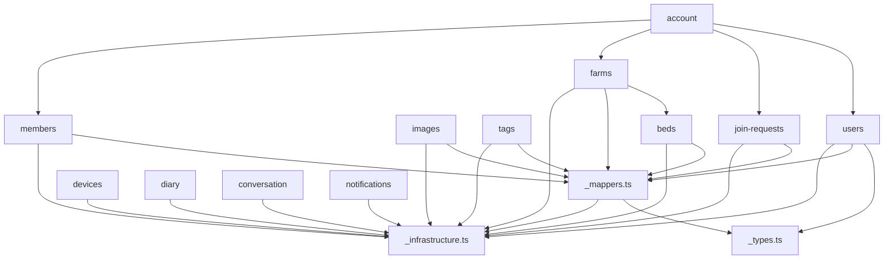

# ADR-20260413: Split dynamodb.ts into Domain Repositories (F-15 / #369)

## Status
Accepted (2026-04-13) — reviewed: `this`-rewrite risk, cross-domain map, deleteFarm cascade documented

## Context

The API service layer has a single monolithic file `src/api/src/services/dynamodb.ts` (1,902 LOC) containing one class (`DynamoRepository`) with 62 methods across 13 domains. This file is:

1. **Hard to navigate** -- developers must scroll through 1,900 lines to find the method they need.
2. **High merge-conflict risk** -- any two features touching different domains edit the same file.
3. **Unclear ownership** -- no structural boundary between farms, devices, diary, etc.

### Forces

- **796 tests must stay green** -- zero functional changes allowed.
- **18+ test files** mock `dynamoRepo` via `vi.mock('../../services/dynamodb')` (or `../services/dynamodb`). Changing mock paths across all tests is high-risk and noisy.
- **1 unit test file** (`dynamodb.test.ts`) directly instantiates `new DynamoRepository()` using `aws-sdk-client-mock`.
- **12 route handlers + 1 middleware** import `dynamoRepo` from `../../services/dynamodb` or `../services/dynamodb`.
- **Cross-domain methods** exist: `createFarm()` calls bed creation, `approveJoinRequest()` calls `buildMembershipItems()`, `deleteAccount()` cascades across farms/members/settings/join-requests, `deleteFarm()` cascades across all farm-related entities.
- **Singleton pattern** (`export const dynamoRepo = new DynamoRepository()`) is consumed everywhere.
- **Shared infrastructure**: DynamoDB client, key builders (`pk`, `sk`), pagination helpers, item mappers, types, and constants are used across all domains.

### Constraint Summary

| Constraint | Impact |
|-----------|--------|
| Test mock paths unchanged | Barrel re-export from `dynamodb.ts` is mandatory |
| Singleton preserved | Class + `export const dynamoRepo` pattern must remain |
| Cross-domain calls work | Methods on `this` must resolve across domain files |
| Zero behavioral change | Pure refactor -- no new features, no API changes |

## Options Considered

### Option 1: Extract to `services/repositories/` with Class Mixins

- **Description**: Create a `services/repositories/` directory with one file per domain. Each file exports a mixin function that adds methods to the class prototype. The main `dynamodb.ts` imports all mixins and composes the class. Barrel re-export keeps all existing imports working.
- **Pros**: Clean domain separation. Class `this` references work naturally. Test mock paths unchanged.
- **Cons**: Mixin pattern adds indirection. TypeScript mixin types are verbose. Unfamiliar pattern for many developers.
- **Effort**: Medium-High

### Option 2: Extract to `services/repositories/` with Plain Functions + Facade Class

- **Description**: Create a `services/repositories/` directory with one file per domain. Each file exports plain async functions (not methods) that receive the DynamoDB client and helpers as parameters. The `DynamoRepository` class in `dynamodb.ts` becomes a thin facade that delegates to these functions. Barrel re-export preserves all existing imports.
- **Pros**: Each domain file is a simple module of pure functions -- easy to test, easy to read. Facade class preserves the singleton `dynamoRepo` API. No TypeScript gymnastics. Cross-domain calls are just function imports within `repositories/`.
- **Cons**: Facade class has ~62 one-liner delegations (boilerplate). Cross-domain functions must import each other explicitly rather than using `this`.
- **Effort**: Medium

### Option 3: Do Nothing

- **Description**: Keep the monolithic `dynamodb.ts` as-is.
- **Pros**: Zero risk. No test changes. No review overhead.
- **Cons**: File continues growing. Merge conflicts worsen. Cognitive load stays high. The file is already at 1,902 lines and every new feature adds more.
- **Effort**: None

## Decision

**Option 2: Extract to `services/repositories/` with Plain Functions + Facade Class.**

## Rationale

1. **Simplicity**: Plain exported functions are the simplest unit of code in TypeScript. No mixin patterns, no prototype manipulation, no generic type gymnastics.
2. **Testability**: Domain functions can be unit-tested in isolation by passing a mock `ddb` client, without needing to instantiate the full `DynamoRepository`.
3. **Zero test disruption**: The facade class in `dynamodb.ts` preserves the exact public API (`dynamoRepo.getFarm(...)`, etc.), so all 18+ test files with `vi.mock('../../services/dynamodb')` continue to work unchanged.
4. **Cross-domain calls are explicit**: `deleteAccount` imports `getFarmsForUser` from `./members`, `deleteFarm` from `./farms`, etc. This makes dependencies visible rather than hiding them behind `this`.
5. **Reversibility**: If the facade pattern proves unwanted, the functions can be called directly from routes (removing the class) in a future refactor. Or the extraction can be reverted by inlining functions back into the class.

Option 1 (mixins) was rejected because TypeScript mixins require complex type declarations (`interface DynamoRepository extends FarmsMixin, BedsMixin, ...`) and the pattern is unfamiliar to most contributors. The cognitive overhead outweighs the benefit.

Option 3 (do nothing) was rejected because the file is already at the pain threshold and every upcoming sprint (AI context pipeline, pre-prod hardening) will add more methods.

## File Tree

```
src/api/src/services/
  dynamodb.ts                    # Facade class + barrel re-export (shrinks to ~180 LOC)
  repositories/
    _infrastructure.ts           # Shared: ddb client, TABLE_NAME, pk, sk, encodeCursor, decodeCursor, extractIdFromSk, bedName, GSI1_INDEX
    _types.ts                    # Shared types: StoredMessage, UserSettings, NotificationPrefs, DeleteAccountSummary, DEFAULT_SETTINGS
    _mappers.ts                  # Item mappers: itemToFarm, itemToBed, itemToImage, itemToTag, itemToFarmMember, itemToUserProfile, itemToUserSettings, buildMembershipItems
    farms.ts                     # getFarm, getAllFarms, createFarm, updateFarm, deleteFarm, getDiscoverableFarms, getStats (7 methods, ~250 LOC)
    beds.ts                      # getBedsForFarm, getBedById, updateBed, createBedsForFarm, createBedsForPositions (5 methods, ~150 LOC)
    images.ts                    # getImagesForBed, getLatestImageForBed, getImageById, createImage, updateImageThumbnailKey (5 methods, ~150 LOC)
    tags.ts                      # getTagsForImage, getLatestTagForImage, createTag (3 methods, ~100 LOC)
    members.ts                   # getFarmsForUser, getFarmMembership, addFarmMember, removeFarmMember, getFarmMembers, countUserMemberships, updateMemberRole (7 methods, ~150 LOC)
    users.ts                     # getUserProfile, upsertUserProfile, getAllUserProfiles, getUserSettings, upsertUserSettings, deleteUserItems (6 methods, ~180 LOC)
    devices.ts                   # createDevice, getDeviceById, getDevicesForFarm, updateDeviceConfig, updateDeviceHeartbeat, deleteDevice, setTestShotFlag, countDevicesForFarm, itemToDevice (9 methods, ~250 LOC)
    diary.ts                     # createDiaryEntry, getDiaryEntryById, getDiaryEntries, updateDiaryEntry, deleteDiaryEntry, itemToDiaryEntry (6 methods, ~200 LOC)
    conversation.ts              # getConversationHistory, saveConversationHistory (2 methods, ~50 LOC)
    join-requests.ts             # createJoinRequest, getJoinRequest, getJoinRequestsForFarm, approveJoinRequest, rejectJoinRequest, deleteJoinRequest, getMyJoinRequests (7 methods, ~180 LOC)
    account.ts                   # deleteAccount (1 method, ~70 LOC)
    notifications.ts             # getNotificationPrefs, upsertNotificationPrefs (2 methods, ~50 LOC)
    index.ts                     # Barrel: re-exports all domain functions (for internal use)
```

### Naming Convention

- Underscore-prefixed files (`_infrastructure.ts`, `_types.ts`, `_mappers.ts`) are internal shared modules -- not imported by routes directly.
- Domain files are named after their entity (plural noun).
- `index.ts` barrel is for convenience within `repositories/` only.

## What Goes Where

### `_infrastructure.ts` (~80 LOC)

```typescript
// DynamoDB client setup
export const ddb: DynamoDBDocumentClient;
export const TABLE_NAME: string;
export const GSI1_INDEX: string;

// Key builders
export const pk: { farm, bed, image, tag, user };
export const sk: { meta, profile, bed, image, tag, farmMember, member, settings, joinRequest, device, diary };

// Pagination
export function encodeCursor(lastKey): string;
export function decodeCursor(cursor, expectedPkPrefix): Record<string, unknown>;

// Utilities
export function extractIdFromSk(skValue, prefix): string;
export function bedName(row, col): string;
```

### `_types.ts` (~30 LOC)

```typescript
export interface StoredMessage { ... }
export interface UserSettings { ... }
export interface NotificationPrefs { ... }
export interface DeleteAccountSummary { ... }
export const DEFAULT_SETTINGS: Omit<UserSettings, 'updated_at'>;
```

### `_mappers.ts` (~100 LOC)

```typescript
export function itemToFarm(item, farmId): Farm;
export function itemToBed(item, farmId, bedId): Bed;
export function itemToImage(item, imageId): Image;
export function itemToTag(item, tagId): Tag;
export function itemToFarmMember(userId, item): FarmMember;
export function itemToUserProfile(item, userId): UserProfile;
export function itemToUserSettings(item): UserSettings;
export function buildMembershipItems(userId, farmId, role, joinedAt): TransactWriteItem[];
```

### Domain Files (example: `farms.ts`)

```typescript
import { ddb, TABLE_NAME, pk, sk, GSI1_INDEX, extractIdFromSk } from './_infrastructure';
import { itemToFarm } from './_mappers';
import { createBedsForFarm } from './beds';
import { buildMembershipItems } from './_mappers';
// ... DDB SDK imports ...

export async function getFarm(farmId: string): Promise<Farm> { ... }
export async function getAllFarms(): Promise<Farm[]> { ... }
export async function createFarm(farmId, userId, data): Promise<Farm> {
  // ... writes farm + membership ...
  await createBedsForFarm(farmId, gridRows, gridCols);  // cross-domain call
  return farm;
}
export async function updateFarm(farmId, updates): Promise<void> { ... }
export async function deleteFarm(farmId): Promise<void> { ... }
export async function getDiscoverableFarms(): Promise<Farm[]> { ... }
export async function getStats(): Promise<{ farms; users; beds }> { ... }
```

### Cross-Domain Dependency Map

```
farms.ts ──imports──> beds.ts (createBedsForFarm)
farms.ts ──imports──> _mappers.ts (buildMembershipItems)
tags.ts  ──writes───> bed status on farm partition (pk.farm + sk.bed, updates latest_status)
join-requests.ts ──imports──> _mappers.ts (buildMembershipItems)
account.ts ──imports──> members.ts (getFarmsForUser, getFarmMembers, removeFarmMember, updateMemberRole)
account.ts ──imports──> farms.ts (deleteFarm)
account.ts ──imports──> join-requests.ts (getMyJoinRequests, deleteJoinRequest)
account.ts ──imports──> users.ts (deleteUserItems)
```

**Note on `deleteFarm`**: Performs a partition-wide scan+delete of ALL items under `FARM#{farmId}`.
This implicitly cascades to beds, devices, diary entries, join requests, and member reverse records
without importing those domain modules. Any change to SK format in those domains affects this cascade.

No circular dependencies exist. The dependency graph is a DAG:



### Facade Class (`dynamodb.ts` after refactor, ~180 LOC)

```typescript
import { type StoredMessage, type UserSettings, type NotificationPrefs, type DeleteAccountSummary, DEFAULT_SETTINGS } from './repositories/_types';
import * as farms from './repositories/farms';
import * as beds from './repositories/beds';
import * as images from './repositories/images';
import * as tags from './repositories/tags';
import * as members from './repositories/members';
import * as users from './repositories/users';
import * as devices from './repositories/devices';
import * as diary from './repositories/diary';
import * as conversation from './repositories/conversation';
import * as joinRequests from './repositories/join-requests';
import * as account from './repositories/account';
import * as notifications from './repositories/notifications';

// Re-export types for backward compatibility
export type { StoredMessage, UserSettings, NotificationPrefs, DeleteAccountSummary };
export { DEFAULT_SETTINGS };

export class DynamoRepository {
  // Farms
  getFarm = farms.getFarm;
  getAllFarms = farms.getAllFarms;
  createFarm = farms.createFarm;
  updateFarm = farms.updateFarm;
  deleteFarm = farms.deleteFarm;
  getDiscoverableFarms = farms.getDiscoverableFarms;
  getStats = farms.getStats;

  // Beds
  getBedsForFarm = beds.getBedsForFarm;
  getBedById = beds.getBedById;
  updateBed = beds.updateBed;
  createBedsForFarm = beds.createBedsForFarm;
  createBedsForPositions = beds.createBedsForPositions;

  // ... (all 62 methods as property assignments) ...
}

export const dynamoRepo = new DynamoRepository();
```

**Key detail**: Methods are assigned as class properties pointing to the extracted functions. This works because the extracted functions are standalone (no `this` dependency). Each method on `dynamoRepo` delegates directly to the domain function.

## Test Migration Strategy

### Zero-Change Test Files (18 files)

All test files that mock `dynamoRepo` via:
```typescript
vi.mock('../../services/dynamodb', () => ({
  dynamoRepo: { getFarm: vi.fn(), ... },
}));
```

**These files require NO changes.** The mock intercepts the entire module, so it does not matter what the real module exports or imports internally. The mock factory returns the same `{ dynamoRepo: { ... } }` shape.

### Low-Change Test File (1 file)

`__tests__/services/dynamodb.test.ts` directly instantiates `new DynamoRepository()` and uses `aws-sdk-client-mock`. This file:

1. **Continues to work as-is** if `DynamoRepository` is still exported from `dynamodb.ts` (it is).
2. The `DynamoRepository` class methods now delegate to extracted functions, but `aws-sdk-client-mock` mocks the DynamoDB DocumentClient globally, so the extracted functions will still hit the mock.
3. **No changes needed** unless the import path changes (it does not).

### Test Impact Summary

| Category | File Count | Changes Required |
|----------|-----------|-----------------|
| Route test files (vi.mock) | 14 | None |
| Middleware test files (vi.mock) | 2 | None |
| Integration test files (vi.mock) | 2 | None |
| Unit test file (aws-sdk-client-mock) | 1 | None |
| Other test files (no dynamodb import) | 6 | None |
| **Total** | **25** | **0 files changed** |

## Implementation Plan

### Batch 1: Extract Shared Infrastructure (~30 min)

1. Create `repositories/_infrastructure.ts` -- move client, constants, key builders, pagination, utilities.
2. Create `repositories/_types.ts` -- move interfaces and `DEFAULT_SETTINGS`.
3. Create `repositories/_mappers.ts` -- move all `itemTo*` functions and `buildMembershipItems`.

### Batch 2: Extract Domain Files (~2 hours)

Extract in dependency order (leaves first):

**`this`-rewrite checklist**: All `this.X()` calls (~15 sites) must be rewritten to direct function
calls or local function calls during extraction. TypeScript compilation catches missing imports.
Key sites:
- `createFarm` → `this.createBedsForFarm` → local import from `./beds`
- `createBedsForFarm` → `this.createBedsForPositions` → local call (same file)
- `getDiscoverableFarms` → `this.getAllFarms` → local call (same file)
- `deleteAccount` → 8 `this.*` calls → imports from members, farms, join-requests, users
- `itemToDevice` (3 call sites in devices) → local function call
- `itemToDiaryEntry` (4 call sites in diary) → local function call

1. `repositories/conversation.ts` (0 cross-domain deps)
2. `repositories/notifications.ts` (0 cross-domain deps)
3. `repositories/tags.ts` (0 cross-domain deps; note: writes bed status via pk.farm+sk.bed keys)
4. `repositories/images.ts` (0 cross-domain deps)
5. `repositories/beds.ts` (0 cross-domain deps)
6. `repositories/users.ts` (0 cross-domain deps)
7. `repositories/members.ts` (0 cross-domain deps)
8. `repositories/devices.ts` (0 cross-domain deps; convert private `itemToDevice` to local function)
9. `repositories/diary.ts` (0 cross-domain deps; convert private `itemToDiaryEntry` to local function)
10. `repositories/farms.ts` (depends on beds, _mappers)
11. `repositories/join-requests.ts` (depends on _mappers for buildMembershipItems)
12. `repositories/account.ts` (depends on members, farms, join-requests, users)
13. `repositories/index.ts` (barrel)

### Batch 3: Rewrite Facade (~30 min)

1. Replace the 1,900-line class body with ~62 property assignments delegating to domain functions.
2. Keep all `export` statements for types.
3. Keep `export const dynamoRepo = new DynamoRepository()`.

### Batch 4: Verify (~15 min)

1. `npm run build` -- TypeScript compiles with no errors.
2. `npm run test` -- all 796 tests pass.
3. `npm run lint` -- no new warnings.
4. Manual spot-check: grep for any remaining direct references to old code locations.

## Consequences

### Positive

- **Navigability**: Each domain file is 50-250 LOC instead of one 1,902-line monolith.
- **Merge safety**: Two features in different domains edit different files.
- **Domain boundaries visible**: File structure reflects the data model.
- **Incremental testability**: Domain functions can be unit-tested with a mock `ddb` client without the full class.
- **Zero test disruption**: All existing mocks and imports continue to work.

### Negative

- **Facade boilerplate**: The `DynamoRepository` class becomes ~62 lines of delegation. This is intentional -- it is the backward-compatibility shim.
- **Two levels of indirection**: `route -> dynamoRepo.getFarm() -> farms.getFarm()`. The runtime cost is negligible (one function call), but a developer must know to look in `repositories/farms.ts` rather than `dynamodb.ts`.
- **File count increase**: 1 file becomes 16 files. IDE sidebar is noisier. Mitigated by the `repositories/` subdirectory grouping.

### Future Path

Once this refactor is stable, a follow-up can:
1. **Remove the facade class** entirely -- routes import domain functions directly (e.g., `import { getFarm } from '../services/repositories/farms'`). This is a larger change that touches all route + test files.
2. **Add dependency injection** -- pass `ddb` client to domain functions for better testability (currently uses module-level singleton).
3. **Split the unit test file** -- `dynamodb.test.ts` can be split into per-domain test files mirroring the repository structure.

These are independent decisions, not prerequisites. The facade extraction is complete and valuable on its own.

## Risk Assessment

| Risk | Likelihood | Impact | Mitigation |
|------|-----------|--------|------------|
| Circular dependency between domain files | Low | High (build failure) | Dependency graph is a verified DAG. `_mappers` holds shared helpers, not domain logic. |
| Test mock path breaks | Very Low | High (mass test failure) | `dynamodb.ts` remains at same path, exports same `dynamoRepo`. No mock paths change. |
| `this`-to-import rewrite | Medium | High | ~15 `this.X()` call sites across 6 methods must be rewritten to direct function imports during extraction. TypeScript compilation catches missing imports. Full test suite (796 tests) verifies correctness. See Batch 2 rewrite checklist. |
| Type export breaks | Low | Medium | All types re-exported from `dynamodb.ts`. `import { UserSettings } from '../../services/dynamodb'` still resolves. |
| Runtime behavior change | Very Low | High | Pure code movement -- no logic changes. Full test suite is the gate. |
