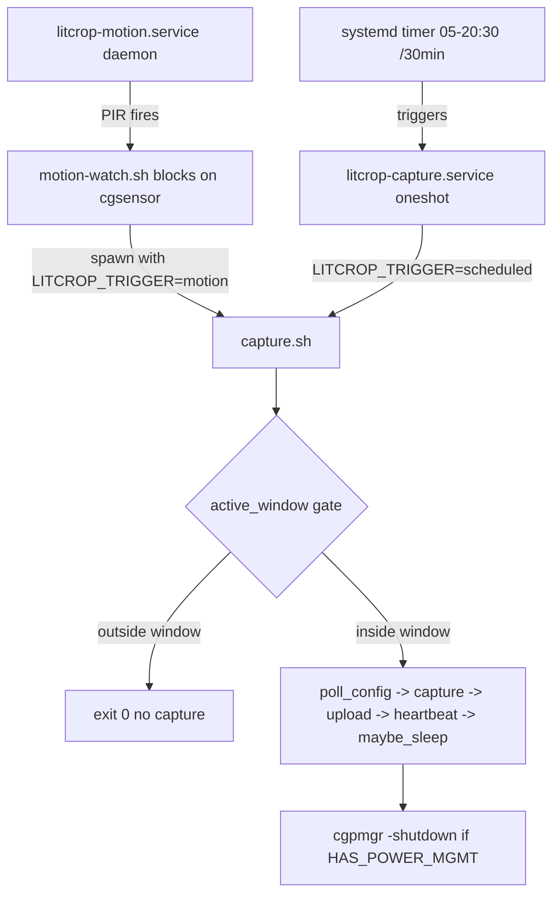

# ADR: Device Capture Scripts — Production Hardening (#395)

## Status
Proposed (2026-04-14) — **v2 (revised 2026-04-14)**

## Revision Log

**v2 (2026-04-14)** — Incorporated review findings:
1. Added **MVP Phase 0** to fix an existing broken config round-trip (capture_interval, resolution, active_window all stored by the UI but not honored by capture.sh). This must land before any new fields are added.
2. Dropped misused systemd `%i` specifier from plain (non-template) units. `install.sh` now substitutes `$HOME` via `sed` at install time.
3. Enumerated **all four config-schema layers** (Update schema, ConfigResponse schema, DEVICE_DEFAULTS, UI form, repo `Partial` type) to keep field additions atomic.
4. Resolved OnCalendar / active_window conflict: systemd timer stays liberal; capture.sh enforces the window in-script.
5. Standardized on `LITCROP_TRIGGER` env var (not `TRIGGER`) to avoid .env-parser overwrite; install.sh scrubs any legacy `TRIGGER=` line.
6. Added numeric guard to `maybe_sleep()` battery read.
7. Clarified systemd unit `[Install]` placement — only the timer is enabled; the oneshot service is triggered by the timer.

## Context

LitCrop's camera node scripts (`install.sh`, `capture.sh`) work for Beta-11 field evaluation but have known gaps for production fleet deployment: no power management integration, no motion-trigger wiring, manual hardware prompts, cron-only scheduling, **and — newly discovered during review — a silently broken config round-trip for three existing fields**. New hardware boards (RPZ-PowerMGR via `cgpmgr`, RPZ-PIRS via `cgsensor`) must be integrated to support Class 2 and Class 3 device behaviors.

### Forces
- Budget ceiling: ~$1.18/month cloud cost; device-side changes must add zero cloud cost
- Existing `capture.sh` (17KB, 453 lines) is battle-tested; avoid full rewrites
- Fleet provisioning requires non-interactive install
- Class 1/2/3 device tiers are already modeled in the API and frontend
- **New**: Existing round-trip bugs must be fixed before adding new fields, or the regression surface doubles

## Options Considered

### Option A: Monolithic capture.sh with mode flags
- **Description**: Add `--mode scheduled|motion|hybrid` flags to `capture.sh`. All logic in one file.
- **Pros**: Single file to deploy, no coordination between services
- **Cons**: File exceeds 700 lines; motion daemon (blocking loop) and oneshot capture are fundamentally different execution models
- **Effort**: Medium

### Option B: Modal scripts coordinated by systemd (recommended)
- **Description**: Keep `capture.sh` as a single-cycle oneshot. Add `motion-watch.sh` as a separate daemon. Systemd units orchestrate both. Power management is a post-capture hook inside `capture.sh`.
- **Pros**: Single-responsibility per script; systemd handles restart/logging/dependencies; motion and scheduled are independently deployable
- **Cons**: More files to deploy; requires systemd (present on all Pi OS)
- **Effort**: Medium

### Option C: Full rewrite in Python
- **Description**: Replace shell scripts with Python + `asyncio`.
- **Pros**: Type safety, async I/O, structured errors
- **Cons**: 50-80MB RAM overhead on Pi Zero 2 W; slow cold-boot startup; breaks curl-pipe-bash install pattern
- **Effort**: High

## Decision

**Option B: Modal scripts coordinated by systemd**, delivered in three progressive phases.

### Architecture



### File Structure

```
~/litcrop/
  capture.sh           # Modified (Phase 0 + 1) — fix round-trip, add power hook, new config parsing
  motion-watch.sh      # NEW (Phase 2) — blocking PIR loop
  hardware.conf        # Modified — auto-generated, adds HAS_POWER_MGMT
  .env                 # Must not contain TRIGGER= (install.sh scrubs legacy)
  .auth-token          # Unchanged
scripts/camera-node/
  install.sh           # Modified — auto-detect, systemd install, $HOME substitution, --non-interactive
  systemd/
    litcrop-capture.service.tmpl   # NEW — template with __LITCROP_HOME__ sed placeholder
    litcrop-capture.timer          # NEW — replaces cron
    litcrop-motion.service.tmpl    # NEW (Phase 2)
```

### Mode Selection

Mode is not a runtime flag — it is derived from `hardware.conf` at install time:

| HAS_PIR_SENSOR | HAS_POWER_MGMT | Units enabled                         |
|----------------|----------------|---------------------------------------|
| 0              | 0              | timer only                            |
| 0              | 1              | timer only (with sleep)               |
| 1              | 0              | timer + motion (hybrid, no sleep)     |
| 1              | 1              | timer + motion (hybrid)               |

---

## MVP Phase 0 — Fix existing broken round-trip (LAND FIRST)

An audit found three fields that the UI writes to DynamoDB and the API serves, but `capture.sh` never honors:

| Field              | UI writes | API returns                             | capture.sh reads        | Result                     |
|--------------------|-----------|-----------------------------------------|-------------------------|----------------------------|
| `capture_interval` | yes       | yes (`capture_interval: 1800`)          | **never read**          | hardcoded `.env INTERVAL_SECONDS` |
| `resolution`       | yes       | yes (`resolution: "1920x1080"`)         | reads `.resolution_width` / `.resolution_height` (keys don't exist) | defaults used forever |
| `active_window`    | yes       | yes (`{ start: "05:00", end: "20:00" }`)| **never parsed**        | captures any hour          |

### Fixes (in `capture.sh poll_config()`)

1. **resolution** — parse the string and split on `x`:
   ```bash
   res=$(echo "$body" | jq -r '.resolution // empty')
   if [[ "$res" =~ ^([0-9]+)x([0-9]+)$ ]]; then
       CAPTURE_WIDTH="${BASH_REMATCH[1]}"
       CAPTURE_HEIGHT="${BASH_REMATCH[2]}"
   fi
   ```

2. **capture_interval** — export for loop mode and honor on next systemd timer reconciliation:
   ```bash
   ci=$(echo "$body" | jq -r '.capture_interval // empty')
   [ -n "$ci" ] && export INTERVAL_SECONDS="$ci"
   ```
   (Note: with systemd replacing cron, `capture_interval` becomes advisory — the OnCalendar expression drives cadence. A future ADR may reconcile by having `poll_config` write a reload-timer stamp; for MVP the value is logged and honored by `--loop` mode only.)

3. **active_window** — parse and enforce via a gate at the top of `run_once()`:
   ```bash
   aw_start=$(echo "$body" | jq -r '.active_window.start // "05:00"')
   aw_end=$(echo "$body"   | jq -r '.active_window.end   // "20:00"')
   export ACTIVE_WINDOW_START="$aw_start"
   export ACTIVE_WINDOW_END="$aw_end"
   ```
   And at `run_once()` entry:
   ```bash
   in_active_window() {
       local now_hm; now_hm=$(date +%H:%M)
       [[ "$now_hm" > "${ACTIVE_WINDOW_START:-05:00}" || "$now_hm" == "${ACTIVE_WINDOW_START:-05:00}" ]] \
         && [[ "$now_hm" < "${ACTIVE_WINDOW_END:-20:00}" ]]
   }
   # ...
   if ! in_active_window; then
       log "[SKIP] Outside active window ${ACTIVE_WINDOW_START}-${ACTIVE_WINDOW_END}"
       return 0
   fi
   ```

**Exit criteria for Phase 0**: A UI resolution change (1280x720) is reflected in the next Pi capture within one config-poll cycle (max 30 min). Active-window change (end=12:00) causes the Pi to skip captures after noon. Verified on one physical device.

---

## MVP Phase 1 — Power management + new config fields

### New config fields (four layers, all must change atomically)

| Layer                                        | File                                                  | Change                                                       |
|----------------------------------------------|-------------------------------------------------------|--------------------------------------------------------------|
| 1. `DeviceConfigResponseSchema` (Pi-facing)  | `packages/shared/src/schemas/index.ts:470`            | Add 4 fields with `.default()`                               |
| 2. `UpdateDeviceRequestSchema` (PATCH body)  | `packages/shared/src/schemas/index.ts:488`            | Add 4 optional fields with validation ranges                 |
| 3. `DEVICE_DEFAULTS` (new-device seeding)    | `src/api/src/routes/devices.ts:36`                    | Add 4 defaults matching schema                               |
| 4. `updateDeviceConfig` repo `Partial` type  | `src/api/src/services/repositories/devices.ts:127`    | Add 4 fields so UpdateExpression includes them               |
| 5. `DeviceConfigForm.tsx` (UI form)          | `src/frontend/src/components/DeviceConfigForm.tsx`    | Add inputs: cooldown (number), max/hr (number), sleep toggle, battery threshold |
| 6. `DeviceConfigResponse` TS type            | `packages/shared/src/types/domain.ts:188`             | Add 4 fields                                                 |

Fields:
- `motion_cooldown_sec: number` (default 60, range 10-600)
- `max_motion_per_hour: number` (default 10, range 1-120)
- `sleep_enabled: boolean` (default false)
- `battery_threshold: number` (default 20, range 5-50, percent)

Without a change at each of the six layers above, the Pi receives only Zod schema defaults and UI changes are silently dropped by the PATCH route.

### `maybe_sleep()` in capture.sh (end of run_once)

```bash
maybe_sleep() {
    [ "${HAS_POWER_MGMT:-0}" != "1" ] && return 0
    [ "${SLEEP_ENABLED:-false}" != "true" ] && return 0

    local batt
    batt=$(cat /sys/class/power_supply/*/capacity 2>/dev/null | head -1 || echo "")
    # Numeric guard — sysfs on some UPS HATs returns empty or "Unknown"
    [[ ! "$batt" =~ ^[0-9]+$ ]] && batt=100

    if (( batt < ${BATTERY_THRESHOLD:-20} )); then
        log "[POWER] Battery ${batt}% < threshold ${BATTERY_THRESHOLD}% — skipping sleep"
        return 0
    fi

    local wake_sec="${SLEEP_INTERVAL:-1800}"
    log "[POWER] Setting wake timer: ${wake_sec}s, shutting down"
    cgpmgr -set "$wake_sec" || { log "[POWER] cgpmgr -set failed"; return 0; }
    cgpmgr -shutdown
}
```

**Exit criteria for Phase 1**: Pi wakes, captures, uploads, sleeps, wakes again — three consecutive successful cycles on one Class 2 device.

---

## Production Phase — Motion support

### `motion-watch.sh` (new, ~80 lines)

```bash
#!/usr/bin/env bash
set -euo pipefail
LITCROP_DIR="${HOME}/litcrop"
source "${LITCROP_DIR}/hardware.conf"

COOLDOWN="${MOTION_COOLDOWN_SEC:-60}"
MAX_PER_HOUR="${MAX_MOTION_PER_HOUR:-10}"

hourly_count=0
hour_start=$(date +%s)

while true; do
    now=$(date +%s)
    if (( now - hour_start >= 3600 )); then
        hourly_count=0
        hour_start=$now
    fi

    cgsensor -watch pir   # blocks until PIR fires

    if (( hourly_count >= MAX_PER_HOUR )); then
        sleep "$COOLDOWN"
        continue
    fi

    LITCROP_TRIGGER=motion "${LITCROP_DIR}/capture.sh"
    hourly_count=$((hourly_count + 1))
    sleep "$COOLDOWN"
done
```

**Entry criteria**: MVP Phase 1 sleep/wake validated on 2+ devices for 7+ days with zero unexpected reboots.

---

## Systemd Units

### litcrop-capture.service.tmpl

```ini
[Unit]
Description=LitCrop scheduled image capture
After=network-online.target
Wants=network-online.target

[Service]
Type=oneshot
User=__LITCROP_USER__
ExecStart=__LITCROP_HOME__/litcrop/capture.sh
Environment=LITCROP_TRIGGER=scheduled
TimeoutStartSec=120
# Intentionally no [Install] — this oneshot is triggered by the .timer, never enabled directly
```

### litcrop-capture.timer

```ini
[Unit]
Description=LitCrop capture schedule

[Timer]
# Liberal window — the script enforces active_window from config at runtime
# so the UI can shrink/grow the window without reinstalling the timer.
OnCalendar=*-*-* 05..20:00/30:00
Persistent=true
RandomizedDelaySec=30

[Install]
WantedBy=timers.target
```

### litcrop-motion.service.tmpl (Production phase)

```ini
[Unit]
Description=LitCrop PIR motion watcher
After=network-online.target
Wants=network-online.target

[Service]
Type=simple
User=__LITCROP_USER__
ExecStart=__LITCROP_HOME__/litcrop/motion-watch.sh
Restart=on-failure
RestartSec=10
Environment=LITCROP_TRIGGER=motion

[Install]
WantedBy=multi-user.target
```

### Install-time substitution (install.sh)

```bash
install_systemd_units() {
    local home_dir="$HOME"
    local user_name="${USER:-$(id -un)}"
    for tmpl in scripts/camera-node/systemd/*.tmpl; do
        local name; name=$(basename "${tmpl%.tmpl}")
        sed -e "s|__LITCROP_HOME__|${home_dir}|g" \
            -e "s|__LITCROP_USER__|${user_name}|g" \
            "$tmpl" | sudo tee "/etc/systemd/system/${name}" >/dev/null
    done
    sudo systemctl daemon-reload
    sudo systemctl enable --now litcrop-capture.timer
    [ "${HAS_PIR_SENSOR:-0}" = "1" ] && sudo systemctl enable --now litcrop-motion.service
    # Never: systemctl enable litcrop-capture.service — the timer triggers it
}
```

Rationale for sed over `@.service` template units: `%i` only expands for instantiated template units. For a single-device-per-Pi model, the template mechanism adds indirection without benefit. A straight sed substitution at install time is simpler, debuggable (the installed unit file is self-contained), and keeps the home dir visible in `systemctl cat litcrop-capture.service`.

---

## Trigger-variable naming

The existing `.env` parser in `capture.sh` (lines 57-61) exports `TRIGGER` when present, overwriting any value set by the caller. To prevent motion-watch.sh's `TRIGGER=motion` from being stomped:

1. **Rename** the wire-format variable to `LITCROP_TRIGGER` everywhere:
   - `motion-watch.sh` exports `LITCROP_TRIGGER=motion`
   - systemd units set `Environment=LITCROP_TRIGGER=…`
   - `capture.sh` reads `TRIGGER="${LITCROP_TRIGGER:-${TRIGGER:-scheduled}}"` (backward-compatible precedence)
2. **Scrub legacy**: `install.sh` removes any `TRIGGER=` line from `.env` on upgrade:
   ```bash
   sed -i '/^export TRIGGER=/d; /^TRIGGER=/d' "$HOME/litcrop/.env"
   ```
3. **Document**: `.env` must not contain `TRIGGER=` — use `LITCROP_TRIGGER=` if overriding.

---

## Config schema changes (full list)

```typescript
// 1. DeviceConfigResponseSchema — Pi-facing GET response
export const DeviceConfigResponseSchema = z.object({
  capture_interval: z.number(),
  resolution: z.string(),
  jpeg_quality: z.number(),
  active_window: ActiveWindowSchema,
  trigger_type: z.literal('scheduled'),
  bed_id: z.string(),
  upload_url: z.string(),
  test_shot_requested: z.boolean(),
  // --- new (#395) ---
  motion_cooldown_sec: z.number().int().min(10).max(600).default(60),
  max_motion_per_hour: z.number().int().min(1).max(120).default(10),
  sleep_enabled: z.boolean().default(false),
  battery_threshold: z.number().int().min(5).max(50).default(20),
});

// 2. UpdateDeviceRequestSchema — PATCH body
export const UpdateDeviceRequestSchema = z.object({
  // ... existing ...
  motion_cooldown_sec: z.number().int().min(10).max(600).optional(),
  max_motion_per_hour: z.number().int().min(1).max(120).optional(),
  sleep_enabled: z.boolean().optional(),
  battery_threshold: z.number().int().min(5).max(50).optional(),
});

// 3. DEVICE_DEFAULTS — devices.ts:36
const DEVICE_DEFAULTS = {
  capture_interval: 1800,
  resolution: '1920x1080',
  jpeg_quality: 85,
  active_window_start: '05:00',
  active_window_end: '20:00',
  motion_cooldown_sec: 60,
  max_motion_per_hour: 10,
  sleep_enabled: false,
  battery_threshold: 20,
};

// 4. updateDeviceConfig Partial — services/repositories/devices.ts:127
updates: Partial<{
  node_name: string; bed_id: string;
  capture_interval: number; resolution: string; jpeg_quality: number;
  active_window_start: string; active_window_end: string;
  motion_cooldown_sec: number; max_motion_per_hour: number;
  sleep_enabled: boolean; battery_threshold: number;
}>
```

UI form changes live in `DeviceConfigForm.tsx` — four new controls beside the existing resolution/quality/window fields.

---

## Consequences

### Positive
- Fleet provisioning via `curl | bash -- --non-interactive`
- Systemd journal replaces manual log rotation
- Power management extends battery life from ~3 days to ~10-14 days
- The broken round-trip that hid behind defaults is now surfaced and fixed
- Timer stays liberal; UI-driven active-window changes take effect without reinstalling units

### Negative
- Requires sudo in install.sh
- Four new systemd artifacts to maintain
- **Hidden breakage risk**: Devices currently running Beta-11 are effectively running on capture.sh defaults, not their DynamoDB config. Rolling out Phase 0 will cause UI-stored values to take effect — any device with a misconfigured `resolution` string or narrow `active_window` will suddenly change behavior. Mitigation: a one-shot DynamoDB migration to normalize `resolution` strings to `1920x1080` / `1280x720` before Phase 0 ships, and a release-note warning.

### Risks

| Risk                                        | Likelihood | Impact | Mitigation                                   |
|---------------------------------------------|-----------|--------|----------------------------------------------|
| cgpmgr/cgsensor not in PATH                 | Medium    | Low    | install.sh checks and prints fix path        |
| PIR false positives drain battery           | Medium    | Medium | Hourly cap + cooldown                        |
| Phase 0 surfaces latent misconfig           | Medium    | Medium | Pre-migration DynamoDB audit + release note  |
| cgpmgr -shutdown races with upload          | Low       | High   | maybe_sleep runs after all network I/O       |
| Battery sysfs returns non-numeric           | Low       | Med    | Regex guard `[[ ! =~ ^[0-9]+$ ]] && batt=100`|

## Rollback

Per phase:
- **Phase 0**: revert capture.sh; systemd untouched.
- **Phase 1**: `systemctl disable --now litcrop-capture.timer && crontab -l | grep capture.sh | crontab -` restores cron.
- **Production**: `systemctl disable --now litcrop-motion.service` — scheduled captures continue uninterrupted.

## Implementation Notes

1. **Land Phase 0 alone** — no new config fields, no systemd. Just fix the three broken reads in capture.sh. Gate Phase 1 on Phase 0 exit criteria.
2. Modify `capture.sh`: Phase 0 patches `poll_config()`; Phase 1 adds `maybe_sleep()` and `in_active_window()` gate at top of `run_once()`.
3. Schema changes in `packages/shared` — single commit covering all six layers listed above.
4. `install.sh`: replace hardware prompts with auto-detect, add sed-based systemd install, scrub legacy `TRIGGER=` from .env.
5. DynamoDB migration script in `scripts/migrations/` — normalize any pre-existing `resolution` values that don't match `^\d+x\d+$`.
6. Defer `motion-watch.sh` and `litcrop-motion.service` to Production phase.
