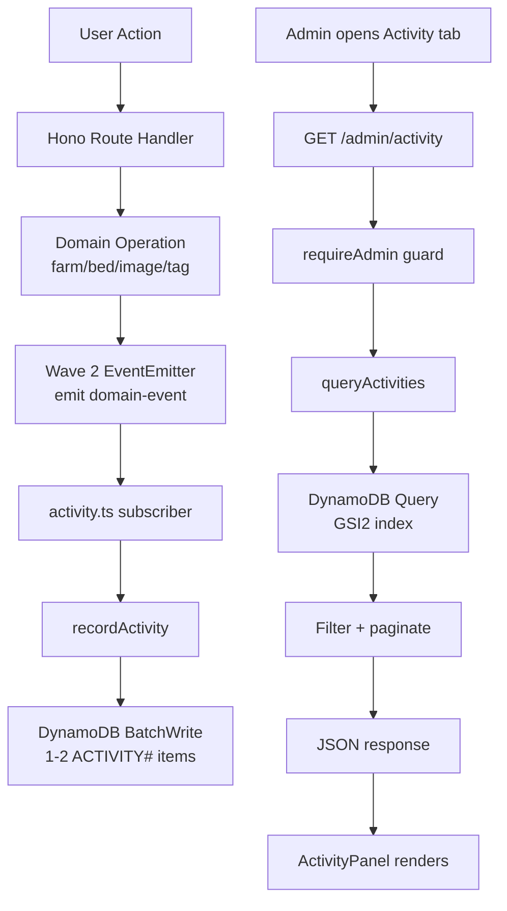

# Beta-4 Wave 3: Admin Activity Log (#207)

> Design document for the admin-facing activity log feature.
> Depends on Wave 2 (event-capture layer with in-process EventEmitter).

---

## Table of Contents

1. [ADR: Activity Storage Strategy](#1-adr-activity-storage-strategy)
2. [Data Model -- ACTIVITY# Entity](#2-data-model----activity-entity)
3. [Service Design](#3-service-design)
4. [API Contract](#4-api-contract)
5. [UX Wireframe](#5-ux-wireframe)
6. [Event Type Catalog](#6-event-type-catalog)
7. [i18n Keys](#7-i18n-keys)
8. [Test Plan](#8-test-plan)

---

## 1. ADR: Activity Storage Strategy

### Status
Proposed (2026-04-01)

### Context
The admin dashboard currently shows static counts (System tab), a user list, and a farm list. There is no audit trail of user actions -- admins cannot see who did what, when. Wave 2 introduces an in-process EventEmitter (`services/events.ts`) that broadcasts domain events (farm created, image uploaded, tag added, member joined, etc.). Wave 3 must persist these events and expose them as a queryable, paginated activity log in the admin UI.

**Constraints:**
- AWS monthly cost ceiling: ~$1.18 target, $5 hard ceiling. Activity storage must add negligible cost.
- Existing infrastructure: single DynamoDB table (`litcrop-mvp`), PAY_PER_REQUEST billing, PITR enabled, TTL attribute configured.
- GSI2 exists in CDK (`GSI2PK`/`GSI2SK`, ALL projection) but is currently unused in application code.
- Event volume: ~1000 events/month at MVP scale (1-5 users). Item size ~200 bytes each = ~200KB/month.
- Retention: 90 days is sufficient for MVP. Older events have no operational value.

### Options Considered

#### Option A: ACTIVITY# entity in existing DynamoDB table (recommended)
- **Description**: Store activity items as a new entity type in the single-table design, using monthly-partitioned PKs and the existing GSI2 for query access patterns.
- **Pros**:
  - Zero new infrastructure -- reuses existing table, GSI, TTL, and PITR
  - Follows established single-table patterns (PK/SK composite keys, cursor pagination)
  - DynamoDB TTL auto-expires items after 90 days -- no cleanup Lambda needed
  - GSI2 is already provisioned but unused -- repurposing it adds zero cost
  - Queries via GSI2 support both global timeline and farm-scoped views
  - Negligible cost at MVP scale (~200KB/month, PAY_PER_REQUEST)
- **Cons**:
  - Adds another entity type to an already multi-entity table (cognitive load)
  - `ACTIVITY#ALL` GSI2PK could become a hot partition at scale (not a concern at MVP)
  - No full-text search capability -- `q` filter must use in-memory post-filtering
- **Effort**: Low

#### Option B: CloudWatch Logs Insights
- **Description**: Write activity events as structured JSON to CloudWatch Logs. Query via Logs Insights from a Lambda or API handler.
- **Pros**:
  - Built-in log retention policies
  - Logs Insights supports regex and aggregation queries
  - Decouples activity from DynamoDB capacity
- **Cons**:
  - Logs Insights queries are async (seconds to return) -- poor UX for paginated log browsing
  - Query cost: $0.005 per GB scanned -- unpredictable cost at scale
  - No cursor-based pagination -- results are query-scoped, not continuation-scoped
  - Requires different API patterns from the rest of the codebase (polling for query completion)
  - Cannot reuse existing GSI2 or DynamoDB pagination patterns
- **Effort**: Medium

#### Option C: Separate DynamoDB table
- **Description**: Create a new `litcrop-activity` table dedicated to activity log items.
- **Pros**:
  - Clean separation of concerns
  - Independent capacity and scaling
  - Avoids adding complexity to the main table
- **Cons**:
  - New CDK resource -- increases infrastructure footprint and cost (even minimal)
  - Duplicates DynamoDB client configuration, table name env vars, and PITR setup
  - Cannot share transactions with main-table writes (e.g., farm delete + activity record)
  - Violates single-table design philosophy already adopted by the project
  - GSI2 on the main table remains wasted
- **Effort**: Medium

### Decision
**Option A: ACTIVITY# entity in existing DynamoDB table.**

### Rationale
At MVP scale (~1000 events/month, 1-5 users), a separate table or CloudWatch Logs adds infrastructure complexity with no tangible benefit. The single-table design already handles 9 entity types successfully. GSI2 is provisioned and unused -- repurposing it for activity queries avoids waste. DynamoDB TTL provides zero-cost automatic cleanup. The implementation reuses existing patterns (`encodeCursor`/`decodeCursor`, `QueryCommand`, `PutCommand`) reducing code and cognitive overhead.

The `ACTIVITY#ALL` GSI2PK will not become a hot partition at MVP volumes. If the project scales to Production scope with thousands of daily events, the mitigation is to shard the GSI2PK (e.g., `ACTIVITY#ALL#0`..`ACTIVITY#ALL#9` with scatter-gather queries). That optimization is deferred.

### Consequences

**Positive:**
- No new AWS resources -- zero additional cost
- Reuses GSI2, paying back its provisioning from initial CDK setup
- TTL auto-expires old items -- no maintenance
- Same pagination and query patterns as the rest of the codebase

**Negative:**
- Main table grows one more entity type (manageable, well-documented)
- Free-text search (`q` param) requires post-filter, limiting efficiency at scale
- GSI2 hot-partition risk at Production scale (documented mitigation above)

### Rollback Plan
Delete ACTIVITY# items via a DynamoDB scan-and-delete script. Remove GSI2 attribute writes from the activity service. GSI2 reverts to unused state. No schema migration needed.

---

## 2. Data Model -- ACTIVITY# Entity

### Key Design

```
Primary Table:
  PK:  ACTIVITY#{YYYY-MM}       (monthly partition -- avoids hot keys)
  SK:  {ISO-timestamp}#{eventId} (sortable, unique within partition)

GSI2 (repurposed):
  GSI2PK:  ACTIVITY#ALL                      (global timeline)
       or  ACTIVITY#FARM#{farmId}            (farm-scoped timeline)
  GSI2SK:  {ISO-timestamp}#{eventId}          (time-ordered)
```

**Why monthly PK partitions?** DynamoDB distributes capacity across partitions by PK value. A single `ACTIVITY#ALL` PK would concentrate all writes to one partition. Monthly partitioning (`ACTIVITY#2026-04`) distributes writes across partitions while still enabling date-range queries by querying the relevant monthly partitions.

**Why GSI2 for queries?** The primary table's PK is month-scoped, so cross-month queries require multiple queries (one per month). GSI2 provides two access patterns in a single index:
- `GSI2PK = ACTIVITY#ALL` -- global admin timeline (all events, all farms)
- `GSI2PK = ACTIVITY#FARM#{farmId}` -- farm-scoped timeline

### Attribute Schema

| Attribute       | Type   | Description                                       | Example                                |
|-----------------|--------|---------------------------------------------------|----------------------------------------|
| `PK`            | S      | Monthly partition key                             | `ACTIVITY#2026-04`                     |
| `SK`            | S      | Timestamp + unique event ID                       | `2026-04-01T12:34:56.789Z#evt_abc123`  |
| `GSI2PK`        | S      | Query access: global or farm-scoped               | `ACTIVITY#ALL`                         |
| `GSI2SK`        | S      | Same as SK (time-ordered)                         | `2026-04-01T12:34:56.789Z#evt_abc123`  |
| `event_type`    | S      | Event category from the catalog                   | `farm.created`                         |
| `actor_id`      | S      | User ID who performed the action                  | `usr_abc123`                           |
| `actor_email`   | S      | Actor's email (denormalized for display)          | `alice@example.com`                    |
| `target_type`   | S      | Entity type affected                              | `farm`                                 |
| `target_id`     | S      | Entity ID affected                                | `farm_xyz789`                          |
| `target_name`   | S      | Human-readable target name (denormalized)         | `My Farm`                              |
| `farm_id`       | S (opt)| Associated farm (null for system-level events)    | `farm_xyz789`                          |
| `details`       | M (opt)| Event-specific metadata (JSON map)                | `{ "old_name": "A", "new_name": "B" }`|
| `created_at`    | S      | ISO 8601 timestamp                                | `2026-04-01T12:34:56.789Z`            |
| `TTL`           | N      | DynamoDB TTL -- epoch seconds, 90 days from creation | `1751328896`                        |

> **Pre-existing bug**: `dynamodb.ts:852` and `budget.ts:168` write lowercase `ttl` but CDK defines uppercase `TTL`. Existing CONV# and budget items are not being TTL-expired. File as separate bug fix.

> **Note**: Primary table PK is for writes and TTL expiration only. All read queries use GSI2.

### Dual GSI2PK Writes

Each activity item is written **once** to the primary table. However, each item carries a single `GSI2PK` value. To support both global and farm-scoped queries, the service writes **two items per event** when `farm_id` is present:

1. **Item 1** (global): `GSI2PK = ACTIVITY#ALL`
2. **Item 2** (farm-scoped): `GSI2PK = ACTIVITY#FARM#{farmId}`, `PK = ACTIVITY#FARM#{farmId}#{YYYY-MM}`

For system-level events without a `farm_id`, only the global item is written.

**Cost impact**: Two items per event doubles writes from ~1000 to ~2000/month. At ~200 bytes/item, this is ~400KB -- still negligible under PAY_PER_REQUEST.

**Alternative considered**: Write a single item with `GSI2PK = ACTIVITY#ALL` and use a FilterExpression for farm-scoped queries. Rejected because FilterExpression still reads all items (consuming RCU) and discards non-matching ones -- wasteful as event volume grows.

### Key Builder (to add to `dynamodb.ts`)

```typescript
const pk = {
  // ... existing key builders ...
  activityMonth: (yearMonth: string) => `ACTIVITY#${yearMonth}`,
  activityFarmMonth: (farmId: string, yearMonth: string) =>
    `ACTIVITY#FARM#${farmId}#${yearMonth}`,
};

const gsi2pk = {
  activityAll: () => 'ACTIVITY#ALL',
  activityFarm: (farmId: string) => `ACTIVITY#FARM#${farmId}`,
};
```

### Shared Constants (to add to `@litcrop/shared`)

```typescript
// In packages/shared/src/constants.ts
export const DDB_KEY_PREFIXES = {
  // ... existing prefixes ...
  ACTIVITY: 'ACTIVITY#',
} as const;

export const ACTIVITY_TTL_DAYS = 90;
```

---

## 3. Service Design

### File: `src/api/src/services/activity.ts`

The activity service has two responsibilities:
1. **Subscribe** to Wave 2's EventEmitter and write ACTIVITY# items to DynamoDB
2. **Query** activity items with filters for the admin API

### Architecture

```
Wave 2 EventEmitter
       |
       | subscribe (on 'domain-event')
       v
+------------------+       +------------------+
| activity.ts      | ----> | dynamodb.ts      |
| - recordActivity |       | - PutCommand     |
| - queryActivities|       | - QueryCommand   |
+------------------+       +------------------+
       ^
       |
  admin.ts route
  GET /admin/activity
```

### recordActivity(event)

```typescript
interface DomainEvent {
  event_type: string;
  actor_id: string;
  actor_email: string;
  target_type: string;
  target_id: string;
  target_name: string;
  farm_id?: string;
  details?: Record<string, unknown>;
}

async function recordActivity(event: DomainEvent): Promise<void> {
  const now = new Date();
  const eventId = `evt_${crypto.randomUUID().slice(0, 12)}`;
  const timestamp = now.toISOString();
  const yearMonth = timestamp.slice(0, 7); // "2026-04"
  const sk = `${timestamp}#${eventId}`;
  const TTL = Math.floor(now.getTime() / 1000) + ACTIVITY_TTL_DAYS * 86400;

  // Item 1: Global timeline
  const globalItem = {
    PK: `ACTIVITY#${yearMonth}`,
    SK: sk,
    GSI2PK: 'ACTIVITY#ALL',
    GSI2SK: sk,
    ...event,
    created_at: timestamp,
    TTL,
  };

  // Item 2: Farm-scoped timeline (only if farm_id present)
  const items = [globalItem];
  if (event.farm_id) {
    items.push({
      PK: `ACTIVITY#FARM#${event.farm_id}#${yearMonth}`,
      SK: sk,
      GSI2PK: `ACTIVITY#FARM#${event.farm_id}`,
      GSI2SK: sk,
      ...event,
      created_at: timestamp,
      TTL,
    });
  }

  // BatchWrite (1-2 items, always within 25-item limit)
  await ddb.send(new BatchWriteCommand({
    RequestItems: {
      [TABLE_NAME]: items.map(item => ({ PutRequest: { Item: item } })),
    },
  }));
}
```

**Error handling**: `recordActivity` is fire-and-forget from the EventEmitter subscriber. Failures are logged but do not block the originating request. This keeps activity recording non-blocking.

### queryActivities(filters)

```typescript
interface ActivityFilters {
  from?: string;        // ISO date (inclusive)
  to?: string;          // ISO date (exclusive)
  event_type?: string[];// Filter by event types
  actor_id?: string;    // Filter by user
  farm_id?: string;     // Filter by farm (uses farm-scoped GSI2PK)
  q?: string;           // Free-text search (post-filter)
  cursor?: string;      // Pagination cursor
  limit?: number;       // Default 50, max 100
}

interface ActivityResult {
  activities: ActivityItem[];
  next_cursor?: string;
  total_estimate?: number;
}
```

**Query strategy:**

1. **Farm-scoped** (`farm_id` provided): Query GSI2 with `GSI2PK = ACTIVITY#FARM#{farmId}`
2. **Global** (no `farm_id`): Query GSI2 with `GSI2PK = ACTIVITY#ALL`
3. **Date range**: Use `GSI2SK BETWEEN :from AND :to` key condition
4. **Event type / actor filters**: Applied as `FilterExpression` (small result sets at MVP)
5. **Free-text search** (`q`): Post-filter in application code -- match against `target_name`, `actor_email`, or `details` stringified. Acceptable at MVP volumes.
6. **Pagination**: Cursor-based using `encodeCursor`/`decodeCursor` from existing `dynamodb.ts`

**Over-fetch strategy for FilterExpression**: When `event_type` or `actor_id` filters are active, the query may return fewer items than `limit` due to FilterExpression discards. The service over-fetches by 2x and paginates through until `limit` items are collected or the partition is exhausted.

---

## 4. API Contract

### `GET /api/v1/admin/activity`

**Auth**: Admin-only (uses existing `requireAdmin(c)` guard).

#### Query Parameters

| Param        | Type   | Required | Default | Description                              |
|--------------|--------|----------|---------|------------------------------------------|
| `from`       | string | No       | 7 days ago | ISO 8601 date/datetime (inclusive)    |
| `to`         | string | No       | now     | ISO 8601 date/datetime (exclusive)       |
| `event_type` | string | No       | all     | Comma-separated event types              |
| `user_id`    | string | No       | all     | Filter by actor user ID                  |
| `farm_id`    | string | No       | all     | Filter by farm (uses farm-scoped index)  |
| `q`          | string | No       | none    | Free-text search (target name, email)    |
| `cursor`     | string | No       | none    | Pagination cursor from previous response |
| `limit`      | number | No       | 50      | Items per page (max 100)                 |

#### Response: 200 OK

```json
{
  "activities": [
    {
      "id": "evt_abc123def4",
      "event_type": "farm.created",
      "actor_id": "usr_abc123",
      "actor_email": "alice@example.com",
      "target_type": "farm",
      "target_id": "farm_xyz789",
      "target_name": "My Farm",
      "farm_id": "farm_xyz789",
      "details": {},
      "created_at": "2026-04-01T12:34:56.789Z"
    }
  ],
  "next_cursor": "eyJQSyI6IkF...",
  "total_estimate": null
}
```

**Note on `total_estimate`**: DynamoDB does not efficiently support COUNT with filters. This field is `null` for now. If needed, a background scan can populate an approximate count -- deferred to Production scope.

#### Response: 403 Forbidden

```json
{
  "error": {
    "code": "FORBIDDEN",
    "message": "Not authorized"
  }
}
```

#### Route Registration

```typescript
// In src/api/src/routes/admin.ts

router.get('/activity', async (c) => {
  const result = requireAdmin(c);
  if (result instanceof Response) return result;

  const from = c.req.query('from') ?? new Date(Date.now() - 7 * 86400000).toISOString();
  const to = c.req.query('to') ?? new Date().toISOString();
  const eventTypes = c.req.query('event_type')?.split(',').filter(Boolean);
  const userId = c.req.query('user_id');
  const farmId = c.req.query('farm_id');
  const q = c.req.query('q');
  const cursor = c.req.query('cursor');
  const limit = Math.min(Number(c.req.query('limit')) || 50, 100);

  const data = await queryActivities({
    from, to, event_type: eventTypes,
    actor_id: userId, farm_id: farmId,
    q, cursor, limit,
  });

  return c.json(data);
});
```

---

## 5. UX Wireframe

### Tab Integration

The Activity tab is the **4th tab** in AdminDashboard, added after "Farms" and before "Notifications" (Wave 2):

> **Final tab order: System | Users | Farms | Activity | Notifications.** AdminDashboard will have 5 tabs total.

```typescript
type AdminTab = 'system' | 'users' | 'farms' | 'activity' | 'notifications';

const TABS: { key: AdminTab; label: string }[] = [
  { key: 'system',        label: t('admin.system') },
  { key: 'users',         label: t('admin.users') },
  { key: 'farms',         label: t('admin.farms') },
  { key: 'activity',      label: t('admin.activity.tab') },
  { key: 'notifications', label: t('notifications.tab') },
];
```

### Wireframe (Mobile-First, 375px)

```
+----------------------------------------------------------+
| [System] [Users] [Farms] [Activity] [Notifications]     |
+----------------------------------------------------------+
|                                                          |
| Filters                                                  |
| +---------------------------------------------+ |
| | Date range: [Last 7 days     v]             | |
| +---------------------------------------------+ |
| | Event type: [All types       v]             | |
| +---------------------------------------------+ |
| | User:       [Search user...     ]           | |
| +---------------------------------------------+ |
| | Farm:       [Search farm...     ]           | |
| +---------------------------------------------+ |
|                                                 |
| Activity Log                                    |
| +---------------------------------------------+ |
| | 12:34  + Farm Created                       | |
| |        alice@example.com                     | |
| |        "My Farm"                             | |
| +---------------------------------------------+ |
| | 12:20  @ Image Uploaded                     | |
| |        bob@example.com                       | |
| |        Bed A1 -- My Farm                     | |
| +---------------------------------------------+ |
| | 11:55  # Tag Added                          | |
| |        alice@example.com                     | |
| |        "Healthy" on IMG-abc -- My Farm       | |
| +---------------------------------------------+ |
| | 11:30  > Member Joined                      | |
| |        charlie@example.com                   | |
| |        My Farm (observer)                    | |
| +---------------------------------------------+ |
|                                                 |
| [       Load more activities        ]           |
|                                                 |
+-----------------------------------------------+
```

### Wireframe (Desktop, 1024px+)

```
+---------------------------------------------------------------------------------+
| [System]  [Users]  [Farms]  [Activity]  [Notifications]                         |
+---------------------------------------------------------------------------------+
|                                                                                   |
| +--Date range--+ +--Event type--+ +--User search--+ +--Farm search--+            |
| | Last 7 days v| | All types  v | |               | |               |            |
| +--------------+ +--------------+ +---------------+ +---------------+            |
|                                                                                   |
| +-------------------------------------------------------------------------------+ |
| | Time       | Event            | Actor              | Target    | Farm          | |
| |------------|------------------|--------------------|-----------|---------      | |
| | Apr 1      | + Farm Created   | alice@example.com  | My Farm   | My Farm      | |
| | 12:34      |                  |                    |           |               | |
| |------------|------------------|--------------------|-----------|---------      | |
| | Apr 1      | @ Image Uploaded | bob@example.com    | Bed A1    | My Farm      | |
| | 12:20      |                  |                    |           |               | |
| |------------|------------------|--------------------|-----------|---------      | |
| | Apr 1      | # Tag Added      | alice@example.com  | IMG-abc   | My Farm      | |
| | 11:55      |                  |                    | "Healthy" |               | |
| |------------|------------------|--------------------|-----------|---------      | |
| | Apr 1      | > Member Joined  | charlie@example.com| observer  | My Farm      | |
| | 11:30      |                  |                    |           |               | |
| +-------------------------------------------------------------------------------+ |
|                                                                                   |
| [                    Load more activities                        ]                |
|                                                                                   |
+---------------------------------------------------------------------------------+
```

### Empty State

```
+----------------------------------------------------------+
| [System] [Users] [Farms] [Activity] [Notifications]     |
+----------------------------------------------------------+
|                                                 |
|            (no filter bar shown)                |
|                                                 |
|         No activity recorded yet.               |
|                                                 |
|    Activity will appear here as users           |
|    interact with the system.                    |
|                                                 |
+-----------------------------------------------+
```

### Component Structure

```
AdminDashboard
  +-- ActivityPanel (new)
        +-- ActivityFilters
        |     +-- DateRangeSelect (preset dropdown: 24h, 7d, 30d, custom)
        |     +-- EventTypeSelect (multi-select dropdown)
        |     +-- UserSearchInput (text input with debounce)
        |     +-- FarmSearchInput (text input with debounce)
        +-- ActivityList
        |     +-- ActivityRow (repeated)
        |           +-- timestamp display
        |           +-- event icon + label
        |           +-- actor email
        |           +-- target name + context
        +-- LoadMoreButton (cursor-based)
        +-- ActivityEmptyState
```

---

## 6. Event Type Catalog

Each event from Wave 2's EventEmitter maps to display properties for the activity log.

> **Note**: Events 1-7 are defined in Wave 2 (BETA4-EMAIL-NOTIFICATIONS.md `AppEventMap`). Events 8-14 are Wave 3 additions to the `AppEventMap`.

| # | Event Type              | Icon | i18n Label Key                    | Color   | Description Template                                          |
|---|-------------------------|------|-----------------------------------|---------|---------------------------------------------------------------|
| 1 | `farm.created`          | `+`  | `admin.activity.event.farm_created`    | green   | `{actor} created farm "{target_name}"`                        |
| 2 | `farm.deleted`          | `x`  | `admin.activity.event.farm_deleted`    | red     | `{actor} deleted farm "{target_name}"`                        |
| 3 | `join_request.submitted`| `?`  | `admin.activity.event.join_request`    | yellow  | `{actor} requested to join "{target_name}"`                   |
| 4 | `join_request.approved` | `>`  | `admin.activity.event.join_approved`   | green   | `{actor} approved join request for "{target_name}"`           |
| 5 | `join_request.rejected` | `x`  | `admin.activity.event.join_rejected`   | red     | `{actor} rejected join request for "{target_name}"`           |
| 6 | `user.signup`           | `+`  | `admin.activity.event.user_signup`     | green   | `{actor} signed up`                                           |
| 7 | `account.deleted`       | `x`  | `admin.activity.event.account_deleted` | red     | `{actor} deleted their account`                               |
| 8 | `farm.updated`          | `~`  | `admin.activity.event.farm_updated`    | blue    | `{actor} updated farm "{target_name}"`                        |
| 9 | `bed.updated`           | `~`  | `admin.activity.event.bed_updated`     | blue    | `{actor} updated bed "{target_name}"`                         |
|10 | `image.uploaded`        | `@`  | `admin.activity.event.image_uploaded`  | green   | `{actor} uploaded image to "{target_name}"`                   |
|11 | `tag.created`           | `#`  | `admin.activity.event.tag_created`     | blue    | `{actor} tagged image "{target_name}" as {details.tag_value}` |
|12 | `member.joined`         | `>`  | `admin.activity.event.member_joined`   | green   | `{actor} joined farm "{target_name}" as {details.role}`       |
|13 | `member.removed`        | `<`  | `admin.activity.event.member_removed`  | red     | `{actor} removed {details.removed_user} from "{target_name}"` |
|14 | `user.profile_updated`  | `~`  | `admin.activity.event.profile_updated` | blue    | `{actor} updated their profile`                               |

### Color Mapping

```typescript
const EVENT_COLORS: Record<string, string> = {
  green:  'var(--color-success)',   // Create / join / approve
  blue:   'var(--color-primary)',   // Update / change
  red:    'var(--color-danger)',    // Delete / remove / reject
  yellow: 'var(--color-warning)',   // Pending / request
  purple: 'var(--color-info)',      // Chat / AI
};
```

### Icon+Label Component

```typescript
function EventBadge({ eventType }: { eventType: string }) {
  const config = EVENT_TYPE_CONFIG[eventType] ?? {
    icon: '?', labelKey: 'admin.activity.event.unknown', color: 'blue'
  };
  return (
    <span style={`color:${EVENT_COLORS[config.color]}`}>
      {config.icon} {t(config.labelKey)}
    </span>
  );
}
```

---

## 7. i18n Keys

### English (`en.json`)

```json
{
  "admin": {
    "activity": {
      "tab": "Activity",
      "title": "Activity Log",
      "empty": "No activity recorded yet.",
      "empty_hint": "Activity will appear here as users interact with the system.",
      "empty_filtered": "No activity matches the current filters.",
      "load_more": "Load more activities",
      "filter": {
        "date_range": "Date range",
        "date_24h": "Last 24 hours",
        "date_7d": "Last 7 days",
        "date_30d": "Last 30 days",
        "date_custom": "Custom range",
        "event_type": "Event type",
        "event_type_all": "All types",
        "user": "User",
        "user_placeholder": "Search by user...",
        "farm": "Farm",
        "farm_placeholder": "Search by farm..."
      },
      "column": {
        "time": "Time",
        "event": "Event",
        "actor": "Actor",
        "target": "Target",
        "farm": "Farm"
      },
      "event": {
        "farm_created": "Farm Created",
        "farm_updated": "Farm Updated",
        "farm_deleted": "Farm Deleted",
        "bed_updated": "Bed Updated",
        "image_uploaded": "Image Uploaded",
        "tag_created": "Tag Added",
        "member_joined": "Member Joined",
        "member_removed": "Member Removed",
        "role_changed": "Role Changed",
        "join_request": "Join Requested",
        "join_approved": "Join Approved",
        "join_rejected": "Join Rejected",
        "profile_updated": "Profile Updated",
        "chat_started": "Chat Started",
        "unknown": "Unknown Event"
      }
    }
  }
}
```

### Japanese (`ja.json`)

```json
{
  "admin": {
    "activity": {
      "tab": "アクティビティ",
      "title": "アクティビティログ",
      "empty": "アクティビティはまだ記録されていません。",
      "empty_hint": "ユーザーがシステムを操作すると、ここにアクティビティが表示されます。",
      "empty_filtered": "現在のフィルターに一致するアクティビティはありません。",
      "load_more": "さらに読み込む",
      "filter": {
        "date_range": "期間",
        "date_24h": "過去24時間",
        "date_7d": "過去7日間",
        "date_30d": "過去30日間",
        "date_custom": "カスタム範囲",
        "event_type": "イベントタイプ",
        "event_type_all": "すべてのタイプ",
        "user": "ユーザー",
        "user_placeholder": "ユーザーを検索...",
        "farm": "ファーム",
        "farm_placeholder": "ファームを検索..."
      },
      "column": {
        "time": "時刻",
        "event": "イベント",
        "actor": "操作者",
        "target": "対象",
        "farm": "ファーム"
      },
      "event": {
        "farm_created": "ファーム作成",
        "farm_updated": "ファーム更新",
        "farm_deleted": "ファーム削除",
        "bed_updated": "ベッド更新",
        "image_uploaded": "画像アップロード",
        "tag_created": "タグ追加",
        "member_joined": "メンバー参加",
        "member_removed": "メンバー削除",
        "role_changed": "ロール変更",
        "join_request": "参加リクエスト",
        "join_approved": "参加承認",
        "join_rejected": "参加拒否",
        "profile_updated": "プロフィール更新",
        "chat_started": "チャット開始",
        "unknown": "不明なイベント"
      }
    }
  }
}
```

---

## 8. Test Plan

### 8.1 Activity Recording Tests

| # | Test Case | Input | Expected |
|---|-----------|-------|----------|
| R1 | Record activity with farm_id | `farm.created` event with `farm_id` | Two DynamoDB items written (global + farm-scoped) |
| R2 | Record activity without farm_id | `user.profile_updated` event, no `farm_id` | One DynamoDB item written (global only) |
| R3 | TTL is set correctly | Any event | `TTL` = `created_at` epoch + 90 days |
| R4 | SK format is sortable | Two events 1ms apart | SK of later event sorts after earlier event |
| R5 | Event ID uniqueness | Two simultaneous events | Different `eventId` suffixes in SK |
| R6 | Recording failure is non-blocking | DynamoDB write throws | Error is logged, originating request succeeds |
| R7 | GSI2PK values are correct | Event with `farm_id = "f1"` | Global item: `ACTIVITY#ALL`, Farm item: `ACTIVITY#FARM#f1` |

### 8.2 Query and Filter Tests

| # | Test Case | Input | Expected |
|---|-----------|-------|----------|
| Q1 | Global timeline (no filters) | `GET /admin/activity` | Returns recent activities, newest first |
| Q2 | Date range filter | `from=2026-04-01&to=2026-04-02` | Only events within range |
| Q3 | Event type filter | `event_type=farm.created,farm.deleted` | Only matching event types |
| Q4 | Actor filter | `user_id=usr_abc123` | Only events by that actor |
| Q5 | Farm filter | `farm_id=farm_xyz789` | Uses farm-scoped GSI2PK, only farm events |
| Q6 | Combined filters | `farm_id=f1&event_type=tag.created` | Farm-scoped + type filter |
| Q7 | Free-text search | `q=alice` | Matches actor_email or target_name containing "alice" |
| Q8 | Empty result set | Filters that match nothing | `{ activities: [], next_cursor: undefined }` |

### 8.3 Pagination Tests

| # | Test Case | Input | Expected |
|---|-----------|-------|----------|
| P1 | First page | `limit=2` | Returns 2 items + `next_cursor` |
| P2 | Next page | `cursor=<from P1>&limit=2` | Returns next 2 items |
| P3 | Last page | Cursor pointing to end | Returns remaining items, no `next_cursor` |
| P4 | Invalid cursor | `cursor=not-valid-base64` | 400 Bad Request |
| P5 | Cursor PK mismatch | Cursor with wrong PK prefix | 400 Bad Request (reuses existing `decodeCursor` validation) |
| P6 | Default limit | No `limit` param | Returns up to 50 items |
| P7 | Limit cap | `limit=999` | Capped to 100 items |

### 8.4 TTL Verification

| # | Test Case | Method | Expected |
|---|-----------|--------|----------|
| T1 | TTL attribute present | Read item from DynamoDB | `TTL` attribute is a number |
| T2 | TTL value is 90 days ahead | Compute `TTL - created_at_epoch` | Equals `90 * 86400` |
| T3 | DynamoDB TTL enabled | CDK assertion or `DescribeTimeToLive` | TTL enabled on `TTL` attribute (already configured) |

### 8.5 Admin Access Control Tests

| # | Test Case | Input | Expected |
|---|-----------|-------|----------|
| A1 | Admin can access | Admin user calls `GET /admin/activity` | 200 OK with activities |
| A2 | Non-admin rejected | Regular user calls `GET /admin/activity` | 403 Forbidden |
| A3 | Unauthenticated rejected | No auth token | 401 Unauthorized |

### Test Implementation Notes

- **Unit tests**: Mock DynamoDB for `recordActivity` and `queryActivities`. Verify item shapes, key construction, TTL calculation, and filter application.
- **Integration tests**: Use the existing DynamoDB local setup (if available) or mock. Write events, then query and verify pagination, date ranges, and filters.
- **The EventEmitter subscription** is tested by emitting events and verifying `recordActivity` is called with correct arguments.
- **Frontend tests**: Verify ActivityPanel renders loading skeleton, empty state, activity rows, and "Load more" button based on mock API responses.

---

## Appendix: Implementation Checklist

- [ ] Add `ACTIVITY` prefix to `DDB_KEY_PREFIXES` in `@litcrop/shared`
- [ ] Add `ACTIVITY_TTL_DAYS = 90` constant to `@litcrop/shared`
- [ ] Create `src/api/src/services/activity.ts` with `recordActivity` and `queryActivities`
- [ ] Add `GSI2_INDEX = 'GSI2'` constant to `dynamodb.ts`
- [ ] Subscribe `recordActivity` to Wave 2's EventEmitter in API bootstrap
- [ ] Add `GET /admin/activity` route to `src/api/src/routes/admin.ts`
- [ ] Create `ActivityPanel` component in frontend
- [ ] Add 4th tab (Activity) to `AdminDashboard.tsx` (Notifications is the 5th tab, added in Wave 2)
- [ ] Add EN/JA i18n keys for activity section
- [ ] Add `ActivityItem` type to `src/frontend/src/lib/api.ts`
- [ ] Add `getAdminActivity` API client function
- [ ] Write unit tests for `recordActivity` (item shape, TTL, dual-write)
- [ ] Write unit tests for `queryActivities` (filters, pagination, cursor)
- [ ] Write integration test for admin activity endpoint (auth, response shape)
- [ ] Write frontend tests for ActivityPanel (states: loading, empty, data, pagination)

---

## Appendix: Mermaid -- Data Flow


