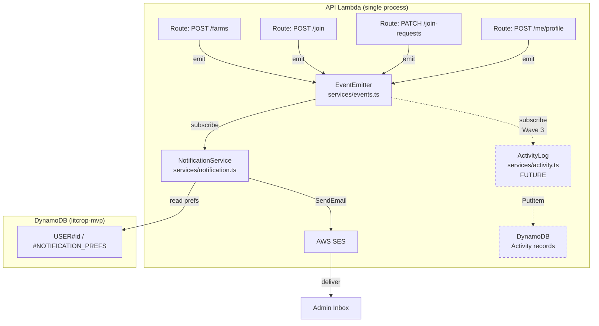

# Beta-4 Design: Admin Email Notifications (#187)

> **Status**: Draft
> **Sprint**: Beta-4 (Wave 2)
> **Issue**: #187
> **Depends on**: Existing admin infrastructure (ADMIN_EMAILS, requireAdmin)
> **Enables**: Wave 3 Activity Log (shared EventEmitter layer)

---

## Table of Contents

1. [ADR: Notification Architecture](#1-adr-notification-architecture)
2. [Event Catalog](#2-event-catalog)
3. [CDK Design](#3-cdk-design)
4. [Service Design](#4-service-design)
5. [API Contract](#5-api-contract)
6. [Frontend Spec](#6-frontend-spec)
7. [i18n Keys](#7-i18n-keys)
8. [Test Plan](#8-test-plan)

---

## 1. ADR: Notification Architecture

### ADR-20260401: Email Notification Delivery Mechanism

**Status**: Proposed

#### Context

LitCrop needs to notify admin users when significant events occur (user signup, farm
lifecycle, join request flow, account deletion). The system currently has no email-sending
capability beyond Cognito transactional emails (verification, password reset). Monthly
email volume is estimated at fewer than 50 emails. The AWS budget constraint is ~$1.18/month
with a $5 ceiling.

This service is also the **foundation for Wave 3 Activity Log** -- the event-capture
abstraction designed here must be reusable by a future activity log subscriber without
changes to the emitting code.

#### Options Considered

##### Option A: SES Direct from Lambda

- **Description**: API Lambda calls SES `SendEmail` directly from within route handlers,
  via an in-process EventEmitter that decouples emission from delivery.
- **Pros**:
  - Simplest architecture -- no new AWS services beyond SES
  - Zero additional cost (SES sandbox: 200 emails/day free to verified addresses)
  - Single Lambda, no fan-out latency
  - EventEmitter abstraction gives Wave 3 a subscription point for free
- **Cons**:
  - Email sending adds ~50-200ms to request latency (mitigated: fire-and-forget with
    error logging, not awaited on the request path)
  - If Lambda cold-starts coincide with SES calls, first request may be slower
  - No built-in retry for failed sends (acceptable at <50 emails/month; log failures)
- **Effort**: Low
- **Cost**: $0.00 (sandbox) or $0.005/month at 50 emails (production SES)

##### Option B: SNS Fan-out to SES

- **Description**: Lambda publishes to an SNS topic; an SNS-SES subscription or a second
  Lambda subscriber sends the email.
- **Pros**:
  - Built-in retry via SNS delivery policies
  - Decoupled: adding subscribers is easy
- **Cons**:
  - Additional infrastructure (SNS topic, subscription, possibly second Lambda)
  - SNS does not natively format HTML emails -- still needs a Lambda subscriber
  - Overkill for <50 emails/month with a single notification channel (email)
  - Adds ~$0.01/month SNS cost (negligible but non-zero complexity cost)
- **Effort**: Medium

##### Option C: EventBridge to Lambda to SES

- **Description**: Lambda emits events to EventBridge; a rule triggers a notification
  Lambda that sends via SES.
- **Pros**:
  - Schema registry, event replay, filtering rules
  - Best for multi-consumer, multi-channel architectures
- **Cons**:
  - Significant complexity for the current scale
  - EventBridge adds latency (typically 500ms+)
  - Requires a second Lambda function
  - Over-engineered for admin-only notifications at MVP scale
- **Effort**: High

#### Decision

**Option A: SES Direct from Lambda** with an in-process `EventEmitter` abstraction.

The EventEmitter is a simple typed pub/sub within the Lambda process -- NOT AWS
EventBridge. It provides:

1. **Decoupling**: Route handlers emit events; the notification service subscribes.
   Route code never imports SES or knows about email delivery.
2. **Extensibility**: Wave 3 Activity Log subscribes to the same events to write
   audit records. No route changes needed.
3. **Testability**: Events can be tested independently of email delivery.

SES will be used in **sandbox mode** for Beta-4. Sandbox restricts sending to verified
email addresses only, which is acceptable because only admin emails (from `ADMIN_EMAILS`
env var) receive notifications. Each admin email must be verified in SES before deployment.
Revisit sandbox exit for production if non-admin recipients are needed.

#### Rationale

At <50 emails/month with a single recipient group (admins), the simplest solution wins.
SNS fan-out and EventBridge add infrastructure complexity without proportional benefit.
The in-process EventEmitter gives us the decoupling and extensibility we need for Wave 3
without the operational overhead of distributed messaging.

#### Consequences

**Positive**:
- Zero incremental AWS cost (SES sandbox free tier)
- Single service to monitor (existing API Lambda)
- Wave 3 Activity Log gets a ready-made event subscription layer
- No new Lambda functions, no new infrastructure services

**Negative**:
- No automatic retry on SES send failure (mitigated: log + alert, manual re-send)
- Email delivery is best-effort, not guaranteed (acceptable for admin notifications)
- If Lambda process crashes mid-request, queued events are lost (extremely rare)
- SES sandbox requires manual verification of each admin email address

#### Progression Criteria

| Current Level | Next Level | Trigger |
|---------------|------------|---------|
| **MVP** (this) | Production | Non-admin recipients needed, or >200 emails/day, or retry/guarantee requirements emerge |

To advance to Production:
- Exit SES sandbox (requires AWS support request)
- Add DLQ or SNS fan-out for guaranteed delivery
- Add bounce/complaint handling via SES notifications

---

## 2. Event Catalog

All events follow a common envelope:

```typescript
interface AppEvent<T extends string, P> {
  type: T;
  timestamp: string;       // ISO 8601
  actor_id: string;        // userId who triggered the event
  actor_email: string;     // email of the actor (for display in notifications)
  payload: P;
}
```

### 2.1 Event Definitions

| Event | Trigger Location | Payload | Recipients | Email Subject |
|-------|-----------------|---------|------------|---------------|
| `user.signup` | POST /me/profile (first creation) | `{ user_id, display_name, email }` | All admins | New user registered |
| `farm.created` | POST /farms | `{ farm_id, farm_name }` | All admins | New farm created |
| `farm.deleted` | DELETE /farms/:farmId | `{ farm_id, farm_name }` | All admins | Farm deleted |
| `join_request.submitted` | POST /farms/:farmId/join | `{ farm_id, farm_name, requester_name }` | All admins | New join request |
| `join_request.approved` | PATCH /farms/:farmId/join-requests/:userId (approve) | `{ farm_id, farm_name, target_user_id, target_user_name }` | All admins | Join request approved |
| `join_request.rejected` | PATCH /farms/:farmId/join-requests/:userId (reject) | `{ farm_id, farm_name, target_user_id, target_user_name }` | All admins | Join request rejected |
| `account.deleted` | DELETE /me/profile | `{ user_id, display_name, email }` | All admins | User account deleted |

### 2.2 Payload Schemas

```typescript
// ── Event payload types ────────────────────────────────────────

interface UserSignupPayload {
  user_id: string;
  display_name: string;
  email: string;
}

interface FarmCreatedPayload {
  farm_id: string;
  farm_name: string;
}

interface FarmDeletedPayload {
  farm_id: string;
  farm_name: string;
}

interface JoinRequestSubmittedPayload {
  farm_id: string;
  farm_name: string;
  requester_name: string;
}

interface JoinRequestResolvedPayload {
  farm_id: string;
  farm_name: string;
  target_user_id: string;
  target_user_name: string;
}

interface AccountDeletedPayload {
  user_id: string;
  display_name: string;
  email: string;
}
```

### 2.3 Email Template Summary

All emails use a simple plain-text format for Beta-4 (HTML templates deferred to
production). Format:

```
Subject: [LitCrop] {event subject}

{event description}

Details:
- {key}: {value}
- {key}: {value}

Triggered by: {actor_email}
Time: {timestamp}

--
LitCrop Admin Notification
```

---

## 3. CDK Design

### 3.1 SES Identity

For sandbox mode, each admin email address must be individually verified. This is a
manual step (not CDK-managed) because:
- SES email verification requires the recipient to click a link
- CDK `ses.EmailIdentity` creates the verification request but cannot complete it
- Admin emails are already known (from `ADMIN_EMAILS` env var)

**Manual step** (documented in deployment runbook):
```bash
# For each admin email:
aws ses verify-email-identity --email-address admin@example.com --region ap-northeast-1
# Admin clicks verification link in their inbox
```

### 3.2 Environment Variables

Add to the `apiLambda` environment block in `litcrop-stack.ts`:

```typescript
// Guard: SES_FROM_EMAIL must be set at CDK synth time (not just Lambda runtime).
const sesFromEmail = process.env['SES_FROM_EMAIL'];
if (!sesFromEmail) throw new Error('SES_FROM_EMAIL required for CDK synthesis');

// Existing:
ADMIN_EMAILS: process.env['ADMIN_EMAILS'] ?? ...,

// New:
SES_FROM_EMAIL: sesFromEmail,
SES_REGION: process.env['SES_REGION'] ?? 'ap-northeast-1',
```

`SES_FROM_EMAIL` must be a verified email address. When empty, the notification service
is disabled (graceful degradation -- events still fire for Wave 3 Activity Log, but
no emails are sent).

### 3.3 IAM Permission

Add SES send permission to the API Lambda role:

```typescript
// Grant API Lambda permission to send email via SES
apiLambda.addToRolePolicy(new iam.PolicyStatement({
  actions: ['ses:SendEmail', 'ses:SendRawEmail'],
  resources: ['*'],   // SES does not support resource-level permissions for SendEmail
  conditions: {
    StringEquals: {
      'ses:FromAddress': process.env['SES_FROM_EMAIL'] ?? '',
    },
  },
}));
```

**Note**: The `ses:FromAddress` condition restricts the Lambda to sending only from the
configured sender address, following least-privilege. The `resources: ['*']` is required
because SES `SendEmail` does not support resource ARNs (this is an AWS limitation, not
a policy gap).

### 3.4 CDK-Nag Suppression

A new `AwsSolutions-IAM5` NagSuppression entry is required for the SES wildcard resource:

```typescript
NagSuppressions.addResourceSuppressions(apiLambda, [
  {
    id: 'AwsSolutions-IAM5',
    reason: 'SES SendEmail does not support resource-level ARN restrictions; scoped by ses:FromAddress condition key.',
    appliesTo: ['Resource::*'],
  },
], true);
```

### 3.5 Cost Impact

| Component | Monthly Cost |
|-----------|-------------|
| SES sandbox (verified emails) | $0.00 |
| SES production (if needed) | ~$0.005 (50 emails x $0.10/1000) |
| Additional Lambda execution | ~$0.00 (50ms x 50 invocations) |
| **Total incremental** | **$0.00** (sandbox) |

Well within the $1.18 monthly budget. No ceiling risk.

---

## 4. Service Design

### 4.1 `services/events.ts` -- Typed EventEmitter

This is the **shared foundation layer** for both Wave 2 (notifications) and Wave 3
(activity log). It is an in-process pub/sub, not an AWS service.

```typescript
// src/api/src/services/events.ts

// ── Event type map ──────────────────────────────────────────────
// Add new event types here; all subscribers get type safety.

export interface AppEventMap {
  'user.signup':             AppEvent<'user.signup', UserSignupPayload>;
  'farm.created':            AppEvent<'farm.created', FarmCreatedPayload>;
  'farm.deleted':            AppEvent<'farm.deleted', FarmDeletedPayload>;
  'join_request.submitted':  AppEvent<'join_request.submitted', JoinRequestSubmittedPayload>;
  'join_request.approved':   AppEvent<'join_request.approved', JoinRequestResolvedPayload>;
  'join_request.rejected':   AppEvent<'join_request.rejected', JoinRequestResolvedPayload>;
  'account.deleted':         AppEvent<'account.deleted', AccountDeletedPayload>;

  // Events below are emitted for activity logging (Wave 3) — no email notifications.
  'farm.updated':            AppEvent<'farm.updated', FarmUpdatedPayload>;
  'bed.updated':             AppEvent<'bed.updated', BedUpdatedPayload>;
  'image.uploaded':          AppEvent<'image.uploaded', ImageUploadedPayload>;
  'tag.created':             AppEvent<'tag.created', TagCreatedPayload>;
  'member.joined':           AppEvent<'member.joined', MemberJoinedPayload>;
  'member.removed':          AppEvent<'member.removed', MemberRemovedPayload>;
  'user.profile_updated':    AppEvent<'user.profile_updated', UserProfileUpdatedPayload>;
}

export type AppEventType = keyof AppEventMap;

// ── Envelope ────────────────────────────────────────────────────

export interface AppEvent<T extends string, P> {
  type: T;
  timestamp: string;
  actor_id: string;
  actor_email: string;
  payload: P;
}

// ── Payload types ───────────────────────────────────────────────

export interface UserSignupPayload {
  user_id: string;
  display_name: string;
  email: string;
}

export interface FarmCreatedPayload {
  farm_id: string;
  farm_name: string;
}

export interface FarmDeletedPayload {
  farm_id: string;
  farm_name: string;
}

export interface JoinRequestSubmittedPayload {
  farm_id: string;
  farm_name: string;
  requester_name: string;
}

export interface JoinRequestResolvedPayload {
  farm_id: string;
  farm_name: string;
  target_user_id: string;
  target_user_name: string;
}

export interface AccountDeletedPayload {
  user_id: string;
  display_name: string;
  email: string;
}

// ── Wave 3 payload types (activity logging only) ────────────────

export interface FarmUpdatedPayload {
  farm_id: string;
  farm_name: string;
  changed_fields?: string[];   // optional list of field names that changed
}

export interface BedUpdatedPayload {
  bed_id: string;
  bed_name: string;
  farm_id: string;
  farm_name: string;
  changed_fields?: string[];
}

export interface ImageUploadedPayload {
  image_id: string;
  bed_id: string;
  bed_name: string;
  farm_id: string;
  farm_name: string;
}

export interface TagCreatedPayload {
  image_id: string;
  tag_value: string;
  farm_id: string;
  farm_name: string;
}

export interface MemberJoinedPayload {
  farm_id: string;
  farm_name: string;
  role: string;               // 'observer' | 'member'
}

export interface MemberRemovedPayload {
  farm_id: string;
  farm_name: string;
  removed_user_id: string;
  removed_user_name: string;
}

export interface UserProfileUpdatedPayload {
  changed_fields?: string[];  // optional list of field names that changed
}

// ── EventEmitter ────────────────────────────────────────────────

type Listener<T extends AppEventType> = (event: AppEventMap[T]) => void | Promise<void>;

class TypedEventEmitter {
  private listeners = new Map<string, Set<Function>>();

  on<T extends AppEventType>(type: T, listener: Listener<T>): void {
    if (!this.listeners.has(type)) {
      this.listeners.set(type, new Set());
    }
    this.listeners.get(type)!.add(listener);
  }

  off<T extends AppEventType>(type: T, listener: Listener<T>): void {
    this.listeners.get(type)?.delete(listener);
  }

  /**
   * Emit an event. Listeners are invoked asynchronously (fire-and-forget).
   * Errors in listeners are caught and logged, never propagated to the caller.
   */
  emit<T extends AppEventType>(type: T, event: AppEventMap[T]): void {
    const set = this.listeners.get(type);
    if (!set || set.size === 0) return;
    for (const listener of set) {
      // Fire-and-forget: do not await, do not throw
      Promise.resolve()
        .then(() => listener(event))
        .catch((err) => {
          console.error(`[events] listener error for ${type}:`, err);
        });
    }
  }
}

/** Singleton event bus -- shared across the Lambda process. */
export const appEvents = new TypedEventEmitter();
```

**Key design decisions**:
- **Fire-and-forget**: `emit()` is synchronous from the caller's perspective. Listeners
  run asynchronously and errors are swallowed (logged). This means email failures never
  break the API response.
- **Singleton**: One instance per Lambda process. Module-level initialization ensures
  all subscribers registered at import time are ready.
- **Typed**: TypeScript generics enforce that emitters and subscribers agree on payload
  shapes at compile time.

### 4.1.1 Lambda Execution Model and Fire-and-Forget Risk

After the Lambda handler returns a response, the execution context is frozen. Fire-and-forget SES calls via `Promise.resolve().then(...)` may not complete if Lambda freezes before the microtask runs.

**Accepted risk**: ~5-10% of notification emails may be lost in practice.

**Mitigation for production**: await the SES call (adds 50-200ms latency) or switch to SNS topic publication. Track send failures via CloudWatch metric filter on `[notification] failed to send` log lines.

### 4.2 `services/notification.ts` -- Email Subscriber

```typescript
// src/api/src/services/notification.ts

import { SESClient, SendEmailCommand } from '@aws-sdk/client-ses';
import { appEvents, type AppEventType, type AppEventMap } from './events';

// ── Config ──────────────────────────────────────────────────────

const SES_FROM_EMAIL = process.env['SES_FROM_EMAIL'] ?? '';
const SES_REGION = process.env['SES_REGION'] ?? process.env['AWS_REGION'] ?? 'ap-northeast-1';
const ADMIN_EMAILS: string[] = (process.env['ADMIN_EMAILS'] ?? '')
  .split(',')
  .map(e => e.trim())
  .filter(Boolean);

const ENABLED = SES_FROM_EMAIL.length > 0 && ADMIN_EMAILS.length > 0;

// ── SES Client ──────────────────────────────────────────────────

const ses = ENABLED ? new SESClient({ region: SES_REGION }) : null;

// ── Notification Preferences (DynamoDB) ─────────────────────────

// Default: all event types enabled for all admins
const ALL_EVENT_TYPES: AppEventType[] = [
  'user.signup',
  'farm.created',
  'farm.deleted',
  'join_request.submitted',
  'join_request.approved',
  'join_request.rejected',
  'account.deleted',
];

export const DEFAULT_NOTIFICATION_PREFS: Record<AppEventType, boolean> = {
  'user.signup': true,
  'farm.created': true,
  'farm.deleted': true,
  'join_request.submitted': true,
  'join_request.approved': true,
  'join_request.rejected': true,
  'account.deleted': true,
};

// ── Email formatting ────────────────────────────────────────────

const EMAIL_SUBJECTS: Record<AppEventType, string> = {
  'user.signup': 'New user registered',
  'farm.created': 'New farm created',
  'farm.deleted': 'Farm deleted',
  'join_request.submitted': 'New join request',
  'join_request.approved': 'Join request approved',
  'join_request.rejected': 'Join request rejected',
  'account.deleted': 'User account deleted',
};

function formatEmailBody<T extends AppEventType>(event: AppEventMap[T]): string {
  const lines: string[] = [];

  switch (event.type) {
    case 'user.signup': {
      const p = event.payload as { user_id: string; display_name: string; email: string };
      lines.push('A new user has registered on LitCrop.');
      lines.push('');
      lines.push('Details:');
      lines.push(`- Display name: ${p.display_name || '(not set)'}`);
      lines.push(`- Email: ${p.email}`);
      break;
    }
    case 'farm.created': {
      const p = event.payload as { farm_id: string; farm_name: string };
      lines.push('A new farm has been created.');
      lines.push('');
      lines.push('Details:');
      lines.push(`- Farm: ${p.farm_name}`);
      lines.push(`- Farm ID: ${p.farm_id}`);
      break;
    }
    case 'farm.deleted': {
      const p = event.payload as { farm_id: string; farm_name: string };
      lines.push('A farm has been deleted.');
      lines.push('');
      lines.push('Details:');
      lines.push(`- Farm: ${p.farm_name}`);
      lines.push(`- Farm ID: ${p.farm_id}`);
      break;
    }
    case 'join_request.submitted': {
      const p = event.payload as { farm_id: string; farm_name: string; requester_name: string };
      lines.push('A user has requested to join a farm.');
      lines.push('');
      lines.push('Details:');
      lines.push(`- Farm: ${p.farm_name}`);
      lines.push(`- Requester: ${p.requester_name || '(anonymous)'}`);
      break;
    }
    case 'join_request.approved': {
      const p = event.payload as { farm_id: string; farm_name: string; target_user_name: string };
      lines.push('A join request has been approved.');
      lines.push('');
      lines.push('Details:');
      lines.push(`- Farm: ${p.farm_name}`);
      lines.push(`- User: ${p.target_user_name || '(unknown)'}`);
      break;
    }
    case 'join_request.rejected': {
      const p = event.payload as { farm_id: string; farm_name: string; target_user_name: string };
      lines.push('A join request has been rejected.');
      lines.push('');
      lines.push('Details:');
      lines.push(`- Farm: ${p.farm_name}`);
      lines.push(`- User: ${p.target_user_name || '(unknown)'}`);
      break;
    }
    case 'account.deleted': {
      const p = event.payload as { user_id: string; display_name: string; email: string };
      lines.push('A user has deleted their account.');
      lines.push('');
      lines.push('Details:');
      lines.push(`- Display name: ${p.display_name || '(not set)'}`);
      lines.push(`- Email: ${p.email}`);
      break;
    }
  }

  lines.push('');
  lines.push(`Triggered by: ${event.actor_email || event.actor_id}`);
  lines.push(`Time: ${event.timestamp}`);
  lines.push('');
  lines.push('--');
  lines.push('LitCrop Admin Notification');

  return lines.join('\n');
}

// ── Send helper ─────────────────────────────────────────────────

async function sendToAdmins(
  subject: string,
  body: string,
  eventType: AppEventType,
): Promise<void> {
  if (!ses) return;

  // TODO (Beta-4 implementation): Load per-admin preferences from DynamoDB
  // and filter ADMIN_EMAILS by opt-in status for this eventType.
  // For now, send to all admins.
  const recipients = ADMIN_EMAILS;
  if (recipients.length === 0) return;

  try {
    await ses.send(new SendEmailCommand({
      Source: SES_FROM_EMAIL,
      Destination: { ToAddresses: recipients },
      Message: {
        Subject: { Data: `[LitCrop] ${subject}`, Charset: 'UTF-8' },
        Body: {
          Text: { Data: body, Charset: 'UTF-8' },
        },
      },
    }));
    console.log(`[notification] sent ${eventType} email to ${recipients.length} admin(s)`);
  } catch (err) {
    // Fire-and-forget: log error but never throw
    console.error(`[notification] failed to send ${eventType} email:`, err);
  }
}

// ── Subscribe to events ─────────────────────────────────────────

function initNotificationSubscriptions(): void {
  if (!ENABLED) {
    console.log('[notification] disabled: SES_FROM_EMAIL or ADMIN_EMAILS not configured');
    return;
  }

  for (const eventType of ALL_EVENT_TYPES) {
    appEvents.on(eventType, (event) => {
      const subject = EMAIL_SUBJECTS[eventType];
      const body = formatEmailBody(event);
      // Do not await -- fire-and-forget
      sendToAdmins(subject, body, eventType);
    });
  }

  console.log(`[notification] subscribed to ${ALL_EVENT_TYPES.length} event types`);
}

// Initialize subscriptions at module load time
initNotificationSubscriptions();
```

### 4.3 DynamoDB: Notification Preferences Entity

**Key pattern** (single-table design):

| PK | SK | Attributes |
|----|-----|------------|
| `USER#{userId}` | `#NOTIFICATION_PREFS` | `prefs: Record<AppEventType, boolean>`, `updated_at: string` |

```typescript
// Added to services/dynamodb.ts

export interface NotificationPrefs {
  prefs: Record<string, boolean>;  // keys are AppEventType values
  updated_at: string;
}

// In dynamoRepo:

async getNotificationPrefs(userId: string): Promise<NotificationPrefs | null> {
  const result = await ddb.send(new GetCommand({
    TableName: TABLE_NAME,
    Key: { PK: pk.user(userId), SK: '#NOTIFICATION_PREFS' },
  }));
  return result.Item ? (result.Item as NotificationPrefs) : null;
}

async upsertNotificationPrefs(
  userId: string,
  prefs: Record<string, boolean>,
): Promise<NotificationPrefs> {
  const now = new Date().toISOString();
  await ddb.send(new PutCommand({
    TableName: TABLE_NAME,
    Item: {
      PK: pk.user(userId),
      SK: '#NOTIFICATION_PREFS',
      prefs,
      updated_at: now,
    },
  }));
  return { prefs, updated_at: now };
}
```

### 4.4 Event Emission Points

Where `appEvents.emit(...)` calls are added in existing route handlers:

**Wave 2 events (email notifications + activity log):**

| File | Location | Event |
|------|----------|-------|
| `routes/me.ts` | After `upsertUserProfile()` (first creation only) | `user.signup` |
| `routes/farms.ts` | After successful `createFarm()` | `farm.created` |
| `routes/farms.ts` | After successful `deleteFarm()` | `farm.deleted` |
| `routes/farms.ts` | After successful `createJoinRequest()` | `join_request.submitted` |
| `routes/farms.ts` | After `approveJoinRequest()` | `join_request.approved` |
| `routes/farms.ts` | After `rejectJoinRequest()` | `join_request.rejected` |
| `routes/me.ts` | After account deletion (when implemented) | `account.deleted` |

**Wave 3 events (activity log only — no email notification):**

| File | Location | Event |
|------|----------|-------|
| `routes/farms.ts` | After successful `updateFarm()` | `farm.updated` |
| `routes/beds.ts` | After successful `updateBed()` | `bed.updated` |
| `routes/images.ts` | After successful image upload / S3 put | `image.uploaded` |
| `routes/tags.ts` | After successful `createTag()` | `tag.created` |
| `routes/farms.ts` | After `approveJoinRequest()` (member now active) | `member.joined` |
| `routes/farms.ts` | After `removeMember()` | `member.removed` |
| `routes/me.ts` | After `upsertUserProfile()` (subsequent updates, not first creation) | `user.profile_updated` |

**Example emission** (in farms.ts after farm creation):

```typescript
import { appEvents } from '../services/events';

// After: const farm = await dynamoRepo.createFarm(...)
appEvents.emit('farm.created', {
  type: 'farm.created',
  timestamp: new Date().toISOString(),
  actor_id: userId,
  actor_email: userEmail,
  payload: { farm_id: farm.id, farm_name: farm.name },
});
```

### 4.5 Module Initialization

In `app.ts`, import the notification service to trigger subscription registration:

```typescript
// ── Notification subscriptions (must import to initialize) ──────
import './services/notification';
```

This import executes `initNotificationSubscriptions()` at module load time, before any
requests are handled. The events service (`events.ts`) is imported transitively.

---

## 5. API Contract

### 5.1 GET /api/v1/me/notification-preferences

**Auth**: Required (JWT). Admin-only (403 for non-admins).

**Response** `200 OK`:
```json
{
  "prefs": {
    "user.signup": true,
    "farm.created": true,
    "farm.deleted": true,
    "join_request.submitted": true,
    "join_request.approved": false,
    "join_request.rejected": false,
    "account.deleted": true
  },
  "updated_at": "2026-04-01T10:00:00.000Z"
}
```

If no preferences are stored, returns defaults (all `true`).

**Error responses**:
- `401` -- Missing or invalid JWT
- `403` -- Not an admin (`{ error: { code: "FORBIDDEN", message: "Not authorized" } }`)

### 5.2 PATCH /api/v1/me/notification-preferences

**Auth**: Required (JWT). Admin-only (403 for non-admins).

**Request body**:
```json
{
  "prefs": {
    "join_request.approved": false,
    "join_request.rejected": false
  }
}
```

Partial update: only the keys present in the request body are changed. Omitted keys
retain their current values. Unknown keys are rejected (400).

**Response** `200 OK`:
```json
{
  "prefs": {
    "user.signup": true,
    "farm.created": true,
    "farm.deleted": true,
    "join_request.submitted": true,
    "join_request.approved": false,
    "join_request.rejected": false,
    "account.deleted": true
  },
  "updated_at": "2026-04-01T10:30:00.000Z"
}
```

**Error responses**:
- `400` -- Invalid body or unknown event type key
- `401` -- Missing or invalid JWT
- `403` -- Not an admin

### 5.3 Route Registration

In `app.ts`:

```typescript
// Auth middleware
app.use('/api/v1/me/notification-preferences', authMiddleware);

// Route (handled in me.ts router)
// GET|PATCH /api/v1/me/notification-preferences
```

In `routes/me.ts`:

```typescript
// GET /api/v1/me/notification-preferences
router.get('/notification-preferences', async (c) => {
  const { userId, isAdmin } = getAuthContext(c);
  if (!isAdmin) {
    return c.json({ error: { code: 'FORBIDDEN', message: 'Not authorized' } }, 403);
  }
  const stored = await dynamoRepo.getNotificationPrefs(userId);
  const prefs = stored?.prefs ?? DEFAULT_NOTIFICATION_PREFS;
  return c.json({
    prefs,
    updated_at: stored?.updated_at ?? '',
  });
});

// PATCH /api/v1/me/notification-preferences
router.patch('/notification-preferences', async (c) => {
  const { userId, isAdmin } = getAuthContext(c);
  if (!isAdmin) {
    return c.json({ error: { code: 'FORBIDDEN', message: 'Not authorized' } }, 403);
  }
  const body = await c.req.json();
  // Validate: body.prefs must be an object with known event type keys and boolean values
  const incoming = body['prefs'];
  if (!incoming || typeof incoming !== 'object') {
    throw new ValidationError('prefs must be an object');
  }
  for (const [key, value] of Object.entries(incoming)) {
    if (!(key in DEFAULT_NOTIFICATION_PREFS)) {
      throw new ValidationError(`Unknown event type: ${key}`);
    }
    if (typeof value !== 'boolean') {
      throw new ValidationError(`Value for ${key} must be a boolean`);
    }
  }
  // Merge with existing or defaults
  const stored = await dynamoRepo.getNotificationPrefs(userId);
  const merged = { ...(stored?.prefs ?? DEFAULT_NOTIFICATION_PREFS), ...incoming };
  const result = await dynamoRepo.upsertNotificationPrefs(userId, merged);
  return c.json(result);
});
```

---

## 6. Frontend Spec

### 6.1 Location

Add a **"Notifications"** section to the existing AdminDashboard as the **5th tab**.

> **Final tab order: System | Users | Farms | Activity | Notifications.** AdminDashboard will have 5 tabs total. The Activity tab (Wave 3) is the 4th tab; Notifications is the 5th.

**Recommendation**: New tab, to keep the System tab focused on metrics.

### 6.2 UI Components

```
+------------------------------------------------------------------+
| Admin Dashboard                                                   |
| [System] [Users] [Farms] [Activity] [Notifications]              |
+------------------------------------------------------------------+
|                                                    |
|  Email Notification Preferences                    |
|                                                    |
|  Choose which events trigger email notifications.  |
|                                                    |
|  User Events                                       |
|  +----------------------------------------------+  |
|  | New user registered        [====ON====]      |  |
|  | User account deleted       [====ON====]      |  |
|  +----------------------------------------------+  |
|                                                    |
|  Farm Events                                       |
|  +----------------------------------------------+  |
|  | New farm created           [====ON====]      |  |
|  | Farm deleted               [====ON====]      |  |
|  +----------------------------------------------+  |
|                                                    |
|  Join Request Events                               |
|  +----------------------------------------------+  |
|  | Join request submitted     [====ON====]      |  |
|  | Join request approved      [===OFF====]      |  |
|  | Join request rejected      [===OFF====]      |  |
|  +----------------------------------------------+  |
|                                                    |
|  [Save]                                            |
|                                                    |
+--------------------------------------------------+
```

### 6.3 Behavior

- **Load**: Fetch `GET /api/v1/me/notification-preferences` on tab mount.
  Display toggles reflecting current state. Default all ON if no stored preferences.
- **Toggle**: Each toggle is immediate in the UI (optimistic). On change, debounce
  300ms then PATCH with all changed values.
- **Save**: Alternative to auto-save: a "Save" button that sends the PATCH. Prefer
  explicit save to match the existing settings UX pattern in the Profile page.
- **Error**: Toast notification on save failure. Revert toggles to server state.
- **Non-admin**: The "Notifications" tab is only rendered when `is_admin === true` in
  the user profile response.

### 6.4 API Integration

```typescript
// src/frontend/src/lib/api.ts (or similar)

export async function getNotificationPrefs(): Promise<NotificationPrefsResponse> {
  return fetchApi('/api/v1/me/notification-preferences');
}

export async function updateNotificationPrefs(
  prefs: Partial<Record<string, boolean>>
): Promise<NotificationPrefsResponse> {
  return fetchApi('/api/v1/me/notification-preferences', {
    method: 'PATCH',
    body: JSON.stringify({ prefs }),
  });
}
```

---

## 7. i18n Keys

### 7.1 English (`en.json`)

```json
{
  "notifications": {
    "tab": "Notifications",
    "title": "Email Notification Preferences",
    "description": "Choose which events trigger email notifications.",
    "section_user": "User Events",
    "section_farm": "Farm Events",
    "section_join": "Join Request Events",
    "user_signup": "New user registered",
    "account_deleted": "User account deleted",
    "farm_created": "New farm created",
    "farm_deleted": "Farm deleted",
    "join_request_submitted": "Join request submitted",
    "join_request_approved": "Join request approved",
    "join_request_rejected": "Join request rejected",
    "save": "Save",
    "saved": "Preferences saved",
    "save_error": "Could not save preferences"
  }
}
```

### 7.2 Japanese (`ja.json`)

```json
{
  "notifications": {
    "tab": "通知",
    "title": "メール通知設定",
    "description": "メール通知を受け取るイベントを選択してください。",
    "section_user": "ユーザーイベント",
    "section_farm": "農場イベント",
    "section_join": "参加リクエストイベント",
    "user_signup": "新規ユーザー登録",
    "account_deleted": "ユーザーアカウント削除",
    "farm_created": "新しい農場の作成",
    "farm_deleted": "農場の削除",
    "join_request_submitted": "参加リクエスト送信",
    "join_request_approved": "参加リクエスト承認",
    "join_request_rejected": "参加リクエスト拒否",
    "save": "保存",
    "saved": "設定を保存しました",
    "save_error": "設定の保存に失敗しました"
  }
}
```

---

## 8. Test Plan

### 8.1 Unit Tests: EventEmitter (`services/events.ts`)

| Test | Description |
|------|-------------|
| `emit with no listeners` | Emitting an event with no subscribers does not throw |
| `emit fires listener` | Registered listener receives the correct event payload |
| `emit multiple listeners` | All registered listeners for the same event type are called |
| `listener error isolation` | A throwing listener does not prevent other listeners from running |
| `off removes listener` | Unsubscribed listener is not called on subsequent emit |
| `type safety` | TypeScript compiler rejects mismatched event type and payload |

### 8.2 Unit Tests: Notification Service (`services/notification.ts`)

| Test | Description |
|------|-------------|
| `disabled when SES_FROM_EMAIL empty` | No SES calls when env var is missing |
| `disabled when ADMIN_EMAILS empty` | No SES calls when no admins configured |
| `sends email on event` | SES SendEmailCommand is called with correct params for each event type |
| `email subject format` | Subject matches `[LitCrop] {event subject}` pattern |
| `email body content` | Body contains event details, actor, and timestamp |
| `SES error does not throw` | SES client failure is caught and logged, does not propagate |

**Mocking strategy**: Mock `@aws-sdk/client-ses` using `vi.mock()` (Vitest). Assert
`SendEmailCommand` input matches expectations.

### 8.3 Integration Tests: API Endpoints

| Test | Description |
|------|-------------|
| `GET prefs -- non-admin 403` | Non-admin user receives 403 |
| `GET prefs -- admin default` | Admin with no stored prefs gets all-true defaults |
| `GET prefs -- admin stored` | Admin with stored prefs gets correct values |
| `PATCH prefs -- non-admin 403` | Non-admin user receives 403 |
| `PATCH prefs -- partial update` | Only specified keys are changed; others retain values |
| `PATCH prefs -- unknown key 400` | Unknown event type key returns validation error |
| `PATCH prefs -- non-boolean 400` | Non-boolean value returns validation error |

### 8.4 Integration Tests: Event Emission

| Test | Description |
|------|-------------|
| `farm.created emitted` | Creating a farm emits the event with correct payload |
| `join_request.submitted emitted` | Submitting a join request emits the event |
| `join_request.approved emitted` | Approving a join request emits the event |
| `join_request.rejected emitted` | Rejecting a join request emits the event |
| `user.signup emitted` | First profile creation emits the event |

**Strategy**: Subscribe a test listener to `appEvents` before invoking the route handler.
Assert the listener received the expected event. No SES calls needed (test the emitter,
not the subscriber).

### 8.5 Manual Testing Checklist

- [ ] Verify SES sender email in sandbox: `aws ses verify-email-identity`
- [ ] Verify admin recipient email(s) in sandbox
- [ ] Create a new user -- admin receives signup email
- [ ] Create a farm -- admin receives farm created email
- [ ] Submit join request -- admin receives join request email
- [ ] Approve/reject join request -- admin receives resolution email
- [ ] Toggle notification preference OFF, repeat action -- no email sent
- [ ] Check CloudWatch logs for `[notification]` log lines

---

## Appendix A: Architecture Diagram



## Appendix B: Deployment Runbook Additions

### Pre-deployment (one-time SES setup)

```bash
# 1. Verify sender email
aws ses verify-email-identity \
  --email-address noreply@litcrop.example.com \
  --region ap-northeast-1

# 2. Verify each admin recipient email (sandbox requirement)
aws ses verify-email-identity \
  --email-address admin1@example.com \
  --region ap-northeast-1

# 3. Check verification status
aws ses get-identity-verification-attributes \
  --identities noreply@litcrop.example.com admin1@example.com \
  --region ap-northeast-1
```

### Environment variables to set before `cdk deploy`

```bash
export SES_FROM_EMAIL=noreply@litcrop.example.com
export ADMIN_EMAILS=admin1@example.com          # already required
```

### Post-deployment verification

```bash
# Send test email via SES CLI
aws ses send-email \
  --from noreply@litcrop.example.com \
  --to admin1@example.com \
  --subject "[LitCrop] Test notification" \
  --text "This is a test email from the LitCrop notification system." \
  --region ap-northeast-1
```

## Appendix C: File Change Summary

| File | Change |
|------|--------|
| `src/api/src/services/events.ts` | **New** -- Typed EventEmitter |
| `src/api/src/services/notification.ts` | **New** -- SES email subscriber |
| `src/api/src/services/dynamodb.ts` | Add `getNotificationPrefs`, `upsertNotificationPrefs` |
| `src/api/src/routes/me.ts` | Add GET/PATCH notification-preferences endpoints, emit `user.signup` |
| `src/api/src/routes/farms.ts` | Add event emissions for farm + join request lifecycle |
| `src/api/src/app.ts` | Import notification service, add auth middleware for new route |
| `infra/lib/litcrop-stack.ts` | Add `SES_FROM_EMAIL`, `SES_REGION` env vars; add SES IAM policy |
| `src/frontend/src/i18n/en.json` | Add `notifications.*` keys |
| `src/frontend/src/i18n/ja.json` | Add `notifications.*` keys |
| `src/frontend/src/components/AdminDashboard.*` | Add Notifications tab |
| `src/frontend/src/lib/api.ts` | Add notification prefs API functions |
