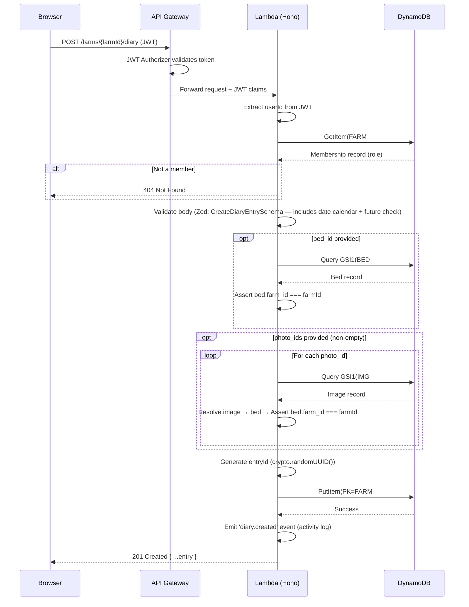
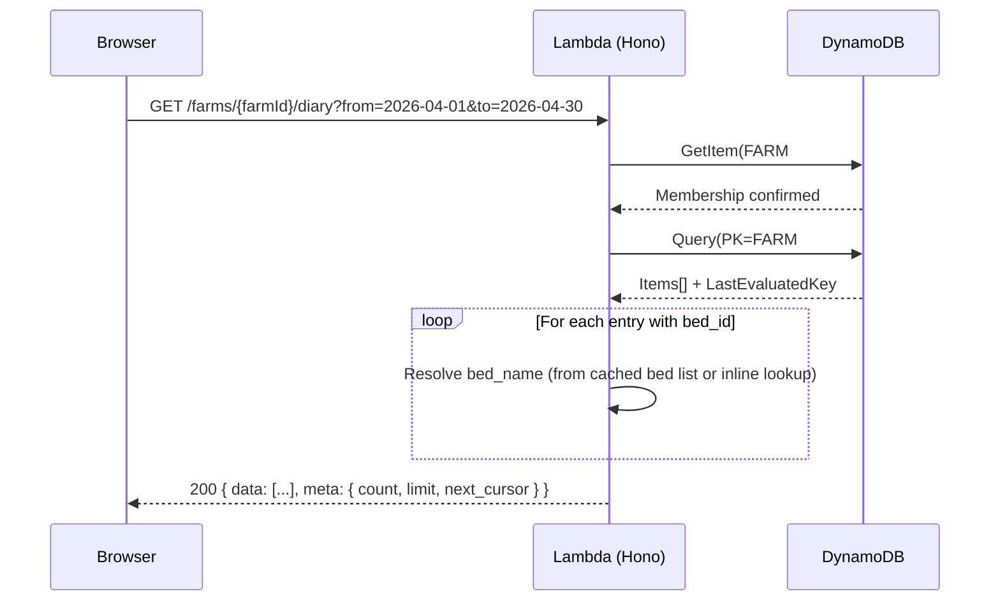
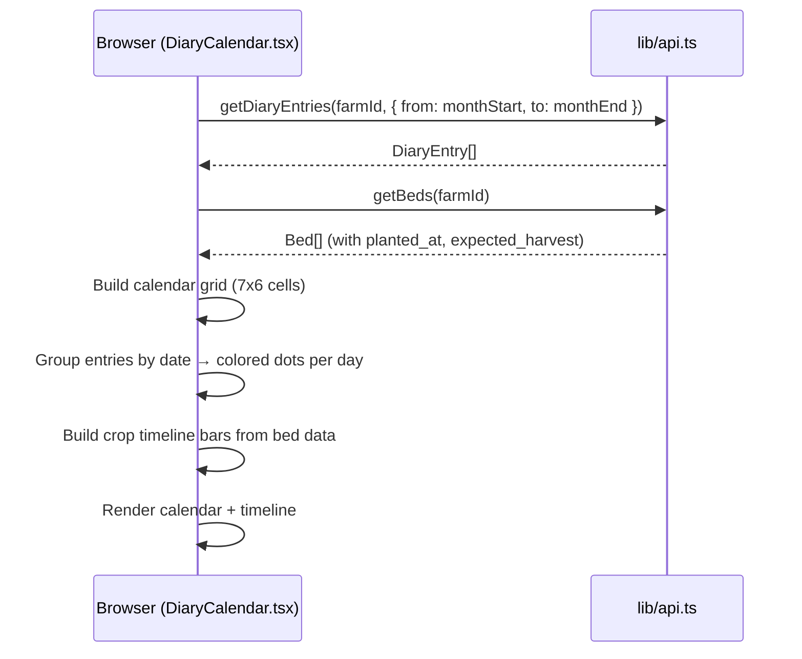

# Beta-7 Design: Farm Diary

> Steps 2-5 of the design pipeline (`cc-design`). Generated 2026-04-03.
> Issues: #245 (epic), #246 (work log), #247 (calendar)
> Prerequisites: `docs/designs/BETA7-REQUIREMENTS.md` (Step 1, remediated)
> Scope Level: **MVP** (incremental — extends existing architecture)

---

## Step 2: Architecture

### 2.1 Architecture Decision: Incremental Extension

The Farm Diary requires **no new AWS resources** — it extends the existing single-table DynamoDB, existing API Lambda, and existing Astro/Preact frontend. This is a feature-level addition, not an architecture change.

| Aspect | Decision | Rationale |
|--------|----------|-----------|
| Data storage | Existing DynamoDB table (`litcrop-mvp`) | Single-table design; diary is another entity under `FARM#` partition |
| API | Existing Hono Lambda | New route file `routes/diary.ts`; reuses auth middleware + `assertFarmAccess` |
| Frontend | Existing Astro + Preact | New page + 4 component islands; extends bottom nav |
| Infrastructure | No CDK changes | On-demand billing; no provisioned capacity to adjust |
| External APIs | None new | Calendar reads existing beds + weather APIs |

### 2.2 New DynamoDB Entity

```
┌─────────────────────────────────────────────────────────────┐
│ Table: litcrop-mvp                                          │
│                                                             │
│ PK: FARM#{farmId}                                           │
│ ├── SK: #META                    (farm metadata)            │
│ ├── SK: BED#01#01#{bedId}        (beds)                     │
│ ├── SK: MEMBER#{userId}          (members)                  │
│ ├── SK: DEVICE#{deviceId}        (devices)       ← Beta-5   │
│ ├── SK: DIARY#{date}#{entryId}   (diary entries) ← Beta-7   │
│ └── SK: ACTIVITY#...             (activity log)             │
│                                                             │
│ GSI1: DIARY#{entryId} → #META   (ID-based lookup) ← Beta-7 │
└─────────────────────────────────────────────────────────────┘
```

### 2.3 Route Registration

```
src/api/src/
├── routes/
│   ├── farms.ts          (existing)
│   ├── beds.ts           (existing)
│   ├── devices.ts        (existing)
│   ├── diary.ts          ← NEW (Beta-7)
│   └── ...
└── app.ts                (add: app.route('/api/v1/farms', diaryRouter))
```

Diary routes are mounted under `/api/v1/farms/:farmId/diary` — farm-scoped, consistent with devices and members.

### 2.4 Frontend Page Architecture

```
src/frontend/src/
├── pages/
│   └── diary.astro              ← NEW (uses BaseLayout with activeTab='diary')
├── components/
│   ├── DiaryPage.tsx            ← NEW (main island: list/calendar toggle)
│   ├── DiaryEntryForm.tsx       ← NEW (create/edit modal)
│   ├── DiaryCalendar.tsx        ← NEW (monthly grid)
│   └── CropTimeline.tsx         ← NEW (horizontal bars)
└── layouts/
    └── BaseLayout.astro         (modified: add Diary tab)
```

### 2.5 Scope Progression

| Level | Diary Features |
|-------|---------------|
| **MVP (Beta-7)** | Work log CRUD, cost tracking, calendar, crop timeline |
| **MVP+ (Beta-8)** | ROI dashboard, Gantt chart, harvest records |
| **Production** | Reminders, CSV export, shareable reports |

---

## Step 3: UX/UI Design

### 3.1 Design Principles Applied

The diary feature follows the existing four design principles:

- **P1 Glanceable**: Calendar dots show farm activity at a glance — colored by category
- **P2 Forgiving Touch**: Entry form uses large touch targets; quick-add button at bottom
- **P3 Progressive Depth**: List view → entry detail → edit form (3-level drill-in)
- **P4 Motion Means Attention**: N/A (no camera integration in diary)

### 3.2 Navigation Change

```
BEFORE (4 tabs):
  🌾 Crops  ⛅ Weather  📡 Device  🌱 Profile

AFTER (5 tabs):
  🌾 Crops  ⛅ Weather  📓 Diary  📡 Device  🌱 Profile
                        ^^^^^^^^
                        NEW (3rd position)
```

Admin tab (6th) remains injected by `AdminTabInjector.tsx`.

**Responsive strategy for 6-tab case:**
At viewports under 360px with 6 tabs, labels are hidden to prevent overflow:
```css
@media (max-width: 359px) {
  .tab-bar__label { display: none; }
  .tab-bar__icon { font-size: 1.25rem; }
}
```
This ensures icon-only tabs at narrow widths. At 360px+, all labels remain visible (5 tabs at 72px = 360px; 6 tabs at 60px = 360px — tight but functional).

### 3.3 Screen Inventory

#### Screen D1: Diary List View (default)

```
┌──────────────────────────────────┐
│ 📓 Farm Diary        [📅] [＋]  │  ← toggle calendar / add entry
│──────────────────────────────────│
│ Today — April 3                  │
│ ┌──────────────────────────────┐ │
│ │ 🌱 Planting        ¥500     │ │  ← category icon + color + cost total
│ │ Planted tomato seedlings A1  │ │  ← description (truncated)
│ │ ⏱ 45min  📷 1               │ │  ← time + photo count
│ └──────────────────────────────┘ │
│ ┌──────────────────────────────┐ │
│ │ 💧 Watering                  │ │
│ │ Morning watering all beds    │ │
│ │ ⏱ 30min                     │ │
│ └──────────────────────────────┘ │
│──────────────────────────────────│
│ Yesterday — April 2              │
│ ┌──────────────────────────────┐ │
│ │ 🛒 Purchase         ¥2,400  │ │
│ │ Bought fertilizer bags       │ │
│ └──────────────────────────────┘ │
│                                  │
│ ┌──────────────────────────────┐ │
│ │   📓 No more entries         │ │  ← end of list
│ └──────────────────────────────┘ │
│                                  │
│ 🌾    ⛅    📓    📡    🌱     │  ← bottom nav
└──────────────────────────────────┘
```

**Interactions:**
- Tap entry card → expand to show full description + cost breakdown + edit/delete
- Tap [+] → open DiaryEntryForm (create mode)
- Tap [📅] → toggle to Calendar view
- Scroll → load more entries (cursor pagination)

#### Screen D2: Diary Calendar View

```
┌──────────────────────────────────┐
│ 📓 Farm Diary        [📋] [＋]  │  ← toggle list / add entry
│──────────────────────────────────│
│       ◀  April 2026  ▶          │
│  Su  Mo  Tu  We  Th  Fr  Sa     │
│                   1   2   3      │
│                  ●   ●●  ●●●    │  ← dots = categories active that day
│   4   5   6   7   8   9  10     │
│                                  │
│  11  12  13  14  15  16  17     │
│              ●                   │
│  18  19  20  21  22  23  24     │
│                                  │
│  25  26  27  28  29  30         │
│──────────────────────────────────│
│ ┌──────────────────────────────┐ │
│ │ CROP TIMELINE                │ │
│ │ ▓▓▓▓▓▓▓▓▓▓░░░░ A1 Tomato    │ │  ← planted → harvest bar
│ │ ▓▓▓▓▓░░░░░░░░░ B2 Lettuce   │ │
│ │ ░░░▓▓▓▓▓▓▓▓▓▓▓ C1 Cucumber  │ │
│ │          ┃ today             │ │  ← current date marker
│ └──────────────────────────────┘ │
│                                  │
│ 🌾    ⛅    📓    📡    🌱     │
└──────────────────────────────────┘
```

**Interactions:**
- Tap a day → show entries for that date (inline expand or filter list)
- Tap crop bar → navigate to `/beds/view?id=<bedId>`
- Swipe/arrows → prev/next month
- Arrow keys → navigate between days (keyboard a11y)

**Calendar UI States:**
| State | Display |
|-------|---------|
| Loading | Skeleton grid (7x5 gray cells, matching existing skeleton pattern) |
| Empty month | Centered text: "No activity this month" (`diary.empty`) with muted icon |
| Error | Reuse error card pattern from FarmOverview (retry button) |
| Populated | Full calendar grid with category dots |

**View Persistence:**
View preference persisted to `localStorage` key `litcrop-diary-view` (values: `'list' | 'calendar'`; default: `'list'`). Read on mount, update on toggle.

#### Screen D3: Diary Entry Form (modal/sheet)

```
┌──────────────────────────────────┐
│ New Entry              [Cancel]  │
│──────────────────────────────────│
│ Date                             │
│ ┌────────────────────────────┐   │
│ │ 2026-04-03            📅  │   │  ← date picker, defaults to today
│ └────────────────────────────┘   │
│                                  │
│ Category *                       │
│ ┌────────────────────────────┐   │
│ │ 🌱 Planting           ▼  │   │  ← dropdown with colored icons
│ └────────────────────────────┘   │
│                                  │
│ Description *                    │
│ ┌────────────────────────────┐   │
│ │ Planted tomato seedlings   │   │  ← textarea, 1-1000 chars
│ │ in bed A1                  │   │
│ └────────────────────────────┘   │
│                                  │
│ Bed (optional)                   │
│ ┌────────────────────────────┐   │
│ │ A1 — Tomato           ▼  │   │  ← dropdown of farm beds
│ └────────────────────────────┘   │
│                                  │
│ Time Spent (optional)            │
│ ┌────────────────────────────┐   │
│ │ 45 minutes                 │   │
│ └────────────────────────────┘   │
│                                  │
│ Costs                    [+ Add] │
│ ┌────────────────────────────┐   │
│ │ Tomato seedlings x10  ¥500│   │  ← inline cost rows
│ └────────────────────────────┘   │
│                                  │
│ ┌────────────────────────────┐   │
│ │        Save Entry          │   │  ← primary button (56px tall)
│ └────────────────────────────┘   │
└──────────────────────────────────┘
```

### 3.4 Category Icons & Colors

| Category | Icon | CSS Variable | Hex |
|----------|------|-------------|-----|
| planting | 🌱 | `--diary-planting` | `#22c55e` |
| watering | 💧 | `--diary-watering` | `#3b82f6` |
| fertilizing | 🧪 | `--diary-fertilizing` | `#a855f7` |
| harvesting | 🌾 | `--diary-harvesting` | `#f59e0b` |
| weeding | 🌿 | `--diary-weeding` | `#84cc16` |
| pest_control | 🐛 | `--diary-pest` | `#ef4444` |
| maintenance | 🔧 | `--diary-maintenance` | `#6b7280` |
| purchase | 🛒 | `--diary-purchase` | `#f97316` |
| other | 📝 | `--diary-other` | `#9ca3af` |

### 3.5 API Design

#### Endpoint: POST /api/v1/farms/:farmId/diary

```
Request:
  POST /api/v1/farms/{farmId}/diary
  Authorization: Bearer <JWT>
  Content-Type: application/json

  {
    "date": "2026-04-03",
    "category": "planting",
    "description": "Planted tomato seedlings in bed A1",
    "time_spent_minutes": 45,
    "bed_id": "bed-uuid-here",
    "photo_ids": [],
    "costs": [
      { "item": "Tomato seedlings x10", "amount": 500, "currency": "JPY" }
    ]
  }

Response: 201 Created
  {
    "id": "entry-uuid",
    "farm_id": "farm-uuid",
    "date": "2026-04-03",
    "category": "planting",
    "description": "Planted tomato seedlings in bed A1",
    "time_spent_minutes": 45,
    "bed_id": "bed-uuid",
    "bed_name": "A1",
    "photo_ids": [],
    "costs": [{ "item": "Tomato seedlings x10", "amount": 500, "currency": "JPY" }],
    "cost_total": 500,
    "created_by": "user-uuid",
    "created_at": "2026-04-03T09:00:00.000Z",
    "updated_at": "2026-04-03T09:00:00.000Z"
  }
```

#### Endpoint: GET /api/v1/farms/:farmId/diary

```
Request:
  GET /api/v1/farms/{farmId}/diary?from=2026-04-01&to=2026-04-30&limit=50
  Authorization: Bearer <JWT>

Response: 200 OK
  {
    "data": [ ...DiaryEntry[] ],
    "meta": {
      "count": 12,
      "limit": 50,
      "next_cursor": null
    }
  }

Notes:
  - Validate query params with DiaryListQuerySchema (max 366-day range)
  - SK query: between('DIARY#2026-04-01', 'DIARY#2026-04-30~')
  - ScanIndexForward: false (newest first)
  - Category filter applied client-side (low volume)
  - Cursor validation: decode base64url, verify PK starts with FARM#{farmId} and SK starts with DIARY#. Throw BadCursorError on mismatch (matches beds.ts pattern).

Errors:
  - 400: Invalid date range, bad cursor, validation error
  - 404: Farm not found or not a member
```

#### Endpoint: GET /api/v1/farms/:farmId/diary/:entryId

```
Request:
  GET /api/v1/farms/{farmId}/diary/{entryId}
  Authorization: Bearer <JWT>

Response: 200 OK
  { ...DiaryEntry }

Security:
  1. assertFarmAccess(farmId, userId) — verify farm membership
  2. Fetch entry via GSI1 (DIARY#{entryId})
  3. Verify entry.farm_id === farmId (IDOR prevention per FR-1.6)
```

#### Endpoint: PATCH /api/v1/farms/:farmId/diary/:entryId

```
Request:
  PATCH /api/v1/farms/{farmId}/diary/{entryId}
  Authorization: Bearer <JWT>
  Content-Type: application/json

  { "description": "Updated description", "costs": [...] }

Security:
  1. assertFarmAccess(farmId, userId)
  2. Fetch entry via GSI1 (GSI1PK=DIARY#{entryId}, GSI1SK=DDB_KEY_PREFIXES.META)
  3. Verify entry.farm_id === farmId (IDOR guard)
  4. Verify entry.created_by === userId OR user role is admin/owner
  5. Apply ONLY Zod-parsed fields from UpdateDiaryEntrySchema — never spread raw request body

Errors:
  - 404: Entry not found or farm_id mismatch
  - 403: Not creator and not admin/owner
  - 400: Validation error (Zod)
```

#### Endpoint: DELETE /api/v1/farms/:farmId/diary/:entryId

```
Same security flow as PATCH.
Response: 204 No Content
```

---

## Step 4: System Design (Sequence Diagrams)

### 4.1 Create Diary Entry



### 4.2 List Diary Entries (Date Range)



### 4.3 Calendar Data Flow



### 4.4 Zod Schemas

```typescript
// packages/shared/src/schemas/index.ts — additions

export const DiaryCategorySchema = z.enum([
  'planting', 'watering', 'fertilizing', 'harvesting',
  'weeding', 'pest_control', 'maintenance', 'purchase', 'other',
]);

export const CostItemSchema = z.object({
  item: z.string().min(1).max(100).trim(),
  amount: z.number().min(0).max(99_999_999),
  currency: z.enum(['JPY', 'USD']),
});

export const CreateDiaryEntrySchema = z.object({
  date: z.string()
    .regex(/^\d{4}-\d{2}-\d{2}$/, 'Date must be YYYY-MM-DD')
    .refine(s => !isNaN(Date.parse(s)), { message: 'Invalid calendar date' })
    .refine(s => {
      const tomorrow = new Date(Date.now() + 86_400_000).toISOString().slice(0, 10);
      return s <= tomorrow;
    }, { message: 'Date cannot be more than 1 day in the future' }),
  category: DiaryCategorySchema,
  description: z.string().min(1).max(1000).trim(),
  time_spent_minutes: z.number().int().min(1).max(1440).nullable().optional(),
  bed_id: z.string().uuid().nullable().optional(),
  photo_ids: z.array(z.string().uuid()).max(5).default([]),
  costs: z.array(CostItemSchema).max(10).default([]),
});

export const DiaryListQuerySchema = z.object({
  from: z.string().regex(/^\d{4}-\d{2}-\d{2}$/).optional(),
  to: z.string().regex(/^\d{4}-\d{2}-\d{2}$/).optional(),
  category: DiaryCategorySchema.optional(),
  limit: z.coerce.number().int().min(1).max(100).default(50),
  cursor: z.string().optional(),
}).refine(data => {
  if (data.from && data.to) {
    const diff = (Date.parse(data.to) - Date.parse(data.from)) / 86_400_000;
    return diff >= 0 && diff <= 366;
  }
  return true;
}, { message: 'Date range must be 0-366 days' });

export const UpdateDiaryEntrySchema = CreateDiaryEntrySchema
  .omit({ date: true })
  .partial();

// SECURITY: PATCH handlers MUST apply only Zod-parsed fields from
// UpdateDiaryEntrySchema. Never merge raw request body onto the stored
// DynamoDB item — this prevents injection of farm_id, created_by, or
// other server-controlled fields.

export const DiaryEntryResponseSchema = z.object({
  id: z.string().uuid(),
  farm_id: z.string().uuid(),
  date: z.string(),
  category: DiaryCategorySchema,
  description: z.string(),
  time_spent_minutes: z.number().nullable(),
  bed_id: z.string().uuid().nullable(),
  bed_name: z.string().nullable(),
  photo_ids: z.array(z.string().uuid()),
  costs: z.array(CostItemSchema),
  cost_total: z.number(),
  created_by: z.string(),
  created_at: z.string(),
  updated_at: z.string(),
});
```

### 4.5 TypeScript Types

```typescript
// packages/shared/src/types/domain.ts — additions

export type DiaryCategory =
  | 'planting' | 'watering' | 'fertilizing' | 'harvesting'
  | 'weeding' | 'pest_control' | 'maintenance' | 'purchase' | 'other';

export interface CostItem {
  item: string;
  amount: number;
  currency: 'JPY' | 'USD';
}

export interface DiaryEntry {
  id: string;
  farm_id: string;
  date: string;           // YYYY-MM-DD
  category: DiaryCategory;
  description: string;
  time_spent_minutes: number | null;
  bed_id: string | null;
  photo_ids: string[];
  costs: CostItem[];
  created_by: string;
  created_at: string;     // ISO 8601
  updated_at: string;     // ISO 8601
}

export interface DiaryEntryResponse extends DiaryEntry {
  bed_name: string | null;
  cost_total: number;
}
```

### 4.6 Event Emissions (optional — enhances activity feed)

> Note: Event emissions are not required by any FR or AC. They enhance the existing activity log feed. Task T1.4 is optional and does not block acceptance criteria.

```typescript
// New events for activity log integration
appEvents.emit('diary.created', {
  type: 'diary.created',
  timestamp: new Date().toISOString(),
  actor_id: userId,
  actor_email: userEmail,
  payload: { farm_id: farmId, entry_id: entry.id, category: entry.category, date: entry.date },
});

// Also: diary.updated, diary.deleted
```

### 4.7 Frontend API Functions

```typescript
// lib/api.ts — additions

export async function getDiaryEntries(
  farmId: string,
  params?: { from?: string; to?: string; category?: string; limit?: number; cursor?: string }
): Promise<PaginatedResponse<DiaryEntryResponse>> { ... }

export async function getDiaryEntry(farmId: string, entryId: string): Promise<DiaryEntryResponse> { ... }

export async function createDiaryEntry(farmId: string, data: CreateDiaryEntryRequest): Promise<DiaryEntryResponse> { ... }

export async function updateDiaryEntry(farmId: string, entryId: string, data: Partial<CreateDiaryEntryRequest>): Promise<DiaryEntryResponse> { ... }

export async function deleteDiaryEntry(farmId: string, entryId: string): Promise<void> { ... }
```

### 4.8 i18n Keys

```json
// en.json additions
{
  "nav": {
    "diary": "Diary"
  },
  "diary": {
    "title": "Farm Diary",
    "empty": "No entries yet",
    "empty_cta": "Log your first activity",
    "add": "New Entry",
    "edit": "Edit Entry",
    "delete": "Delete Entry",
    "delete_confirm": "Delete this diary entry?",
    "date": "Date",
    "category": "Category",
    "description": "Description",
    "time_spent": "Time Spent",
    "time_minutes": "{{count}} min",
    "bed": "Bed",
    "bed_optional": "Bed (optional)",
    "bed_deleted": "(deleted bed)",
    "costs": "Costs",
    "cost_add": "Add Cost",
    "cost_item": "Item",
    "cost_amount": "Amount",
    "cost_currency": "Currency",
    "cost_total": "Total",
    "photos": "Photos",
    "save": "Save Entry",
    "cancel": "Cancel",
    "calendar": "Calendar",
    "list": "List",
    "crop_timeline": "Crop Timeline",
    "categories": {
      "planting": "Planting",
      "watering": "Watering",
      "fertilizing": "Fertilizing",
      "harvesting": "Harvesting",
      "weeding": "Weeding",
      "pest_control": "Pest Control",
      "maintenance": "Maintenance",
      "purchase": "Purchase",
      "other": "Other"
    }
  }
}
```

```json
// ja.json additions
{
  "nav": {
    "diary": "日誌"
  },
  "diary": {
    "title": "農園日誌",
    "empty": "まだ記録がありません",
    "empty_cta": "最初の作業を記録しましょう",
    "add": "新しい記録",
    "edit": "記録を編集",
    "delete": "記録を削除",
    "delete_confirm": "この記録を削除しますか？",
    "date": "日付",
    "category": "カテゴリ",
    "description": "内容",
    "time_spent": "作業時間",
    "time_minutes": "{{count}}分",
    "bed": "畝",
    "bed_optional": "畝（任意）",
    "bed_deleted": "（削除済み）",
    "costs": "費用",
    "cost_add": "費用を追加",
    "cost_item": "項目",
    "cost_amount": "金額",
    "cost_currency": "通貨",
    "cost_total": "合計",
    "photos": "写真",
    "save": "保存",
    "cancel": "キャンセル",
    "calendar": "カレンダー",
    "list": "一覧",
    "crop_timeline": "作物タイムライン",
    "categories": {
      "planting": "植付け",
      "watering": "水やり",
      "fertilizing": "施肥",
      "harvesting": "収穫",
      "weeding": "除草",
      "pest_control": "害虫駆除",
      "maintenance": "整備",
      "purchase": "購入",
      "other": "その他"
    }
  }
}
```

---

## Step 5: Component Tree

```
diary.astro
  └── BaseLayout (activeTab='diary')
        └── DiaryPage.tsx (client:load)
              ├── [Header] Title + View Toggle + Add Button
              │
              ├── [List View] (default)
              │     └── DiaryEntryCard[] (grouped by date)
              │           ├── Category icon + color badge
              │           ├── Description (truncated)
              │           ├── Time + photo count + cost total
              │           └── [Expanded] Full description + costs + edit/delete
              │
              ├── [Calendar View]
              │     ├── DiaryCalendar.tsx
              │     │     ├── Month header with nav arrows
              │     │     ├── Day grid (7x6)
              │     │     │     └── Category dots per day
              │     │     └── Selected day → inline entry list
              │     │
              │     └── CropTimeline.tsx
              │           ├── Bed bars (planted_at → expected_harvest)
              │           ├── Today marker
              │           └── Click → /beds/view?id=
              │
              └── DiaryEntryForm.tsx (bottom sheet on mobile, dialog on desktop)
                    ├── Date picker (default: today)
                    ├── Category dropdown (icons + colors)
                    ├── Description textarea
                    ├── Bed dropdown (farm beds)
                    ├── Time spent input
                    ├── Cost rows (dynamic add/remove)
                    └── Save / Cancel buttons

**DiaryEntryForm presentation:**
- Mobile: **Bottom sheet** sliding up from tab bar (consistent with P2 Forgiving Touch — thumb-zone access). New CSS component `.bottom-sheet` in `components.css` with `z-index: 250` (above tab bar at 200). Includes backdrop overlay and swipe-to-dismiss.
- Desktop: Centered `<dialog>` element with focus trap. Reuse existing `lightbox-overlay` backdrop pattern.
- Both: Scroll lock on body when open; Escape key dismisses.
```

---

## Step 6: Task Breakdown

### Phase 0: Shared (foundation)

| Task | Files | Depends On |
|------|-------|------------|
| T0.1 Add DIARY prefix to constants.ts | `packages/shared/src/constants.ts` | — |
| T0.2 Add DiaryEntry, CostItem types | `packages/shared/src/types/domain.ts` | — |
| T0.3 Add Zod schemas (Create, Update, Response, Category, CostItem) | `packages/shared/src/schemas/index.ts` | T0.1, T0.2 |

### Phase 1: API (#246)

| Task | Files | Depends On |
|------|-------|------------|
| T1.1 DynamoDB diary CRUD functions | `src/api/src/services/dynamodb.ts` | T0.1 |
| T1.2 Diary route handlers (POST, GET list, GET single, PATCH, DELETE) | `src/api/src/routes/diary.ts` | T0.3, T1.1 |
| T1.3 Register diary routes in app.ts | `src/api/src/app.ts` | T1.2 |
| T1.4 Add diary events to activity service | `src/api/src/services/events.ts`, `activity.ts` | T1.2 |
| T1.5 Unit tests for diary DynamoDB functions | `src/api/src/__tests__/services/dynamodb-diary.test.ts` | T1.1 |
| T1.6 Integration tests for diary routes | `src/api/src/__tests__/routes/diary.test.ts` | T1.2 |

### Phase 2: Frontend — Navigation & Page Shell (#245)

| Task | Files | Depends On |
|------|-------|------------|
| T2.1 Add Diary tab to BaseLayout (activeTab union + HTML + inline JA map) | `BaseLayout.astro` | — |
| T2.2 Update AdminTabInjector for 6th-tab positioning | `AdminTabInjector.tsx` | T2.1 |
| T2.3 Add Diary link to DesktopNav | `DesktopNav.tsx` | — |
| T2.4 Create diary.astro page | `src/pages/diary.astro` | T2.1 |
| T2.5 Add diary API functions to lib/api.ts | `lib/api.ts` | — |
| T2.6 Add i18n keys (en.json + ja.json) | `i18n/en.json`, `i18n/ja.json` | — |

### Phase 3: Frontend — List View (#246)

| Task | Files | Depends On |
|------|-------|------------|
| T3.1 DiaryPage.tsx (list view, date grouping, view toggle) | `DiaryPage.tsx` | T2.4, T2.5 |
| T3.2 DiaryEntryForm.tsx (create/edit modal) | `DiaryEntryForm.tsx` | T2.5, T2.6 |
| T3.3 Add diary category colors to tokens.css | `tokens.css` | — |
| T3.4 Add diary component styles to components.css | `components.css` | T3.3 |

### Phase 4: Frontend — Calendar View (#247)

| Task | Files | Depends On |
|------|-------|------------|
| T4.1 DiaryCalendar.tsx (monthly grid + dots + day selection) | `DiaryCalendar.tsx` | T3.1 |
| T4.2 CropTimeline.tsx (horizontal bars from beds API) | `CropTimeline.tsx` | T2.5 |
| T4.3 Calendar keyboard navigation (arrow keys, Tab) | `DiaryCalendar.tsx` | T4.1 |
| T4.4 Calendar + timeline responsive styles | `components.css`, `responsive.css` | T4.1, T4.2 |

### Phase 5: QA & Polish

| Task | Files | Depends On |
|------|-------|------------|
| T5.1 Frontend component tests | `__tests__/DiaryPage.test.ts`, etc. | T3.1, T4.1 |
| T5.2 i18n audit (verify all t() keys exist in both locales) | `en.json`, `ja.json` | T2.6 |
| T5.3 /simplify → /cc-review → /cc-remediate cycle | all | T5.1, T5.2 |

---

## Step 7: Implementation Plan

### Build Sequence

```
Phase 0 (shared)  ──→  Phase 1 (API)  ──→  Phase 2 (nav + page shell)
                                              │
                                              ├──→  Phase 3 (list view)
                                              │
                                              └──→  Phase 4 (calendar)
                                                       │
                                                       └──→  Phase 5 (QA)
```

### Recommended Batch Strategy

Following the Beta-6 pipeline pattern (implement → /simplify → /cc-review → /cc-remediate per batch):

| Batch | Tasks | Deliverable |
|-------|-------|-------------|
| **Batch 1** | T0.1-T0.3, T1.1-T1.6 | API complete + tested |
| **Batch 2** | T2.1-T2.6, T3.1-T3.4 | Nav + list view + entry form |
| **Batch 3** | T4.1-T4.4 | Calendar + crop timeline |
| **Batch 4** | T5.1-T5.3 | Tests + i18n audit + review |

### Scope Level: MVP

This plan implements the full Beta-7 scope. Weather overlay (F5) is conditional — include in Batch 3 if time permits, otherwise defer to Beta-8.

---

## STOP Gate — Step 2 (Architecture)

Review the following before proceeding to implementation:

### docs/PREREQUISITES.md Checklist

- [ ] **Architecture reviewed** — diary extends existing single-table DynamoDB; no new AWS resources
- [ ] **Data model validated** — `DIARY#{date}#{entryId}` under `FARM#` partition; GSI1 for ID lookup
- [ ] **API contract reviewed** — 5 endpoints under `/farms/:farmId/diary`; farm-scope guard on all single-entry ops
- [ ] **Navigation approved** — 5-tab layout: Crops → Weather → **Diary** → Device → Profile
- [ ] **UX wireframes reviewed** — list view, calendar view, entry form (see Screens D1-D3)
- [ ] **i18n keys reviewed** — 30+ new keys in both EN and JA
- [ ] **Category names approved** — 9 categories with icons and colors
- [ ] **Budget confirmed** — estimated < $0.02/month additional DynamoDB cost
- [ ] **Scope boundary clear** — Beta-7 = work log + calendar; Beta-8 = ROI + Gantt

> **Decision options:**
> - **Proceed** → start `/cc-implement` with Batch 1 (API)
> - **Revise** → request changes to architecture or UX design
> - **Redefine** → requirements changed; run `/cc-define` again
