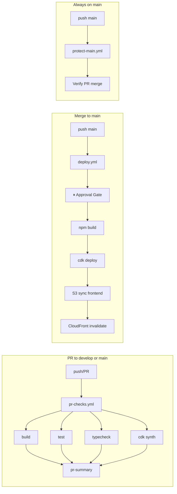

# CI/CD Pipeline Architecture — LitCrop MVP+

> Design spec by rc-architect · 2026-03-22
> Scope: Phase A (CI-1 through CI-4)
> Effort: ~1h design + implementation

---

## Context

LitCrop is an npm workspaces monorepo with a separate `infra/` CDK project:

```
litcrop/
├── package.json           # Root: workspaces = [packages/shared, src/frontend, src/api, src/simulator]
├── vitest.config.ts       # Root: runs all tests across workspaces
├── packages/shared/       # Zod schemas, shared types
├── src/frontend/          # Astro 5 + Preact (astro build)
├── src/api/               # Hono on Lambda (esbuild bundle)
├── src/simulator/         # Camera simulator
├── src/thumbnail/         # Thumbnail Lambda (no package.json scripts)
└── infra/                 # CDK v2 (NOT in npm workspaces — separate install)
```

**Existing workflows**: Template stubs from upstream with TODO placeholders. `protect-main.yml` is functional — keep as-is.

---

## CI-1: pr-checks.yml

### Trigger
```yaml
on:
  pull_request:
    branches: [main, develop]
```

No path filtering — the monorepo is small enough that running all checks on every PR is fine. Avoids missed regressions from cross-workspace dependencies.

### Jobs (4 parallel + 1 summary)

All jobs share this setup preamble:
- `actions/checkout@v4`
- `actions/setup-node@v4` with `node-version: '22'` and `cache: 'npm'`
- `npm ci` (root workspaces)

#### Job 1: `build`
```bash
npm run build            # Builds all workspaces (shared → frontend, api, simulator)
```
**Why workspace build**: `npm run build --workspaces` is already wired in root package.json. Shared must build first (types used by others), and npm workspaces handles the topological order.

#### Job 2: `test`
```bash
npm test                 # vitest run — 288+ tests across all workspaces
```
**Why root-level**: The root `vitest.config.ts` already aggregates all `**/__tests__/**/*.test.ts` patterns. No need for per-workspace test runs.

#### Job 3: `typecheck`
```bash
npm run typecheck        # tsc --noEmit --workspaces (shared, frontend, api)
cd infra && npm ci && npx tsc --noEmit
```
**Why separate infra step**: `infra/` is not in npm workspaces (CDK uses CommonJS, different tsconfig). It needs its own `npm ci` and `tsc --noEmit`.

#### Job 4: `cdk-synth`
```bash
npm ci                                # Root install — needed for @litcrop/shared workspace symlinks
cd infra && npm ci && npx cdk synth   # Infra install + synth
```
**Why root `npm ci` first**: `cdk synth` triggers esbuild bundling of the API Lambda, which resolves `@litcrop/shared` via npm workspace symlinks. Without the root install, esbuild fails to resolve the workspace package. (MUST-FIX from rc-reviewer.)

**Why**: Validates the CDK stack compiles to valid CloudFormation. Catches IAM, resource config, and cdk-nag issues before merge. Can share the `infra/` install with typecheck if we combine them, but keeping them separate is clearer for failure diagnosis.

**Optimization note**: `cdk synth` implicitly runs `tsc` on the infra project, so the infra typecheck in Job 3 is technically redundant. However, keeping it provides a clear signal — "typecheck passed but synth failed" means a CDK-specific issue, not a type error. For a ~1min job, the clarity is worth the cost.

#### Job 5: `pr-summary` (existing — keep)
```yaml
needs: [build, test, typecheck, cdk-synth]
if: always()
```
Reports pass/fail for all 4 jobs. Already implemented in template.

### Caching Strategy
- **npm cache**: `actions/setup-node` with `cache: 'npm'` handles `~/.npm` automatically
- **No `node_modules` caching**: `npm ci` is fast enough (~15s with warm cache) and avoids stale dependency issues
- **infra `node_modules`**: Separate `npm ci` in infra dir. Could cache but not worth the complexity for ~10s install

### Node Version
- **22** (matches `engines.node >= 22.0.0` in root package.json)
- Single version — no matrix needed for MVP+

---

## CI-2: deploy.yml

### Trigger
```yaml
on:
  push:
    branches: [main]
  workflow_dispatch:
    inputs:
      environment:
        description: 'Deployment environment'
        required: true
        default: 'production'
        type: choice
        options: [production]
```

### Decision: Re-run checks or trust PR?

**Recommendation: Trust PR checks, don't re-run.**

Rationale:
- Branch protection requires PR checks to pass before merge to `main`
- Re-running build+test+typecheck adds 3-5 min to every deploy for no new signal
- `cdk deploy` will fail on its own if something is truly broken
- `workflow_dispatch` is the escape hatch for manual re-deploys

### Jobs

#### Job 1: `deploy`
```yaml
environment: production   # Triggers GitHub Environment approval gate (CI-4)
```

Steps:
```bash
# 1. Setup (same as PR checks)
actions/checkout@v4
actions/setup-node@v4 (node-version: 22, cache: npm)
npm ci

# 2. Build frontend (needed for S3 sync)
npm run build

# 3. Configure AWS credentials
aws-actions/configure-aws-credentials@v4
  # Uses OIDC (see CI-3 below)

# 4. CDK deploy (infra + API Lambda + thumbnail Lambda)
cd infra && npm ci && npx cdk deploy --require-approval never

# 5. S3 sync frontend static assets
aws s3 sync src/frontend/dist/ s3://${FRONTEND_BUCKET}/ --delete

# 6. CloudFront invalidation
aws cloudfront create-invalidation \
  --distribution-id ${CLOUDFRONT_DIST_ID} \
  --paths "/*"
```

**Why `--require-approval never`**: The GitHub Environment approval gate (CI-4) provides the human gate. CDK's own approval prompt would block the non-interactive CI runner.

**Why separate S3 sync**: Astro builds static HTML/JS/CSS to `dist/`. CDK deploys the Lambda + API Gateway + infra, but the frontend bucket contents need explicit sync. CDK's `BucketDeployment` construct is an alternative but adds a Lambda for deployment — overkill for MVP+.

#### Job 2: `smoke-test` (post-deploy, optional future)
Not in MVP+ scope, but the natural extension point. Would `curl` the CloudFront URL and API health endpoint.

---

## CI-3: GitHub Secrets

### Recommendation: OIDC over Access Keys

| Approach | Pros | Cons |
|----------|------|------|
| **IAM Access Keys** | Simple setup, works immediately | Long-lived credentials, rotation burden, secret sprawl |
| **OIDC Federation** | No stored secrets, auto-rotating, AWS best practice | One-time IAM role + trust policy setup |

**Decision: OIDC for MVP+.**

Rationale: The one-time setup cost (~15 min in AWS Console or CDK) pays for itself immediately by eliminating credential rotation concerns. This aligns with ADR-IAM (least-privilege principle).

### OIDC Setup

1. **IAM OIDC Identity Provider**: `token.actions.githubusercontent.com`
2. **IAM Role**: `litcrop-github-actions-deploy` with trust policy scoped to:
   - `repo:<owner>/<repo>:ref:refs/heads/main` (deploy only from main)
   - `repo:<owner>/<repo>:pull_request` (PR checks — read-only, for cdk synth)
3. **Role permissions** (least-privilege):
   - `sts:AssumeRoleWithWebIdentity`
   - CDK bootstrap role assumption (`cdk-*` roles)
   - S3 sync to frontend bucket
   - CloudFront invalidation

### Secrets / Variables to configure

| Name | Type | Where | Purpose |
|------|------|-------|---------|
| `AWS_ROLE_ARN` | Secret | Repo | OIDC role ARN for `aws-actions/configure-aws-credentials` |
| `AWS_REGION` | Variable | Repo | `ap-northeast-1` |
| `FRONTEND_BUCKET` | Variable | Environment: production | S3 bucket name for frontend assets |
| `CLOUDFRONT_DIST_ID` | Variable | Environment: production | CloudFront distribution ID for cache invalidation |

**Not needed in CI**:
- `ANTHROPIC_API_KEY` — fetched at runtime from SSM Parameter Store by the Lambda
- DynamoDB table name — injected by CDK as Lambda env var
- S3 image bucket — injected by CDK as Lambda env var

---

## CI-4: GitHub Environment — `production`

### Configuration

| Setting | Value | Rationale |
|---------|-------|-----------|
| **Environment name** | `production` | Standard convention |
| **Required reviewers** | 1 (repo owner) | Prevents unreviewed deploys to prod |
| **Wait timer** | 0 min | No delay needed — reviewer approval is sufficient |
| **Deployment branches** | `main` only | Prevents accidental deploys from feature branches |

### How it works

1. PR merges to `main` → `deploy.yml` triggers
2. Job hits `environment: production` → pauses for approval
3. Reviewer approves in GitHub UI → deploy proceeds
4. If deploy fails → GitHub shows failed deployment; rollback is `cdk deploy` of previous commit

---

## Workflow Interaction Diagram



---

## Implementation Notes for rc-builder

### File changes needed
1. **`.github/workflows/pr-checks.yml`** — Replace template stubs with actual commands (see Job 1-4 above)
2. **`.github/workflows/deploy.yml`** — Replace template with OIDC + CDK deploy + S3 sync (see CI-2 above)
3. **`.github/workflows/protect-main.yml`** — No changes (already functional)

### Key gotchas
- `infra/` needs its own `npm ci` — it's not in the root workspaces
- `cdk synth` needs AWS credentials even for dry-run (reads account/region from context) — use OIDC role with read-only perms for PR checks, or set `CDK_DEFAULT_ACCOUNT` and `CDK_DEFAULT_REGION` env vars to skip actual AWS lookups
- Frontend build needs `PUBLIC_API_URL` env var (check how Astro injects it) — this should come from GitHub Environment variables
- The `--require-approval never` flag is safe because the GitHub Environment gate provides human approval

### What to skip for MVP+
- No matrix builds (single Node version)
- No artifact upload/download between jobs (each job installs fresh — simpler, fast enough)
- No Slack/Discord notifications
- No smoke tests (manual verification post-deploy is fine for 1-5 users)
- No staging environment (single `production` environment)
