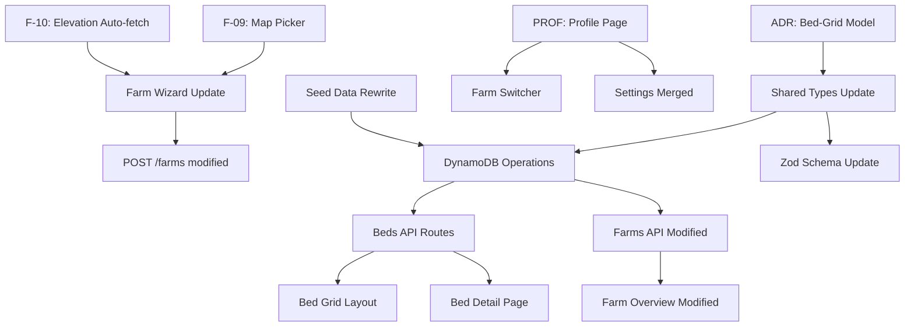

# Phase D Architecture & API Design — UX Restructure

> Date: 2026-03-22
> Status: PROPOSED
> Scope: MVP+ (v0.13)
> Depends on: ADR-20260322-phase-d-bed-grid-data-model.md

---

## 1. Data Model Decision

**Decision**: Flatten Farm->Field->Bed->Plot to **Farm->Bed** (Option B from ADR).

- Field entity: **removed**
- Plot entity: **removed** (crop fields merged into Bed)
- Bed entity: **expanded** with row, col, crop fields, status
- Farm entity: **expanded** with grid_rows, grid_cols
- Image entity: **updated** (primary key uses bed_id instead of plot_id)

See [ADR-20260322](../decisions/ADR-20260322-phase-d-bed-grid-data-model.md) for full rationale.

---

## 2. Updated Entity Types

### 2.1 Farm (modified)

```typescript
export interface Farm {
  id: string;
  user_id: string;              // Cognito sub -- owner
  name: string;
  description?: string;
  latitude: number;
  longitude: number;
  elevation_m?: number;         // F-10: auto-fetched from Open-Meteo
  climate_zone?: string;
  locale: Locale;
  theme: Theme;
  grid_rows: number;            // NEW: 1-5, default 1
  grid_cols: number;            // NEW: 1-5, default 1
  created_at: string;
}
```

**Changes**: Added `grid_rows` and `grid_cols`. These define the bed grid dimensions. Default 1x1 for backward compat with farms created before Phase D.

### 2.2 Bed (expanded -- replaces Bed + Plot)

```typescript
export interface Bed {
  id: string;
  farm_id: string;              // CHANGED: was field_id
  row: number;                  // NEW: 1-based grid row (1-5)
  col: number;                  // NEW: 1-based grid column (1-5)
  name: string;                 // auto-generated: "A1", "B2", etc.
  crop_type?: string;           // MERGED from Plot (optional -- bed can be empty)
  crop_variety?: string;        // MERGED from Plot
  planted_at?: string;          // MERGED from Plot (optional)
  expected_harvest?: string;    // MERGED from Plot (optional)
  notes?: string;               // MERGED from Plot
  latest_status: PlotStatus;    // MERGED from Plot (renamed type to BedStatus later)
}
```

**Key change**: `farm_id` replaces `field_id`. Crop fields are optional because a bed can exist in the grid without a crop assigned yet.

### 2.3 Image (modified)

```typescript
export interface Image {
  id: string;
  bed_id: string;               // CHANGED: was plot_id (primary association)
  node_id: string;
  captured_at: string;
  uploaded_at: string;
  storage_key: string;
  thumbnail_key?: string;
  trigger: TriggerType;
  content_type: string;
  size_bytes: number;
  metadata?: Record<string, unknown>;
}
```

**Changes**: `plot_id` removed. `bed_id` is already present on existing Image records (was denormalized in MVP). It becomes the sole association field.

### 2.4 Removed Entities

- **Field**: Removed entirely. No replacement needed.
- **Plot**: Removed. All fields merged into Bed.

### 2.5 Unchanged Entities

- **Tag**: No changes (still references image_id)
- **FarmMember**: No changes
- **UsageBudget**: No changes
- **ConversationMessage**: No changes

---

## 3. API Contract Changes

### 3.1 Modified Endpoints

#### GET /api/v1/farms/{farmId} -- Response Shape Change

The `fields` array is replaced by a flat `beds` array:

```typescript
// BEFORE (current)
interface GetFarmResponse {
  // ...farm fields...
  fields: FarmField[];  // nested: field -> beds -> plots
}

// AFTER (Phase D)
interface GetFarmResponse {
  id: FarmId;
  user_id: UserId;
  name: string;
  description: string | null;
  latitude: number;
  longitude: number;
  elevation_m: number | null;
  climate_zone: string | null;
  locale: LocaleEnum;
  theme: ThemeEnum;
  grid_rows: number;          // NEW
  grid_cols: number;          // NEW
  created_at: ISO8601;
  beds: FarmBed[];            // CHANGED: flat array, no nesting
}

interface FarmBed {
  id: BedId;
  row: number;
  col: number;
  name: string;
  crop_type: string | null;
  crop_variety: string | null;
  latest_status: StatusEnum;
}
```

**DynamoDB**: 2 queries instead of N+1:
1. `PK=FARM#{farmId} SK=#META` -- farm metadata
2. `PK=FARM#{farmId} SK begins_with BED#` -- all beds (sorted by row/col via SK)

#### POST /api/v1/farms -- Request Body Extended

```typescript
interface CreateFarmRequest {
  name: string;
  latitude: number;
  longitude: number;
  elevation_m?: number | null;   // F-10: can be auto-filled by frontend
  locale?: LocaleEnum;
  theme?: ThemeEnum;
  description?: string | null;
  grid_rows?: number;            // NEW: 1-5, default 1
  grid_cols?: number;            // NEW: 1-5, default 1
}
```

On creation, the API auto-generates Bed records for all grid cells. A 3x4 grid creates 12 Bed items with names A1-A4, B1-B4, C1-C4.

#### PATCH /api/v1/farms/{farmId} -- Extended

```typescript
interface UpdateFarmRequest {
  name?: string;
  description?: string | null;
  latitude?: number;
  longitude?: number;
  elevation_m?: number | null;
  locale?: LocaleEnum;
  theme?: ThemeEnum;
  grid_rows?: number;            // NEW: can resize grid (1-5)
  grid_cols?: number;            // NEW: can resize grid (1-5)
}
```

**Grid resize rules**:
- Expanding: new Bed items created (empty, no crop)
- Shrinking: beds outside new bounds are soft-deleted (marked inactive, images preserved)
- Cannot shrink below the outermost bed that has images

#### GET /api/v1/farms/{farmId}/plots -- RENAMED

```
GET /api/v1/farms/{farmId}/beds
```

Returns all beds for the farm with latest image info. Same purpose as the old plots endpoint but uses bed data.

```typescript
interface FarmBedItem {
  id: BedId;
  row: number;
  col: number;
  name: string;
  crop_type: string | null;
  crop_variety: string | null;
  latest_status: StatusEnum;
  latest_image: {
    id: ImageId;
    thumbnail_url: string | null;
    captured_at: ISO8601;
    trigger: TriggerEnum;
  } | null;
}
```

**Backward compat**: Keep `/farms/{farmId}/plots` as a 301 redirect to `/farms/{farmId}/beds` for one version cycle.

#### GET /api/v1/plots/{plotId} -- REPLACED

```
GET /api/v1/beds/{bedId}
```

```typescript
interface GetBedResponse {
  id: BedId;
  farm_id: FarmId;
  row: number;
  col: number;
  name: string;
  crop_type: string | null;
  crop_variety: string | null;
  planted_at: ISO8601Date | null;
  expected_harvest: ISO8601Date | null;
  notes: string | null;
  latest_status: StatusEnum;
  latest_image: {
    id: ImageId;
    url: string;
    thumbnail_url: string | null;
    captured_at: ISO8601;
    trigger: TriggerEnum;
    tags: Array<{ id: TagId; tag: TagEnum; note: string | null; created_at: ISO8601 }>;
  } | null;
}
```

#### POST /api/v1/plots/{plotId}/images -- REPLACED

```
POST /api/v1/beds/{bedId}/images
```

Same multipart upload contract. The `plotId` path param becomes `bedId`. Internally, image storage key changes to `images/{farmId}/{bedId}/...`.

#### GET /api/v1/plots/{plotId}/images -- REPLACED

```
GET /api/v1/beds/{bedId}/images
```

Same pagination contract. Path param changes only.

### 3.2 New Endpoints

#### PATCH /api/v1/beds/{bedId} -- Assign/Update Crop

```
PATCH /api/v1/beds/{bedId}
Content-Type: application/json
Authorization: Bearer {accessToken}
```

```typescript
interface UpdateBedRequest {
  crop_type?: string | null;        // 1-100 chars; null to clear
  crop_variety?: string | null;     // 1-100 chars; null to clear
  planted_at?: ISO8601Date | null;
  expected_harvest?: ISO8601Date | null;
  notes?: string | null;            // max 500 chars; null to clear
}
```

**Response**: 200 OK with full Bed object.

**Auth**: admin or manager role required.

**Errors**: 400 VALIDATION_ERROR, 401 UNAUTHORIZED, 404 NOT_FOUND

### 3.3 Unchanged Endpoints

| Endpoint | Change |
|----------|--------|
| GET /api/v1/images/{imageId} | No change (image_id lookup via GSI1) |
| POST /api/v1/images/{imageId}/tags | No change |
| GET /api/v1/farms/{farmId}/weather | No change |
| POST /api/v1/chat | No change (bed context replaces plot context internally) |
| GET/POST /api/v1/farms/{farmId}/members | No change |

### 3.4 Endpoint Summary (Phase D)

| # | Method | Path | Status |
|---|--------|------|--------|
| 1 | GET | /api/v1/farms/{farmId} | Modified (beds[] replaces fields[]) |
| 2 | POST | /api/v1/farms | Modified (grid_rows/cols added) |
| 3 | PATCH | /api/v1/farms/{farmId} | Modified (grid_rows/cols added) |
| 4 | GET | /api/v1/farms/{farmId}/beds | **New** (replaces /plots) |
| 5 | GET | /api/v1/beds/{bedId} | **New** (replaces /plots/{plotId}) |
| 6 | PATCH | /api/v1/beds/{bedId} | **New** (assign crop to bed) |
| 7 | GET | /api/v1/beds/{bedId}/images | **New** (replaces /plots/{plotId}/images) |
| 8 | POST | /api/v1/beds/{bedId}/images | **New** (replaces /plots/{plotId}/images) |
| 9 | GET | /api/v1/images/{imageId} | Unchanged |
| 10 | POST | /api/v1/images/{imageId}/tags | Unchanged |
| 11 | GET | /api/v1/farms/{farmId}/weather | Unchanged |
| 12 | POST | /api/v1/chat | Unchanged (internal context change) |
| 13 | GET/POST | /api/v1/farms/{farmId}/members | Unchanged |

---

## 4. DynamoDB Access Patterns

### 4.1 Modified Key Schema

#### Bed (replaces Field + Bed + Plot)

| Attribute | Value | Purpose |
|-----------|-------|---------|
| PK | `FARM#{farmId}` | Partition with farm |
| SK | `BED#{row}#{col}#{bedId}` | Sorted by grid position |
| GSI1PK | `BED#{bedId}` | Lookup bed by ID |
| GSI1SK | `#META` | Standard meta pattern |

**Rationale**: Beds are stored under the farm partition. SK encodes row/col (zero-padded) for natural sort order. GSI1 enables direct bed lookup by ID (needed for image upload, bed detail).

#### Image (modified)

| Attribute | Old Value | New Value |
|-----------|-----------|-----------|
| PK | `PLOT#{plotId}` | `BED#{bedId}` |
| SK | `IMG#{capturedAt}#{imageId}` | `IMG#{capturedAt}#{imageId}` (unchanged) |
| GSI1PK | `IMG#{imageId}` | `IMG#{imageId}` (unchanged) |
| GSI1SK | `#META` | `#META` (unchanged) |
| GSI2PK | `FARM#{farmId}` | `FARM#{farmId}` (unchanged) |

**Change**: Image PK switches from `PLOT#` to `BED#`. This means "get all images for a bed" query becomes `PK=BED#{bedId} SK begins_with IMG#` -- same pattern, different prefix.

### 4.2 Removed Access Patterns

| Pattern | Replacement |
|---------|-------------|
| `PK=FARM#{farmId} SK begins_with FIELD#` | Removed (no Field entity) |
| `PK=FIELD#{fieldId} SK begins_with BED#` | Replaced by `PK=FARM#{farmId} SK begins_with BED#` |
| `PK=BED#{bedId} SK begins_with PLOT#` | Removed (no Plot entity) |
| `GSI2 PK=FARM#{farmId}` (for plots) | Replaced by bed query on farm PK |

### 4.3 New Access Patterns

| Access Pattern | Key Condition | Use Case |
|----------------|---------------|----------|
| Get all beds for farm | `PK=FARM#{farmId} SK begins_with BED#` | Farm overview, layout view |
| Get bed by ID | `GSI1 PK=BED#{bedId} SK=#META` | Bed detail, image upload target |
| Get images for bed | `PK=BED#{bedId} SK begins_with IMG#` | Image timeline (paginated) |

### 4.4 Query Count Comparison

| Operation | Before (Field/Bed/Plot) | After (Bed only) |
|-----------|------------------------|-------------------|
| Farm overview | 1 + N(fields) + N(beds) + N(plots) | 1 + 1 |
| Farm with layout | Same as above | Same: 1 + 1 |
| Bed detail | GSI1 plot lookup + bed lookup | GSI1 bed lookup |
| Image for bed | PK=PLOT# query | PK=BED# query |

---

## 5. Frontend Architecture Notes

### 5.1 Leaflet Map Picker (F-09)

**Strategy**: Frontend-only, no API changes needed.

- **Dependency**: `leaflet` (~40KB gzipped) + `@types/leaflet`
- **Lazy loading**: Dynamic import in the farm creation wizard component only. Not loaded on other pages.
- **Tile provider**: OpenStreetMap (free, no API key)
- **Interaction**: Click/tap to place pin. Pin position updates `latitude`/`longitude` form fields.
- **Initial view**: If browser geolocation available, center on user. Otherwise, center on Japan (35.68, 139.69).
- **Mobile**: Full-width map below the name/description fields. Touch-friendly pin placement.

```typescript
// Lazy-loaded in FarmWizard component
const MapPicker = lazy(() => import('./MapPicker'));
```

### 5.2 Elevation Auto-Fetch (F-10)

**Decision**: Frontend direct call to Open-Meteo Elevation API (not backend proxy).

**Rationale**:
- Open-Meteo Elevation API is free, no API key, CORS-enabled
- Called once during farm creation (not a recurring call)
- No caching benefit from proxying through Lambda
- Keeps backend simpler

```
GET https://api.open-meteo.com/v1/elevation?latitude={lat}&longitude={lon}
Response: { "elevation": [745.0] }
```

**Frontend behavior**:
1. After map pin is placed (or lat/lon manually entered), auto-fetch elevation
2. Display as read-only field: "Elevation: 745m"
3. If fetch fails, field shows "Unable to fetch" with manual entry fallback
4. Value is sent with the POST /api/v1/farms request

### 5.3 Bed Grid Layout View

**New component**: `BedGridLayout.tsx` (Preact island)

- Renders a `grid_rows x grid_cols` CSS Grid
- Each cell shows: bed name (A1, B2...), crop_type, latest_status badge
- Empty beds show a "+" icon to assign a crop
- Tapping a bed with a crop navigates to bed detail
- Toggle between "List" view (existing FarmOverview) and "Layout" view

### 5.4 Profile Page (PROF)

**New Astro page**: `/profile/`

Two sections:
1. **Farm** -- list of farms the user belongs to, with role badge. [+ New Farm] button. [Switch] button per farm. Active farm highlighted.
2. **You** -- user email (read-only from Cognito), locale picker, theme picker, temp unit picker.

Farm switching updates `localStorage('litcrop-farmId')` and triggers a page reload.

### 5.5 Page Routing Changes

| Route | Before | After |
|-------|--------|-------|
| `/` | Farm overview (plot list) | Farm overview (bed list + grid toggle) |
| `/plots/view?id=` | Plot detail | **Removed** (redirect to `/beds/view?id=`) |
| `/beds/view?id=` | N/A | **New**: Bed detail (crop info + image timeline) |
| `/plots/add/` | Add plot wizard | **Removed** (replaced by bed grid + PATCH crop) |
| `/profile/` | N/A (was settings) | **New**: Profile (farm list + user settings) |
| `/settings/` | Theme/locale settings | **Removed** (merged into /profile/) |

---

## 6. Migration Strategy

### 6.1 Scope

Only the demo farm has data. This is a seed-data-level migration, not a production data migration.

### 6.2 Steps

1. **Update shared types** (`packages/shared/src/types/domain.ts`):
   - Add `grid_rows`, `grid_cols` to Farm
   - Add `row`, `col`, `crop_type`, etc. to Bed, change `field_id` to `farm_id`
   - Remove Field interface
   - Remove Plot interface
   - Update Image to remove `plot_id`

2. **Update Zod schemas** (`packages/shared/src/schemas/`):
   - New BedSchema, updated FarmSchema
   - Remove FieldSchema, PlotSchema
   - Update ImageSchema

3. **Update DynamoDB operations** (`src/api/src/services/dynamodb.ts`):
   - New: `createBedForFarm()`, `getBedsForFarm()`, `getBedById()`, `updateBed()`
   - Modified: `createFarm()` auto-generates bed grid
   - Modified: `createImage()` uses `BED#` PK instead of `PLOT#`
   - Deprecated: `createField()`, `createPlot()`, `getFieldsForFarm()`, `getBedsForField()`

4. **Update API routes**:
   - New route file: `src/api/src/routes/beds.ts`
   - Modified: `farms.ts` response shape
   - Deprecated: `plots.ts` (keep as redirect shim for one version)

5. **Update frontend**:
   - New components: MapPicker, BedGridLayout, ProfilePage
   - Modified: FarmOverview (bed-based), navigation
   - Removed: PlotDetail, AddPlot wizard

6. **Rewrite seed data script**:
   - `scripts/seed-data.ts` creates Farm with grid + Beds (with crops) + Images under BED# keys

### 6.3 Rollback

If Phase D needs to be reverted:
- Shared types can be reverted (git revert)
- DynamoDB items under BED# prefix coexist with old FIELD#/PLOT# items (no destructive migration)
- Old seed data script is in git history
- Frontend pages can be restored from git

---

## 7. Dependency Map



### Implementation Order (recommended)

1. Shared types + Zod schemas (foundation)
2. DynamoDB operations (data layer)
3. API routes: beds.ts + farms.ts modifications (API layer)
4. Contract tests update
5. Frontend: MapPicker + Elevation (F-09/F-10, independent)
6. Frontend: BedGridLayout + BedDetail (depends on API)
7. Frontend: Profile page (depends on farm list API)
8. Seed data rewrite
9. Integration testing

---

## 8. Open Questions

| # | Question | Proposed Answer |
|---|----------|-----------------|
| 1 | Should we version the API (v2) for these breaking changes? | No. This is MVP+ with no external consumers. Rename endpoints and update frontend simultaneously. |
| 2 | What happens to existing images referencing plot_id? | Demo farm seed data will be regenerated with bed_id keys. No live user data exists. |
| 3 | Should bed names be user-editable? | No for MVP+. Auto-generated from row/col (A1, B2, etc.). Editable names deferred to PROD. |
| 4 | Can a bed exist without a crop? | Yes. Empty beds show in the grid as available slots. |
