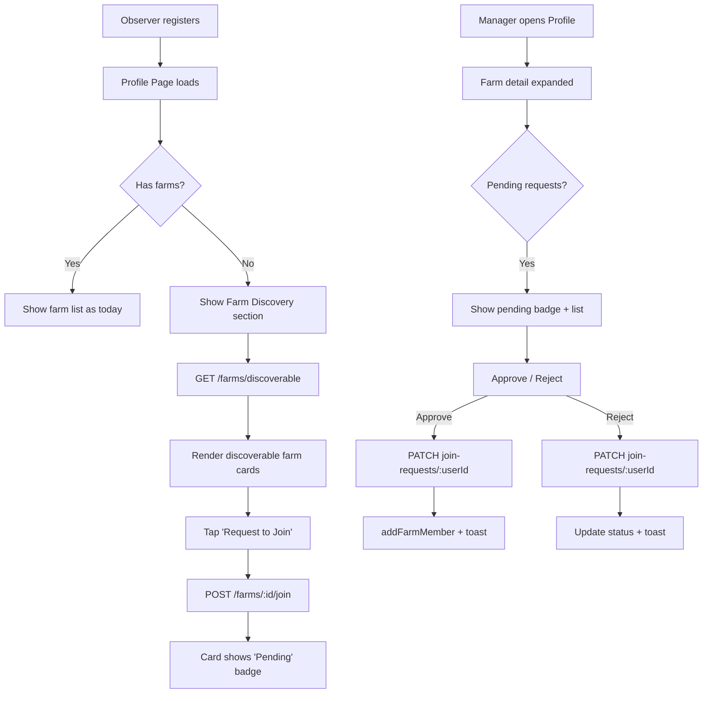

# UX Design: Observer Onboarding (#181) + Admin Email Notifications (#187)

> Combined design spec. Notifications fire on the same events that drive the join workflow.

## 1. Overview

### Problem
Observers register but have no way to find and join existing farms. Managers create farms but have no visibility into who wants to join. System admins have no awareness of platform activity (new accounts, farm changes, membership changes).

### Users
| Persona | Goal |
|---------|------|
| **Observer** | Find a farm and request to join it |
| **Manager / Farm Admin** | Review and approve/reject join requests |
| **System Admin** | Receive email notifications for key platform events |

### Constraints
- Single-table DynamoDB design (PK/SK pattern)
- Hono router on Lambda, Preact islands frontend
- SES for email (no SNS topic complexity needed for MVP)
- Free plan limits: 3 memberships per user, 2 owned farms per user

---

## 2. DynamoDB Data Model

### 2.1 New Entity: Join Request

| Attribute | Type | Description |
|-----------|------|-------------|
| PK | `FARM#{farmId}` | Farm partition |
| SK | `JOIN_REQUEST#{userId}` | Unique per user per farm |
| GSI1PK | `USER#{userId}` | Query "my pending requests" |
| GSI1SK | `JOIN_REQUEST#{farmId}` | Sort by farm |
| user_id | string | Requesting user's Cognito sub |
| farm_id | string | Target farm ID |
| status | `pending` / `approved` / `rejected` | Current state |
| requested_at | string (ISO 8601) | When submitted |
| resolved_at | string (ISO 8601) / null | When approved/rejected |
| resolved_by | string / null | userId of resolver |
| display_name | string | Requester's display name (denormalized for list view) |
| entity_type | `JOIN_REQUEST` | For scan filtering if needed |

**Key prefix addition** (in `packages/shared/src/constants.ts`):
```typescript
// Add to DDB_KEY_PREFIXES:
JOIN_REQUEST: 'JOIN_REQUEST#',
```

**Key builders** (in `src/api/src/services/dynamodb.ts`):
```typescript
// Add to sk object:
joinRequest: (userId: string) => `${DDB_KEY_PREFIXES.JOIN_REQUEST}${userId}`,

// Add to pk object (already exists):
// pk.farm(farmId) — reuse existing
// pk.user(userId) — reuse existing
```

### 2.2 Farm Entity Update: Discoverable Flag

Add `discoverable: boolean` (default `true`) to the existing Farm entity. Stored as a top-level attribute on the `FARM#{farmId} / #META` item.

### 2.3 Access Patterns

| Access Pattern | Key Condition | Index |
|----------------|---------------|-------|
| List pending requests for a farm | PK=`FARM#{farmId}`, SK begins_with `JOIN_REQUEST#` | Table |
| Get specific request | PK=`FARM#{farmId}`, SK=`JOIN_REQUEST#{userId}` | Table |
| List my outgoing requests | GSI1PK=`USER#{userId}`, GSI1SK begins_with `JOIN_REQUEST#` | GSI1 |
| List discoverable farms | Scan with filter `discoverable=true` | Table (acceptable: small dataset, infrequent) |

---

## 3. API Endpoint Contracts

### 3.1 GET /api/v1/farms/discoverable

List farms available for observers to browse and request to join.

**Auth**: Required (any authenticated user).

**Query parameters**: None (MVP -- small dataset, no pagination needed).

**Response** `200`:
```json
{
  "data": [
    {
      "id": "uuid",
      "name": "Tanaka Farm",
      "description": "Rice paddies in Niigata",
      "latitude": 37.9,
      "longitude": 139.0,
      "member_count": 3,
      "has_pending_request": false
    }
  ]
}
```

**Fields**:
- `has_pending_request`: `true` if the calling user already has a pending join request for this farm. Prevents duplicate submissions in the UI.
- `member_count`: Total current members. Gives observers a sense of farm activity.
- Location is included for map display (future) but not elevation or grid details (irrelevant to observers).

**Errors**: `401` (unauthorized), `503` (DDB unavailable).

**Implementation notes**:
- Scan for all farms where `discoverable != false` (treats missing field as `true` for backward compatibility with existing farms).
- For each farm, query `JOIN_REQUEST#{callerUserId}` to set `has_pending_request`.
- Exclude demo farm (`DEMO_FARM_ID`).
- Exclude farms where the caller is already a member.

**Route placement**: Must be defined BEFORE `/:farmId` in the Hono router to avoid `discoverable` being parsed as a farmId parameter.

---

### 3.2 POST /api/v1/farms/{farmId}/join

Observer submits a join request.

**Auth**: Required (any authenticated user).

**Request body**: None (the user's identity comes from the JWT).

**Response** `201`:
```json
{
  "farm_id": "uuid",
  "user_id": "sub",
  "status": "pending",
  "requested_at": "2026-03-25T10:00:00.000Z"
}
```

**Errors**:
| Code | Condition |
|------|-----------|
| `400` | Farm is not discoverable |
| `400` | User has reached `FREE_PLAN_MAX_MEMBERSHIPS` |
| `404` | Farm not found |
| `409` | User already has a pending/approved request for this farm |
| `409` | User is already a member of this farm |

**Side effects**:
1. Creates `JOIN_REQUEST` item in DynamoDB (both table PK and GSI1 projections via single PutCommand with GSI1PK/GSI1SK attributes).
2. Calls `notifyAdmin()` with event `join_request_created`.
3. Calls `notifyFarmManagers()` with event `join_request_created` (emails farm admin/managers).

---

### 3.3 GET /api/v1/farms/{farmId}/join-requests

List join requests for a farm.

**Auth**: Required. Farm member with role `admin` or `manager`.

**Query parameters**:
| Param | Type | Default | Description |
|-------|------|---------|-------------|
| `status` | string | `pending` | Filter by status: `pending`, `approved`, `rejected`, `all` |

**Response** `200`:
```json
{
  "data": [
    {
      "user_id": "sub",
      "display_name": "Yamada Taro",
      "status": "pending",
      "requested_at": "2026-03-25T10:00:00.000Z",
      "resolved_at": null,
      "resolved_by": null
    }
  ]
}
```

**Errors**: `401`, `404` (farm not found or no access), `503`.

---

### 3.4 PATCH /api/v1/farms/{farmId}/join-requests/{userId}

Approve or reject a join request.

**Auth**: Required. Farm member with role `admin` or `manager`.

**Request body**:
```json
{
  "action": "approve" | "reject"
}
```

**Response** `200`:
```json
{
  "user_id": "sub",
  "status": "approved",
  "resolved_at": "2026-03-25T12:00:00.000Z",
  "resolved_by": "resolver-sub"
}
```

**Behavior on `approve`**:
1. Validate target user has not exceeded `FREE_PLAN_MAX_MEMBERSHIPS`.
2. Update join request status to `approved`, set `resolved_at` and `resolved_by`.
3. Call `dynamoRepo.addFarmMember(userId, farmId, 'observer')` to create membership.
4. Call `notifyAdmin()` with event `member_joined`.

**Behavior on `reject`**:
1. Update join request status to `rejected`, set `resolved_at` and `resolved_by`.
2. No notification (avoid noise).

**Errors**:
| Code | Condition |
|------|-----------|
| `400` | Invalid action (not `approve` or `reject`) |
| `400` | Request is not in `pending` status |
| `400` | Target user has reached membership limit (on approve) |
| `404` | Farm not found, no access, or join request not found |

**Transaction safety**: The approve flow uses `TransactWriteCommand` to atomically:
- Update the join request status
- Create both FARM_MEMBER records (forward + reverse)

This prevents a race where the same request is approved twice.

---

### 3.5 GET /api/v1/me/join-requests

List the calling user's own outgoing join requests.

**Auth**: Required.

**Response** `200`:
```json
{
  "data": [
    {
      "farm_id": "uuid",
      "farm_name": "Tanaka Farm",
      "status": "pending",
      "requested_at": "2026-03-25T10:00:00.000Z"
    }
  ]
}
```

**Implementation**: Query GSI1 with PK=`USER#{userId}`, SK begins_with `JOIN_REQUEST#`. Enrich with farm name via batch get.

---

### 3.6 PATCH /api/v1/farms/{farmId} (existing -- add discoverable)

Add `discoverable` to the existing farm update endpoint. Only `admin` or `manager` roles can change it.

**Request body addition**:
```json
{
  "discoverable": true
}
```

No new endpoint needed -- extends existing `validateFarmFields()`.

---

## 4. Admin Email Notifications (#187)

### 4.1 Events

| Event Key | Subject Line | Triggered By |
|-----------|-------------|--------------|
| `new_account` | `[LitCrop] New account: {email}` | POST /api/v1/me/profile (first profile create) |
| `farm_created` | `[LitCrop] Farm created: {farmName}` | POST /api/v1/farms |
| `farm_deleted` | `[LitCrop] Farm deleted: {farmName}` | DELETE /api/v1/farms/{farmId} |
| `member_joined` | `[LitCrop] Member joined: {displayName} -> {farmName}` | Join request approved |
| `member_left` | `[LitCrop] Member left: {displayName} <- {farmName}` | DELETE /api/v1/farms/{farmId}/members/me |
| `join_request_created` | `[LitCrop] Join request: {displayName} -> {farmName}` | POST /api/v1/farms/{farmId}/join |

### 4.2 Notification Utility

**File**: `src/api/src/services/email.ts`

```typescript
interface NotifyAdminParams {
  event: string;       // Event key from table above
  subject: string;     // Email subject line
  body: string;        // Plain-text email body
}

async function notifyAdmin(params: NotifyAdminParams): Promise<void>
```

**Behavior**:
- Reads `ADMIN_EMAILS` env var (already exists in CDK stack, comma-separated).
- If empty or undefined, silently no-ops (notifications are optional).
- Sends one email per admin address via SES `SendEmailCommand`.
- Uses `SES_FROM_ADDRESS` env var as sender (e.g., `noreply@litcrop.example.com`).
- All calls are fire-and-forget (`void` return, errors logged but not thrown). Notification failures must never block the primary operation.
- Plain-text only (no HTML templates for MVP).

**Email body format**:
```
Event: Join Request Created
Time: 2026-03-25T10:00:00Z

User: Yamada Taro (yamada@example.com)
Farm: Tanaka Farm (abc12345)

---
LitCrop Admin Notification
```

### 4.3 Farm Manager Notification

For join request events specifically, also notify the farm's admin/manager members.

**Function**: `notifyFarmManagers(farmId, params)` -- queries farm members with role `admin` or `manager`, resolves their email from Cognito `AdminGetUser`, sends notification. Fire-and-forget like `notifyAdmin`.

This is a stretch goal for MVP. If omitted, managers discover pending requests via the badge in the UI.

### 4.4 CDK Infrastructure Changes

**File**: `infra/lib/litcrop-stack.ts`

Add SES identity and grant API Lambda send permission:

```typescript
import * as ses from 'aws-cdk-lib/aws-ses';

// After existing constructs, before Lambda definition:
const sesIdentity = new ses.EmailIdentity(this, 'AdminEmailIdentity', {
  identity: ses.Identity.email(process.env['SES_FROM_ADDRESS'] ?? 'noreply@litcrop.example.com'),
});

// Add to apiLambda environment:
SES_FROM_ADDRESS: process.env['SES_FROM_ADDRESS'] ?? 'noreply@litcrop.example.com',

// Grant SES send permission to API Lambda:
apiLambda.addToRolePolicy(new iam.PolicyStatement({
  actions: ['ses:SendEmail'],
  resources: ['*'],  // SES identity ARN is complex; scope in production
}));
```

**CDK-Nag suppression** (add to existing list):
```typescript
{
  id: 'AwsSolutions-IAM5',
  reason: 'SES SendEmail wildcard is acceptable for MVP; identity-scoped ARN in production',
},
```

**Environment variables to add to Lambda**:
| Var | Value | Description |
|-----|-------|-------------|
| `SES_FROM_ADDRESS` | `noreply@litcrop.example.com` | Sender email (must be SES-verified) |

**Note**: SES starts in sandbox mode. For MVP, manually verify recipient admin emails in the SES console. Production will require requesting production access.

---

## 5. Frontend Component Architecture

### 5.1 User Flows

```
Observer Registration Flow:
  Register -> Role=Observer -> Profile Page
    -> "No farms" state shows Farm Discovery section
    -> Browse discoverable farms
    -> Tap "Request to Join"
    -> Toast: "Request sent"
    -> Card updates to show "Pending" badge
    -> (Later) Admin approves -> Farm appears in profile farm list

Manager Approval Flow:
  Profile Page -> Farm detail expanded -> "N pending" badge
    -> Tap badge -> See list of pending requests
    -> Approve / Reject each
    -> Toast: "Member added" or "Request rejected"
```



### 5.2 Component State Matrix

| Component | Default | Loading | Empty | Error | Success |
|-----------|---------|---------|-------|-------|---------|
| FarmDiscovery | List of farm cards | Skeleton tiles | "No farms available" message | "Failed to load" with retry | N/A |
| JoinRequestButton | "Request to Join" (primary) | Spinner + disabled | N/A | Toast error | Changes to "Pending" badge (disabled, muted) |
| PendingRequestsBadge | Hidden (0 pending) | N/A | N/A | N/A | Shows count: "3 pending" |
| JoinRequestList | List of request cards | Skeleton rows | "No pending requests" | "Failed to load" | N/A |
| ApproveRejectButtons | Two buttons (Approve green, Reject gray) | Disabled + spinner on active | N/A | Toast error | Row removed + toast |

### 5.3 New Components

**`src/frontend/src/components/FarmDiscovery.tsx`**
- Preact island rendered in ProfilePage when user has no farms (or always visible below farm list for observers).
- Fetches `GET /api/v1/farms/discoverable`.
- Renders card per farm: name, description (truncated), member count, location text.
- "Request to Join" button per card, or "Pending" badge if already requested.
- Search/filter input at top (client-side filter by name, MVP).

**`src/frontend/src/components/JoinRequestList.tsx`**
- Rendered inside farm detail expansion in ProfilePage (for admin/manager farms).
- Fetches `GET /api/v1/farms/{farmId}/join-requests?status=pending`.
- Each row: display name (or truncated userId), requested date, Approve/Reject buttons.
- Approve triggers PATCH with `action: approve`, Reject with `action: reject`.
- On success, removes row from list and decrements badge count.

### 5.4 Modified Components

**`src/frontend/src/components/ProfilePage.tsx`**
- Import and render `<FarmDiscovery />` when `farms.length === 0` or when user's preferred role is `observer`.
- In farm detail expansion: if user role is `admin` or `manager`, show pending request count badge and render `<JoinRequestList />`.
- Add pending count to farm card summary line (e.g., "2x2 beds . 3 members . 2 pending").

**`src/frontend/src/lib/api.ts`**
- Add API client functions:
  - `getDiscoverableFarms(): Promise<DiscoverableFarm[]>`
  - `requestToJoinFarm(farmId: string): Promise<JoinRequest>`
  - `getJoinRequests(farmId: string, status?: string): Promise<JoinRequest[]>`
  - `resolveJoinRequest(farmId: string, userId: string, action: 'approve' | 'reject'): Promise<JoinRequest>`
  - `getMyJoinRequests(): Promise<MyJoinRequest[]>`

**`src/frontend/src/i18n/en.ts`** and **`ja.ts`**
- Add translation keys:
  - `discovery.title`: "Find a Farm"
  - `discovery.no_farms`: "No farms are currently accepting new members."
  - `discovery.request_join`: "Request to Join"
  - `discovery.pending`: "Pending"
  - `discovery.members`: "members"
  - `discovery.request_sent`: "Join request sent!"
  - `discovery.already_requested`: "Already requested"
  - `join_requests.title`: "Join Requests"
  - `join_requests.approve`: "Approve"
  - `join_requests.reject`: "Reject"
  - `join_requests.approved`: "Member added!"
  - `join_requests.rejected`: "Request rejected"
  - `join_requests.empty`: "No pending requests"
  - `join_requests.pending_count`: "{count} pending"

### 5.5 Farm Discovery Card Layout

```
+--------------------------------------------------+
| Tanaka Farm                          [3 members]  |
| Rice paddies in Niigata                           |
|                                                   |
| [  Request to Join  ]     or     [ Pending ]      |
+--------------------------------------------------+
```

- Card uses existing `border: var(--border-default)`, `border-radius: var(--radius-md)`, `padding: var(--space-3)`.
- "Request to Join" button: `btn-primary` class, full width within card.
- "Pending" badge: `btn-secondary` class, disabled, with `opacity: 0.6`.
- Farm name: `font-weight: var(--font-weight-semibold)`, `font-size: var(--font-size-base)`.
- Description: `font-size: var(--font-size-sm)`, `color: var(--color-gray-500)`, max 2 lines with `text-overflow: ellipsis`.
- Member count: `font-size: var(--font-size-xs)`, `color: var(--color-gray-400)`, aligned right.

### 5.6 Join Request Row Layout

```
+--------------------------------------------------+
| Yamada Taro                    [Approve] [Reject] |
| Requested 2 days ago                              |
+--------------------------------------------------+
```

- Row uses `display: flex; justify-content: space-between; align-items: center`.
- Display name: `font-weight: var(--font-weight-semibold)`.
- Timestamp: `font-size: var(--font-size-xs)`, `color: var(--color-gray-500)`, relative time.
- Approve button: `background: var(--color-primary)`, white text, small padding.
- Reject button: `btn-secondary` class, small padding.
- Both buttons use `font-size: var(--font-size-sm)`, `padding: var(--space-1) var(--space-3)`.

---

## 6. Accessibility Checklist

- [x] All buttons have descriptive text (no icon-only actions)
- [x] "Request to Join" button disabled state communicates via `aria-disabled` + visual change
- [x] Pending badge uses `aria-label="N pending join requests"` for screen readers
- [x] Toast notifications use `role="status"` (already implemented in Toast component)
- [x] Approve/Reject buttons include farm context in `aria-label`: "Approve Yamada Taro's join request"
- [x] Loading skeletons use `aria-busy="true"` on parent container
- [x] Empty states are announced: `role="status"` on "No farms available" message
- [x] Color contrast: all text meets 4.5:1 ratio (using existing design tokens)
- [x] Touch targets: all buttons minimum 44px height (ensured by `var(--space-3)` padding on both axes)
- [x] Keyboard navigation: tab order follows visual order, Enter/Space activates buttons

---

## 7. Implementation Order

### Phase 1: Data Model + API (backend-first)

| Step | Task | Files |
|------|------|-------|
| 1a | Add `JOIN_REQUEST` to `DDB_KEY_PREFIXES` | `packages/shared/src/constants.ts` |
| 1b | Add `JoinRequest` type to shared types | `packages/shared/src/types/domain.ts` |
| 1c | Add `joinRequest` key builder + CRUD methods to dynamoRepo | `src/api/src/services/dynamodb.ts` |
| 1d | Add `discoverable` to farm create/update/response | `src/api/src/routes/farms.ts`, `dynamodb.ts` |
| 1e | Create join request routes | `src/api/src/routes/join-requests.ts` (new) |
| 1f | Register routes in Hono app | `src/api/src/app.ts` |
| 1g | Write API tests | `src/api/tests/join-requests.test.ts` (new) |

### Phase 2: Email Notifications

| Step | Task | Files |
|------|------|-------|
| 2a | Create email service utility | `src/api/src/services/email.ts` (new) |
| 2b | Add SES identity + IAM to CDK stack | `infra/lib/litcrop-stack.ts` |
| 2c | Wire `notifyAdmin()` calls into route handlers | `farms.ts`, `join-requests.ts`, `profile.ts` |
| 2d | Write email service tests (mock SES) | `src/api/tests/email.test.ts` (new) |

### Phase 3: Frontend

| Step | Task | Files |
|------|------|-------|
| 3a | Add API client functions | `src/frontend/src/lib/api.ts` |
| 3b | Add i18n keys (en + ja) | `src/frontend/src/i18n/en.ts`, `ja.ts` |
| 3c | Create FarmDiscovery component | `src/frontend/src/components/FarmDiscovery.tsx` (new) |
| 3d | Create JoinRequestList component | `src/frontend/src/components/JoinRequestList.tsx` (new) |
| 3e | Integrate into ProfilePage | `src/frontend/src/components/ProfilePage.tsx` |
| 3f | Write component tests | `src/frontend/tests/FarmDiscovery.test.ts` (new) |

---

## 8. File Manifest

### New Files
| File | Purpose |
|------|---------|
| `src/api/src/routes/join-requests.ts` | Join request API routes (mounted at `/api/v1/farms/:farmId/join-requests`) |
| `src/api/src/services/email.ts` | SES email notification utility |
| `src/api/tests/join-requests.test.ts` | API integration tests for join flow |
| `src/api/tests/email.test.ts` | Email service unit tests |
| `src/frontend/src/components/FarmDiscovery.tsx` | Farm discovery + join request UI |
| `src/frontend/src/components/JoinRequestList.tsx` | Pending request approval UI |
| `src/frontend/tests/FarmDiscovery.test.ts` | Component tests |

### Modified Files
| File | Change |
|------|--------|
| `packages/shared/src/constants.ts` | Add `JOIN_REQUEST` to `DDB_KEY_PREFIXES` |
| `packages/shared/src/types/domain.ts` | Add `JoinRequest` type, `JoinRequestStatus` union |
| `src/api/src/services/dynamodb.ts` | Add key builders, CRUD for join requests, `getDiscoverableFarms()` |
| `src/api/src/routes/farms.ts` | Add `discoverable` to farm create/update, add `GET /farms/discoverable` route, wire notifications |
| `src/api/src/routes/profile.ts` | Wire `notifyAdmin('new_account')` on first profile create |
| `src/api/src/app.ts` | Mount join-requests sub-router |
| `infra/lib/litcrop-stack.ts` | Add SES identity, IAM policy, env vars |
| `src/frontend/src/lib/api.ts` | Add 5 new API client functions |
| `src/frontend/src/i18n/en.ts` | Add discovery + join request translation keys |
| `src/frontend/src/i18n/ja.ts` | Add discovery + join request translation keys |
| `src/frontend/src/components/ProfilePage.tsx` | Render FarmDiscovery and JoinRequestList |

---

## 9. Edge Cases + Error Recovery

| Scenario | Behavior |
|----------|----------|
| Observer requests to join a farm, then the farm is deleted | Stale join request remains but is harmless. `GET /farms/discoverable` will not list deleted farms. If observer views their requests, farm name shows as "Unknown farm". |
| Admin approves a request but user already hit membership limit | PATCH returns `400` with message. UI shows toast error. Request stays `pending` so admin can retry later or inform user. |
| Two managers approve the same request concurrently | `TransactWriteCommand` with condition on join request status prevents double-approve. Second request gets `400` ("Request is not pending"). |
| Observer submits join request, then creates their own farm | Allowed. Join request stays pending. If approved, user now has 2 farms (within free plan limit of 3 memberships). |
| Farm manager sets `discoverable: false` while requests are pending | Existing pending requests remain valid and can still be approved/rejected. Farm just stops appearing in the discovery list. |
| Admin email send fails (SES sandbox, unverified recipient) | Error is logged (`console.error`) but not thrown. Primary operation (farm create, join request, etc.) succeeds regardless. |
| User tries to join a farm they are already a member of | `409 Conflict` returned. UI should not show "Request to Join" for farms where user is a member (filtered in `GET /discoverable`), but the API validates as defense in depth. |

---

## 10. API Route Registration

In `src/api/src/app.ts`, the join request routes should be nested under the farms router for URL consistency:

```typescript
// In farms.ts, after existing routes:
import joinRequestRoutes from './join-requests';
router.route('/:farmId/join-requests', joinRequestRoutes);

// The join endpoint is a direct child of farms:
// POST /api/v1/farms/:farmId/join
router.post('/:farmId/join', joinHandler);
```

The `GET /api/v1/farms/discoverable` route must be registered before `GET /api/v1/farms/:farmId` to prevent Hono from interpreting "discoverable" as a farmId parameter.

The `GET /api/v1/me/join-requests` route is registered in the existing `me` or `profile` router.

---

## 11. Shared Types

Add to `packages/shared/src/types/domain.ts`:

```typescript
export type JoinRequestStatus = 'pending' | 'approved' | 'rejected';

export interface JoinRequest {
  farm_id: string;
  user_id: string;
  status: JoinRequestStatus;
  display_name: string;
  requested_at: string;
  resolved_at: string | null;
  resolved_by: string | null;
}

export interface DiscoverableFarm {
  id: string;
  name: string;
  description: string | null;
  latitude: number;
  longitude: number;
  member_count: number;
  has_pending_request: boolean;
}
```

---

## 12. Open Questions (Deferred)

1. **Should rejected users be able to re-request?** For MVP, no. A rejected request stays rejected. The manager can manually add the user via the existing `POST /farms/:farmId/members` endpoint if they change their mind. Post-MVP: allow re-request after 7 days.

2. **Should there be an admin dashboard tab for join requests?** Not for this iteration. Managers see requests per-farm in their profile. System admins get email notifications. A dedicated admin tab can be added later if volume warrants it.

3. **Should the discoverable farms list paginate?** Not for MVP. With `FREE_PLAN_MAX_OWNED_FARMS = 2`, the total farm count will stay small. Add cursor pagination when the platform scales.
